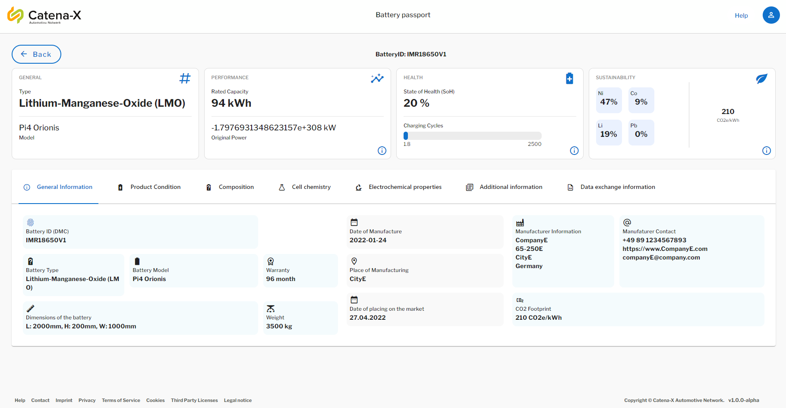

<!--
  Catena-X - Product Passport Consumer Frontend
 
  Copyright (c) 2022, 2023 BASF SE, BMW AG, Henkel AG & Co. KGaA
 
  See the NOTICE file(s) distributed with this work for additional
  information regarding copyright ownership.
 
  This program and the accompanying materials are made available under the
  terms of the Apache License, Version 2.0 which is available at
  https://www.apache.org/licenses/LICENSE-2.0.
 
  Unless required by applicable law or agreed to in writing, software
  distributed under the License is distributed on an "AS IS" BASIS
  WITHOUT WARRANTIES OR CONDITIONS OF ANY KIND,
  either express or implied. See the
  License for the specific language govern in permissions and limitations
  under the License.
 
  SPDX-License-Identifier: Apache-2.0
-->

<h1 style="display:flex; align-items: center;">&nbsp;&nbsp;Digital Product Pass Application</h1>

## What is digital product passport application?

The digital product passport  application provides a consumer user interface to request a battery passport from a battery manufacturer using the standardized components and technologies in a Catena-X network. The passport will be displayed in a human-readable from any browser. The data exchange standards given by Catena-X are used to provide the battery passport to different personas (roles) in the network.

In particular, the appliction is used to access the battery passport data provided by battery manufacturer. By scanning QR-code or knowing the manufacturer and battery-ID, a user can request the passport  through **Eclipse Dataspace Connectors (EDCs)** over the Catena-X network. The passport provider will provide data attributes that is only visible to a permitted signed-in user. 

## Application Preview

Here is a preview from the DPP App UI, where we visualize a test battery passport in this case.



> **Note**: For more information check the [documentation section](./docs/)
## Getting Started

To get started you can have a look into our documentation:

| Name                                                                      | Description                                                                                                                                                        |
| ----------------------------------------------------------------          | -----------------------------------------------------------------------------------------------------------------------------------------------------------        |
| [Arc42](./docs/arc42/Arc42.md)                                             | Arc42 of Digital Product Pass                                                                                                                                      |
| [Administration Guide](./docs/admin%20guide/Admin_Guide.md)                  | Administration Guide explaining the infrastructure and how to configure the application                                                                          |
| [Backend Documentation](./consumer-backend/productpass/readme.md)          | Backend documentation Product Passport App                                                                                                                         |
| [Deployment in Hotel Budapest](./deployment/README.md)                     | Technical Guide - Deployment in ArgoCD Hotel Budapest (integration environment)                                                                                    |
| [Docker Overview](./docker/README.md)                                      | Overview on general docker commands                                                                                                                                |
| [Keycloak Overview](./docker/local/Keycloak/README.md)                     | This guide describes how to setup a keycloak instance in local docker container and import existing realm.json file.                                               |
| [Short Introduction into the project](./docs/GETTING-STARTED.md)           | Battery Pass Allpication infrastructure, installation guide, technical usage guide                                                                                 |
| [Code Scaning with Kics and Trivy](./docs/IaC.md)                          | Infrastructure As Code (IaC) with KICS intends to find security vulnerabilities by scanning the code and upload results to the security dashboard in github        |
| [Release Guidelines](./docs/RELEASE.md)                                     | Product Battery Pass Consumer App Release Guide                                                                                                                    |
| [Secret Management](./docs/SECRETS_MANAGEMENT.md)                          | Secrets management with CX HashiCorp Vault and ArgoCD Vault Plugin (AVP) - client credentials, database passwords, access tokens                                   |
| [Cypress Overview](./docs/cypress/CYPRESS.md)                              | Documentation for Battery Passport App E2E Cypress test                                                                                                            |
| [End User Manual](./docs/user%20manual/User%20Manual%20Product%20Viewer%20App.md)             | End User Manual Product Viewer App                                                                                                                                  |
| [Postman Overview](./postman/README.md)                                    | Technical guide depicts the battery pass end-to-end API calls through the postman REST client                                                                      |
| [Changelog](./CHANGELOG.md)                                                | Changelog                                                                                                                                                          |

### Prerequisites:

- Git
- Code editor (VS Code/ IntelliJ recommended)
- Nodejs 16 (Node Package Manager - npm)
- Vuejs
- Docker
- Git Bash (for windows operating system only)

## Installation
### Clone project repository

```bash
git clone https://github.com/eclipse-tractusx/digital-product-pass.git
```

### Install dependencies

```bash
cd digital-product-pass/
npm install --legacy-peer-deps
```

## Run Project

### Compiles and minifies for production

```bash
npm run build
```
#### Method 1: Without Docker

#### Compiles and hot-reloads for development

```bash
npm run serve
```

#### Method 2: With Docker

The following environment variables must be set in [build and deploy](./buildAndDeploy.sh) script:

- PASS_VERSION
- APP_VERSION
- APP_API_TIMEOUT
- APP_API_MAX_RETRIES
- APP_API_DELAY
- IDENTITY_PROVIDER_URL
- HOST_URL
- DATA_URL
- KEYCLOAK_CLIENTID
- KEYCLOAK_REALM
- KEYCLOAK_ONLOAD


```bash
# run script
../buildAndDeploy.sh consumer-ui
```

You can run the application in docker container with existing image `ghcr.io/eclipse-tractusx/digital-product-pass/consumer-ui:latest` from GitHub packages. You need to update the [build and deploy](./buildAndDeploy.sh) script.

The consumer frontend is available in browser at [http://localhost:8080](http://localhost:8080)

## Coding styles

### How to set up a code editor

See [VSCode configuration](https://code.visualstudio.com/docs/getstarted/settings).

## License

[Apache-2.0](https://raw.githubusercontent.com/eclipse-tractusx/digital-product-pass/digital-product-pass/main/LICENSE)
