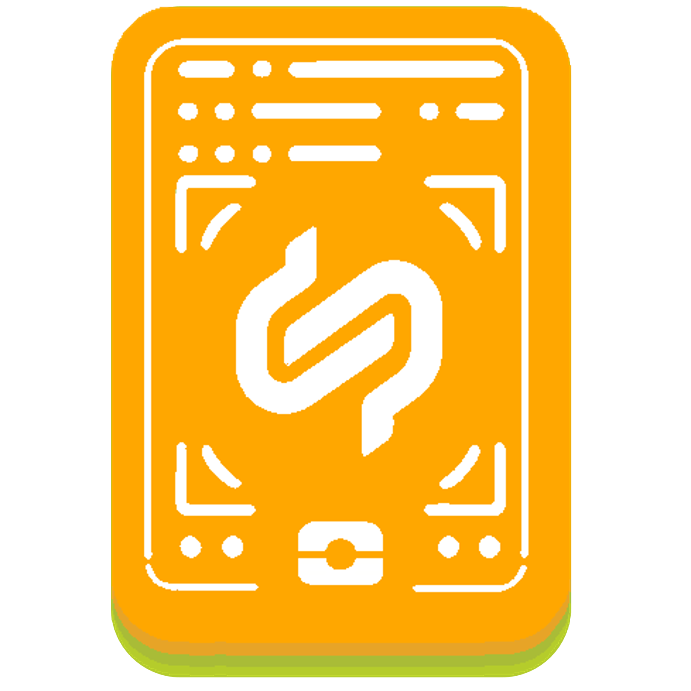

<!--
#######################################################################

Tractus-X - Digital Product Pass Application 

Copyright (c) 2022, 2024 BMW AG
Copyright (c) 2022, 2024 Henkel AG & Co. KGaA
Copyright (c) 2023, 2024 CGI Deutschland B.V. & Co. KG
Copyright (c) 2023, 2024 Contributors to the Eclipse Foundation

See the NOTICE file(s) distributed with this work for additional
information regarding copyright ownership.

This work is made available under the terms of the
Creative Commons Attribution 4.0 International (CC-BY-4.0) license,
which is available at
https://creativecommons.org/licenses/by/4.0/legalcode.

SPDX-License-Identifier: CC-BY-4.0

#######################################################################
-->

[![Contributors][contributors-shield]][contributors-url]
[![Stargazers][stars-shield]][stars-url]
[![Apache 2.0 License][license-shield]][license-url-code]
[![CC-BY-4.0][license-shield-non-code]][license-url-non-code]
[![Latest Release][release-shield]][release-url]

  
   
  <h1 style="align-items: center;">Digital Product Pass Application</h1>

## Description

The digital product passport  application provides a consumer user interface to request a battery passport from a battery manufacturer using the standardized components and technologies in a Catena-X network. The passport will be displayed in a human-readable from any browser. The data exchange standards given by Catena-X are used to provide the battery passport to different personas (roles) in the network.

In particular, the application is used to access the battery passport data provided by battery manufacturer. By scanning QR-code or knowing the manufacturer and battery-ID, a user can request the passport  through **Eclipse Dataspace Connectors (EDCs)** over the Catena-X network. The passport provider will provide data attributes that is only visible to a permitted signed-in user. 

### Software Version
#### Helm Chart Version
<pre id="helm-version"><a href="https://github.com/eclipse-tractusx/digital-product-pass/releases/tag/digital-product-pass-4.0.0-rc1">4.0.0-rc1</a></pre>
#### Application Version
<pre id="app-version"><a href="https://github.com/eclipse-tractusx/digital-product-pass/releases/tag/v4.0.0-rc1">v4.0.0-rc1</a></pre>

## Application Preview

Here is a preview from the DPP App UI, where we visualize a test battery passport in this case.

> **Note**: For more information check the [documentation section](./docs/README.md)

## Getting Started

To get started you can have a look into our documentation:

| Name                                                                                                          | Description                                                                                                                                                 |
| ------------------------------------------------------------------------------------------------------------- | ----------------------------------------------------------------------------------------------------------------------------------------------------------- |
| [Arc42](./docs/architecture/Arc42.md)                                                                                | Main Architecture Document (Arc42) of Digital Product Pass Application                                                                                      |
| [Interoperability](./docs/interoperability/InteroperabilityGuide.md)                                                                                | Interoperability document of Digital Product Pass Application                                                                                      |
| [Data Sovereignty](./docs/data-sovereignty/PolicyConfigGuide.md)                                                                                | Data Sovereignty document of Digital Product Pass Application                                                                                      |
| [Administration Guide](./docs/admin/AdminGuide.md)                                                    | Administration Guide explaining the infrastructure and how to configure the application                                                                     |
| [Data Retrieval Guide](./docs/data-retrieval/README.md)                                 | Guide on how to retrieve data from the Catena-X Network as the Digital Product Pass                                                                         |
| [Backend Documentation](./dpp-backend/digitalproductpass/README.md)                                           | Backend documentation Product Passport App                                                                                                                  |
| [Docker Overview](./deployment/local/iam/README.md)                                                           | Overview on general docker commands                                                                                                                         |
| [Keycloak Overview](./deployment/local/iam/README.md)                                                         | This guide describes how to setup a keycloak instance in local docker forcontainer and import existing realm.json file.                                     |
| [Short Introduction into the project](./docs/GETTING-STARTED.md)                                              | Digital Product Pass App infrastructure, helm installation guide, technical usage guide                                                                     |
| [Code Scaning with Kics and Trivy](./docs/security/infrastructure-as-code/IaC.md)                                  | Infrastructure As Code (IaC) with KICS intends to find security vulnerabilities by scanning the code and upload results to the security dashboard in github |
| [Release Guidelines](./docs/RELEASE.md)                                                                       | Digital Product Pass App Release Guide                                                                                                                      |
| [Secret Management](./docs/security/secrets-management/SecretsManagement.md)                                        | Secrets management to store client credentials, database passwords, access tokens                         |
| [End User Manual](./docs/user/UserManual.md)                                                         | End User Manual Product Viewer App                                                                                                                          |
| [Postman Overview](./deployment/local/postman//README.md)                                                     | Technical guide depicts the battery pass end-to-end API calls through the postman REST client                                                               |
| [Changelog](./CHANGELOG.md)                                                                                   | Changelog                                                                                                                                                   |
| [Helm Charts](https://github.com/eclipse-tractusx/digital-product-pass/tree/main/charts/digital-product-pass) | Project's Helm Charts                                                                                                                                       |

## Base Images

| Language         | Container Base Image                                                                                         |
| :--------------- | :----------------------------------------------------------------------------------------------------------- |
| Java / JVM based | [Eclipse Temurin](https://hub.docker.com/_/eclipse-temurin)                                                  |
| JS frontends     | [Node.JS](https://hub.docker.com/_/node)   [Nginx](https://hub.docker.com/r/nginxinc/nginx-unprivileged) |

## Installation

For installing the Digital Product Pass Application please consult our [Intallation Guide](./INSTALL.md).

## Licenses

- [Apache-2.0](https://raw.githubusercontent.com/eclipse-tractusx/digital-product-pass/main/LICENSE) for code
- [CC-BY-4.0](https://spdx.org/licenses/CC-BY-4.0.html) for non-code

## Notice for Docker Images

DockerHub:
- https://hub.docker.com/r/tractusx/digital-product-pass-frontend
- https://hub.docker.com/r/tractusx/digital-product-pass-backend
- https://hub.docker.com/r/tractusx/digital-product-pass-verification-wallet
  
Eclipse Tractus-X product(s) installed within the image:

- GitHub: https://github.com/eclipse-tractusx/digital-product-pass
- Project home: https://projects.eclipse.org/projects/automotive.tractusx
- Dockerfiles: 
    - Frontend: https://github.com/eclipse-tractusx/digital-product-pass/blob/main/Dockerfile
    - Backend: https://github.com/eclipse-tractusx/digital-product-pass/blob/main/dpp-backend/digitalproductpass/Dockerfile
    - DPP Verification Simple Wallet: https://github.com/eclipse-tractusx/digital-product-pass/blob/main/dpp-verification/simple-wallet/Dockerfile
- Project License: [Apache License, Version 2.0](https://raw.githubusercontent.com/eclipse-tractusx/digital-product-pass/main/LICENSE)

**Used base image**
- [alpine:3.19](https://github.com/alpinelinux/docker-alpine)
- [node:lts-alpine](https://github.com/nodejs/docker-node)
- [nginxinc/nginx-unprivileged:stable-alpine](https://github.com/nginxinc/docker-nginx-unprivileged/blob/main/Dockerfile-alpine.template)
- [eclipse-temurin:19-alpine](https://github.com/adoptium/containers)
- Official DockerHub pages:
    - Alpine: https://hub.docker.com/_/alpine
    - Node: https://hub.docker.com/_/node
    - Nginxinc/nginx-unprivileged: https://hub.docker.com/r/nginxinc/nginx-unprivileged
    - Eclipse Temurin: https://hub.docker.com/_/eclipse-temurin  
- Eclipse Temurin Project: https://projects.eclipse.org/projects/adoptium.temurin  
- Additional information about images:
    - alpinelinux/docker-alpine:3.19: https://github.com/alpinelinux/docker-alpine/blob/v3.19/x86_64/Dockerfile
    - Node: https://github.com/docker-library/repo-info/tree/master/repos/node
    - Nginxinc/nginx-unprivileged: https://github.com/nginxinc/docker-nginx-unprivileged
    - Eclipse Temurin: https://github.com/docker-library/repo-info/tree/master/repos/eclipse-temurin

As with all Docker images, these likely also contain other software which may be under other licenses
(such as Bash, etc. from the base distribution, along with any direct or indirect dependencies of the primary software being contained).

As for any pre-built image usage, it is the image user's responsibility to ensure that any use of this image complies with any relevant licenses for all software contained within.

<!-- MARKDOWN LINKS & IMAGES -->
<!-- https://www.markdownguide.org/basic-syntax/#reference-style-links -->

[contributors-shield]: https://img.shields.io/github/contributors/eclipse-tractusx/digital-product-pass.svg?style=for-the-badge
[contributors-url]: https://github.com/eclipse-tractusx/digital-product-pass/graphs/contributors
[stars-shield]: https://img.shields.io/github/stars/eclipse-tractusx/digital-product-pass.svg?style=for-the-badge
[stars-url]: https://github.com/eclipse-tractusx/digital-product-pass/stargazers
[license-shield]: https://img.shields.io/github/license/eclipse-tractusx/digital-product-pass.svg?style=for-the-badge
[license-url-code]: https://github.com/eclipse-tractusx/digital-product-pass/blob/main/LICENSE
[license-shield-non-code]: https://img.shields.io/badge/NON--CODE%20LICENSE-CC--BY--4.0-8A2BE2?style=for-the-badge
[license-url-non-code]: https://github.com/eclipse-tractusx/digital-product-pass/blob/main/LICENSE_non-code
[release-shield]: https://img.shields.io/github/v/release/eclipse-tractusx/digital-product-pass.svg?style=for-the-badge
[release-url]: https://github.com/eclipse-tractusx/digital-product-pass/releases
