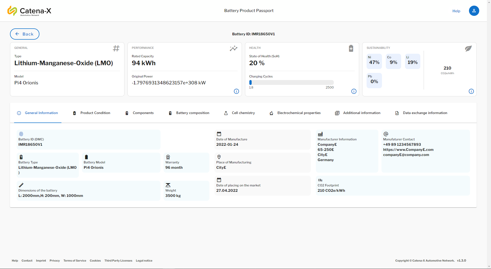

<!-- 
  Tractus-X - Digital Product Passport Application 
 
  Copyright (c) 2022, 2024 BASF SE, BMW AG, Henkel AG & Co. KGaA
  Copyright (c) 2022, 2024 Contributors to the Eclipse Foundation

  See the NOTICE file(s) distributed with this work for additional
  information regarding copyright ownership.
 
  This program and the accompanying materials are made available under the
  terms of the Apache License, Version 2.0 which is available at
  https://www.apache.org/licenses/LICENSE-2.0.
 
  Unless required by applicable law or agreed to in writing, software
  distributed under the License is distributed on an "AS IS" BASIS
  WITHOUT WARRANTIES OR CONDITIONS OF ANY KIND,
  either express or implied. See the
  License for the specific language govern in permissions and limitations
  under the License.
 
  SPDX-License-Identifier: Apache-2.0
-->

<h1 style="display:flex; align-items: center;">&nbsp;&nbsp;Digital Product Pass Application</h1>

[![Contributors][contributors-shield]][contributors-url]
[![Stargazers][stars-shield]][stars-url]
[![Apache 2.0 License][license-shield]][license-url]
[![Latest Release][release-shield]][release-url]

## Description

The digital product passport  application provides a consumer user interface to request a battery passport from a battery manufacturer using the standardized components and technologies in a Catena-X network. The passport will be displayed in a human-readable from any browser. The data exchange standards given by Catena-X are used to provide the battery passport to different personas (roles) in the network.

In particular, the appliction is used to access the battery passport data provided by battery manufacturer. By scanning QR-code or knowing the manufacturer and battery-ID, a user can request the passport  through **Eclipse Dataspace Connectors (EDCs)** over the Catena-X network. The passport provider will provide data attributes that is only visible to a permitted signed-in user. 

### Software Version
#### Helm Chart Version
<pre id="helm-version"><a href="https://github.com/eclipse-tractusx/digital-product-pass/releases/tag/digital-product-pass-2.2.0">2.2.0</a></pre>
#### Application Version
<pre id="app-version"><a href="https://github.com/eclipse-tractusx/digital-product-pass/releases/tag/v2.2.0">v2.2.0</a></pre>

## Application Preview

Here is a preview from the DPP App UI, where we visualize a test battery passport in this case.

> **Note**: For more information check the [documentation section](./docs/README.md)

## Getting Started

To get started you can have a look into our documentation:

| Name                                                                                                          | Description                                                                                                                                                 |
| ------------------------------------------------------------------------------------------------------------- | ----------------------------------------------------------------------------------------------------------------------------------------------------------- |
| [Arc42](./docs/arc42/Arc42.md)                                                                                | Main Architecture Document (Arc42) of Digital Product Pass Application                                                                                      |
| [Administration Guide](./docs/admin%20guide/AdminGuide.md)                                                    | Administration Guide explaining the infrastructure and how to configure the application                                                                     |
| [Data Retrieval Guide](./docs/data%20retrieval%20guide/DataRetrievalGuide.md)                                 | Guide on how to retrieve data from the Catena-X Network as the Digital Product Pass                                                                         |
| [Backend Documentation](./dpp-backend/digitalproductpass/README.md)                                           | Backend documentation Product Passport App                                                                                                                  |
| [Deployment in Argo CD](./deployment/README.md)                                                               | Technical Guide - Deployment in ArgoCD - integration environment                                                                                            |
| [Docker Overview](./deployment/local/iam/README.md)                                                           | Overview on general docker commands                                                                                                                         |
| [Keycloak Overview](./deployment/local/iam/README.md)                                                         | This guide describes how to setup a keycloak instance in local docker forcontainer and import existing realm.json file.                                     |
| [Short Introduction into the project](./docs/GETTING-STARTED.md)                                              | Digital Product Pass App infrastructure, helm installation guide, technical usage guide                                                                     |
| [Code Scaning with Kics and Trivy](./docs/infrastructure%20as%20code/IaC.md)                                  | Infrastructure As Code (IaC) with KICS intends to find security vulnerabilities by scanning the code and upload results to the security dashboard in github |
| [Release Guidelines](./docs/RELEASE.md)                                                                       | Digital Product Pass App Release Guide                                                                                                                      |
| [Secret Management](./docs/secrets%20management/SECRETS_MANAGEMENT.md)                                        | Secrets management with CX HashiCorp Vault and ArgoCD Vault Plugin (AVP) - client credentials, database passwords, access tokens                            |
| [End User Manual](./docs/user%20manual/UserManual.md)                                                         | End User Manual Product Viewer App                                                                                                                          |
| [Postman Overview](./deployment/local/postman//README.md)                                                     | Technical guide depicts the battery pass end-to-end API calls through the postman REST client                                                               |
| [Changelog](./CHANGELOG.md)                                                                                   | Changelog                                                                                                                                                   |
| [Helm Charts](https://github.com/eclipse-tractusx/digital-product-pass/tree/main/charts/digital-product-pass) | Project's Helm Charts                                                                                                                                       |

## Base Images

| Language         | Container Base Image                                                                                         |
| :--------------- | :----------------------------------------------------------------------------------------------------------- |
| Java / JVM based | [Eclipse Temurin](https://hub.docker.com/_/eclipse-temurin)                                                  |
| JS frontends     | [Node.JS](https://hub.docker.com/_/node)   [Nginx](https://hub.docker.com/r/nginxinc/nginx-unprivileged) |

## Installation

For installing the Digital Product Pass Application please consult our [Intallation Guide](./INSTALL.md).

## License

[Apache-2.0](https://raw.githubusercontent.com/eclipse-tractusx/digital-product-pass/main/LICENSE)

## Notice for Docker image

DockerHub:

-   https://hub.docker.com/r/tractusx/digital-product-pass-frontend
-   https://hub.docker.com/r/tractusx/digital-product-pass-backend

**Base images:**

-   DockerHub:

    -   Node: https://hub.docker.com/_/node
    -   Nginxinc/nginx-unprivileged: https://hub.docker.com/r/nginxinc/nginx-unprivileged
    -   Eclipse Temurin: https://hub.docker.com/_/eclipse-temurin

-   Dockerfiles:

    -   [node:lts-alpine](https://github.com/nodejs/docker-node)
    -   [nginxinc/nginx-unprivileged:stable-alpine](https://github.com/nginxinc/docker-nginx-unprivileged/blob/main/Dockerfile-alpine.template)
    -   [eclipse-temurin:19-alpine](https://github.com/adoptium/containers)

-   GitHub project:
    -   Node: https://github.com/docker-library/repo-info/tree/master/repos/node
    -   nginxinc/docker-nginx-unprivileged: https://github.com/nginxinc/docker-nginx-unprivileged
    -   Eclipse Temurin: https://github.com/docker-library/repo-info/tree/master/repos/eclipse-temurin

<!-- MARKDOWN LINKS & IMAGES -->
<!-- https://www.markdownguide.org/basic-syntax/#reference-style-links -->

[contributors-shield]: https://img.shields.io/github/contributors/eclipse-tractusx/digital-product-pass.svg?style=for-the-badge
[contributors-url]: https://github.com/eclipse-tractusx/digital-product-pass/graphs/contributors
[stars-shield]: https://img.shields.io/github/stars/eclipse-tractusx/digital-product-pass.svg?style=for-the-badge
[stars-url]: https://github.com/eclipse-tractusx/digital-product-pass/stargazers
[license-shield]: https://img.shields.io/github/license/eclipse-tractusx/digital-product-pass.svg?style=for-the-badge
[license-url]: https://github.com/eclipse-tractusx/digital-product-pass/blob/main/LICENSE
[release-shield]: https://img.shields.io/github/v/release/eclipse-tractusx/digital-product-pass.svg?style=for-the-badge
[release-url]: https://github.com/eclipse-tractusx/digital-product-pass/releases
