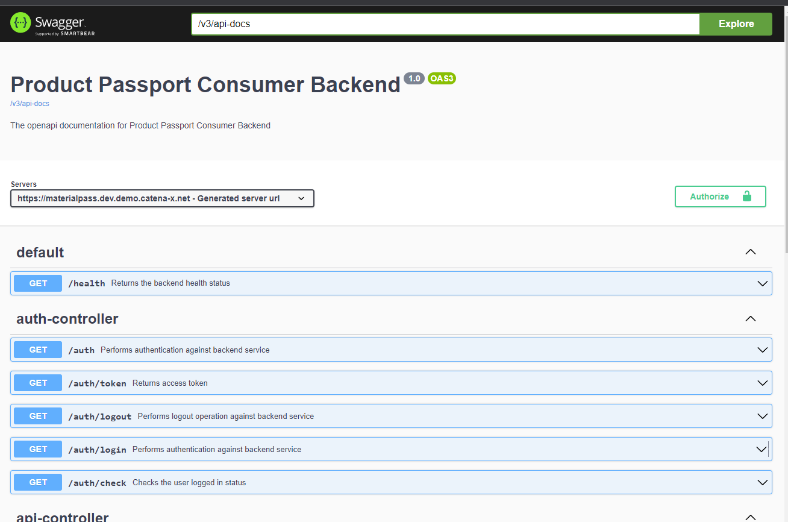

<!--
  Catena-X - Product Passport Consumer Backend
 
  Copyright (c) 2022, 2023 BASF SE, BMW AG, Henkel AG & Co. KGaA

  See the NOTICE file(s) distributed with this work for additional
  information regarding copyright ownership.
 
  This program and the accompanying materials are made available under the
  terms of the Apache License, Version 2.0 which is available at
  https://www.apache.org/licenses/LICENSE-2.0.
 
  Unless required by applicable law or agreed to in writing, software
  distributed under the License is distributed on an "AS IS" BASIS
  WITHOUT WARRANTIES OR CONDITIONS OF ANY KIND,
  either express or implied. See the
  License for the specific language govern in permissions and limitations
  under the License.
 
  SPDX-License-Identifier: Apache-2.0
-->

<h1 style="display:flex; align-items: center;">&nbsp;&nbsp;Digital Product Pass Backend</h1>


<h2><strong>Version</strong>: <span style="color: cyan">0.6.1-SNAPSHOT</span><h2>

<br>

# Table of contents
<!-- TOC -->
- [Table of contents](#table-of-contents)
- [What is this backend app responsible for?](#what-is-this-backend-app-responsible-for)
- [Services Available](#services-available)
  - [Authentication Services](#authentication-services)
  - [API Services](#api-services)
    - [Data](#data)
    - [Passport API](#passport-api)
      - [Versions Available](#versions-available)
    - [Contract API](#contract-api)
  - [Public APIs](#public-apis)
  - [OSS License Check](#oss-license-check)
  - [Swagger Docs](#swagger-docs)
- [Run the application](#run-the-application)
  - [Modify the configurations in the deployment files](#modify-the-configurations-in-the-deployment-files)
- [TL;DR](#tldr)
  - [Pre-requisites](#pre-requisites)
  - [Install](#install)
  - [Expose the ports](#expose-the-ports)
    - [Get pod name](#get-pod-name)
    - [Port forward](#port-forward)
    - [Check if the application is running](#check-if-the-application-is-running)
- [Frequently asked questions](#frequently-asked-questions)
  - [How to install the application and run it locally?](#how-to-install-the-application-and-run-it-locally)
    - [Install](#install-1)
    - [Run the JAR file](#run-the-jar-file)
    - [Configure the secrets](#configure-the-secrets)
  - [How to start the application locally using Spring Boot?](#how-to-start-the-application-locally-using-spring-boot)
- [License](#license)
<!-- TOC -->

# What is this backend app responsible for?

This backend includes the services and *logics* to manage the *passports* of the `frontend app`.

# Services Available

## Authentication Services
All Authenticated APIs required a `AccessToken` JWT Token generated by the login in the frontend or in the Catena-X Keycloak instance.

```yaml
{
    headers: {
        Authorization: "Bearer <<AccessToken>>"
    }
}
```

For login and log out!
```bash
------
\auth\check #With this api you can check you authentication status.
------
\auth\token #Request token from the keycloak instance
------
```

## API Services
>  **_NOTE:_** You must be authenticated with the keycloak instance to access this APIs


### Data
Get data from Catena-X Services
```bash
\api\data\catalog?providerUrl=<...> #Get all the catalog from the provider

------
\api\data\submodel\<assetId>?idType=<...>&index=<...>
__________
default idType = "Battery_ID_DMC_Code"
default index = 0

------

\api\data\passport?transferId=<...> #Get passport if the transferId is available -> No contract exchange is required if transferId exists

```

### Passport API

Get a passport from a Catena-X Provider by using its AssetId, this will start a negotiation with the provider and retrieve passport

```bash
\api\passport\<version>\<assetId>?idType=<...>&index=<...>
__________
default idType = "Battery_ID_DMC_Code"
default index = 0
```

#### Versions Available
The passport available versions are:
```bash
[ "v3.0.1" ] -> Battery Passport
```

To change the available versions add in the configurations for each environment ``

```yaml
passport:
    versions:
        - 'v3.0.1'
```

### Contract API

Get a contract from the catalog searching by assetId
```bash
\api\contracts\<assetId>
```

## Public APIs

Public APIs don't require authentication
```bash
\health #Get the health status of the server
```
```json
{
    "message": "RUNNING",
    "status": 200,
    "data": "24/11/2022 17:48:18.487"
}

```

## OSS License Check

The third party library dependecies, utilized in this app have to  be approved from The Eclipse Foundation.

The [Dash Licence Tool](https://github.com/eclipse/dash-licenses) is used to scan the dependencies

[OSS License Checks with Dash & Compliance with Apache 2.0](https://confluence.catena-x.net/pages/viewpage.action?pageId=54989501)

At the time of writing this manual, the dependencies have status approved and therefore no need to generate  IP Team Review request further.

[Maven plugin](https://github.com/eclipse/dash-licenses/blob/master/README.md#maven-plugin-options) used to check OSS license

How to run:
```bash
mvn org.eclipse.dash:license-tool-plugin:license-check -Ddash.summary=DEPENDENCIES
```


## Swagger Docs

Swagger documentation is now automatically available at the following path:

```https://<host>/swagger-ui/index.html```



For authorization, you will need to add a JWT Access token from the Catena-X IAM:


# Run the application

Use maven to run the spring boot application:
```bash
mvn spring-boot:run
```

If you want to run the application in a different way checkout the [frequently asked questions](#frequently-asked-questions) section below.

## Modify the configurations in the deployment files

You can use the default configuration to start the application:
```charts/digital-product-pass/values.yaml```

However if you need to change it just create a new environment with this naming convention: ```values-env`.yaml``` where ```env``` is the name of your environment. You can use as an example the following configuration file: ```charts/digital-product-pass/values-int.yaml```.

The configuration for the consumer backend application is a yaml file that is configured in the following tag: ```backend.application```. Before the application starts all the configuration parameters must be specified, since they are required for initialization and will be checked at the test fase.

Once you configured the application use the follow the [TL;DR](#tldr) below to ```build the image and start the application``` using helm charts.

# TL;DR 

## Pre-requisites

You must have [Helm](https://helm.sh/),  [Minikube](https://minikube.sigs.k8s.io/docs/start/) and [Maven](https://maven.apache.org/) to follow this steps.


## Install

To install the application using the configured helm charts use the following command from the project root directory:

```bash
helm install digital-product-pass ./charts/digital-product-pass -f charts/digital-product-pass/values.yaml -f charts/digital-product-pass/values-int.yaml 
``` 

> **NOTE**: This command will deploy the complete application.

## Expose the ports

Once the application is running, in order for you to access it, we need to expose the ports. Following this commands we will be able to access it.

### Get pod name
Search for the application name:

```bash
kubectl get pods -n product-material-pass --no-headers |  awk '{if ($1 ~ "consumer-backend-") print $1}'
```
**Example**:


Copy the pod name with the prefix `consumer-backend`

### Port forward

Paste the pod name after the `port-forward` parameter. 
```bash
kubectl -port-forward consumer-backend-67c4c9678-nqg7p 8888:8888 -n product-material-pass
```

> **NOTE**: The default port set is `8888` however it can be changed in the configuration.

### Check if the application is running

Go to the following url to check the health status:
```
localhost:8888/health
```

# Frequently asked questions

## How to install the application and run it locally?

Use the following commands to install/compile the application:

### Install
```bash 
mvn clean install test
```

### Run the JAR file

Substitute the `<version>` variable with the current version of the Digital Product Pass Backend and run the jar:

```bash

./target/productpass-<version>-SNAPSHOT.jar

```
### Configure the secrets

Once the application is running a tmp file will be created in the following directory: `data/VaultConfig/vault.token.yml`

```yml
token: <Add Vault token here> 
client:
  id: <Add the Keycloak client.id here>
  secret: <Add the Keycloak client.secret here>
apiKey: <Add the EDC api key here>
```

## How to start the application locally using Spring Boot?

Use the following command using [maven](https://maven.apache.org/) to start the application

```bash 
mvn clean spring-boot:run
```


# License
[Apache-2.0](https://raw.githubusercontent.com/catenax-ng/product-battery-passport-consumer-app/main/LICENSE)

