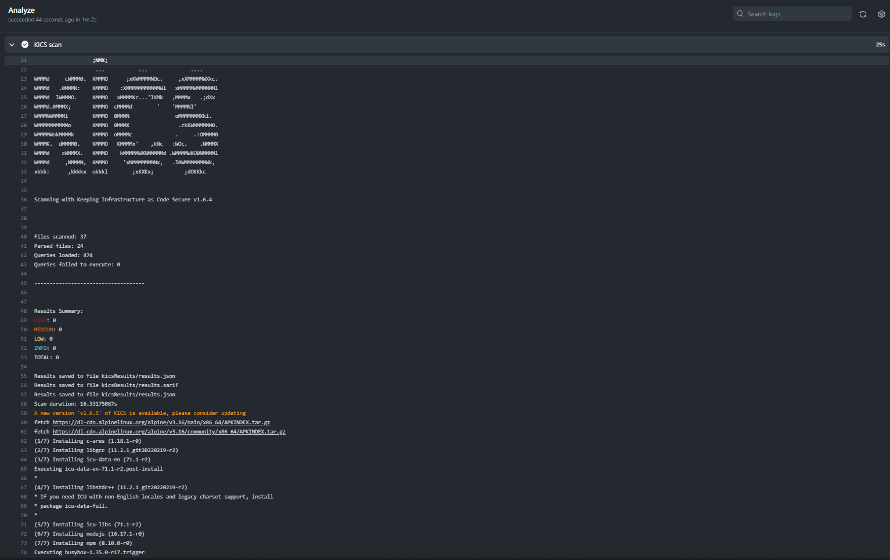

## Infrastructure As Code (IaC) with KICS

This tool intends to find security vulnerabilities by scanning the code  and upload results to the security dashboard in github. It is integrated as GitHub action into the repository workflows [KICS](../.github/workflows/kics.yml) and also a successor of Checkov. IaC must be scanned via nightly GitHub action and High/critical error findings are not accepted.

To integrate KICS into a repository, please see its [documentation](https://catenax-ng.github.io/docs/security/how-to-integrate-kics).

### Results

Since, it is triggered via nnightly build daily, the below output is taken from one of the jobs history.

Complete history can be seen [here](https://github.com/catenax-ng/product-battery-passport-consumer-app/actions/workflows/kics.yml)

## Container Scan with Trivy

This tool intends to find security vulnerabilities by scanning the container images and upload results to the github security tab. Similar to KICS, it is also integrated as GitHub action [Trivy](../.github/workflows/trivy.yml) and triggerd via nightly build. All containers in GitHub Packages must be scanned and High/critical error findings are not accepted.

To integrate Trivy into a repository, please see its [documentation](https://catenax-ng.github.io/docs/security/how-to-integrate-trivy).

### Results

Since, it is triggered as a build every night, the below output is taken from one of the jobs history.

Complete history can be seen [here](https://github.com/catenax-ng/product-battery-passport-consumer-app/actions/workflows/trivy.yml)

## Static Application Serucity Testing

The static application security testing is performed by Veracode tool through GitHub actions.
Code must be scanned weekly with Veracode tool, medium risks require mitigation statement, high and above not accepted.

### Veracode Static Analysis pipeline Scan

It performs code analysis in the pipeline, show results and feedback once pipeline is finished. It helps for pull requests to know about very high/high security findings prior to merging code. This job is optional at the moment.

### Veracode Upload and Scan

It builds, package up the code and upload results to the [veracode platform](https://analysiscenter.veracode.com). It is one of the important jobs, and must be aligned to the quality gate requirements. 

Please see more details about Veracode tool integration [here](https://catenax-ng.github.io/docs/security/how-to-integrate-veracode).
