<!--
  Catena-X - Product Passport Consumer Frontend
 
  Copyright (c) 2022, 2023 BASF SE, BMW AG, Henkel AG & Co. KGaA
 
  See the NOTICE file(s) distributed with this work for additional
  information regarding copyright ownership.
 
  This program and the accompanying materials are made available under the
  terms of the Apache License, Version 2.0 which is available at
  https://www.apache.org/licenses/LICENSE-2.0.
 
  Unless required by applicable law or agreed to in writing, software
  distributed under the License is distributed on an "AS IS" BASIS
  WITHOUT WARRANTIES OR CONDITIONS OF ANY KIND,
  either express or implied. See the
  License for the specific language govern in permissions and limitations
  under the License.
 
  SPDX-License-Identifier: Apache-2.0
-->

# (CEC) ARC42 - Product Passport Consumer Application Documentation

   

Version: v2.2  
Latest Revision Mar. 30, 2023

## Table of Contents
 
1. [Table of Contents](#table-of-contents)
2. [Introduction and Goals](#introduction-and-goals)    
    2.1 [Requirements Overview](#requirements-overview)  
    2.2 [Quality Goals](#quality-goals)

3. [Architecture Constraints](#architecture-constraints)

4. [System Scope and Context](#system-scope-and-context)  
    4.1 [Detailed Explanation from Product Passport Application](#detailed-explanation-from-product-passport-application)  
&nbsp;&nbsp;&nbsp;&nbsp; 4.1.1 [Product Passport Component](#product-passport-component)    
&nbsp;&nbsp;&nbsp;&nbsp;&nbsp;&nbsp;&nbsp;&nbsp; 4.1.1.1 [Application State Diagram](#application-state-diagram)  
 &nbsp;&nbsp;&nbsp;&nbsp;&nbsp;&nbsp;&nbsp;&nbsp; 4.1.1.2. [Technical Integration Design](#technical-integration-design)    
    4.2. [Business Context](#business-context)  
    4.3 [Technical Context](#technical-context)  
&nbsp;&nbsp;&nbsp;&nbsp; 4.3.1 [Runtime Environments](#runtime-environments)  
&nbsp;&nbsp;&nbsp;&nbsp; 4.3.2 [Container Ecosystem](#container-ecosystem)  
&nbsp;&nbsp;&nbsp;&nbsp;&nbsp;&nbsp;&nbsp;&nbsp;&nbsp; 4.3.2.1 [Kubernetes Container Platform (Gardener)](#kubernetes-container-platform-gardener)  
&nbsp;&nbsp;&nbsp;&nbsp;&nbsp;&nbsp;&nbsp;&nbsp; 4.3.2.2 [Containers](#containers)  
&nbsp;&nbsp;&nbsp;&nbsp; 4.3.3 [CI/CD](#cicd)  
&nbsp;&nbsp;&nbsp;&nbsp; 4.3.4 [Documentation Links](#documentation-links)  
&nbsp;&nbsp;&nbsp;&nbsp; 4.3.5 [Catena-X Shared Services](#catena-x-shared-services)

5. [Solution Strategy](#solution-strategy)  
    5.1 [Architecture Diagram](#architecture-diagram)  
    5.2 [Technology & Architecture Detail](#technology--architecture-detail)    
&nbsp;&nbsp;&nbsp;&nbsp; 5.2.1 [Frontend (User Interface - Client Side)](#frontend-user-interface---client-side)    
&nbsp;&nbsp;&nbsp;&nbsp;&nbsp;&nbsp;&nbsp;&nbsp; 5.2.1.1 [Vue.js 3](#vuejs-3)  
&nbsp;&nbsp;&nbsp;&nbsp;&nbsp;&nbsp;&nbsp;&nbsp;&nbsp;&nbsp;&nbsp;&nbsp; 5.2.1.1.1 [Vuetify](#vuetify)  
&nbsp;&nbsp;&nbsp;&nbsp;&nbsp;&nbsp;&nbsp;&nbsp; 5.2.1.2 [Frontend Component Description](#component-description)  
&nbsp;&nbsp;&nbsp;&nbsp; 5.2.2 [Backend (Server Side)](#backend-server-side)  
&nbsp;&nbsp;&nbsp;&nbsp;&nbsp;&nbsp;&nbsp;&nbsp; 5.2.2.1. [Java 19](#java-19)  
&nbsp;&nbsp;&nbsp;&nbsp;&nbsp;&nbsp;&nbsp;&nbsp;&nbsp;&nbsp;&nbsp;&nbsp; 5.2.2.1.1 [Spring Boot](#spring-boot)  
&nbsp;&nbsp;&nbsp;&nbsp;&nbsp;&nbsp;&nbsp;&nbsp; 5.2.2.2 [Backend Component Description](#component-description-1)  

    5.3 [Infrastructure](#infrastructure)     
&nbsp;&nbsp;&nbsp;&nbsp; 5.3.1 [Kubernetes and Helm Charts](#kubernetes-and-helm-charts)  
    5.4 [Security Solution Strategy](#security-solution-strategy)   

6. [Building Block View](#building-block-view)  
    6.1 [Blackbox Overall System](#blackbox-overall-system)  
    6.2 [Whitebox Overall System](#whitebox-overall-system)
7. [Runtime View](#runtime-view)  

8. [Deployment View](#deployment-view)    

9. [Cross-Cutting Concepts](#cross-cutting-concepts)   

10. [Design Decisions](#design-decisions)   
    10.1  [History View (Landing Page)](#history-view-landing-page)  
    10.2  [QR Code and Searching View](#qr-code-and-searching-view)   
    10.3  [Battery Passport View](#battery-passport-view)  
    
11. [Quality Requirements](#quality-requirements)   
    11.1 [Qualtiy Scenarios](#quality-scenarios)  

12. [Risks and Technical Debts](#risks-and-technical-debts)  

13. [Glossary](#glossary)

## Introduction and Goals

Within the Catena-X Network, Product Passports are provided by manufacturers and can be exchanged in a standardized way. The data exchange standards are given by Catena-X and are used provide the product passport to different users in the network.

This passports can be used for different products like **Batteries**, **Gearboxes**, etc. At the moment the only product implemented are **batteries**, so the user interface only displays product passports. In the near future it will be able to display any passport structure, over a generic product passport that is in development at the moment.

The product passport consumer app provides an easy way to request a product passport from a manufacturer using the Catena-X network and standardized components and technologies. The passport will be displayed user-readable in an common browser. The app is used to access the passport data, which is provided by a manufacturer. Another interesting feature, is that you are able to scan a QR-code or by knowing the manufacturer and product-ID a user can request the passport over the Catena-X. On the other end, the manufacturer will provide passports with data elements, that the signed-in user is allowed to see the detailed information from a product.

This application is developed by the **Product Passport Team**, one of the members from **Catena-X Circular Economy Team**, aiming to contribute to the environmental cause, allowing recyclers, OEMs and dismantlers to know properties, dimensions and other important data related with a current product or material.

### Requirements Overview

The product passport consumer app is an web-based application developed in Vue.js, making it accessible using **standard browsers** (Chrome, Edge, Firefox, etc) for any user in the Catena-X Network.

It displays a specific passport for each product, in the Catena-X network hosted in a backend system. Using the Catena-X data exchange standards to request and receive data from the network it leverages the users and roles provided by Catena-X by using the required shared components (IAM, EDC, DAPS, DT-Registry)

The product passport consumer app UI follows the Catena-X CI layout, keeping things simple for the user while still providing the necessary information.

A User can request a passport...

* Either by scanning a **QR-code** which leads to the a passport view UI, allowing the user to visualize all the necessary/required information of a product. Making easier to dismantle it.
* In case a QR is not provided, the user is able to introduce the product id manually in a search field.

As the data provider might not send every data field regarding to the users privileges, the application is flexible with its layout and data handling, displaying only what it receives.

### Quality Goals

1. Reference the release management process with its **Quality Gates** (security, test, documentation, etc)
2. Test created in cypress (reference to test cases)
3. CI Pipeline to reduce manual effort and error. Establish fast feedback.
4. Git branch concept with PR and review-approvals
5. Lint for code formatting and styling

## Architecture Constraints

Catena-X Standard to DataExchange, Trust and Security. **We follow the Catena-X Architecture Framework**

FOSS Guardrails

Guardrails for Data Souveranity **We follow the Data Souveranity Guardrails from PI5**

## System Scope and Context

The Product Passport Application is a Catena-X terms a "blue" application. This means that it is a Business Application that accesses other "green" applications, like the Digital Twin Registry, IAM (Keycloack), Secret Management (Hashi Corp Vault), which are provided by the Catena-X network.

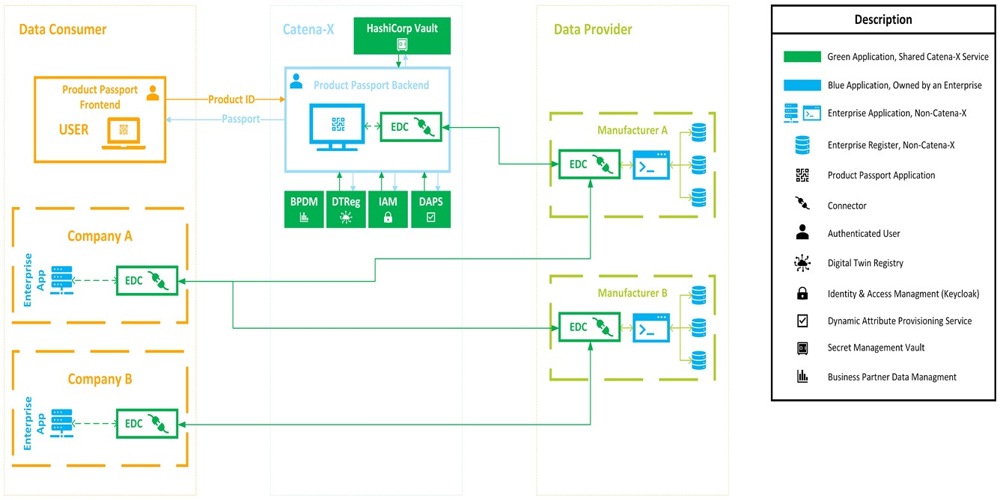

### Detailed Explanation from Product Passport Application

The interaction between the Product Passport Application previous the "BatteryPass" Application, the EDC Connectors, the Digital Twin registry and other services is detailed in the following page:

#### Product Passport Component

##### Application State Diagram

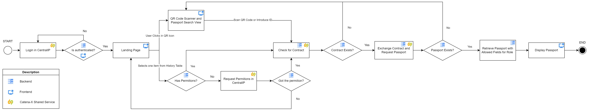

##### Technical Integration Design

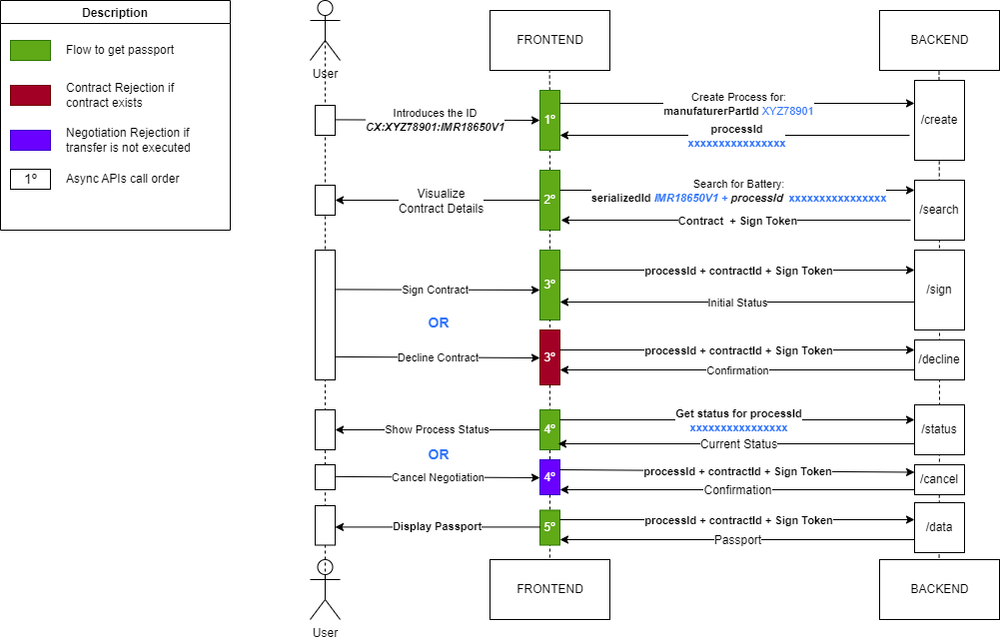

Swagger Documentation: [https://materialpass.int.demo.catena-x.net/swagger-ui/index.html](https://materialpass.int.demo.catena-x.net/swagger-ui/index.html
)

### Business Context

**Contents.**  
Specification of all communication partners (users, IT-systems, …) with explanations of domain specific inputs and outputs or interfaces. Optionally you can add domain specific formats or communication protocols.

**Motivation.**  
All stakeholders should understand which data are exchanged with the environment of the system.

**Form.**  
All kinds of diagrams that show the system as a black box and specify the domain interfaces to communication partners.
Alternatively (or additionally) you can use a table. The title of the table is the name of your system, the three columns contain the name of the communication partner, the inputs, and the outputs.  
***Diagram or Table***  
***Optionally: Explanation of external domain interfaces***

### Technical Context

#### Runtime Environments

At the moment, the Product Passport Application is hosted in three different environments:

| Application Runtime Environments | URLs |
| ---- | ----------- |
| Development (DEV) | [https://materialpass.dev.demo.catena-x.net/](https://materialpass.dev.demo.catena-x.net/) |
| Integration (INT) | [https://materialpass.int.demo.catena-x.net/](https://materialpass.int.demo.catena-x.net/) |
| Beta (BETA) | [https://materialpass.beta.demo.catena-x.net/](https://materialpass.beta.demo.catena-x.net/) |

| ArgoCD Deployment | URLs |
| ---- | ----------- |
| Development (DEV) | [https://argo.dev.demo.catena-x.net/](https://argo.dev.demo.catena-x.net/) |
| Integration (INT) | [https://argo.int.demo.catena-x.net/](https://argo.int.demo.catena-x.net/) |
| Beta (BETA) | [https://argo.beta.demo.catena-x.net/](https://argo.beta.demo.catena-x.net/) |

#### Container Ecosystem

##### Kubernetes Container platform (gardener)

* Hotel Budapest (Development, Integration and Beta Environments)
* Namespace:
  * product-material-pass

##### Containers

* EDC-Consumer Connector
* Consumer-UI
* PostgreSQL

#### CI/CD

* Managed by ArgoCD:
  * [https://argo.dev.demo.catena-x.net/](https://argo.dev.demo.catena-x.net/)
  * [https://argo.int.demo.catena-x.net/](https://argo.int.demo.catena-x.net/)
  * [https://argo.beta.demo.catena-x.net/](https://argo.beta.demo.catena-x.net/)
* Source code management - GitHub Repository:
  * [https://github.com/eclipse-tractusx/digital-product-pass](https://github.com/eclipse-tractusx/digital-product-pass)
* DevSecOps:
  * [Intro | Catena-x - DevSecOps](https://catenax-ng.github.io/docs/getstarted/intro)
* Eclipse Tractus-X Release Guidelines:
  * [Intro | Eclipse Tractus-X - Release Guidelines](https://eclipse-tractusx.github.io/docs/release)

#### Documentation links

* [ARC42 Documentation](#)
* [GitHub Documentation](https://github.com/eclipse-tractusx/digital-product-pass/tree/main/docs)
* [Administration Guide](../admin%20guide/Admin_Guide.md)
* [API Documentation (Swagger)](https://materialpass.int.demo.catena-x.net/swagger-ui/index.html)

#### Catena-X Shared Services

* IAM with Keycloak managed by Catena-X:
  * [https://centralidp.int.demo.catena-x.net/auth/](https://centralidp.int.demo.catena-x.net/auth/)
* DT-Registry with AAS-shell:
  * [https://semantics.int.demo.catena-x.net/registry/swagger-ui/index.html](https://semantics.int.demo.catena-x.net/registry/swagger-ui/index.html)
* DAPS registry: consumer endpoint registered:
  * [https://daps1.int.demo.catena-x.net/](https://daps1.int.demo.catena-x.net/)
* HashiCorp Vault to Store Secrets (https-certificate to access the connectors, *DB-credentials for our postgres db and Keycloak instances*):
  * [https://vault.demo.catena-x.net/ui/vault/secrets/material-pass/](https://vault.demo.catena-x.net/ui/vault/secrets/material-pass/)

## Solution Strategy

### Architecture Diagram

## Technology & Architecture Detail

Our technology and architecture are based in the Catena-X Guidelines. However the specific technologies selected are:

### Frontend (User Interface - Client Side)

#### Vue.js 3

According to the [Vue documentation](https://vuejs.org/guide/introduction.html), Vue (pronounced /vjuː/, like **view** ) is a JavaScript framework for building user interfaces. It builds on top of standard HTML, CSS, and JavaScript and provides a declarative and component-based programming model that helps you efficiently develop user interfaces, be they simple or complex.

Vue.js in the version 3 allows us to build stable components and have control of all the application lifecycle. One advantage of Vue is that all the components that are build can be scalabled easily, allowing the structure to be generalized.

In order to speed the development and build safe and stable components, a component has been selected.

##### Vuetify

Since we are required to follow the style guidelines from Catena-X, we selected Vuetify in its version 3.0.4, that is built using **Google's Material Design**, the selected Catena-X Style.

According to the [Vuetify documentation](https://next.vuetifyjs.com/en/introduction/why-vuetify/), every component in Vuetify is handcrafted under the guise of [Google’s Material Design](https://material.io/) specification and comes with hundreds of customization options that fit any style or design; even if it’s not Material. This gives us flexibility when choosing and personalizing the style of the application, while still maintaining the **stability, scalability and security** from the components. And when compared with other frameworks, we can see that an new patch regarding security and stability is release every week, giving us safety that the library is constantly improved and tested.

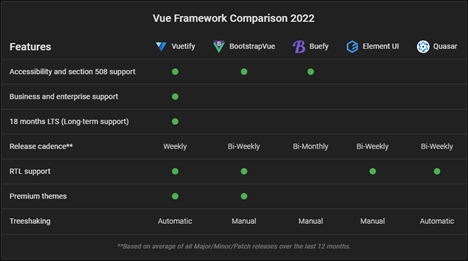

Another advantage from Vuetify is its documentation. There you are allowed to understand all the components and personalize them on-flight. Example: [Vuetify Alerts](https://next.vuetifyjs.com/en/components/alerts/).

Here we can see the components from the frontend of the application:

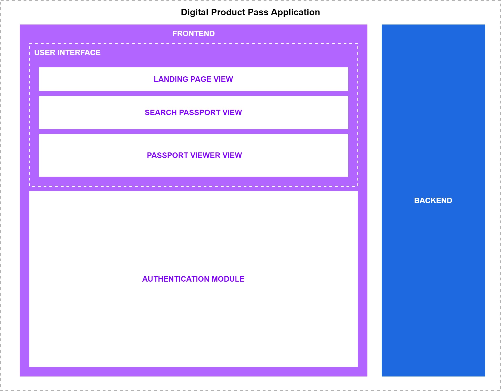

#### Component Description

| Component | Description |
| ---- | ----------- |
| Landing Page View | This component is part of the User Interface (UI), it is also responsible of asking the Authentication Module if the user is authenticated and wait for being redirected to the Central IDP, IAM Services from Catena-X. |
| Search Passport View | This component is part of the User Interface (UI), it offers the user the possibility of searching by partInstanceId or Scanning a QR Code that contains the partInstanceId. |
| Passport Viewer View | This component is part of the User Interface (UI), it requests the Passport from the Backend, report errors from the backend, gives a timeout error if the request takes too long or retrieves the passport. |
| Authentication Module | Uses the following library: [https://www.npmjs.com/package/keycloak-js](https://www.npmjs.com/package/keycloak-js). This component is responsible for managing the user authentication, making Central IDP API calls, identifying users and requesting access token and refreshing it  |

> **_INFO:_** *Just principal components with logics  are represented in this diagram, they are composed of several other smaller visual components, however they include no extra logic rather than displaying information to the user in the User Interface.*

#### Backend (Server Side)

The backend was built in order to give support to the frontend and provide dynamic data models, that can be stored in a persistence layer of the server. It also shall be responsible to communicate with the Catena-X network, authenticating the users and retrieving the necessary information in order that the frontend is able to visualize it to the user.

##### Java 19

The latest version of Java was selected so we can have no problem in utilizing new Java Classes and libraries. Java is an object-oriented language and is one of the most maintainable languages. Because it is robustness, cross-platform capabilities, security features and because is easy of use, it has become one of the first choices when providing Internet solutions worldwide.

###### Spring Boot

We selected spring boot because it allows us to:

* Consume different datasets from data-providers and process them for a flexible representation has no standard solution.
* Hiding fields with no values can be done in the computation or with the [Jackson Library](https://www.baeldung.com/jackson-ignore-null-fields)
* Exception Handling is quite comfortable within Java because of the type-safety. Don’t you something like @SneakyThrows and try to not use minor exceptions like RuntimeExceptions, because otherwise you don't have to deal with them explicitly.
* For session management there are [Session Scoped Beans](https://www.baeldung.com/spring-bean-scopes#2-session-scope) in Spring and they live within one http session.
* It allows us to comply with Catena-X security requirements and integrate Keycloak instances for authentication.

To ease the understanding and get a general technical context of the backend the following diagram was created:

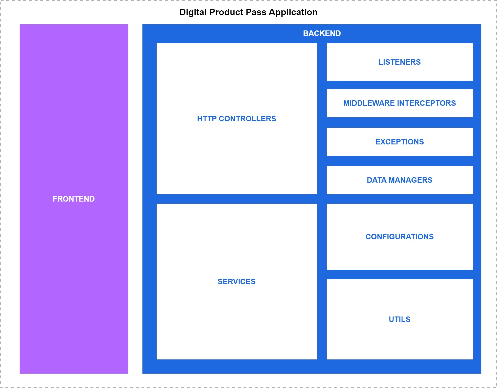

#### Component Description

| Component | Description |
| ---- | ----------- |
| HTTP Controllers | The http controllers are the main components and they are responsible for handling the external HTTP calls and APIs allowing other systems to access data |
| Services | The services are second main component and they are  responsible of interacting and getting data of external systems |
| Listeners | This component is responsible for listening to events and executing logics when they occur |
| Configurations | This component is integrated in Spring Boot and with the Utils, they are responsible for setting the parameters and logics of the whole backend system.  |
| Data Managers | This component is responsible for storing and retrieving data. (At the moment no data is stored apart from configurations) |
| Middleware and Interceptors | These components are integrated with the HTTP Controllers, however they are responsible for the information and for adding logics between the requests. Thanks to this component that we are able to log all API calls coming from the Frontend or external systems |
| Exceptions | This component contains the exception definitions, they can be in Runtime Exeception or Normal Exception Types. |
| Utils | This component is the base for all the  components, we are able to manage such as, Catena-X Logics, Configuration Logics, Cryptography, Logging, etc...|

### Infrastructure

#### Kubernetes and Helm Charts

Containerization technology is used in order to ease the deployment and management process. Kubernetes is an open-source container orchestration platform that allows us to automate deployment, scale, and management of containerized applications using Docker containers.

Helm is a package manager for Kubernetes and chart describes a set of Kubernetes resources such as deployment, pod, service, and other objects. Helm charts allow us to version the Kubernetes manifests and this lets us to install specific application/chart versions, means keeping the specific configurations for infrastructure as is in the code. Here, helm charts are used to provision battery passport components in different software runtime environments for instance, development, integration and pre-production which provides us a flexible way by having their separate configuration files for each infrastructure.

[Gartner](https://blogs.gartner.com/tony-iams/use-platform-engineering-to-implement-devops-workflows-with-kubernetes/#:~:text=Gartner%20is%20seeing%20enterprises%20deploy%20Kubernetes%20at%20increasing,greater%20varieties%20of%20applications%20and%20servicing%20multiple%20teams.) is considered to deploy Kubernetes resources at increasing scale as they look towards the cloud-native applications for modernizing infrastructure and applications across the organizations, targeting greater varieties of applications and servicing multiple teams.

[Argo CD platform](https://argoproj.github.io/cd/) is implemented as a Kubernetes controller and used as GitOps continuous delivery tool for Kubernetes. It is a declarative approach to define application components, configurations, and environments that should be versioned controlled. This allows us to manage application deployment and lifecycle that should be automated, auditable, and easy to understand. In this project, we used the Argo CD tool as a deployment platform where the Kubernetes cluster is running using Gartner, managed by the DevSecOps team. We used Argo CD to deploy the battery passport application components.

### Security Solution Strategy

In order to maintain the system safe and to comply with the quality gates a series of security applications are used.

## Building Block View

The system has certain building blocks which are illustrated below.
The primary battery passport application components are:

* Consumer Frontend
* Consumer Backend
* EDC Consumer

**Consumer Frontend:** A JavaScript-based user interface to request a battery passport from a battery manufacturer through Ecpilse Dataspace Connector (EDC) and Catena-X shared services, utilized by the consumer backend component.

**Consumer Backend:** A Java-based backend system that manages a variety of passports, utilizes Catenax shared services, and handles requests from the frontend component.

**EDC Consumer:** An Eclipse Dataspace Connector (EDC) is a gateway, used to establish a connection with the provider EDC in order to perform data transfer process, followed by certain steps such as requesting contract offers, doing contract negotiations, and transferring requested data once negotiations are agreed by both parties.

There are different levels categorized concerning the application resources deployed for a specific tool:

**Scope & Context:** A top-level defines the application runtime environment where application artifacts are deployed and running in a remote Kubernetes cluster in Argo CD (Hotel Budapest - INT) through helm charts. The deployed components are: "materialpass-edc" which refers to the consumer connector and "battery passport consumer application" refers to the consumer frontend (UI) application.

**Level 1:** this level defines a deep dive into each deployment artifact: materialpass-edc, consumer-backend and consumer-ui. In this layer, Kubernetes and helm resources are utilized using umbrella helm charts, consisting of some dependencies (container images) which are fetched from the GitHub registries.

**Level 2:** A centralized source control repository where the source code and build artifacts are stored and version controlled. It also contains various git actions, for instance, the Build pipeline that publishes compiled applications onto the GitHub Container Packages Registry (GHCR) which is further accessed by the next level and other build actions that get triggered to verify the CatenaX quality gate requirements.

**Level 3:** A development level where application source code is developed and built by developers.

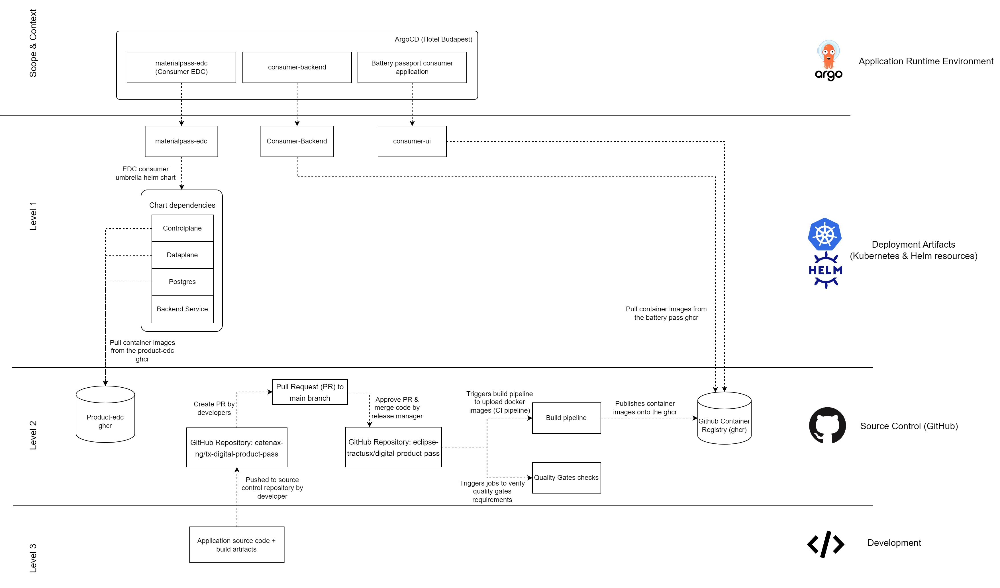

### Blackbox Overall System

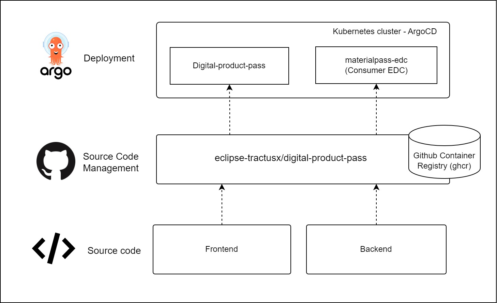

### Whitebox Overall System

A developer who creates a new feature branch to work on a specific feature that would be later on introduced in the next application release. He pushes the branch into the remote git repository, opens a new pull request (PR), and involves others such as project developer(s) and maintainer(s) to review his work where they could also provide their comments. Once PR is approved, the changes will get merged into the develop/main repository.

During the merge process, the build pipeline also known as Continuous integration (CI) gets triggered through a git action which builds the application artifacts, packages them into a docker image, and finally publishes the image onto the GitHub Container Registry with the tag holding latest commit SHA. In addition, other jobs are also executed which scan the code based on various criteria to fulfill the quality gate requirements.

The application deployment is translated into Kubernetes resources through helm charts which are deployed in Argo CD. We take the advantage of built-in AutoSync feature of ArgoCD that does the Continuous Deployment(CD) job for us. This is done by matching the current and desired state of the application if there is a new code change or a new container image uploaded to a registry.

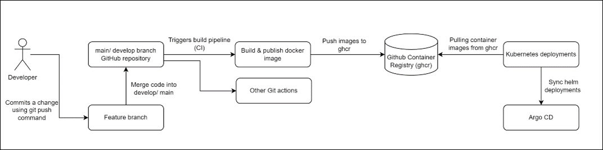

| Name | Responsibility |
| ---- | -------------- |
| GitHub repository | Source Code Management (SCM), Version Controlling System (VCS) that stores and manages application source code and build files |
| Build and publish docker image | A Continuous Integration pipeline, used to build UI container image and upload it to the registry |
| Other Git actions | KICS (Code scan), Veracode (secret scan), Trivy (Container scan), SonarCloud (code quality scan), ESLint (code formatting) |
| GitHub Container Registry (GHCR) | A container registry to store and manage container images and version them with tags |
| Kubernetes deployment | Kubernetes manifest yaml files such as deployment, pod, service, ingress |
| Argo CD | Application runtime environment managed by DevSecOps team |

## Runtime View

* Behavioral view
* User Experience (UX) journey

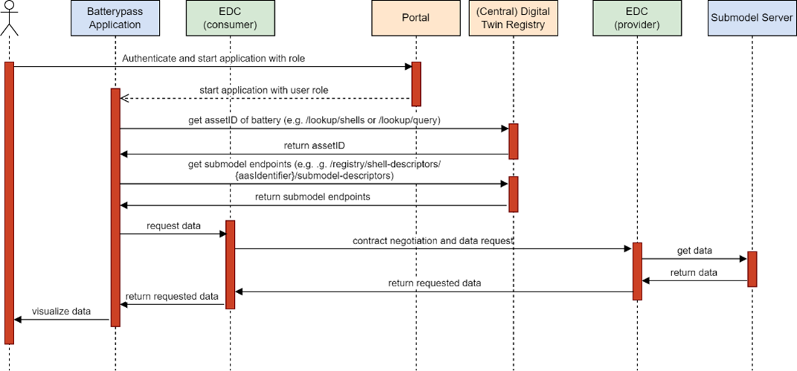

## Deployment View

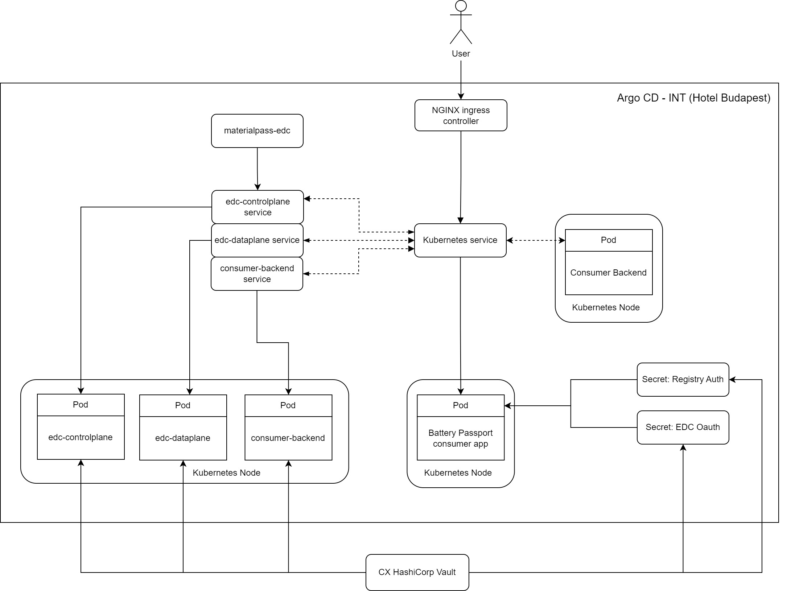

## Cross-cutting Concepts

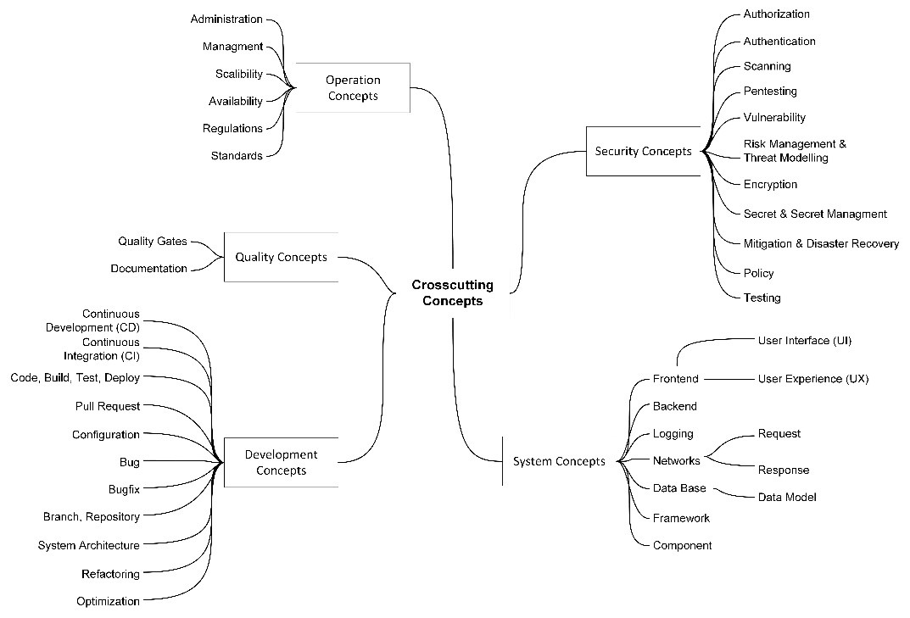

## Design Decisions

Designs are followed using the Catena-X Style Guidelines.

### History View (Landing Page)

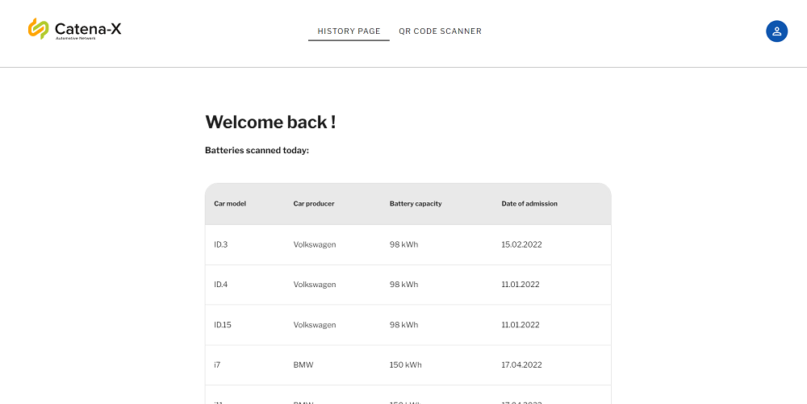

It was used a basic table, the logo, the footer and the avatar from Catena-X design guidelines:

### QR Code and Searching View

The QR Code view was also design following the Catena-X buttons and search style guides

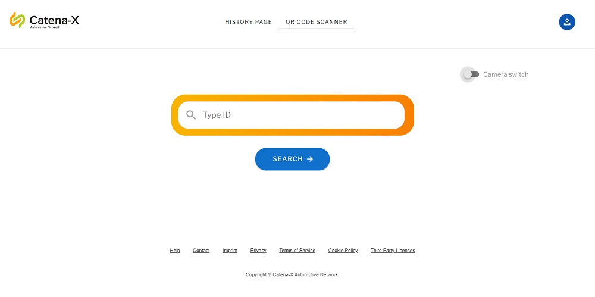

### Battery Passport View

The passport view was designed following using Catena-X accordion guidelines.

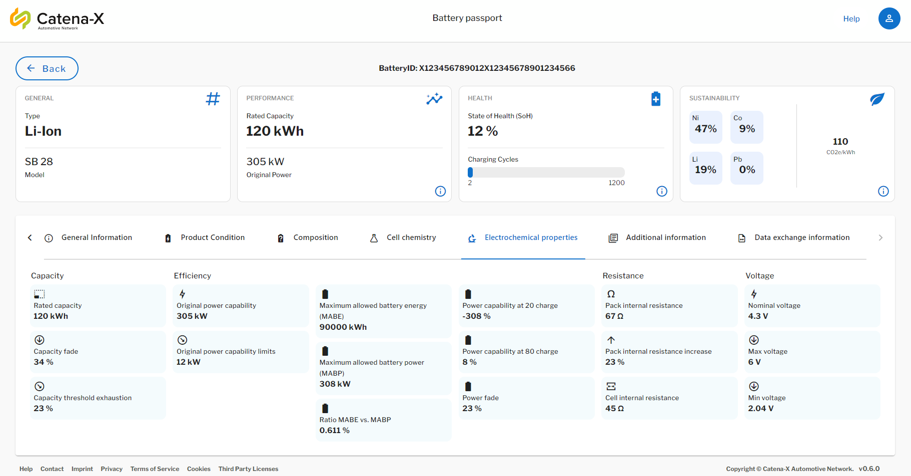

## Quality Requirements

As the Product Passport product is part of the Catena-X Network we are required to follow the quality requirements set by the Governance and Architecture Teams.  

The description of this quality gates can be found in the following documentation:

**Delivery Date:** 03.03.2023

### Quality Scenarios

**QS-01: The user shall response with a user friendly way to every request, even in case of error.:**  
When a used access the application and requests are performed from the frontend side, an error handling must be implemented in order to assure the correct user workflow within the application.

**QS-02: The application needs to provide a intuitive UI to the user.:**  
An user needs to be able to understand easily the application interface, in order to access the required data and to navigate thought the app.

## Risks and Technical Debts

**Who will be the owner of the application, who will maintain it?**

## Glossary

| Term | Definition |
| ---- | -------------- |
| EDC Connector | The Eclipse Data Space Connector provides a generic way to express, negotiate, and document the rules under which data is shared, and also with whom. |
| QG | Quality Gate, is a documentation, security & user satisfaction process defined by the Catena-X governance and architects in order to achieve common quality standards between the network. |
| IAM | Identity Access Management is a framework of policies and technologies to ensure that the right users (that are part of the ecosystem connected to or within an enterprise) have the appropriate access to technology resources. |
| DT-Reg | Digital Twin Registry is service of the Catena-X Semantic Layer that links IDS assets/artifacts/implementations (or rather: well-defined and cross-related subsets thereof) with their semantic descriptions and structure (aspect models as hosted in the Semantic Hub) |
| DAPS |The Dynamic Attribute Provisioning Service (DAPS) is a Federation Service of Identity and Trust (Authentication/Authorization), which is used by the traceability system.  |
| BPDM | Business Partner Data Management is a system that has the goal of representing legal entities, sites and the specific additional addresses of a legal entity. |
| CD | Continuous Deployment is a software engineering approach in which software functionalities are delivered frequently and through automated deployments. |
| CI | Continuous Integration is a software engineering practice of merging all developers' working copies to a shared mainline several times a day. |
| Backend | Is the part of a computer system or application that is not directly accessed by the user, typically responsible for storing and manipulating data. |
| Frontend | Is the graphical user interface (UI) of a software that makes it easier to use |
| Git | Is a distributed version control system: tracking changes in any set of files, usually used for coordinating work among programmers collaboratively developing source code during software development. |
| DevOps | Is a set of practices that combines software development (Dev) and IT operations (Ops). It aims to shorten the systems development life cycle and provide continuous delivery with high software quality. |
| Repository | Is a database of digital content with an associated set of data management, search and access methods allowing application-independent access to the content, rather like a digital library, but with the ability to store and modify content in addition to searching and retrieving. |
