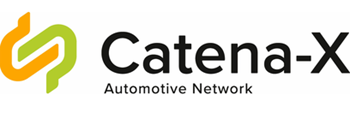

<!--
 Copyright 2023 BASF SE, BMW AG, Henkel AG & Co. KGaA
 
 Licensed under the Apache License, Version 2.0 (the "License");
 you may not use this file except in compliance with the License.
 You may obtain a copy of the License at
 
     http://www.apache.org/licenses/LICENSE-2.0
 
 Unless required by applicable law or agreed to in writing, software
 distributed under the License is distributed on an "AS IS" BASIS,
 WITHOUT WARRANTIES OR CONDITIONS OF ANY KIND, either express or implied.
 See the License for the specific language governing permissions and
 limitations under the License.
-->

# (CEC) ARC42 - Product Passport Consumer Application Documentation

   

Version: v2.2  
Latest Revision Mar. 27, 2023

## Table of Contents

1. [Table of Contents](#table-of-contents)
2. [Introduction and Goals](#introduction-and-goals)
    1. [Requirements Overview](#requirements-overview)
    2. [Quality Goals](#quality-goals)
3. [Architecture Constraints](#architecture-constraints)
4. [System Scope and Context](#system-scope-and-context)
    1. [Detailed Explanation from Product Passport Application](#detailed-explanation-from-product-passport-application)
        1. [Product Passport Component](#product-passport-component)
            1. [Application State Diagram](#application-state-diagram)
            2. [Technical Integration Design](#technicl-integration-design)
    2. [Business Context](#business-context)
    3. [Technical Context](#technical-context)
        1. [Runtime Environments](#runtime-environments)
        2. [Container Ecosystem](#container-ecosystem)
             1. [Kubernetes Container Platform (Gardener)](#kubernetes-container-platform-gardener)
             2. [Containers](#containers)
        3. [CI/CD](#cicd)
        4. [Documentation Links](#documentation-links)
        6. [Catena-X Shared Services](#catena-x-shared-services)
5. [Solution Strategy](#solution-strategy)
    1. [Architecture Diagram](#architecture-diagram)
    2. [Technology & Architecture Detail](#technology--architecture-detail)
        1. [Frontend (User Interface - Client Side)](#frontend-user-interface---client-side)
            1. [Vue.js 3](#vuejs-3)
                1. [Vuetify](#vuetify)
            2. [Backend (Server Side)](#backend-server-side)
                1. [Java 19](#java-19)
                    1. [Spring Boot](#spring-boot)
    3. [Infrastructure](#infrastructure)
        1. [Kubernetes and Helm Charts](#kubernetes-and-helm-charts)
    4. [Security Solution Strategy](#security-solution-strategy)
6. [Building Block View](#building-block-view)
    1. [Blackbox Overall System](#blackbox-overall-system)
    2. [Whitebox Overall System](#whitebox-overall-system)
7. [Runtime View](#runtime-view)
8. [Deployment View](#deployment-view)
9. [Cross-Cutting Concepts](#cross-cutting-concepts)
10. [Design Decisions](#design-decisions)
11. [Quality Requirements](#quality-requirements)   
    3. [Qualtiy Scenarios](#quality-scenarios)
12. [Risks and Technical Debts](#risks-and-technical-debts)
13. [Glossary](#glossary)

## Introduction and Goals

Within the Catena-X Network, Product Passports are provided by manufacturers and can be exchanged in a standardized way. The data exchange standards are given by Catena-X and are used provide the product passport to different users in the network.

This passports can be used for different products like **Batteries**, **Gearboxes**, etc. At the moment the only product implemented are **batteries**, so the user interface only displays product passports. In the near future it will be able to display any passport structure, over a generic product passport that is in development at the moment.

The product passport consumer app provides an easy way to request a product passport from a manufacturer using the Catena-X network and standardized components and technologies. The passport will be displayed user-readable in an common browser. The app is used to access the passport data, which is provided by a manufacturer. Another interesting feature, is that you are able to scan a QR-code or by knowing the manufacturer and product-ID a user can request the passport over the Catena-X. On the other end, the manufacturer will provide passports with data elements, that the signed-in user is allowed to see the detailed information from a product.

This application is developed by the **Product Passport Team**, one of the members from **Catena-X Circular Economy Team**, aiming to contribute to the environmental cause, allowing recyclers, OEMs and dismantlers to know properties, dimensions and other important data related with a current product or material.

### Requirements Overview

The product passport consumer app is an web-based application developed in Vue.js, making it accessible using **standard browsers** (Chrome, Edge, Firefox, etc) for any user in the Catena-X Network.

It displays a specific passport for each product, in the Catena-X network hosted in a backend system. Using the Catena-X data exchange standards to request and receive data from the network it leverages the users and roles provided by Catena-X by using the required shared components (IAM, EDC, DAPS, DT-Registry)

The product passport consumer app UI follows the Catena-X CI layout, keeping things simple for the user while still providing the necessary information.

A User can request a passport...

* Either by scanning a **QR-code** which leads to the a passport view UI, allowing the user to visualize all the necessary/required information of a product. Making easier to dismantle it.
* In case a QR is not provided, the user is able to introduce the product id manually in a search field.

As the data provider might not send every data field regarding to the users privileges, the application is flexible with its layout and data handling, displaying only what it receives.

### Quality Goals

1. Reference the release management process with its **Quality Gates** (security, test, documentation, etc)
2. Test created in cypress (reference to test cases)
3. CI Pipeline to reduce manual effort and error. Establish fast feedback.
4. Git branch concept with PR and review-approvals
5. Lint for code formatting and styling

**Contents.**  
*The top three (max five) quality goals for the architecture whose fulfillment is of highest importance to the major stakeholders. We really mean quality goals for the architecture. Don't confuse them with project goals. They are not necessarily identical.*  

**Motivation.**  
*You should know the quality goals of your most important stakeholders, since they will influence fundamental architectural decisions. Make sure to be very concrete about these qualities, avoid buzzwords. If you as an architect do not know how the quality of your work will be judged…*  

**Form.**  
*A table with quality goals and concrete scenarios, ordered by priorities.*

**Contents.**  
*Explicit overview of stakeholders of the system, i.e. all person, roles or organizations that*

* *should know the architecture*
* *have to be convinced of the architecture*
* *have to work with the architecture or with code*
* *need the documentation of the architecture for their work*
* *have to come up with decisions about the system or its development*

**Motivation.**  
*You should know all parties involved in development of the system or affected by the system. Otherwise, you may get nasty surprises later in the development process. These stakeholders determine the extent and the level of detail of your work and its results.*

**Form.**  
*Table with role names, person names, and their expectations with respect to the architecture and its documentation.*

## Architecture Constraints

Catena-X Standard to DataExchange, Trust and Security. **We follow the Catena-X Architecture Framework**

FOSS Guardrails

Guardrails for Data Souveranity **We follow the Data Souveranity Guardrails from PI5**

**Contents.**  
*Any requirement that constrains software architects in their freedom of design and implementation decisions or decision about the development process. These constraints sometimes go beyond individual systems and are valid for whole organizations and companies.*

**Motivation.**  
*Architects should know exactly where they are free in their design decisions and where they must adhere to constraints. Constraints must always be dealt with; they may be negotiable, though.*

**Form.**  
*Simple tables of constraints with explanations. If needed you can subdivide them into technical constraints, organizational and political constraints and conventions (e.g. programming or versioning guidelines, documentation or naming conventions).*

## System Scope and Context

The Product Passport Application is a Catena-X terms a "blue" application. This means that it is a Business Application that accesses other "green" applications, like the Digital Twin Registry, IAM (Keycloack), Secret Management (Hashi Corp Vault), which are provided by the Catena-X network.

### Detailed Explanation from Product Passport Application

The interaction between the Product Passport Application previous the "BatteryPass" Application, the EDC Connectors, the Digital Twin registry and other services is detailed in the following page:

#### Product Passport Component

##### Application State Diagram

##### Technical Integration Design

Swagger Documentation: [https://materialpass.int.demo.catena-x.net/swagger-ui/index.html](https://materialpass.int.demo.catena-x.net/swagger-ui/index.html
)

### Business Context

**Contents.**  
Specification of all communication partners (users, IT-systems, …) with explanations of domain specific inputs and outputs or interfaces. Optionally you can add domain specific formats or communication protocols.

**Motivation.**  
All stakeholders should understand which data are exchanged with the environment of the system.

**Form.**  
All kinds of diagrams that show the system as a black box and specify the domain interfaces to communication partners.
Alternatively (or additionally) you can use a table. The title of the table is the name of your system, the three columns contain the name of the communication partner, the inputs, and the outputs.  
***Diagram or Table***  
***Optionally: Explanation of external domain interfaces***

### Technical Context

#### Runtime Environments

At the moment, the Product Passport Application is hosted in three different environments:

| Application Runtime Environments | URLs |
| ---- | ----------- |
| Development (DEV) | [https://materialpass.dev.demo.catena-x.net/](https://materialpass.dev.demo.catena-x.net/) |
| Integration (INT) | [https://materialpass.int.demo.catena-x.net/](https://materialpass.int.demo.catena-x.net/) |
| Beta (BETA) | [https://materialpass.beta.demo.catena-x.net/](https://materialpass.beta.demo.catena-x.net/) |

| ArgoCD Deployment | URLs |
| ---- | ----------- |
| Development (DEV) | [https://argo.dev.demo.catena-x.net/](https://argo.dev.demo.catena-x.net/) |
| Integration (INT) | [https://argo.int.demo.catena-x.net/](https://argo.int.demo.catena-x.net/) |
| Beta (BETA) | [https://argo.beta.demo.catena-x.net/](https://argo.beta.demo.catena-x.net/) |

#### Container Ecosystem

##### Kubernetes Container platform (gardener)

* Hotel Budapest (Development, Integration and Beta Environments)
* Namespace:
  * product-material-pass

##### Containers

* EDC-Consumer Connector
* Consumer-UI
* PostgreSQL

#### CI/CD

* Managed by ArgoCD:
  * [https://argo.dev.demo.catena-x.net/](https://argo.dev.demo.catena-x.net/)
  * [https://argo.int.demo.catena-x.net/](https://argo.int.demo.catena-x.net/)
  * [https://argo.beta.demo.catena-x.net/](https://argo.beta.demo.catena-x.net/)
* Source code management - GitHub Repository:
  * [https://github.com/eclipse-tractusx/digital-product-pass](https://github.com/eclipse-tractusx/digital-product-pass)
* DevSecOps:
  * [Intro | Catena-x - DevSecOps](https://catenax-ng.github.io/docs/getstarted/intro)
* Eclipse Tractus-X Release Guidelines:
  * [Intro | Eclipse Tractus-X - Release Guidelines](https://eclipse-tractusx.github.io/docs/release)

#### Documentation links

* [ARC42 Documentation](#)
* [GitHub Documentation](https://github.com/eclipse-tractusx/digital-product-pass/tree/main/docs)
* [Administration Guide](../admin%20guide/Admin_Guide.md)
* [API Documentation (Swagger)](https://materialpass.int.demo.catena-x.net/swagger-ui/index.html)

#### Catena-X Shared Services

* IAM with Keycloak managed by Catena-X:
  * [https://centralidp.int.demo.catena-x.net/auth/](https://centralidp.int.demo.catena-x.net/auth/)
* DT-Registry with AAS-shell:
  * [https://semantics.int.demo.catena-x.net/registry/swagger-ui/index.html](https://semantics.int.demo.catena-x.net/registry/swagger-ui/index.html)
* DAPS registry: consumer endpoint registered:
  * [https://daps1.int.demo.catena-x.net/](https://daps1.int.demo.catena-x.net/)
* HashiCorp Vault to Store Secrets (https-certificate to access the connectors, *DB-credentials for our postgres db and Keycloak instances*):
  * [https://vault.demo.catena-x.net/ui/vault/secrets/material-pass/](https://vault.demo.catena-x.net/ui/vault/secrets/material-pass/)

## Solution Strategy

### Architecture Diagram

**Contents.**  
*Technical interfaces (channels and transmission media) linking your system to its environment. In addition a mapping of domain specific input/output to the channels, i.e. an explanation with I/O uses which channel.*

**Motivation.**  
*Many stakeholders make architectural decision based on the technical interfaces between the system and its context. Especially infrastructure or hardware designers decide these technical interfaces.*

**Form.**  
*E.g. UML deployment diagram describing channels to neighboring systems, together with a mapping table showing the relationships between channels and input/output.*  
***Diagram or Table***  
***Optionally: Explanation of external domain interfaces***  
***Mapping Input/Output ot Channels***

## Technology & Architecture Detail

Our technology and architecture are based in the Catena-X Guidelines. However the specific technologies selected are:

### Frontend (User Interface - Client Side)

#### Vue.js 3

According to the [Vue documentation](https://vuejs.org/guide/introduction.html), Vue (pronounced /vjuː/, like **view** ) is a JavaScript framework for building user interfaces. It builds on top of standard HTML, CSS, and JavaScript and provides a declarative and component-based programming model that helps you efficiently develop user interfaces, be they simple or complex.

Vue.js in the version 3 allows us to build stable components and have control of all the application lifecycle. One advantage of Vue is that all the components that are build can be scalabled easily, allowing the structure to be generalized.

In order to speed the development and build safe and stable components, a component has been selected.

##### Vuetify

Since we are required to follow the style guidelines from Catena-X, we selected Vuetify in its version 3.0.4, that is built using **Google's Material Design**, the selected Catena-X Style.

According to the [Vuetify documentation](https://next.vuetifyjs.com/en/introduction/why-vuetify/), every component in Vuetify is handcrafted under the guise of [Google’s Material Design](https://material.io/) specification and comes with hundreds of customization options that fit any style or design; even if it’s not Material. This gives us flexibility when choosing and personalizing the style of the application, while still maintaining the **stability, scalability and security** from the components. And when compared with other frameworks, we can see that an new patch regarding security and stability is release every week, giving us safety that the library is constantly improved and tested.

Another advantage from Vuetify is its documentation. There you are allowed to understand all the components and personalize them on-flight. Example: [Vuetify Alerts](https://next.vuetifyjs.com/en/components/alerts/).

Here we can see the components from the frontend of the application:

#### Component Description

| Component | Description |
| ---- | ----------- |
| Landing Page View | This component is part of the User Interface (UI), it is also responsible of asking the Authentication Module if the user is authenticated and wait for being redirected to the Central IDP, IAM Services from Catena-X. |
| Search Passport View | This component is part of the User Interface (UI), it offers the user the possibility of searching by partInstanceId or Scanning a QR Code that contains the partInstanceId. |
| Passport Viewer View | This component is part of the User Interface (UI), it requests the Passport from the Backend, report errors from the backend, gives a timeout error if the request takes too long or retrieves the passport. |
| Authentication Module | Uses the following library: [https://www.npmjs.com/package/keycloak-js](https://www.npmjs.com/package/keycloak-js). This component is responsible for managing the user authentication, making Central IDP API calls, identifying users and requesting access token and refreshing it  |

***Info:*** 
*Just principal components with logics  are represented in this diagram, they are composed of several other smaller visual components, however they include no extra logic rather than displaying information to the user in the User Interface.*

#### Backend (Server Side)

The backend was built in order to give support to the frontend and provide dynamic data models, that can be stored in a persistence layer of the server. It also shall be responsible to communicate with the Catena-X network, authenticating the users and retrieving the necessary information in order that the frontend is able to visualize it to the user.

##### Java 19

The latest version of Java was selected so we can have no problem in utilizing new Java Classes and libraries. Java is an object-oriented language and is one of the most maintainable languages. Because it is robustness, cross-platform capabilities, security features and because is easy of use, it has become one of the first choices when providing Internet solutions worldwide.

###### Spring Boot

We selected spring boot because it allows us to:

* Consume different datasets from data-providers and process them for a flexible representation has no standard solution.
* Hiding fields with no values can be done in the computation or with the [Jackson Library](https://www.baeldung.com/jackson-ignore-null-fields)
* Exception Handling is quite comfortable within Java because of the type-safety. Don’t you something like @SneakyThrows and try to not use minor exceptions like RuntimeExceptions, because otherwise you don't have to deal with them explicitly.
* For session management there are [Session Scoped Beans](https://www.baeldung.com/spring-bean-scopes#2-session-scope) in Spring and they live within one http session.
* It allows us to comply with Catena-X security requirements and integrate Keycloak instances for authentication.

To ease the understanding and get a general technical context of the backend the following diagram was created:

#### Component Description

| Component | Description |
| ---- | ----------- |
| HTTP Controllers | The http controllers are the main components and they are responsible for handling the external HTTP calls and APIs allowing other systems to access data |
| Services | The services are second main component and they are  responsible of interacting and getting data of external systems |
| Listeners | This component is responsible for listening to events and executing logics when they occur |
| Configurations | This component is integrated in Spring Boot and with the Utils, they are responsible for setting the parameters and logics of the whole backend system.  |
| Data Managers | This component is responsible for storing and retrieving data. (At the moment no data is stored apart from configurations) |
| Middleware and Interceptors | These components are integrated with the HTTP Controllers, however they are responsible for the information and for adding logics between the requests. Thanks to this component that we are able to log all API calls coming from the Frontend or external systems |
| Exceptions | This component contains the exception definitions, they can be in Runtime Exeception or Normal Exception Types. |
| Utils | This component is the base for all the  components, we are able to manage such as, Catena-X Logics, Configuration Logics, Cryptography, Logging, etc...|

### Infrastructure

#### Kubernetes and Helm Charts

Containerization technology is used in order to ease the deployment and management process. Kubernetes is an open-source container orchestration platform that allows us to automate deployment, scale, and management of containerized applications using Docker containers.

Helm is a package manager for Kubernetes and chart describes a set of Kubernetes resources such as deployment, pod, service, and other objects. Helm charts allow us to version the Kubernetes manifests and this lets us to install specific application/chart versions, means keeping the specific configurations for infrastructure as is in the code. Here, helm charts are used to provision battery passport components in different software runtime environments for instance, development, integration and pre-production which provides us a flexible way by having their separate configuration files for each infrastructure.

[Gartner](https://blogs.gartner.com/tony-iams/use-platform-engineering-to-implement-devops-workflows-with-kubernetes/#:~:text=Gartner%20is%20seeing%20enterprises%20deploy%20Kubernetes%20at%20increasing,greater%20varieties%20of%20applications%20and%20servicing%20multiple%20teams.) is considered to deploy Kubernetes resources at increasing scale as they look towards the cloud-native applications for modernizing infrastructure and applications across the organizations, targeting greater varieties of applications and servicing multiple teams.

[Argo CD platform](https://argoproj.github.io/cd/) is implemented as a Kubernetes controller and used as GitOps continuous delivery tool for Kubernetes. It is a declarative approach to define application components, configurations, and environments that should be versioned controlled. This allows us to manage application deployment and lifecycle that should be automated, auditable, and easy to understand. In this project, we used the Argo CD tool as a deployment platform where the Kubernetes cluster is running using Gartner, managed by the DevSecOps team. We used Argo CD to deploy the battery passport application components.

### Security Solution Strategy

In order to maintain the system safe and to comply with the quality gates a series of security applications are used.

**Contents.**  
*A short summary and explanation of the fundamental decisions and solution strategies, that shape the system's architecture. These include:*

* *technology decisions*
* *decisions about the top-level decomposition of the system, e.g. usage of an architectural pattern or design pattern*
* *decisions on how to achieve key quality goals*
* *relevant organizational decisions, e.g. selecting a development process or delegating certain tasks to third parties.*

**Motivation.**  
*These decisions form the cornerstones for your architecture. They are the basis for many other detailed decisions or implementation rules.*

**Form.**  
*Keep the explanation of these key decisions short.*  
*Motivate what you have decided and why you decided that way, based upon your problem statement, the quality goals and key constraints. Refer to details in the following sections.*

## Building Block View

The system has certain building blocks which are illustrated below.
The primary battery passport application components are:

* Consumer Frontend
* Consumer Backend
* EDC Consumer

**Consumer Frontend:** A JavaScript-based user interface to request a battery passport from a battery manufacturer through Ecpilse Dataspace Connector (EDC) and Catena-X shared services, utilized by the consumer backend component.

**Consumer Backend:** A Java-based backend system that manages a variety of passports, utilizes Catenax shared services, and handles requests from the frontend component.

**EDC Consumer:** An Eclipse Dataspace Connector (EDC) is a gateway, used to establish a connection with the provider EDC in order to perform data transfer process, followed by certain steps such as requesting contract offers, doing contract negotiations, and transferring requested data once negotiations are agreed by both parties.

There are different levels categorized concerning the application resources deployed for a specific tool:

**Scope & Context:** A top-level defines the application runtime environment where application artifacts are deployed and running in a remote Kubernetes cluster in Argo CD (Hotel Budapest - INT) through helm charts. The deployed components are: "materialpass-edc" which refers to the consumer connector and "battery passport consumer application" refers to the consumer frontend (UI) application.

**Level 1:** this level defines a deep dive into each deployment artifact: materialpass-edc, consumer-backend and consumer-ui. In this layer, Kubernetes and helm resources are utilized using umbrella helm charts, consisting of some dependencies (container images) which are fetched from the GitHub registries.

**Level 2:** A centralized source control repository where the source code and build artifacts are stored and version controlled. It also contains various git actions, for instance, the Build pipeline that publishes compiled applications onto the GitHub Container Packages Registry (GHCR) which is further accessed by the next level and other build actions that get triggered to verify the CatenaX quality gate requirements.

**Level 3:** A development level where application source code is developed and built by developers.

**Contents.**  
*The building block view shows the static decomposition of the system into building blocks (modules, components, subsystems, classes, interfaces, packages, libraries, frameworks, layers, partitions, tiers, functions, macros, operations, datas structures, …) as well as their dependencies (relationships, associations, …)*
*This view is mandatory for every architecture documentation. In analogy to a house this is the floor plan.*

**Motivation.**  
*Maintain an overview of your source code by making its structure understandable through abstraction.*
*This allows you to communicate with your stakeholder on an abstract level without disclosing implementation details.*

**Form.**  
*The building block view is a hierarchical collection of black boxes and white boxes (see figure below) and their descriptions.*

### Blackbox Overall System

### Whitebox Overall System

A developer who creates a new feature branch to work on a specific feature that would be later on introduced in the next application release. He pushes the branch into the remote git repository, opens a new pull request (PR), and involves others such as project developer(s) and maintainer(s) to review his work where they could also provide their comments. Once PR is approved, the changes will get merged into the develop/main repository.

During the merge process, the build pipeline also known as Continuous integration (CI) gets triggered through a git action which builds the application artifacts, packages them into a docker image, and finally publishes the image onto the GitHub Container Registry with the tag holding latest commit SHA. In addition, other jobs are also executed which scan the code based on various criteria to fulfill the quality gate requirements.

The application deployment is translated into Kubernetes resources through helm charts which are deployed in Argo CD. We take the advantage of built-in AutoSync feature of ArgoCD that does the Continuous Deployment(CD) job for us. This is done by matching the current and desired state of the application if there is a new code change or a new container image uploaded to a registry.

| Name | Responsibility |
| ---- | -------------- |
| GitHub repository | Source Code Management (SCM), Version Controlling System (VCS) that stores and manages application source code and build files |
| Build and publish docker image | A Continuous Integration pipeline, used to build UI container image and upload it to the registry |
| Other Git actions | KICS (Code scan), Veracode (secret scan), Trivy (Container scan), SonarCloud (code quality scan), ESLint (code formatting) |
| GitHub Container Registry (GHCR) | A container registry to store and manage container images and version them with tags |
| Kubernetes deployment | Kubernetes manifest yaml files such as deployment, pod, service, ingress |
| Argo CD | Application runtime environment managed by DevSecOps team |

*Here you describe the decomposition of the overall system using the following white box template. It contains:*

* *an overview diagram*
* *a motivation for the decomposition*
* *black box descriptions of the contained building blocks. For these we offer you alternatives:*
  * *use one table for a short and pragmatic overview of all contained building blocks and their interfaces*
  * *use a list of black box descriptions of the building blocks according to the black box template (see below). Depending on your choice of tool this list could be sub-chapters (in text files), sub-pages (in a Wiki) or nested elements (in a modeling tool).*
* *(optional  important interfaces, that are not explained in the black box templates of a building block, but are very important for understanding the white box. Since there are so many ways to specify interfaces why do not provide a specific template for them. In the worst case you have to specify and describe syntax, semantics, protocols, error handling, restrictions, versions, qualities, necessary compatibilities and many things more. In the best case you will get away with examples or simple signatures.*

**Motivation.**  
*text explanation*

**Contained Building Blocks.**  
*Description of contained building block (black boxes)*

**Important Interfaces.**  
*Description of important interfaces*  

*Insert your explanations of black boxes from level 1:*
*If you use tabular form you will only describe your black boxes with name and responsibility according to the following schema:*

| Name | Responsibility |
| ---- | -------------- |
| *black box 1* | *Text* |
| *black box 2* | *Text* |

*If you use a list of black box descriptions then you fill in a separate black box template for every important building block . Its headline is the name of the black box.*

## Runtime View

* behavioral view and
* UX Journey of David

**Contents.**  
*The runtime view describes concrete behavior and interactions of the system's building blocks in form of scenarios from the following areas:*

* *important use cases or features: how do building blocks execute them?*
* *interactions at critical external interfaces: how do building blocks cooperate with users and neighboring systems?*
* *operation and administration: launch, start-up, stop*
* *error and exception scenarios*

*Remark: The main criterion for the choice of possible scenarios (sequences, workflows) is their **architectural relevance**. It is **not** important to describe a large number of scenarios. You should rather document a representative selection.*

**Motivation.**  
*You should understand how (instances of) building blocks of your system perform their job and communicate at runtime. You will mainly capture scenarios in your documentation to communicate your architecture to stakeholders that are less willing or able to read and understand the static models (building block view, deployment view).*

**Form.**  
*There are many notations for describing scenarios, e.g.*

* *numbered list of steps (in natural language)*
* *activity diagrams or flow charts*
* *sequence diagrams*
* *BPMN or EPCs (event process chains)*
* *state machines*
* *…*

## Deployment View

**Contents.**  
*The deployment view describes:*

1. *the technical infrastructure used to execute your system, with infrastructure elements like geographical locations, environments, computers, processors, channels and net topologies as well as other infrastructure elements and*
2. *the mapping of (software) building blocks to that infrastructure elements.*

*Often systems are executed in different environments, e.g. development environment, test environment, production environment. In such cases you should document all relevant environments.
Especially document the deployment view when your software is executed as distributed system with more then one computer, processor, server or container or when you design and construct your own hardware processors and chips.
From a software perspective it is sufficient to capture those elements of the infrastructure that are needed to show the deployment of your building blocks. Hardware architects can go beyond that and describe the infrastructure to any level of detail they need to capture.*

**Motivation.**  
*Software does not run without hardware. This underlying infrastructure can and will influence your system and/or some cross-cutting concepts. Therefore, you need to know the infrastructure.  
Maybe the highest level deployment diagram is already contained in section 3.2. as technical context with your own infrastructure as ONE black box. In this section you will zoom into this black box using additional deployment diagrams:*

* *UML offers deployment diagrams to express that view. Use it, probably with nested diagrams, when your infrastructure is more complex.*
* *When your (hardware) stakeholders prefer other kinds of diagrams rather than the deployment diagram, let them use any kind that is able to show nodes and channels of the infrastructure.*

## Cross-cutting Concepts

**Contents.**  
*This section describes overall, principal regulations and solution ideas that are relevant in multiple parts (= cross-cutting) of your system. Such concepts are often related to multiple building blocks. They can include many different topics, such as*

* *domain models*
* *architecture patterns or design patterns*
* *rules for using specific technology*
* *principal, often technical decisions of overall decisions*
* *implementation rules*

**Motivation.**  
*Concepts form the basis for conceptual integrity (consistency, homogeneity) of the architecture. Thus, they are an important contribution to achieve inner qualities of your system.*  
*Some of these concepts cannot be assigned to individual building blocks (e.g. security or safety). This is the place in the template that we provided for a cohesive specification of such concepts.*

**Form.**  
*The form can be varied:*

* *concept papers with any kind of structure*
* *cross-cutting model excerpts or scenarios using notations of the architecture views*
* *sample implementations, especially for technical concepts*
* *reference to typical usage of standard frameworks (e.g. using Hibernate for object/relational mapping)*

**Structure.**  
*A potential (but not mandatory) structure for this section could be:*

* *Domain concepts*
* *User Experience concepts (UX)*
* *Safety and security concepts*
* *Architecture and design patterns*
* *"Under-the-hood"*
* *development concepts*
* *operational concepts*

*Note: it might be difficult to assign individual concepts to one specific topic on this list.*

## Design Decisions

Designs are followed using the Catena-X Style Guidelines.

### History View (Landing Page)

It was used a basic table, the logo, the footer and the avatar from Catena-X design guidelines:

### QR Code and Searching View

The QR Code view was also design following the Catena-X buttons and search style guides

### Battery Passport View

The passport view was designed following using Catena-X accordion guidelines.

**Contents.**  
*Important, expensive, large scale or risky architecture decisions including rationals. With "decisions" we mean selecting one alternative based on given criteria.  
Please use your judgement to decide whether an architectural decision should be documented here in this central section or whether you better document it locally (e.g. within the white box template of one building block).
Avoid redundancy. Refer to section 4, where you already captured the most important decisions of your architecture.*

**Motivation.**  
*Stakeholders of your system should be able to comprehend and retrace your decisions.*

**Form.**  
*Various options:*

* *List or table, ordered by importance and consequences or*
* *More detailed in form of separate sections per decision*
* *ADR (architecture decision record) for every important decision*

## Quality Requirements

As the Product Passport product is part of the Catena-X Network we are required to follow the quality requirements set by the Governance and Architecture Teams.  

The description of this quality gates can be found in the following documentation:

**Delivery Date:** 03.03.2023

**Contents.**  
*This section contains all quality requirements as quality tree with scenarios. The most important ones have already been described in section 1.2. (quality goals)  
Here you can also capture quality requirements with lesser priority, which will not create high risks when they are not fully achieved.*

**Motivation.**  
*Since quality requirements will have a lot of influence on architectural decisions you should know for every stakeholder what is really important to them, concrete and measurable.*

### Quality Scenarios

**QS-01: The user shall response with a user friendly way to every request, even in case of error.:**  
When a used access the application and requests are performed from the frontend side, an error handling must be implemented in order to assure the correct user workflow within the application.

**QS-02: The application needs to provide a intuitive UI to the user.:**  
An user needs to be able to understand easily the application interface, in order to access the required data and to navigate thought the app.

**Contents.**  
*Concretization of (sometimes vague or implicit) quality requirements using (quality) scenarios.  
These scenarios describe what should happen when a stimulus arrives at the system.  
For architects, two kinds of scenarios are important:*

* *Usage scenarios (also called application scenarios or use case scenarios) describe the system's runtime reaction to a certain stimulus. This also includes scenarios that describe the system's efficiency or performance. Example: The system reacts to a user's request within one second.*
* *Change scenarios describe a modification of the system or of its immediate environment. Example: Additional functionality is implemented or requirements for a quality attribute change.*

**Motivation.**  
*Scenarios make quality requirements concrete and allow to more easily measure or decide whether they are fulfilled.  
Especially when you want to assess your architecture using methods like ATAM you need to describe your quality goals (from section 1.2) more precisely down to a level of scenarios that can be discussed and evaluated.*

**Form.**  
*Tabular or free form text.*  

## Risks and Technical Debts

**Who will be the owner of the application, who will maintain it?**

**Contents.**  
*A list of identified technical risks or technical debts, ordered by priority*

**Motivation.**  
*"Risk management is project management for grown-ups" (Tim Lister, Atlantic Systems Guild.)  
This should be your motto for systematic detection and evaluation of risks and technical debts in the architecture, which will be needed by management stakeholders (e.g. project managers, product owners) as part of the overall risk analysis and measurement planning.*

**Form.**  
*List of risks and/or technical debts, probably including suggested measures to minimize, mitigate or avoid risks or reduce technical debts.*

## Glossary

| Term | Definition |
| ---- | -------------- |
| EDC Connector | The Eclipse Data Space Connector provides a generic way to express, negotiate, and document the rules under which data is shared, and also with whom. |
| QG | Quality Gate, is a documentation, security & user satisfaction process defined by the Catena-X governance and architects in order to achieve common quality standards between the network. |
| IAM | Identity Access Management is a framework of policies and technologies to ensure that the right users (that are part of the ecosystem connected to or within an enterprise) have the appropriate access to technology resources. |
| DT-Reg | Digital Twin Registry is service of the Catena-X Semantic Layer that links IDS assets/artifacts/implementations (or rather: well-defined and cross-related subsets thereof) with their semantic descriptions and structure (aspect models as hosted in the Semantic Hub) |
| DAPS |The Dynamic Attribute Provisioning Service (DAPS) is a Federation Service of Identity and Trust (Authentication/Authorization), which is used by the traceability system.  |
| BPDM | Business Partner Data Management is a system that has the goal of representing legal entities, sites and the specific additional addresses of a legal entity. |
| CD | Continuous Deployment is a software engineering approach in which software functionalities are delivered frequently and through automated deployments. |
| CI | Continuous Integration is a software engineering practice of merging all developers' working copies to a shared mainline several times a day. |
| Backend | Is the part of a computer system or application that is not directly accessed by the user, typically responsible for storing and manipulating data. |
| Frontend | Is the graphical user interface (UI) of a software that makes it easier to use |
| Git | Is a distributed version control system: tracking changes in any set of files, usually used for coordinating work among programmers collaboratively developing source code during software development. |
| DevOps | Is a set of practices that combines software development (Dev) and IT operations (Ops). It aims to shorten the systems development life cycle and provide continuous delivery with high software quality. |
| Repository | Is a database of digital content with an associated set of data management, search and access methods allowing application-independent access to the content, rather like a digital library, but with the ability to store and modify content in addition to searching and retrieving. |

**Contents.**  
*The most important domain and technical terms that your stakeholders use when discussing the system.  
You can also see the glossary as source for translations if you work in multi-language teams.*

**Motivation.**  
*You should clearly define your terms, so that all stakeholders*

* have an identical understanding of these terms
* do not use synonyms and homonyms
* A table with columns *Term* and *Definition*.
* Potentially more columns in case you need translations.

| Term | Definition |
| ---- | -------------- |
| *Term-1* | *definition-1* |
| *Term-2* | *definition-2* |
