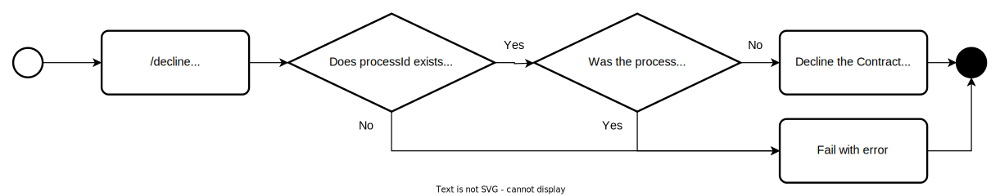
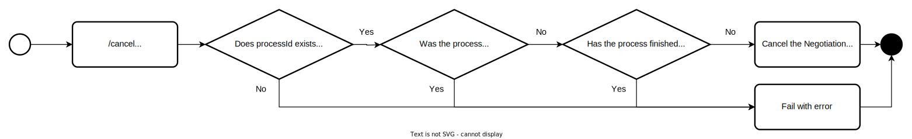
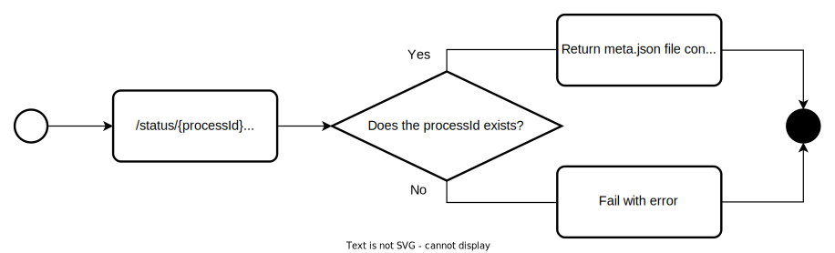
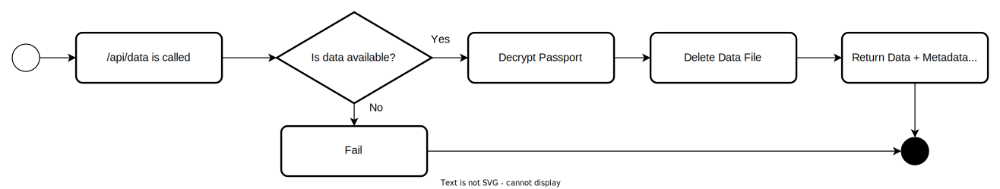
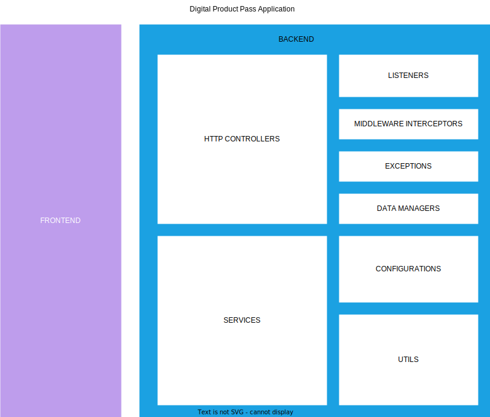
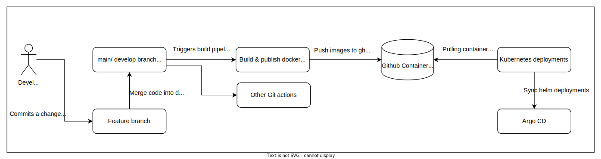
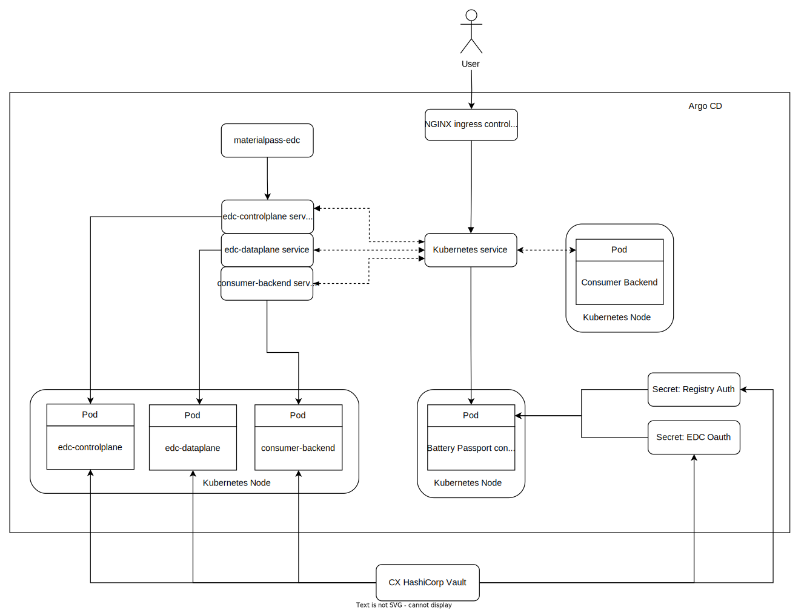
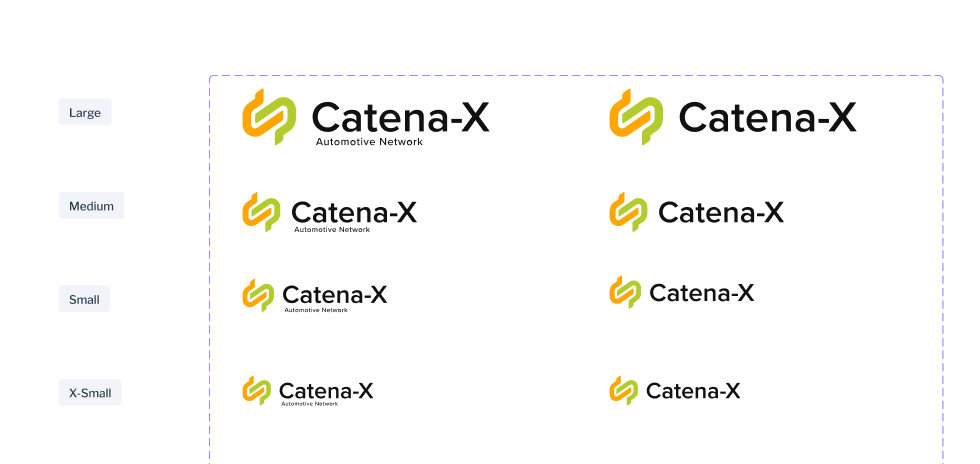
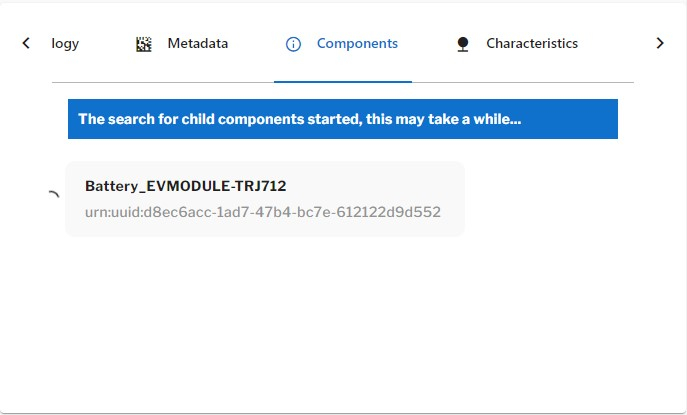
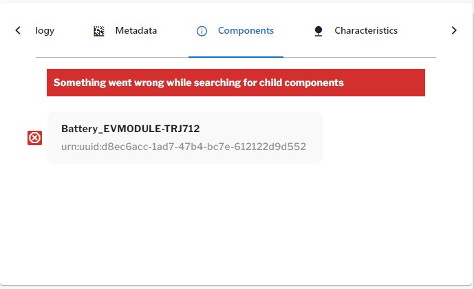

<!-- 
  Tractus-X - Digital Product Passport Application 
 
  Copyright (c) 2022, 2024 BMW AG, Henkel AG & Co. KGaA
  Copyright (c) 2023, 2024 CGI Deutschland B.V. & Co. KG
  Copyright (c) 2022, 2024 Contributors to the Eclipse Foundation

  See the NOTICE file(s) distributed with this work for additional
  information regarding copyright ownership.
 
  This program and the accompanying materials are made available under the
  terms of the Apache License, Version 2.0 which is available at
  https://www.apache.org/licenses/LICENSE-2.0.
 
  Unless required by applicable law or agreed to in writing, software
  distributed under the License is distributed on an "AS IS" BASIS
  WITHOUT WARRANTIES OR CONDITIONS OF ANY KIND,
  either express or implied. See the
  License for the specific language govern in permissions and limitations
  under the License.
 
  SPDX-License-Identifier: Apache-2.0
-->

# (CEC) ARC42 - Digital Product Pass Application Documentation

   

| Version | v5.0 |
| ------- | ---- | 

Latest Revision: *Nov 20, 2023*


## Table of Contents
 
- [(CEC) ARC42 - Digital Product Pass Application Documentation](#cec-arc42---digital-product-pass-application-documentation)
  - [Table of Contents](#table-of-contents)
  - [Introduction and Goals](#introduction-and-goals)
    - [Requirements Overview](#requirements-overview)
    - [Quality Goals](#quality-goals)
  - [Architecture Constraints](#architecture-constraints)
  - [System Scope and Context](#system-scope-and-context)
    - [Application State Diagram](#application-state-diagram)
    - [Technical Integration Design](#technical-integration-design)
    - [Authentication \& Authorization](#authentication--authorization)
      - [End User Token](#end-user-token)
      - [Technical User Token](#technical-user-token)
      - [Start Up Services Calls](#start-up-services-calls)
    - [Data Retrieval Flow](#data-retrieval-flow)
      - [Discovery Phase](#discovery-phase)
      - [Digital Twin Registry Search Phase](#digital-twin-registry-search-phase)
        - [Create API Sequence Diagram](#create-api-sequence-diagram)
        - [Create Flow Diagram](#create-flow-diagram)
      - [Digital Twin Search](#digital-twin-search)
        - [Search with Drill Down](#search-with-drill-down)
        - [Search API Sequence Diagram](#search-api-sequence-diagram)
        - [Search API Flow](#search-api-flow)
        - [Aspect Configuration](#aspect-configuration)
      - [Data Negotiation and Transfer Phase](#data-negotiation-and-transfer-phase)
        - [Agree API Sequence Diagram](#agree-api-sequence-diagram)
        - [Agree Flow Diagram](#agree-flow-diagram)
        - [Decline API Flow Diagram](#decline-api-flow-diagram)
        - [Cancel API Flow Diagram](#cancel-api-flow-diagram)
        - [Status API Flow Diagram](#status-api-flow-diagram)
        - [Data API Flow Diagram](#data-api-flow-diagram)
    - [Item Relationship Service Integration (Drill Down Functionality)](#item-relationship-service-integration-drill-down-functionality)
        - [Input Parameters](#input-parameters)
        - [Callback Url](#callback-url)
        - [Important Notes](#important-notes)
      - [Search API with IRS](#search-api-with-irs)
        - [Search API Sequence with IRS](#search-api-sequence-with-irs)
        - [Search API Flow with IRS](#search-api-flow-with-irs)
      - [Drill Down Status Check with IRS](#drill-down-status-check-with-irs)
        - [State API Description](#state-api-description)
        - [Tree API Description](#tree-api-description)
        - [Components API Description](#components-api-description)
        - [Async Data Retrieval Sequence with IRS](#async-data-retrieval-sequence-with-irs)
        - [Async Data Retrieval Flow with IRS](#async-data-retrieval-flow-with-irs)
    - [Business Context](#business-context)
    - [Technical Context](#technical-context)
      - [Container Ecosystem](#container-ecosystem)
        - [Kubernetes Container platform (gardener)](#kubernetes-container-platform-gardener)
        - [Containers](#containers)
      - [CI/CD](#cicd)
      - [Documentation links](#documentation-links)
      - [Catena-X Shared Services](#catena-x-shared-services)
  - [Solution Strategy](#solution-strategy)
    - [Architecture Diagram](#architecture-diagram)
  - [Technology \& Architecture Detail](#technology--architecture-detail)
    - [Frontend (User Interface - Client Side)](#frontend-user-interface---client-side)
      - [Vue.js 3](#vuejs-3)
        - [Vuetify](#vuetify)
      - [Component Description](#component-description)
      - [Backend (Server Side)](#backend-server-side)
        - [Java 19](#java-19)
          - [Spring Boot](#spring-boot)
      - [Component Description](#component-description-1)
    - [Infrastructure](#infrastructure)
      - [Kubernetes and Helm Charts](#kubernetes-and-helm-charts)
    - [Security Solution Strategy](#security-solution-strategy)
  - [Building Block View](#building-block-view)
    - [Blackbox Overall System](#blackbox-overall-system)
    - [Whitebox Overall System](#whitebox-overall-system)
  - [Deployment View](#deployment-view)
  - [Cross-cutting Concepts](#cross-cutting-concepts)
  - [Design Decisions](#design-decisions)
    - [Searching View](#searching-view)
    - [Battery Passport View](#battery-passport-view)
    - [Digital Product Pass View](#digital-product-pass-view)
    - [IRS Component Drill Down](#irs-component-drill-down)
      - [Loading](#loading)
      - [No Children Available](#no-children-available)
      - [Tree of Components Available](#tree-of-components-available)
      - [Error Occurred](#error-occurred)
  - [Quality Requirements](#quality-requirements)
    - [Quality Scenarios](#quality-scenarios)
  - [Risks and Technical Debts](#risks-and-technical-debts)
  - [Glossary](#glossary)
  - [NOTICE](#notice)

## Introduction and Goals

Within the Catena-X Network, Digital Product Passports are provided by manufacturers and can be exchanged in a standardized way. The data exchange standards are given by Catena-X and are used provide the product passport to different users in the network. 

The digital product pass app provides an easy way to request a product passport from a manufacturer using the Catena-X network and standardized components and technologies. The passport will be displayed user-readable in an common browser. The app is used to access the passport data, which is provided by a manufacturer. Another interesting feature, is that you are able to scan a QR-code or by knowing the manufacturer and product-ID a user can request the passport over the Catena-X. On the other end, the manufacturer will provide passports with data elements, that the signed-in user is allowed to see the detailed information from a product.

This passports can be used for different products like **Batteries**, **Gearboxes**, etc. The digital product pass frontend viewer at the moment supports tree types of passports:

    - Digital Product Pass
    - Battery Pass
    - Transmission Pass

The digital product pass backend has the power to retrieve any aspect from the Catena-X Network. More information at the [Aspect Configuration]()

This application is developed by the **Digital Product Pass Team**, one of the members from **Catena-X Circular Economy Use Case Team**, aiming to contribute to the environmental cause, allowing recyclers, OEMs and dismantlers to know properties, dimensions and other important data related with a current product or material.

### Requirements Overview

The product passport consumer app is an web-based application developed in Vue.js, making it accessible using **standard browsers** (Chrome, Edge, Firefox, etc) for any user in the Catena-X Network.

It displays a specific passport for each product, in the Catena-X network hosted in a backend system. Using the Catena-X data exchange standards to request and receive data from the network it leverages the users and roles provided by Catena-X by using the required shared components (IAM, EDC, SSI, EDC Discovery, Discovery Finder and BPN Discovery) as well as the new Decentral DT-Registry.

The product passport consumer app UI follows the Catena-X CI layout, keeping things simple for the user while still providing the necessary information.

A User can request a passport...

* Either by scanning a **QR-code** which leads to the a passport view UI, allowing the user to visualize all the necessary/required information of a product. Making easier to dismantle it.
* In case a QR is not provided, the user is able to introduce the product id manually in a search field.

As the data provider might not send every data field regarding to the users privileges, the application is flexible with its layout and data handling, displaying only what it receives.

### Quality Goals

1. Reference the release management process with its **Quality Gates** (security, test, documentation, etc)
2. Test created in cypress (reference to test cases)
3. CI Pipeline to reduce manual effort and error. Establish fast feedback.
4. Git branch concept with PR and review-approvals
5. Lint for code formatting and styling

## Architecture Constraints

Catena-X Standard to DataExchange, Trust and Security. **We follow the Catena-X Architecture Framework**

FOSS Guardrails

Guardrails for Data Souveranity **We follow the Data Souveranity Guardrails from PI5**

## System Scope and Context

The Product Passport Application is a Catena-X terms a "blue" application. This means that it is a Business Application that accesses other "green" applications, like the BPN Discovery, EDC Discovery, Discovery Finder, Portal IAM (Keycloack), Secret Management (Hashi Corp Vault), which are provided by the Catena-X network.


### Application State Diagram

This is the state diagram that describes the flow between the frontend and backend components of the application.


### Technical Integration Design

Complete technical interaction overview between frontend and backend

The interaction between the Product Passport Application previous the "BatteryPass" Application, the EDC Connectors, the Digital Twin registry and other services is detailed in the following page:

Here is a resume of the frontend and the backend communication.


The APIs we see in the diagram are the responsibles for comunicating with the several different services from Catena-X.

### Authentication & Authorization

The authorization & authentication are dependent in the Portal Central IDP or a Keycloak instance.

Here is an example of how the authentication & authorization works:


The Digital Product Pass has two authorization methods:

| Authorization Type            | Description                                                                                                                                                                                                                                                                                                                                   |
| ----------------------------- | --------------------------------------------------------------------------------------------------------------------------------------------------------------------------------------------------------------------------------------------------------------------------------------------------------------------------------------------- |
| Portal Roles                  | Each digital product pass application contains an specific "AppId" provided by the portal in the Marketplace registration. And this Id shall be added to the configuration of the DPP Application in order to authenticate the user. If the end user contains any role added in the portal it will have access to the application if enabled. |
| Business Partner Number (BPN) | The digital product pass application contains a check for the "BPN" of the end user. An option is also to allow the user to login if he is belonging to the company of the configured "EDC" so no user can act in name of a specific company.                                                                                                 |

#### End User Token
All the APIs in the Backend except the `/health` API are secured by the usage of JWT Tokens generated by the `Keycloak` or the `Central IDP` service for the End User.

The Frontend is the responsible for obtaining this token and refreshing it, so in this way **the User Session is administrated in the Frontend Browser**, remaining at the client and **is not stored at the Backend**. In this way the Backend is just responsible for identifying which user and with which roles is logged in.

> **NOTE**: At the moment role authentication is not implemented, so the backend is going to return the same information without checking the role, just checking if the Token is valid.

*Frontend Auth Configuration*: `frontend.productpass.idp_url` and `frontend.productpass.keycloak` configurations are required to be added and need to be valid in order that the frontend component works.

```yaml
clientId: "<clientId>"
realm: "<realm>"
onLoad: "login-required"
```

*Backend Auth Configuration*: `backend.application.configuration.keycloak` is required to be completed: 
```yaml
realm: <realm>
resource: "<clientId>"
tokenUri: 'https://<keycloak.url>/auth/realms/<realm>/protocol/openid-connect/token'
userInfoUri: 'https://<keycloak.url>/auth/realms/<realm>/protocol/openid-connect/userinfo'
```

#### Technical User Token
In order that the Backend can access different services like the `IRS` or the `BPN Disocovery` for example, it needs to obtain at the `Keycloak` or `Central IDP` the an **Technical User Token**

*Backend Technical User Auth Configuration*: `backend.edc` is required to be completed: 
```yaml
clientId: "<Add client id here>"
clientSecret: "<Add client secret here>"
```
#### Start Up Services Calls

During the start up from the backend 3 checks are performed.

  1. Check the connection to the `EDC Consumer`
  2. Check if the BPN Number from the `Backend` and the `EDC Consumer` are the same
  3. Check if the BPN Number from the `Technical User` is the same as the `Backend` and the `EDC Consumer`
   
> *NOTE*: This checks can be disabled at the `configuration.security.checks` properties in the helm charts 


If the `configuration.dtr.central` is disabled the backend will also make a call to the `Discovery Finder` service to find the `BPN Discovey` and `EDC Discovey` services.


### Data Retrieval Flow

As detailed at the [Data Retrieval Guide Phases](../data-retrieval/README.md#data-retrieval-flow) there are 4 main phases required to retrieve data in the **Catena-X Network**:

    1. Discovery Phase 
    2. Digital Twin Registry Search Phase
    3. Digital Twin Search Phase
    4. Data Negotiation and Transfer Phase

Below it is described how does the **Digital Product Pass** goes through this phases:
> **NOTE**: The APIs below have been simplified without their prefix however they are belonging to the  `/api/contract/*` API Controller. 

#### Discovery Phase

The **Digital Product Pass** application request the Discovery Service in startup gathering the `BPN Discovery` and the `EDC Discovery` endpoints.

The keys used for searching the endpoints in the Discovery Service by default are:

| Key | Service Name |
| --- | ------------ |
| bpn | EDC Discovery Service |
| manufacturerPartId | BPN Discovery Service |

> **IMPORTANT NOTE**: This keys can be modified at the configuration (`backend.application.configuration.discovery.bpn.key` and `backend.application.configuration.discovery.edc.key`)
in case the keys used in the Discovery Service are another ones. 

#### Digital Twin Registry Search Phase
The **Digital Twin Registry Search Phase** as it is detailed at the [Data Retrieval Guide Phase 1 and 2](../data-retrieval/README.md#1-discovery-phase--2-digital-twin-registry-search-phase) is the junction of two main phases the *Discovery Phase*  and the *Digital Twin Registry Search Phase* which are essential for starting the Digital Twin Search.

The `/create` api is responsible for calling the `BPN Discovery` service searching for the BPN of a `manufacturerPartId` and validating if there is any `Decentral Digital Twin Registry` available for the BPN number found in the `EDC Discovery` service.
This is detailed [here](../data-retrieval/README.md#1-discovery-phase--2-digital-twin-registry-search-phase) in the Data Retrieval Guide.

The API is called "**create**" because it is responsible for creating the **process** which will be responsible for doing the data retrieval in the Digital Product Pass.
Basically it creates a `processId` when the `Digital Twin Registries` are found and are available for searching Digital Twins.

> **NOTE**: If the property `configuration.dtr.temporaryStorage` is set a optimization will be made and the contractAgreementId will be temporary stored together with the DTR endpoint in order to speed up the Passport Search. At the end it will return the process for the user to search a passport.

##### Create API Sequence Diagram


##### Create Flow Diagram


#### Digital Twin Search

The **Digital Twin Search** as it is detailed at the [Data Retrieval Guide Phase 3](../data-retrieval/README.md#3-digital-twin-search-phase-1) is the phase responsible for search in all the **Digital Twin Registries** found at the previous phase, finding and retrieving the searched **Digital Twin**.

As described at the *Data Retrieval Guide* the **Digital Product Pass** Application is searching by default for the *partInstanceId* of an specific digital twin.

> **NOTE**: This parameter can be changed in the request of the `/search` API, by including the `idType` property.

At the `/search` API the user can search for a serialized Id and get its contract. The `Backend` will search for the Digital Twin and will return the contract for the first one that is found.

A `sign token` (a sha256 hash) is return also and acts like a "session token" allowing just the user that created the process to sign or decline the contract.

##### Search with Drill Down 

The search diagrams below describe the `Search` for digital twins without the **IRS Drill Down** enabled. For more information how it would look if the drill down is enabled by setting the `children` property to on or at the backend configuration param `backend.application.configuration.irs.enabled` to `true`, please look at this section: [Search API with IRS](#search-api-with-irs)

##### Search API Sequence Diagram


##### Search API Flow


##### Aspect Configuration

The Aspect search order and priority is defined at the configuration: `backend.configuration.passport.aspects`.

Currently the default order of aspects is:

    1. Digital Product Pass (urn:bamm:io.catenax.generic.digital_product_passport:1.0.0#DigitalProductPassport)
    2. Battery Pass (urn:bamm:io.catenax.generic.digital_product_passport:1.0.0#DigitalProductPassport)
    3. Transmission Pass (urn:bamm:io.catenax.transmission.transmission_pass:1.0.0#TransmissionPass)

This means that first the backend will search in the digital twin if the digital product pass is available and then will search for the next ones.

> **NOTE**: The backend is able to retrieve any aspect from the Catena-X Network, just configure the `semanticId` parameter in the `/api/contract/search` API request body and continue the data negotiation and transfer phase until the data retrieval.

#### Data Negotiation and Transfer Phase

The **Data Negotiation and Transfer Phase** as it is detailed at the [Data Retrieval Guide Phase 4](../data-retrieval/README.md#4-data-negotiation-and-transfer-phase-1) is the phase responsible for the final data transfer and negotiation. In this phase we retrieve the data using the EDC.

Once the user has the contract he can call the `/agree` API to start the negotiation process and the transfer of the passport. This means that the user accepted the policy and the frame-contracts contained in the contract policy.

The other option rather than `/agree` is the `/decline` API, that basically blocks the process and makes it invalid. This means that the user declined the specific contract that was found for this process.

After the user signs the contract he can use the `/status` API to get the process status and see when it is ready to retrieve the passport using the API `/data`.

The API `/data` will decrypt the passport file that is encrypted using the session token "sign token", and will delete the file so that it is returned just once to the user and can not be accessed anymore. So a new passport will be always need to be requested.


> *NOTE*: The user can use `/cancel` to interrupt the negotiation process once it is signed by mistake if is the case. It will be only valid until the negotiation is made.

##### Agree API Sequence Diagram 


##### Agree Flow Diagram

Here is described in detail how the sign flow works:


##### Decline API Flow Diagram

Here is how the flow of decline works:



##### Cancel API Flow Diagram

Here is how the flow of cancel works:



##### Status API Flow Diagram

The get status API just gives the status for a existing process:




##### Data API Flow Diagram

This API is responsible for retrieving the Aspect Model Payloads and some metadata from the contract exchange.




Swagger Documentation: [https://dpp.int.demo.catena-x.net/swagger-ui/index.html](https://dpp.int.demo.catena-x.net/swagger-ui/index.html)

#### Single API
The Single API permits to get data from a Catena-X Provider by abstracting of all the separated APIs needed to do so. Authenticating with an defined API Key and with the mandatory and given serialized and discovery identifications, this API will
create the process and check for the viability of the data retrieval, searches for a passport with the given serialized id, automatically signs the contract retrieved from provider and start negotiation, waits for the negotiation
to be done and returns the data negotiated and transferred. In short, it's the set of the various APIs in one with auto-sign functionality to agile the data retrieval in a simple way.


### Item Relationship Service Integration (Drill Down Functionality)

The Item Relationship Service [IRS] (**[tractusx/item-relationship-service](https://github.com/eclipse-tractusx/item-relationship-service)**) is responsible for providing the drill down functionality the Digital Product Pass application needs for finding the children of the current passports.

The IRS ([charts reference implementation](../../deployment/infrastructure/data-consumer/edc-consumer/Chart.yaml)) is deployed and attached to the EDC Consumer so that it can search in the network for the children of an specific `globalAssetId` and a `BPN`. 

> **NOTE**: The IRS Functionality can be deactivated by setting the following configuration at the `values.yaml` file to false: `backend.configuration.irs.enabled` or by setting the attribute `children` to false when the `/api/contract/search` API is called.

##### Input Parameters
Before the Digital Product Pass Application requests the search for the children of a Digital Twin in the IRS `/jobs` [POST] API,  it needs to identify some parameters to input in the Job Request:

| Key | Description |
| ------- | ---- | 
| **globalAssetId** | The `globalAssetId` is found in the Digital Twin retrieved from the `Digital Twin Registry` component found during the [Digital Twin Search](#digital-twin-search) |
| **bpn** | The `business partner number` is found at the `BPN Discovery` and is selected once the `Digital Twin` is found at a `Digital Twin Registry` |

##### Callback Url
The backend from the Digital Product Pass is responsible for the IRS communications. In order to save the constant requesting for the IRS status in the `jobs/{jobId}` API, it will use the "callbackUrl" property when starting an IRS job.

The callback url is contructed in the following way:

```
https://<backendUrl>/api/irs/{processId}/{searchId}?status=COMPLETED&id={globalAssetId}
```

This are the following parameters:
| Key | Description |
| ------- | ---- | 
| **processId** | Parameter generated by the `/create` api and identifies which process it belong to the job search. |
| **searchId** | The search id is a md5 hash generated by the backend based on the specific `globalAssetId`, the `processId` and other unique information. Therefore any attacks against the backend IRS search process can be executed. And in this way the IRS does not needs any authentication at the response header.
| **globalAssetId** | The `globalAssetId` is found in the Digital Twin retrieved from the `Digital Twin Registry` component found during the [Digital Twin Search](#digital-twin-search) |

Once the callback url is called when the job is in state "COMPLETED" the backend will call the `jobs/{jobId}` API of the IRS to request the Job Information and populate the **tree data model** if children are available.

##### Important Notes
These are important notes related to the IRS search.

- The drill down functionality is fixed to `1 depth` because of processing time issues and because most of the cases the "allowed" depth visualization will be 1 level down because of the `one level up - one level down` rule
- The current version of the IRS ([`v4.1.0`](https://github.com/eclipse-tractusx/item-relationship-service/releases/tag/4.1.0)) takes approximately 7 minutes to load the children. Because of this:
    - Some timeouts were set at the backend and frontend components to prevent that the loading time is infinite
- The IRS is currently configured to call the "callback url" when the status "COMPLETED" is reached. In case the IRS is not responding for the timeout time it will be considered as an error.
- The drill down functionality is build in the way that data sovereignty is respected. This means:
    - The Digital Product Pass applications knows where the information is, because of the digital twin retrieved at the IRS Response, however it will do the contract negotiation again searching for the `Digital Product Pass` aspect or any other aspect in the [**Aspect Search Order**](#aspect-configuration)    

#### Search API with IRS

The `/search` api detailed at the [Digital Twin Search Phase](#digital-twin-search) is is responsible for finding the **Digital Twin** searched. 

When the IRS is enabled the `/search` API will also start in parallel the search for the children digital twins at the IRS component. It will create a Job using the `globalAssetId` attribute contained in the Digital Twin found. As detailed [above](#input-parameters).

The Job parameters (*jobId, globalAssetId, jobStatus*) will be stored in the `meta.json` file from the process and can be accessed by the backend always when the frontend requests it using the `processId`.

The backend will also create a single node tree for the Digital Twin that is already available. Creating a `treeDataModel.json` file at the process directory.

##### Search API Sequence with IRS


##### Search API Flow with IRS


#### Drill Down Status Check with IRS

Once the data is retrieved after calling the `/data` API the frontend will be requesting the backend for the current status of the IRS job which is searching for the children asyncronously. 

##### State API Description

In order that the frontend knows what is the status for the digital twin drill down search done by the IRS component, it can call the `/api/irs/{processId}/state` API. It will return the current status of the Job. Basically the backend will be waiting for the call of the callbackUrl (More detailed information [here](#callback-url)) and will return the current status.

States Available:

For easing the processing the state API is a leight weighted and returns really fast the responses for redusing processing and waiting time. It matches the status from the HTTP protocol however they can mean different things:

| Status Code | Status Name | Status Description
| ----------- | ----------- | ------------------ |
| **200** | OK | The job callback was done and children were found, the Job Description is returned |
| **404** | Not Found | The job callback was done and children were not found |
| **201** | No Content | This means that the job is still running and no job callback was done yet |
| **405** | Method Not Allowed | The method is not allowed to be called because the IRS property was not enabled at the `/search` method or the IRS configuration property was not enabled in the backend.
| **401** | Not Authorized | The authentication has expired or the token is not valid |
| **400** | Bad Request |There was an error when starting the IRS job or at the end of the job processing (when the timeout is reached after receiveing no response from the IRS) |
| **500** | Internal Server Error | There was an error while processing the drill down |

##### Tree API Description

The `/api/irs/{processId}/tree` returns the complete content of the **Tree Data Model** which contains the digital twins and the complete job information as well as the children structured in a node format.

> **NOTE**: At the moment this API is not used by the frontend since the structure of the data is too detailed and big for the frontend processing. Its just ideal for storing and searching for data fast.

##### Components API Description

The `/api/irs/{processId}/components` API is called by the frontend when the `/api/irs/{processId}/state` API returns a `200` with `children available`. Additionally it is also called at the start of the search process for returning the inital tree with one digital twin. It returns a simplified/resumed version of the `/api/irs/{processId}/tree`, with a Array Node structure allowing the frontend to visualize the data in a more optimized way and making this API returning data more leight weighed. 

However the search using this API response is not ideal, better is to use the `/api/irs/{processId}/tree` API when searching for data.

##### Async Data Retrieval Sequence with IRS


##### Async Data Retrieval Flow with IRS 


### Business Context

**Contents.**  
Specification of all communication partners (users, IT-systems, …) with explanations of domain specific inputs and outputs or interfaces. Optionally you can add domain specific formats or communication protocols.

**Motivation.**  
All stakeholders should understand which data are exchanged with the environment of the system.

**Form.**  
All kinds of diagrams that show the system as a black box and specify the domain interfaces to communication partners.
Alternatively (or additionally) you can use a table. The title of the table is the name of your system, the three columns contain the name of the communication partner, the inputs, and the outputs.  
***Diagram or Table***  
***Optionally: Explanation of external domain interfaces***

### Technical Context

#### Container Ecosystem

##### Kubernetes Container platform (gardener)

* Argo CD infrastructure (Integration environment)
* Namespace:
  * product-material-pass

##### Containers

* EDC-Consumer Connector
* DPP-Frontend
* DPP-Backend
* PostgreSQL

#### CI/CD
* Source code management - GitHub Repository:
  * [https://github.com/eclipse-tractusx/digital-product-pass](https://github.com/eclipse-tractusx/digital-product-pass)
* DevSecOps:
  * [Intro | Tractus-X - DevSecOps](https://catenax-ng.github.io/docs/getstarted/intro)
* Eclipse Tractus-X Release Guidelines:
  * [Intro | Eclipse Tractus-X - Release Guidelines](https://eclipse-tractusx.github.io/docs/release)


#### Documentation links

* [ARC42 Documentation](./Arc42.md)
* [GitHub Documentation](https://github.com/eclipse-tractusx/digital-product-pass/tree/main/docs)
* [Administration Guide](../admin/AdminGuide.md)
* [API Documentation (Swagger)](https://app.swaggerhub.com/apis/eclipse-tractusx-bot/digital-product-pass)
* [Data Retrieval Guide](../data-retrieval/README.md)


#### Catena-X Shared Services

* IAM with Keycloak managed by Catena-X:
  * [https://centralidp.int.demo.catena-x.net/auth/](https://centralidp.int.demo.catena-x.net/auth/)
* HashiCorp Vault to Store Secrets (https-certificate to access the connectors, *DB-credentials for our postgres db and Keycloak instances*):
  * [https://vault.demo.catena-x.net/ui/vault/secrets/material-pass/](https://vault.demo.catena-x.net/ui/vault/secrets/material-pass/)

## Solution Strategy

### Architecture Diagram


## Technology & Architecture Detail

Our technology and architecture are based in the Catena-X Guidelines. However the specific technologies selected are:

### Frontend (User Interface - Client Side)

#### Vue.js 3

According to the [Vue documentation](https://vuejs.org/guide/introduction.html), Vue (pronounced /vjuː/, like **view** ) is a JavaScript framework for building user interfaces. It builds on top of standard HTML, CSS, and JavaScript and provides a declarative and component-based programming model that helps you efficiently develop user interfaces, be they simple or complex.

Vue.js in the version 3 allows us to build stable components and have control of all the application lifecycle. One advantage of Vue is that all the components that are build can be scalabled easily, allowing the structure to be generalized.

In order to speed the development and build safe and stable components, a component has been selected.

##### Vuetify

Since we are required to follow the style guidelines from Catena-X, we selected Vuetify in its version 3.0.4, that is built using **Google's Material Design**, the selected Catena-X Style.

According to the [Vuetify documentation](https://next.vuetifyjs.com/en/introduction/why-vuetify/), every component in Vuetify is handcrafted under the guise of [Google’s Material Design](https://material.io/) specification and comes with hundreds of customization options that fit any style or design; even if it’s not Material. This gives us flexibility when choosing and personalizing the style of the application, while still maintaining the **stability, scalability and security** from the components. And when compared with other frameworks, we can see that an new patch regarding security and stability is release every week, giving us safety that the library is constantly improved and tested.


Another advantage from Vuetify is its documentation. There you are allowed to understand all the components and personalize them on-flight. Example: [Vuetify Alerts](https://next.vuetifyjs.com/en/components/alerts/).

Here we can see the components from the frontend of the application:


#### Component Description

| Component | Description |
| ---- | ----------- |
| Landing Page View | This component is part of the User Interface (UI), it is also responsible of asking the Authentication Module if the user is authenticated and wait for being redirected to the Central IDP, IAM Services from Catena-X. |
| Search Passport View | This component is part of the User Interface (UI), it offers the user the possibility of searching by partInstanceId or Scanning a QR Code that contains the partInstanceId. |
| Passport Viewer View | This component is part of the User Interface (UI), it requests the Passport from the Backend, report errors from the backend, gives a timeout error if the request takes too long or retrieves the passport. |
| Authentication Module | Uses the following library: [https://www.npmjs.com/package/keycloak-js](https://www.npmjs.com/package/keycloak-js). This component is responsible for managing the user authentication, making Central IDP API calls, identifying users and requesting access token and refreshing it  |

> **_INFO:_** *Just principal components with logics  are represented in this diagram, they are composed of several other smaller visual components, however they include no extra logic rather than displaying information to the user in the User Interface.*

#### Backend (Server Side)

The backend was built in order to give support to the frontend and provide dynamic data models, that can be stored in a persistence layer of the server. It also shall be responsible to communicate with the Catena-X network, authenticating the users and retrieving the necessary information in order that the frontend is able to visualize it to the user.

##### Java 19

The latest version of Java was selected so we can have no problem in utilizing new Java Classes and libraries. Java is an object-oriented language and is one of the most maintainable languages. Because it is robustness, cross-platform capabilities, security features and because is easy of use, it has become one of the first choices when providing Internet solutions worldwide.

###### Spring Boot

We selected spring boot because it allows us to:

* Consume different datasets from data-providers and process them for a flexible representation has no standard solution.
* Hiding fields with no values can be done in the computation or with the [Jackson Library](https://www.baeldung.com/jackson-ignore-null-fields)
* Exception Handling is quite comfortable within Java because of the type-safety. Don’t you something like @SneakyThrows and try to not use minor exceptions like RuntimeExceptions, because otherwise you don't have to deal with them explicitly.
* For session management there are [Session Scoped Beans](https://www.baeldung.com/spring-bean-scopes#2-session-scope) in Spring and they live within one http session.
* It allows us to comply with Catena-X security requirements and integrate Keycloak instances for authentication.

To ease the understanding and get a general technical context of the backend the following diagram was created:



#### Component Description

| Component | Description |
| ---- | ----------- |
| HTTP Controllers | The http controllers are the main components and they are responsible for handling the external HTTP calls and APIs allowing other systems to access data |
| Services | The services are second main component and they are  responsible of interacting and getting data of external systems |
| Listeners | This component is responsible for listening to events and executing logics when they occur |
| Configurations | This component is integrated in Spring Boot and with the Utils, they are responsible for setting the parameters and logics of the whole backend system.  |
| Data Managers | This component is responsible for storing and retrieving data. (At the moment no data is stored apart from configurations) |
| Middleware and Interceptors | These components are integrated with the HTTP Controllers, however they are responsible for the information and for adding logics between the requests. Thanks to this component that we are able to log all API calls coming from the Frontend or external systems |
| Exceptions | This component contains the exception definitions, they can be in Runtime Exeception or Normal Exception Types. |
| Utils | This component is the base for all the  components, we are able to manage such as, Catena-X Logics, Configuration Logics, Cryptography, Logging, etc...|


### Infrastructure

#### Kubernetes and Helm Charts

Containerization technology is used in order to ease the deployment and management process. Kubernetes is an open-source container orchestration platform that allows us to automate deployment, scale, and management of containerized applications using Docker containers.

Helm is a package manager for Kubernetes and chart describes a set of Kubernetes resources such as deployment, pod, service, and other objects. Helm charts allow us to version the Kubernetes manifests and this lets us to install specific application/chart versions, means keeping the specific configurations for infrastructure as is in the code. Here, helm charts are used to provision battery passport components in different software runtime environments for instance, development, integration and pre-production which provides us a flexible way by having their separate configuration files for each infrastructure.

[Gartner](https://blogs.gartner.com/tony-iams/use-platform-engineering-to-implement-devops-workflows-with-kubernetes/#:~:text=Gartner%20is%20seeing%20enterprises%20deploy%20Kubernetes%20at%20increasing,greater%20varieties%20of%20applications%20and%20servicing%20multiple%20teams.) is considered to deploy Kubernetes resources at increasing scale as they look towards the cloud-native applications for modernizing infrastructure and applications across the organizations, targeting greater varieties of applications and servicing multiple teams.

[Argo CD platform](https://argoproj.github.io/cd/) is implemented as a Kubernetes controller and used as GitOps continuous delivery tool for Kubernetes. It is a declarative approach to define application components, configurations, and environments that should be versioned controlled. This allows us to manage application deployment and lifecycle that should be automated, auditable, and easy to understand. In this project, we used the Argo CD tool as a deployment platform where the Kubernetes cluster is running using Gartner, managed by the DevSecOps team. We used Argo CD to deploy the battery passport application components.

### Security Solution Strategy

In order to maintain the system safe and to comply with the quality gates a series of security applications are used.

## Building Block View

The system has certain building blocks which are illustrated below.
The primary battery passport application components are:

* Consumer Frontend
* Consumer Backend
* EDC Consumer

**Consumer Frontend:** A JavaScript-based user interface to request a battery passport from a battery manufacturer through Ecpilse Dataspace Connector (EDC) and Catena-X shared services, utilized by the consumer backend component.

**Consumer Backend:** A Java-based backend system that manages a variety of passports, utilizes Catenax shared services, and handles requests from the frontend component.

**EDC Consumer:** An Eclipse Dataspace Connector (EDC) is a gateway, used to establish a connection with the provider EDC in order to perform data transfer process, followed by certain steps such as requesting contract offers, doing contract negotiations, and transferring requested data once negotiations are agreed by both parties.

There are different levels categorized concerning the application resources deployed for a specific tool:

**Scope & Context:** A top-level defines the application runtime environment where application artifacts are deployed and running in a remote Kubernetes cluster in Argo CD through helm charts. The deployed components are: "materialpass-edc" which refers to the consumer connector and "battery passport consumer application" refers to the consumer frontend (UI) application.

**Level 1:** this level defines a deep dive into each deployment artifact: materialpass-edc, and digital-product-pass (consumer-ui and consumer-backend). In this layer, Kubernetes and helm resources are utilized using umbrella helm charts, consisting of some dependencies (container images) which are fetched from the GitHub registries.

**Level 2:** A centralized source control repository where the source code and build artifacts are stored and version controlled. It also contains various git actions, for instance, the Build pipeline that publishes compiled applications onto the GitHub Container Packages Registry (GHCR) which is further accessed by the next level and other build actions that get triggered to verify the CatenaX quality gate requirements.

**Level 3:** A development level where application source code is developed and built by developers.


### Blackbox Overall System


### Whitebox Overall System

A developer who creates a new feature branch to work on a specific feature that would be later on introduced in the next application release. He pushes the branch into the remote git repository, opens a new pull request (PR), and involves others such as project developer(s) and maintainer(s) to review his work where they could also provide their comments. Once PR is approved, the changes will get merged into the develop/main repository.

During the merge process, the build pipeline also known as Continuous integration (CI) gets triggered through a git action which builds the application artifacts, packages them into a docker image, and finally publishes the image onto the GitHub Container Registry with the tag holding latest commit SHA. In addition, other jobs are also executed which scan the code based on various criteria to fulfill the quality gate requirements.

The application deployment is translated into Kubernetes resources through helm charts which can be deployed in some cloud environment. At the time of writing this guide, ArgoCD platform was used for deployment purposes. We take the advantage of ArgoCD to leverage the Continuous Deployment (CD) process through its built-in auto-sync feature. This is done by matching the current and desired state of the application once a code is pushed or a new container image is uploaded to a registry.



| Name | Responsibility |
| ---- | -------------- |
| GitHub repository | Source Code Management (SCM), Version Controlling System (VCS) that stores and manages application source code and build files |
| Build and publish docker image | A Continuous Integration pipeline, used to build UI container image and upload it to the registry |
| Other Git actions | KICS (Code scan), Veracode (secret scan), Trivy (Container scan), SonarCloud (code quality scan), ESLint (code formatting) |
| GitHub Container Registry (GHCR) | A container registry to store and manage container images and version them with tags |
| Kubernetes deployment | Kubernetes manifest yaml files such as deployment, pod, service, ingress |
| Argo CD | Application runtime environment managed by DevSecOps team |

## Deployment View



## Cross-cutting Concepts


## Design Decisions

Designs are followed using the Catena-X Style Guidelines.


It was used a basic table, the logo, the footer and the avatar from Catena-X design guidelines:





### Searching View

The Search view was also design following the Catena-X buttons and search style guides


### Battery Passport View

The passport view was designed following using Catena-X accordion guidelines.


### Digital Product Pass View

Since the [v1.2.0](https://github.com/eclipse-tractusx/digital-product-pass/releases/tag/v1.2.0) release the `Digital Product Pass v1.0.0` Aspect is available to be visualized in the application. In the following example we can visualize a Battery Passport as Digital Product Pass:


### IRS Component Drill Down

The IRS Drill Down feature is available since the version [v1.3.0](https://github.com/eclipse-tractusx/digital-product-pass/releases/tag/v1.3.0) and it will display an tree of components in the frontend. 

The process of requesting the child components from the IRS takes a while aprox 7 minutes so the user is constantly informed of the progress from the IRS Job.

#### Loading 

When the job is still running there will be displayed a spinner and a message saying that the search for components is going on.



#### No Children Available

When there is the case that the IRS Job returns a empty relationship array the frontend will display a No child component found warning, this means that the asset has no children available in the `Digital Twin Registries` of the BPN Number found for the current asset in the `BPN Discovery` endpoint.


#### Tree of Components Available

This is the success case, when there are components available in connection to the digital twin.

In this case the user can click in the child `external link` button to open a new tab and start the search for a the Digital Product Pass


#### Error Occurred

In case the backend is not acesible or any other error ocurred the search for the child components will stop. This means that if the user want to search for the child components again it shall request the passport again since there was an error with this process.



## Quality Requirements

As the Product Passport product is part of the Catena-X Network we are required to follow the quality requirements set by the Governance and Architecture Teams.

### Quality Scenarios

**QS-01: The user shall response with a user friendly way to every request, even in case of error.:**  
When a used access the application and requests are performed from the frontend side, an error handling must be implemented in order to assure the correct user workflow within the application.

**QS-02: The application needs to provide a intuitive UI to the user.:**  
An user needs to be able to understand easily the application interface, in order to access the required data and to navigate thought the app.

## Risks and Technical Debts

**Who will be the owner of the application, who will maintain it?**

## Glossary

| Term | Definition |
| ---- | -------------- |
| EDC Connector | The Eclipse Data Space Connector provides a generic way to express, negotiate, and document the rules under which data is shared, and also with whom. |
| QG | Quality Gate, is a documentation, security & user satisfaction process defined by the Catena-X governance and architects in order to achieve common quality standards between the network. |
| IAM | Identity Access Management is a framework of policies and technologies to ensure that the right users (that are part of the ecosystem connected to or within an enterprise) have the appropriate access to technology resources. |
| DT-Reg | Digital Twin Registry is service of the Catena-X Semantic Layer that links IDS assets/artifacts/implementations (or rather: well-defined and cross-related subsets thereof) with their semantic descriptions and structure (aspect models as hosted in the Semantic Hub) |
| DAPS |The Dynamic Attribute Provisioning Service (DAPS) is a Federation Service of Identity and Trust (Authentication/Authorization), which is used by the traceability system.  |
| BPDM | Business Partner Data Management is a system that has the goal of representing legal entities, sites and the specific additional addresses of a legal entity. |
| CD | Continuous Deployment is a software engineering approach in which software functionalities are delivered frequently and through automated deployments. |
| CI | Continuous Integration is a software engineering practice of merging all developers' working copies to a shared mainline several times a day. |
| Backend | Is the part of a computer system or application that is not directly accessed by the user, typically responsible for storing and manipulating data. |
| Frontend | Is the graphical user interface (UI) of a software that makes it easier to use |
| Git | Is a distributed version control system: tracking changes in any set of files, usually used for coordinating work among programmers collaboratively developing source code during software development. |
| DevOps | Is a set of practices that combines software development (Dev) and IT operations (Ops). It aims to shorten the systems development life cycle and provide continuous delivery with high software quality. |
| Repository | Is a database of digital content with an associated set of data management, search and access methods allowing application-independent access to the content, rather like a digital library, but with the ability to store and modify content in addition to searching and retrieving. |


## NOTICE

This work is licensed under the [Apache-2.0](https://www.apache.org/licenses/LICENSE-2.0).

- SPDX-License-Identifier: Apache-2.0
- SPDX-FileCopyrightText: 2022, 2024 BMW AG, Henkel AG & Co. KGaA
- SPDX-FileCopyrightText: 2023, 2024 CGI Deutschland B.V. & Co. KG
- SPDX-FileCopyrightText: 2023, 2024 Contributors to the Eclipse Foundation
- Source URL: https://github.com/eclipse-tractusx/digital-product-pass
