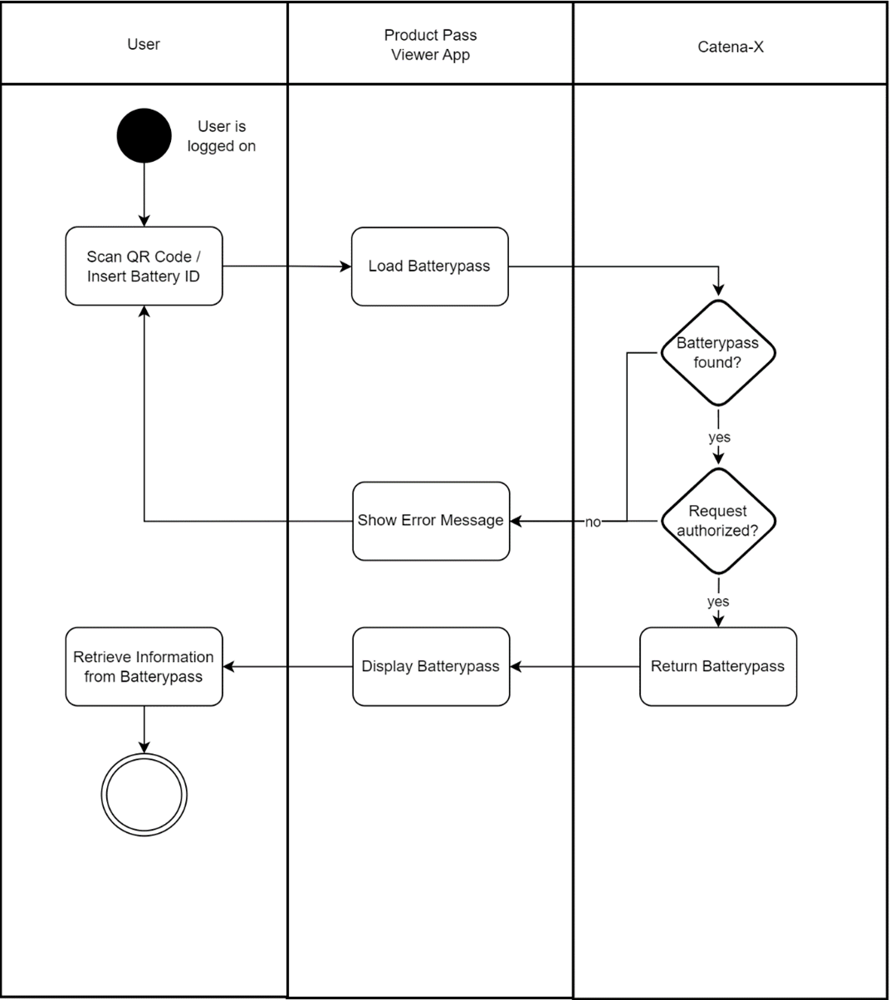
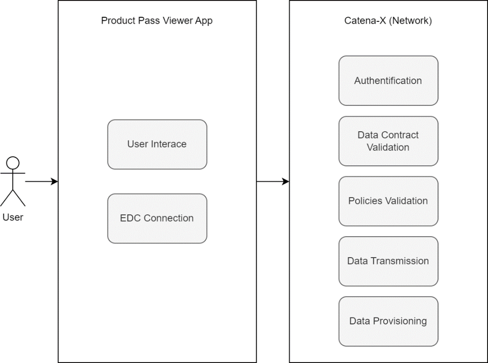

<!--
  Catena-X - Product Passport Consumer Application
 
  Copyright (c) 2022, 2023 BASF SE, BMW AG, Henkel AG & Co. KGaA
 
  See the NOTICE file(s) distributed with this work for additional
  information regarding copyright ownership.
 
  This program and the accompanying materials are made available under the
  terms of the Apache License, Version 2.0 which is available at
  https://www.apache.org/licenses/LICENSE-2.0.
 
  Unless required by applicable law or agreed to in writing, software
  distributed under the License is distributed on an "AS IS" BASIS
  WITHOUT WARRANTIES OR CONDITIONS OF ANY KIND,
  either express or implied. See the
  License for the specific language govern in permissions and limitations
  under the License.
 
  SPDX-License-Identifier: Apache-2.0
-->

# [MP] Product Passport Application

>Some links might not be accesible as they lead to a private confluence. If you need access please reach out to the dev Team and request what information you need for what reason.

The Product Passport Application enables the user to retrieve detailed information for a given product. The product can be looked up via ID or via a QR Code which is printed on the product.  

This first version of the Product Passport Application is focusing exclusively on the battery:  

*"The Battery Passport is the key instrument to develop a sustainable and circular battery value chain delivering on 10 principles by monitoring the sustainability performance based on data Understandable, Standardized, Accurate, Differentiating, Auditable, Comprehensive and providing the insights to trigger improvement action. The Battery Passport is will be the cornerstone for the Digital Product Passport.
The Passport itself is defined by the usage of Catena-X shared services, a standardized data model and an application which will enable stakeholders to access the relevant data."*  

## Persona:

The Viewer App can be used from different personas:

* Supplier
* Car Producer
* Battery Producer
* Recycler
* Dismantler
* Authority
* Public (e.g.: end user / consumer)

For each persona it is defined which data field can be viewed from whom (Source: [[MP] PI5 - Sprint 3 23.08 - 05.09.22)](https://confluence.catena-x.net/display/ARTV/%5BMP%5D+PI5+-+Sprint+3+23.08+-+05.09.22). Some of these data fields are required by regulator.  

## End User Benefit Statements:

* The Battery Passport is the key instrument to develop a sustainable and circular battery value chain and fullfilling regulatory requirements
* Based on the Digital Product Passport companies, like supplier, car producer, battery producer, recycler, dismantler and consumer, can make better decisions on how to develop, build, maintain, operate, recycle or dismantle the product.
* User of the battery pass viewer app, leverage the interoperability and data souveranity standards of Catana-X and receive the standardized product data set in a simple way.  

## Business problem:

Regulatory forces to make specific information accesible to a specific audience. The flow to recieve this information is shown below.

  

## App Provider Commitment

BMW, BASF and Henkel have jointly decided to initiate and drive the topic of data exchange via digital product passports. Agreements for joint developments exists.  

## Architecture Functional Cut between Apps and Network

  

## Business Semantic Alignment 

The business semantic alignment is limited to the business domain sustainability. The main goal of this app is to visualize the product pass and in the first step the battery pass. The data model for the battery pass was developed within the material pass team and is a candidate for standardization. Other data models are currently not neccesary.  

## Mapping against Catena-X Architecture Framework

The Product Passport Viewer App is using the following standardization candidates:

* Battery Passport

The following candidates are not yet implemented:

* Gearbox Passport
* Sealant Passport, Tire Passport
* Generic Product Passport

## NOTICE

This work is licensed under the [Apache-2.0](https://www.apache.org/licenses/LICENSE-2.0).

- SPDX-License-Identifier: Apache-2.0
- SPDX-FileCopyrightText: 2022, 2023 BASF SE, BMW AG, Henkel AG & Co. KGaA
- SPDX-FileCopyrightText: 2023 Contributors to the Eclipse Foundation
- Source URL: https://github.com/eclipse-tractusx/digital-product-pass
