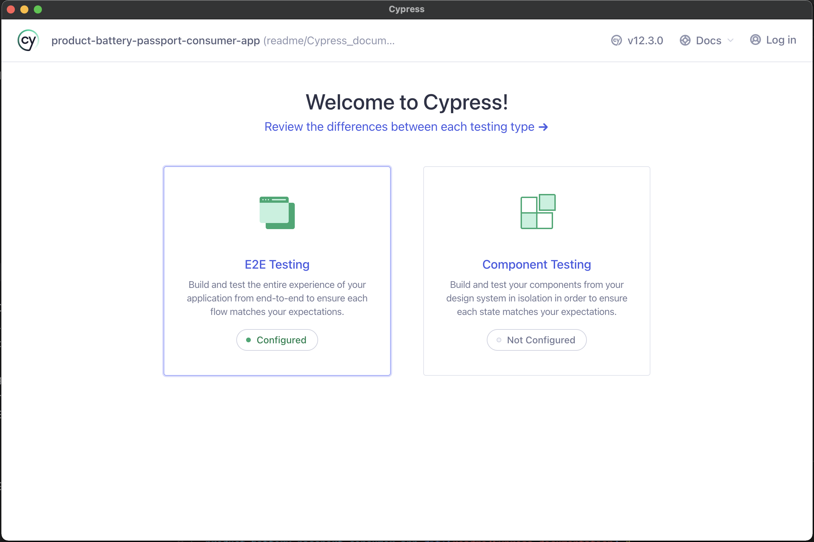
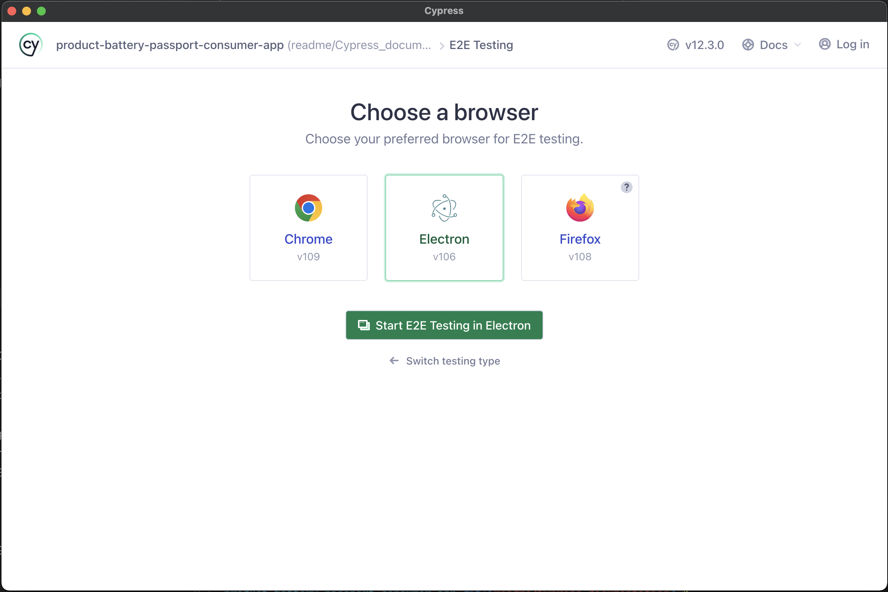
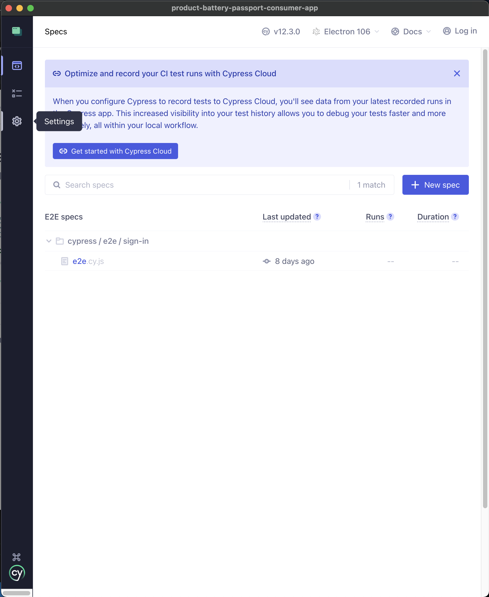
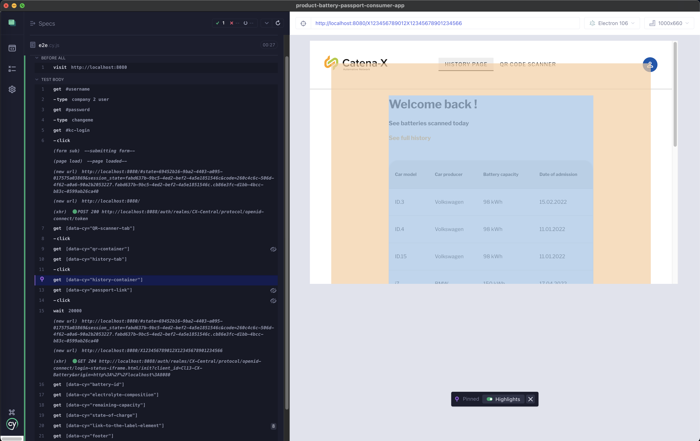
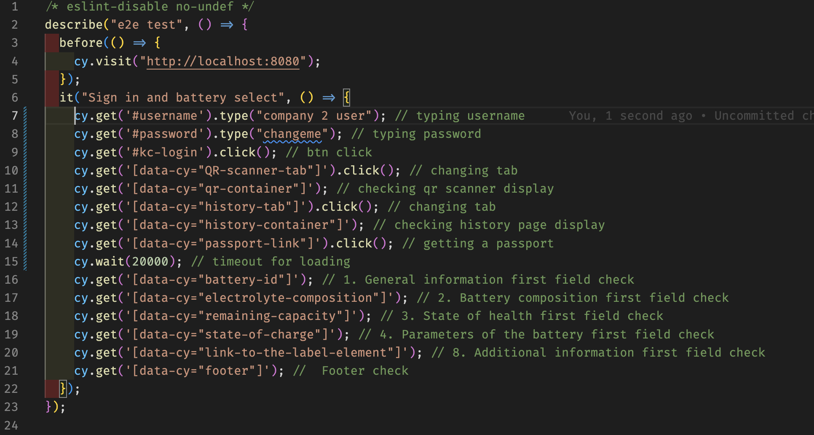

<!--
  Catena-X - Product Passport Consumer Application

  Copyright (c) 2022, 2023 BASF SE, BMW AG, Henkel AG & Co. KGaA

  See the NOTICE file(s) distributed with this work for additional
  information regarding copyright ownership.

  This program and the accompanying materials are made available under the
  terms of the Apache License, Version 2.0 which is available at
  https://www.apache.org/licenses/LICENSE-2.0.

  Unless required by applicable law or agreed to in writing, software
  distributed under the License is distributed on an "AS IS" BASIS
  WITHOUT WARRANTIES OR CONDITIONS OF ANY KIND,
  either express or implied. See the
  License for the specific language govern in permissions and limitations
  under the License.

  SPDX-License-Identifier: Apache-2.0
-->

# Cypress test

This is the documentation for Battery Passport App E2E Cypress test.

## Steps to perform the test with Cypress GUI

1. npm run cypress:open
2. Choose E2E testing
     
     

3. Choose browser - Electron
     
     

4. Choose specs - e2e
     
     

5. DOcumentation of passing test on local env
     
     

## Steps tested

  
  

## NOTICE

This work is licensed under the [Apache-2.0](https://www.apache.org/licenses/LICENSE-2.0).

- SPDX-License-Identifier: Apache-2.0
- SPDX-FileCopyrightText: 2022, 2023 BASF SE, BMW AG, Henkel AG & Co. KGaA
- SPDX-FileCopyrightText: 2023 Contributors to the Eclipse Foundation
- Source URL: https://github.com/eclipse-tractusx/digital-product-pass
