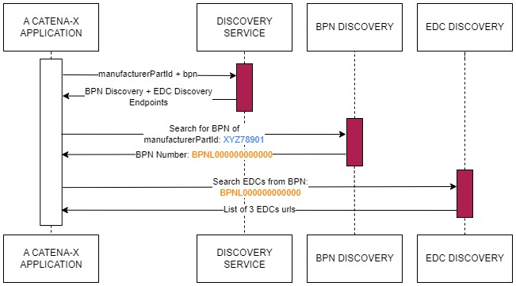
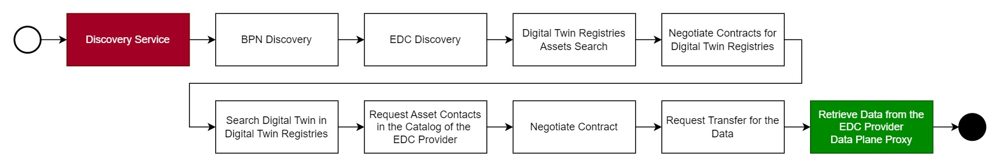

#  Catena-X Data Retrieval Guide


| Version | v1.0 |
| ------- | ---- | 

Created: *25 August 2023* 

## Table of Contents
- [ Catena-X Data Retrieval Guide](#-catena-x-data-retrieval-guide)
  - [Table of Contents](#table-of-contents)
  - [Introduction](#introduction)
  - [Starting Point](#starting-point)
    - [Available Central Services](#available-central-services)
  - [Problems Generated](#problems-generated)
  - [Data Retrieval Flow](#data-retrieval-flow)
  - [Digital Twin Registry Search](#digital-twin-registry-search)
  - [Attachments](#attachments)
    - [AAS 3.0 Digital Twin Example](#aas-30-digital-twin-example)

## Introduction
The Catena-X Network Data Retrieval process can be really complex and challanging to understand. The `Digital Product Pass` application as consumer application is designed to retrieve information from the Catena-X Network in its native way. We as team proposed a solution for retrieving information in this decentralized network in a very efficient way. This solution is implemeneted in the [`Digital Product Pass Backend`](../../consumer-backend/productpass/readme.md) and can retrieve information in aproximated `8-20s` using the algorithm and prodedures documented in the [Arc42](../arc42/Arc42.md) documentation.

Therefore this guide is here to provide information about how to retrive Data from the Catena-X Network like the `Digital Product Pass` application. Here we will describe the problem tha many consumers application are facing then retrieving data in Catena-X and how we as the DPP Team propose our vision.

## Starting Point

Before we start with the diagrams is necessary to give some context and remark how things are happening and which services are available.

After the Digital Twin Registry became an decentral component provided by several Catena-X Members as Providers, there was the need of providing central services to enable searching for this digital twin registries.

Therefore some central services were created, allowing the authorized Catena-X Applications to find the EDC endpoints after calling the following services:

### Available Central Services


| Service Name | Description | 
|------------- | ----------- |
| Discovery Service | Responsible to give the search endpoints for a type of id |
| BPN Discovery	| Responsible for indicating the BPNs for the IDs registered by |the providers
| EDC Discovery	| Responsible for giving the EDC endpoints of one or more BPNs | 


The main idea was that they will be called in a sequential way when needed to find the EDC endpoints.

Here we can observe an example of how a normal exchange would work in a sequential way:



## Problems Generated

After the fist implementations have been released, it was analyzed that some problems were generated.

The problems observed from the application side were: 

- dDTR search guidelines are missing:
    - After we receive the list of several EDCs, there is no guideline on the most optimized way of searching which EDC has the digital twin registry asset.
- Performance problem:
   - There is a performance problem, because if you want to find the digital twin registries for each request + search in each digital twin registry for the assets (which involves contract negotiation with EDCs) takes time.
- Scalability and Maintenance problem:
   - If we scale it in to the Catena-X Overarching project, we will observe that every product implemented their own solution. From a maintenance perspective the is big problem.
   - Imagine a new update in the EDC is made or in any other central discovery service, this would mean that every single application would need to change their architecture and code because they are responsible of maintaining it.

Therefore there needs to be a easier way of querying this services and searching in different dDTRs around the Catena-X Network.

## Data Retrieval Flow

Here is a diagram of the data retrival flow necessary to retrieve any data from the Catena-X Network without any optimizations:




At the beginning we start calling the `Discovery Service` which is responsible for giving us the urls from the `BPN Discovery` and the `EDC Discovery` this two service give us first a `BPN or Business Partner Number` for a especific `id` and the `EDC Discovery` will give you a list of EDC registered by one company's `BPN`.

Once we have a list of `EDCs` we need to find which of this EDCs contain the `Digital Twin Registry` component. We can filter which `EDCs` contain the `Digital Twin Registry` by simply calling for the catalog with the `type` condition of the contract that must have the `data.core.digitalTwinRegistry` standardized type. 

Once we have the list of DTRs we need to negotiate each contract retrieve in the catalog so that we can have the `Contract Agreement Id` which is given by the EDC once the contact is signed and agreed. This id will be used later to request the transfer for the `EDR` token for acessing the `Digital Twin Registry` through the `EDC Provider Data Plane Proxy`. 

We need to search for the `Digital Twins` inside of the `Digital Twin Registries`, and once we found it we can start the negotiation for the `submodelDescriptor` we are searching for that can be for example a: `Digital Product Pass`, `Battery Pass`, `Single Level BOM as Built` or a `Transmission Pass`.

Once we have the submodel we are going to call the [`subprotocolBody`](#L233) url of the `endpoint interface` with name `SUBMODEL-3.0`. This will provide for us the asset id to negotiate with the EDC Provider. Once this asset is negotiated we will request for the `transfer` and `EDR` token will be sent to the backend by the EDC Provider, allowing us to query the dataplane url contained in the `href` field of the endpoint interface. And in this way we will retrive the data using the `EDC Provider Data Plane Proxy`.


## Digital Twin Registry Search

The search for digital twin registries is the first step to be done when retrieving data in Catena-X.

Once the negotiation for the digital twin registries assets are done we would be able to retrieve a catalog for the user to search the serialized Id.


If we want to implement a digital twin registry search API we need to search for:

ID Name	Example	Description
Discovery Id Type	manufacturerPartId	This id type will be used for the Discovery Service to check which is the BPN Discovery service entpoint, then we call the BPN Discovery to find the BPN for a specific id
Discovery Id	XYZ78901	This id will be used for the BPN Discovery in order to find the BPN numbers for the id.

## Attachments

### AAS 3.0 Digital Twin Example

```json
{
  "description": [
      {
          "language": "en",
          "text": "Battery Digital Twin"
      }
  ],
  "displayName": [],
  "globalAssetId": "urn:uuid:efcb5f8d-f31c-4b1f-b090-9c878054554d",
  "idShort": "Battery_BAT-XYZ789",
  "id": "urn:uuid:3d050cd8-cdc7-4d65-9f37-70a65d5f53f5",
  "specificAssetIds": [
      {
          "name": "manufacturerPartId",
          "value": "XYZ78901",
          "externalSubjectId": {
              "type": "ExternalReference",
              "keys": [
                  {
                      "type": "GlobalReference",
                      "value": "BPNL00000000CBA5"
                  },
                  {
                      "type": "GlobalReference",
                      "value": "PUBLIC_READABLE"
                  }
              ]
          }
      },
      {
          "name": "partInstanceId",
          "value": "BAT-XYZ789",
          "externalSubjectId": {
              "type": "ExternalReference",
              "keys": [
                  {
                      "type": "GlobalReference",
                      "value": "BPNL00000000CBA5"
                  }
              ]
          }
      }
  ],
  "submodelDescriptors": [
      {
          "endpoints": [
              {
                  "interface": "SUBMODEL-3.0",
                  "protocolInformation": {
                      "href": "https://materialpass.int.demo.catena-x.net/BPNL000000000000/api/public/data/urn:uuid:1ea64f49-8b2b-4cd2-818e-cf9d452c6fea",
                      "endpointProtocol": "HTTP",
                      "endpointProtocolVersion": [
                          "1.1"
                      ],
                      "subprotocol": "DSP",
                      "subprotocolBody": "id=urn:uuid:3e4a5957-f226-478a-ab18-79ced49d6195;dspEndpoint=https://materialpass.int.demo.catena-x.net/BPNL000000000000",
                      "subprotocolBodyEncoding": "plain",
                      "securityAttributes": [
                          {
                              "type": "NONE",
                              "key": "NONE",
                              "value": "NONE"
                          }
                      ]
                  }
              }
          ],
          "idShort": "SerialPart",
          "id": "urn:uuid:1ea64f49-8b2b-4cd2-818e-cf9d452c6fea",
          "semanticId": {
              "type": "ExternalReference",
              "keys": [
                  {
                      "type": "Submodel",
                      "value": "urn:bamm:io.catenax.serial_part:1.0.1#SerialPart"
                  }
              ]
          },
          "description": [],
          "displayName": []
      },
      {
          "endpoints": [
              {
                  "interface": "SUBMODEL-3.0",
                  "protocolInformation": {
                      "href": "https://materialpass.int.demo.catena-x.net/BPNL000000000000/api/public/data/urn:uuid:09d5d8a9-9073-47b6-93c6-80caff176dca",
                      "endpointProtocol": "HTTP",
                      "endpointProtocolVersion": [
                          "1.1"
                      ],
                      "subprotocol": "DSP",
                      "subprotocolBody": "id=urn:uuid:3e4a5957-f226-478a-ab18-79ced49d6195;dspEndpoint=https://materialpass.int.demo.catena-x.net/BPNL000000000000",
                      "subprotocolBodyEncoding": "plain",
                      "securityAttributes": [
                          {
                              "type": "NONE",
                              "key": "NONE",
                              "value": "NONE"
                          }
                      ]
                  }
              }
          ],
          "idShort": "singleLevelBomAsBuilt",
          "id": "urn:uuid:09d5d8a9-9073-47b6-93c6-80caff176dca",
          "semanticId": {
              "type": "ExternalReference",
              "keys": [
                  {
                      "type": "Submodel",
                      "value": "urn:bamm:io.catenax.single_level_bom_as_built:1.0.0#SingleLevelBomAsBuilt"
                  }
              ]
          },
          "description": [],
          "displayName": []
      },
      {
          "endpoints": [
              {
                  "interface": "SUBMODEL-3.0",
                  "protocolInformation": {
                      "href": "https://materialpass.int.demo.catena-x.net/BPNL000000000000/api/public/data/urn:uuid:777a3f0a-6d29-4fcd-81ea-1c27c1b870cc",
                      "endpointProtocol": "HTTP",
                      "endpointProtocolVersion": [
                          "1.1"
                      ],
                      "subprotocol": "DSP",
                      "subprotocolBody": "id=urn:uuid:3e4a5957-f226-478a-ab18-79ced49d6195;dspEndpoint=https://materialpass.int.demo.catena-x.net/BPNL000000000000",
                      "subprotocolBodyEncoding": "plain",
                      "securityAttributes": [
                          {
                              "type": "NONE",
                              "key": "NONE",
                              "value": "NONE"
                          }
                      ]
                  }
              }
          ],
          "idShort": "digitalProductPass",
          "id": "urn:uuid:777a3f0a-6d29-4fcd-81ea-1c27c1b870cc",
          "semanticId": {
              "type": "ExternalReference",
              "keys": [
                  {
                      "type": "Submodel",
                      "value": "urn:bamm:io.catenax.generic.digital_product_passport:1.0.0#DigitalProductPassport"
                  }
              ]
          },
          "description": [
              {
                  "language": "en",
                  "text": "Digital Product Passport Submodel"
              }
          ],
          "displayName": []
      }
  ]
}

```