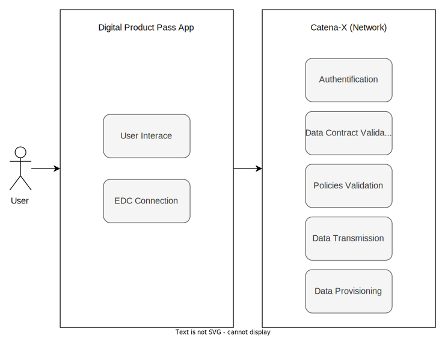

<!--
#######################################################################

Tractus-X - Digital Product Passport Application 

Copyright (c) 2022, 2024 BMW AG, Henkel AG & Co. KGaA
Copyright (c) 2023, 2024 CGI Deutschland B.V. & Co. KG
Copyright (c) 2022, 2024 Contributors to the Eclipse Foundation

See the NOTICE file(s) distributed with this work for additional
information regarding copyright ownership.

This work is made available under the terms of the
Creative Commons Attribution 4.0 International (CC-BY-4.0) license,
which is available at
https://creativecommons.org/licenses/by/4.0/legalcode.

SPDX-License-Identifier: CC-BY-4.0

#######################################################################
-->

# Digital Product Passport Application

The Digital Product Passport (DPP) Application enables the user to retrieve detailed information for a given product. The product can be looked up via ID or via a QR Code which is printed on the product.  

This first version of the Product Passport Application is focusing exclusively on the battery:  

*"The Battery Passport is the key instrument to develop a sustainable and circular battery value chain delivering on 10 principles by monitoring the sustainability performance based on data Understandable, Standardized, Accurate, Differentiating, Auditable, Comprehensive and providing the insights to trigger improvement action. The Battery Passport is will be the cornerstone for the Digital Product Passport.
The Passport itself is defined by the usage of Catena-X shared services, a standardized data model and an application which will enable stakeholders to access the relevant data."*  

## Persona:

The DPP App can be used from different personas:

* Supplier
* Car Producer
* Battery Producer
* Recycler
* Dismantler
* Authority
* Public (e.g.: end user / consumer)

For each persona it is defined which data field can be viewed from whom. Some of these data fields are required by regulator.  

## End User Benefit Statements:

* The Battery Passport is the key instrument to develop a sustainable and circular battery value chain and fullfilling regulatory requirements
* Based on the Digital Product Passport companies, like supplier, car producer, battery producer, recycler, dismantler and consumer, can make better decisions on how to develop, build, maintain, operate, recycle or dismantle the product.
* User of the battery pass viewer app, leverage the interoperability and data souveranity standards of Catana-X and receive the standardized product data set in a simple way.  

## Business problem:

Regulatory forces to make specific information accesible to a specific audience. The flow to recieve this information is shown below.

  

## App Provider Commitment

BMW, CGI and Henkel have jointly decided to initiate and drive the topic of data exchange via digital product passports. Agreements for joint developments exists.  

## Architecture Functional Cut between Apps and Network

  

## Business Semantic Alignment 

The business semantic alignment is limited to the business domain sustainability/circular economy. The main goal of this app is to visualize the digital product pass and in the first step the battery pass and transmission pass. The data models for the battery pass, digital product pass and transmission pass were made by the digital product pass team and are standardized in Catena-X.

## Mapping against Catena-X Architecture Framework

Which standardization candidates are you intending to use in your scenario, which ones did you decide not to use?

The Digital Product Passport App is using the following standardization candidates:

* Battery Passport (For Release 24.05 version 5.0.0 of the Battery Pass is used) → https://github.com/eclipse-tractusx/sldt-semantic-models/tree/main/io.catenax.battery.battery_pass/5.0.0
* Digital Product Passport (For Release 24.05 version 4.0.0 of the DPP is used) → https://github.com/eclipse-tractusx/sldt-semantic-models/tree/main/io.catenax.generic.digital_product_passport/4.0.0
* Gearbox/Transmission Passport (For Release 24.05 version 1.0.0 of the Transmission Pass is used) ->https://github.com/eclipse-tractusx/sldt-semantic-models/tree/main/io.catenax.transmission.transmission_pass/1.0.0

The following candidates are not yet implemented:

* Sealant Passport, Tire Passport
* E-Drive

The digital product pass is using the [EDC v0.7.0](https://github.com/eclipse-tractusx/tractusx-edc/releases/tag/0.7.0) and enables the  [data sovereignty policy configurations](https://github.com/eclipse-tractusx/digital-product-pass/blob/main/docs/data-sovereignty/PolicyConfigGuide.md)

## Technical Integration Design

The technical integration design can be found in the [arc42 documentation](../architecture/Arc42.md)

## NOTICE

This work is licensed under the [CC-BY-4.0](https://creativecommons.org/licenses/by/4.0/legalcode).

- SPDX-License-Identifier: CC-BY-4.0
- SPDX-FileCopyrightText: 2022, 2024 BMW AG, Henkel AG & Co. KGaA
- SPDX-FileCopyrightText: 2023, 2024 CGI Deutschland B.V. & Co. KG
- SPDX-FileCopyrightText: 2023, 2024 Contributors to the Eclipse Foundation
- Source URL: https://github.com/eclipse-tractusx/digital-product-pass
