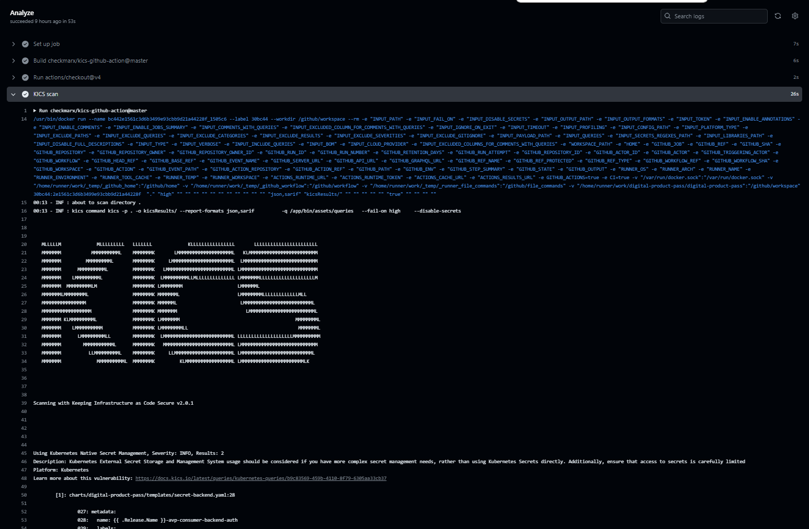
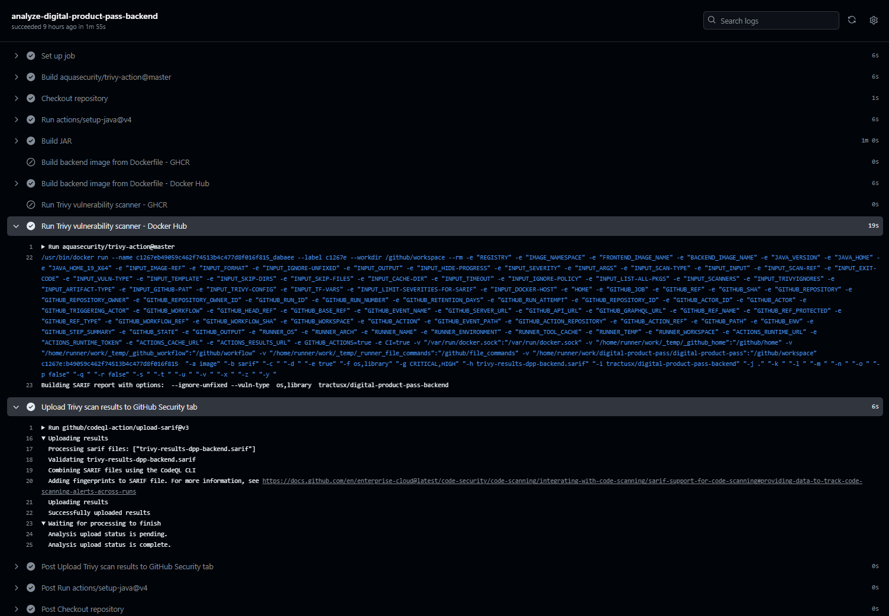
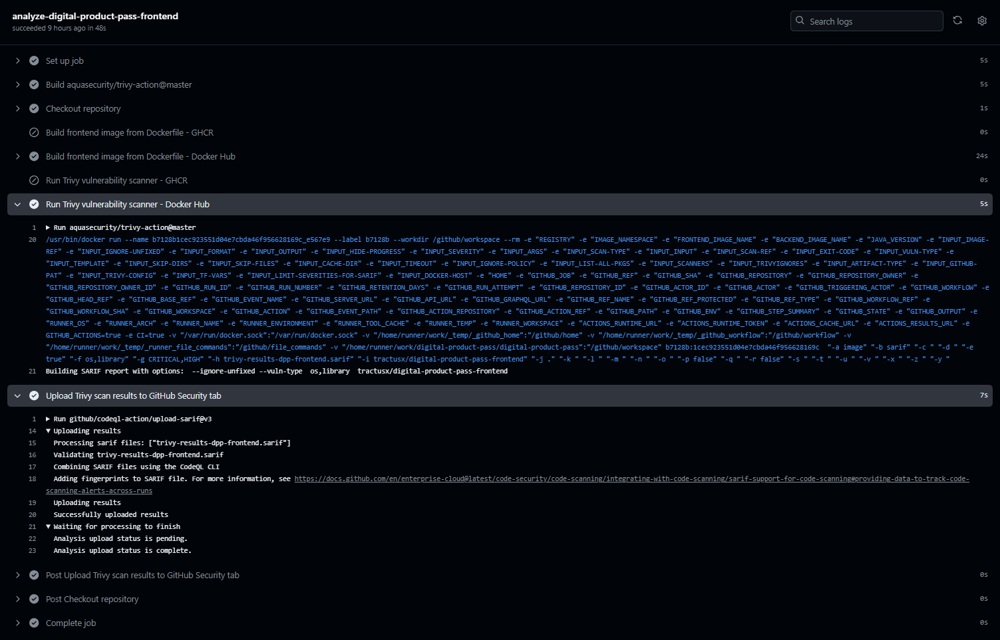
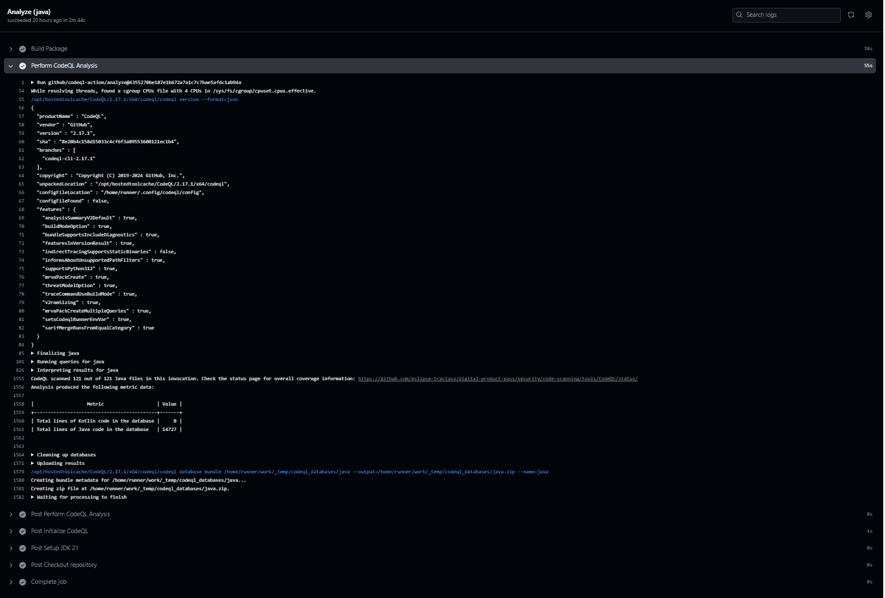

<!-- 
  Tractus-X - Digital Product Passport Application 
 
  Copyright (c) 2022, 2024 BMW AG, Henkel AG & Co. KGaA
  Copyright (c) 2023, 2024 CGI Deutschland B.V. & Co. KG
  Copyright (c) 2022, 2024 Contributors to the Eclipse Foundation

  See the NOTICE file(s) distributed with this work for additional
  information regarding copyright ownership.
 
  This program and the accompanying materials are made available under the
  terms of the Apache License, Version 2.0 which is available at
  https://www.apache.org/licenses/LICENSE-2.0.
 
  Unless required by applicable law or agreed to in writing, software
  distributed under the License is distributed on an "AS IS" BASIS
  WITHOUT WARRANTIES OR CONDITIONS OF ANY KIND,
  either express or implied. See the
  License for the specific language govern in permissions and limitations
  under the License.
 
  SPDX-License-Identifier: Apache-2.0
-->
## Infrastructure As Code (IaC) with KICS

This tool intends to find security vulnerabilities by scanning the code  and upload results to the security dashboard in github. It is integrated as GitHub action into the repository workflows [KICS](../../../.github/workflows/kics.yml) and also a successor of Checkov. IaC must be scanned via nightly GitHub action and High/critical error findings are not accepted.

To integrate KICS into a repository, please see its [documentation](https://eclipse-tractusx.github.io/docs/release/trg-8/trg-8-02).

### Results

Since, it is triggered via nnightly build daily, the below output is taken from one of the jobs history.

Complete history can be seen [here](https://github.com/eclipse-tractusx/digital-product-pass/actions/workflows/kics.yml)

## Container Scan with Trivy

This tool intends to find security vulnerabilities by scanning the container images and upload results to the github security tab. Similar to KICS, it is also integrated as GitHub action [Trivy](../../../.github/workflows/trivy.yml) and triggerd via nightly build. All containers in GitHub Packages must be scanned and High/critical error findings are not accepted.

To integrate Trivy into a repository, please see its [documentation](https://eclipse-tractusx.github.io/docs/release/trg-8/trg-8-04).

### Results

Since, it is triggered as a build every night, the below output is taken from one of the jobs history.

#### Backend Scanning

####  Frontend Scanning

Complete history can be seen [here](https://github.com/eclipse-tractusx/digital-product-pass/actions/workflows/trivy.yml)

## Static Application Serucity Testing

The static application security testing is performed by CodeQL tool through GitHub actions.
Code must be scanned weekly with CodeQL tool, medium risks require mitigation statement, high and above not accepted.

### CodeQL Code Analysis

It builds, package up the code and performs code analysis to the CodeQL platform. It helps for pull requests to know about very high/high security findings prior to merging code. It is one of the important jobs, and must be aligned to the quality gate requirements.

To integrate CodeQL into a repository, please see its [documentation](https://eclipse-tractusx.github.io/docs/release/trg-8/trg-8-01).

### Results

Complete history can be seen [here](https://github.com/eclipse-tractusx/digital-product-pass/actions/workflows/codeql.yaml)

## NOTICE

This work is licensed under the [Apache-2.0](https://www.apache.org/licenses/LICENSE-2.0).

- SPDX-License-Identifier: Apache-2.0
- SPDX-FileCopyrightText: 2022, 2024 BMW AG, Henkel AG & Co. KGaA
- SPDX-FileCopyrightText: 2023, 2024 CGI Deutschland B.V. & Co. KG
- SPDX-FileCopyrightText: 2023 Contributors to the Eclipse Foundation
- Source URL: https://github.com/eclipse-tractusx/digital-product-pass
