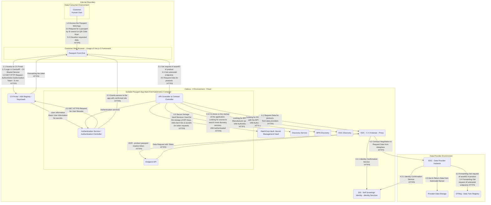

<!-- 
  Tractus-X - Digital Product Passport Application 
 
  Copyright (c) 2022, 2024 BMW AG, Henkel AG & Co. KGaA
  Copyright (c) 2023, 2024 CGI Deutschland B.V. & Co. KG
  Copyright (c) 2022, 2024 Contributors to the Eclipse Foundation

  See the NOTICE file(s) distributed with this work for additional
  information regarding copyright ownership.
 
  This program and the accompanying materials are made available under the
  terms of the Apache License, Version 2.0 which is available at
  https://www.apache.org/licenses/LICENSE-2.0.
 
  Unless required by applicable law or agreed to in writing, software
  distributed under the License is distributed on an "AS IS" BASIS
  WITHOUT WARRANTIES OR CONDITIONS OF ANY KIND,
  either express or implied. See the
  License for the specific language govern in permissions and limitations
  under the License.
 
  SPDX-License-Identifier: Apache-2.0
-->

# Security Assessment Product Passport Application

| Contact                   | Details                                                                                              |
| ------------------------- | ---------------------------------------------------------------------------------------------------- |
| Contact for product       | https://github.com/matbmoser                                                                         |
| Security responsible      | [@SSIRKC](https://github.com/SSIRKC)   [@szymonkowalczykzf](https://github.com/szymonkowalczykzf) |
| Version number of product | 24.05                                                                                                |
| Dates of assessment       | 2024-05-13: Re-Assessment                                                                            |
| Status of assessment      | RE-ASSESSMENT DONE & Approved                                                                        |

## Product Description

The Digital Product Passport App is Internet facing web app designed with a purpose of disclosing details about battery (and others products in the future) products for authenticated & authorized users.
Within the Catena-X Network, Product Passports are provided by manufacturers and can be exchanged in a standardized way. The data exchange standards are given by Catena-X and are used provide the product passport to different users in the network.
This passports can be used for different products like Batteries, Gearboxes, etc. At the moment the only product implemented are batteries, so the user interface only displays product passports. In the near future it will be able to display any passport structure, over a generic product passport that is in development at the moment.
The product passport consumer app provides an easy way to request a product passport from a manufacturer using the Catena-X network and standardized components and technologies. The passport will be displayed user-readable in an common browser. The app is used to access the passport data, which is provided by a manufacturer. Another interesting feature, is that you are able to scan a QR-code or by knowing the manufacturer and product-ID a user can request the passport over the Catena-X. On the other end, the manufacturer will provide passports with data elements, that the signed-in user is allowed to see the detailed information from a product.
This application is developed by the Product Passport Team, one of the members from Catena-X Circular Economy Team, aiming to contribute to the environmental cause, allowing recyclers, OEMs and dismantlers to know properties, dimensions and other important data related with a current product or material.
The product passport consumer app is an web-based application developed in Vue.js, making it accessible using standard browsers (Chrome, Edge, Firefox, etc) for any user in the Catena-X Network.
It displays a specific passport for each product, in the Catena-X network hosted in a backend system. Using the Catena-X data exchange standards to request and receive data from the network it leverages the users and roles provided by Catena-X by using the required shared components (IAM, EDC, SSI, EDC Discovery, Discovery Finder and BPN Discovery) as well as the new Decentral DT-Registry.
The product passport consumer app UI follows the Catena-X CI layout, keeping things simple for the user while still providing the necessary information.

An User can request a passport:
* Either by scanning a QR-code which leads to the a passport view UI, allowing the user to visualize all the necessary/required information of a product. Making easier to dismantle it.
* In case a QR is not provided, the user is able to introduce the product id manually in a search field.  
As the data provider might not send every data field regarding to the users privileges, the application is flexible with its layout and data handling, displaying only what it receives.

## Scope of the review

| ID  | Component Description             |
| --- | --------------------------------- |
| 1   | Authentication Service            |
| 2   | Digital Product Passport Frontend |
| 3   | Digital Product Passport Backend  |

## Components out of scope of the review

| ID  | Component Description                  |
| --- | -------------------------------------- |
| 1   | CX Portal                              |
| 2   | IAM Registry - Keycloack               |
| 3   | HashiCorp Vault                        |
| 4   | Digital Twin Registry                  |
| 5   | Dynamic Attribute Provisioning Service |
| 6   | EDC Discovery                          |
| 7   | Discovery Finder                       |
| 8   | BPN Discovery                          |

## Security Control Design

Current state of the security controls already implemented within the application.

Authentication, authorization  - Product Passport App is using Catena - X Portal authentication & authorization mechanism, it's implemented according to CX policies & requirements, with the usage of CX Keycloak & secure way of populating the privileges with the usage of tokens. 
Session Management - Session timeout limit for users is set for 300 seconds. Session IDs are not transmitted in the URLs, concurrent session (one user logging on 2 different devices) is possible. 
File Upload / Download -Product Passport app do not have any features for file downloads or uploads.
Encryption - Product Passport application is using secure encryption channel for all data in transit with the usage of HTTPS & TLS. All interactions with other C-X applications require compliance with the C-X security standards. Passport application is not storing the processed data.

Authentication & Authorization Concept:

Passport App Authentication & Authorization concept is fully dependable on Catena - X Portal authentication. Only authenticated in C-X Portal Users may access the Passport Application.
Application authentication is populated with usage of token generated by CX Portal Keycloak. 
Passport Application currently have 4 users roles available for interested users. Authorization data is stored securely within Passport application secret storage.
Users without roles assignment are not authorized to access the application.

Additionally all of the users that authenticate within the Application have to be compliant with BPN Checks.
That means that all user's BPN number have integrity check in place comparing it with the BPN number associated to that users within EDC.

Please find roles description below :
OAM - allowing a set of details available only to the authorized personnel
Dismantler - allowing a set of details available only to the authorized personnel
Recycler - allowing a set of details available only to the authorized personnel
Public customer - allowing a set of details available to everyone with access to the product ID (The role is still under implementation)

## Diagrams

## Vulnerabilities & Threats

| V001              | Log forge attack into application through frontend console.log()     |
| ----------------- | -------------------------------------------------------------------- |
| Element           | Product Passport Application                                         |
| Before Mitigation | Impact: Medium, Likelihood: Low, Risk: Low                           |
| After Mitigation  | Impact: Low, Likelihood: Low, Risk: Low                              |
| Mitigation        | Implement logging in backend system, instead of logging in frontend. |

| V002              | Secrets for Keycloak instance are exposed in frontend component.                          |
| ----------------- | ----------------------------------------------------------------------------------------- |
| Element           | Product Passport Application                                                              |
| Before Mitigation | Impact: Medium, Likelihood: Medium, Risk: Medium                                          |
| After Mitigation  | Impact: Low, Likelihood: Low, Risk: Low                                                   |
| Mitigation        | Implement GitGuardan, Veracode and migrate the login in Keycloak instance to the backend. |

| V003              | Integration between backend and frontend can generate vulnerabilities. |
| ----------------- | ---------------------------------------------------------------------- |
| Element           | Product Passport Application                                           |
| Before Mitigation | Impact: Medium, Likelihood: Medium, Risk: Medium                       |
| After Mitigation  | Impact: Low, Likelihood: Low, Risk: Low                                |
| Mitigation        | Test the code and scan for attack surface with Veracode.               |

| V004              | Login password credentials are too weak and can be brute forced easily.                                                                                                                                           |
| ----------------- | ----------------------------------------------------------------------------------------------------------------------------------------------------------------------------------------------------------------- |
| Element           | Product Passport Application                                                                                                                                                                                      |
| Before Mitigation | Impact: High, Likelihood: Medium, Risk: High                                                                                                                                                                      |
| After Mitigation  | Impact: Low, Likelihood: Low, Risk: Low                                                                                                                                                                           |
| Mitigation        | Change access passwords in Keycloak instance. Recommendation is aimed for the password policies managed by the C-X Portal Team. Product Passport App is just using them in a Black Box approach. Risk Transferred |

| V005              | Fields and the usage of GET methods for searching are an open door to SQL Injection attacks. |
| ----------------- | -------------------------------------------------------------------------------------------- |
| Element           | Product Passport Application                                                                 |
| Before Mitigation | Impact: High, Likelihood: High, Risk: High                                                   |
| After Mitigation  | Impact: Low, Likelihood: Low, Risk: Low                                                      |
| Mitigation        | Implement a filter for not allowed characters.                                               |

| V006              | XSS attacks can be performed by attacking ID searching in product passport using GET Method. Leading to exposal of sensible information. |
| ----------------- | ---------------------------------------------------------------------------------------------------------------------------------------- |
| Element           | Product Passport Application                                                                                                             |
| Before Mitigation | Impact: High, Likelihood: High, Risk: High                                                                                               |
| After Mitigation  | Impact: Low, Likelihood: Low, Risk: Low                                                                                                  |
| Mitigation        | Add filters for XSS characters and injection of <script> tags.                                                                           |

| V007              | No security is implemented regarding the access to the passport information.                                                                                                                                                                                  |
| ----------------- | ------------------------------------------------------------------------------------------------------------------------------------------------------------------------------------------------------------------------------------------------------------- |
| Element           | Product Passport Application                                                                                                                                                                                                                                  |
| Before Mitigation | Impact: High, Likelihood: Medium, Risk: High                                                                                                                                                                                                                  |
| After Mitigation  | Impact: Low, Likelihood: Low, Risk: Low                                                                                                                                                                                                                       |
| Mitigation        | Implement backend role based passport information retrieve. Data requested by the passport application is already validated. The current approach is similar to the black box approach that we are trusting as it's part of the C-X project. Risk Transferred |

| V008              | Error control not correctly implemented. Risk of breaking the workflow from the application. |
| ----------------- | -------------------------------------------------------------------------------------------- |
| Element           | Product Passport Application                                                                 |
| Before Mitigation | Impact: High, Likelihood: High, Risk: High                                                   |
| After Mitigation  | Impact: Low, Likelihood: Low, Risk: Low                                                      |
| Mitigation        | Implement popup alerts that allow the user to maintain the workflow.                         |

| V009              | No responsive interface has been implemented, risk of mal function in smartphones and tablets.   |
| ----------------- | ------------------------------------------------------------------------------------------------ |
| Element           | Product Passport Application                                                                     |
| Before Mitigation | Impact: Medium, Likelihood: High, Risk: Medium                                                   |
| After Mitigation  | Impact: Low, Likelihood: Low, Risk: Low                                                          |
| Mitigation        | Implement a responsive structure, using responsive components or a Vue.js framework like Vuetify |

| V010              | Components are not scalable and are self-built. Risk of building unsafe components.                          |
| ----------------- | ------------------------------------------------------------------------------------------------------------ |
| Element           | Product Passport Application                                                                                 |
| Before Mitigation | Impact: High, Likelihood: Medium, Risk: Medium                                                               |
| After Mitigation  | Impact: Low, Likelihood: Low, Risk: Low                                                                      |
| Mitigation        | Implement component framework like Vuetify, allowing scalability and abstraction of components. Test the UI. |

| V011              | Unstable UX, components are not stable since they are personalized. Risk of confusing and giving a bad impression to the end user. |
| ----------------- | ---------------------------------------------------------------------------------------------------------------------------------- |
| Element           | Product Passport Application                                                                                                       |
| Before Mitigation | Impact: High, Likelihood: High, Risk: High                                                                                         |
| After Mitigation  | Impact: Low, Likelihood: Low, Risk: Low                                                                                            |
| Mitigation        | Develop abstract components over Vuetify framework. Test the UI.                                                                   |

| V012              | Permissions for each role are not correctly defined, risk of accessing to another role restricted data leading to data leaking. |
| ----------------- | ------------------------------------------------------------------------------------------------------------------------------- |
| Element           | Product Passport Application                                                                                                    |
| Before Mitigation | Impact: High, Likelihood: Medium, Risk: High                                                                                    |
| After Mitigation  | Impact: Low, Likelihood: Low, Risk: Low                                                                                         |
| Mitigation        | Discussion on the subject was ended with marking this finding as not valid.                                                     |

| V013              | No privacy policy is still defined. Risk of not complying with data privacy.                 |
| ----------------- | -------------------------------------------------------------------------------------------- |
| Element           | Product Passport Application                                                                 |
| Before Mitigation | Impact: Low, Likelihood: High, Risk: Low                                                     |
| After Mitigation  | Impact: Low, Likelihood: Low, Risk: Low                                                      |
| Mitigation        | Risk should be handled by the C-X team, not the Passport app team directly. Risk Transferred |

| V014              | Dependencies can get deprecated.                                                              |
| ----------------- | --------------------------------------------------------------------------------------------- |
| Element           | Product Passport Application                                                                  |
| Before Mitigation | Impact: Low, Likelihood: Medium, Risk: Low                                                    |
| After Mitigation  | Impact: Low, Likelihood: Low, Risk: Low                                                       |
| Mitigation        | Follow up in Veracode the status of dependencies versions, and implement dependabot in Github |

| V015              | API can be accessed without a correct role.                                     |
| ----------------- | ------------------------------------------------------------------------------- |
| Element           | Product Passport Application                                                    |
| Before Mitigation | Impact: Medium, Likelihood: Medium, Risk: Medium                                |
| After Mitigation  | Impact: Low, Likelihood: Low, Risk: Low                                         |
| Mitigation        | Implement session communications between frontend and backend using JWT tokens. |

| V016              | The end user may not understand the UI and the workflow.                           |
| ----------------- | ---------------------------------------------------------------------------------- |
| Element           | Product Passport Application                                                       |
| Before Mitigation | Impact: Low, Likelihood: Low, Risk: Low                                            |
| After Mitigation  | Impact: Low, Likelihood: Low, Risk: Low                                            |
| Mitigation        | Create an End User Manual that contains an explanation how to use the application. |

| V017              | Access to the user camera can be misused.                                                                                                                                                                                                                                                      |
| ----------------- | ---------------------------------------------------------------------------------------------------------------------------------------------------------------------------------------------------------------------------------------------------------------------------------------------- |
| Element           | Product Passport Application                                                                                                                                                                                                                                                                   |
| Before Mitigation | Impact: Medium, Likelihood: Medium, Risk: Medium                                                                                                                                                                                                                                               |
| After Mitigation  | Impact: Low, Likelihood: Low, Risk: Low                                                                                                                                                                                                                                                        |
| Mitigation        | Use camera only for the really necessary moments and then deactivate it. Allow the user to stop scanning the screen. A button to stop scanning has been included and is in development fase, therefore the user will be able to decide if wants to scan the QR code or introduce a Battery Id. |

| V018              | Landing page requests webcam. No compliance to the GDPR.                                                                                                                                                                             |
| ----------------- | ------------------------------------------------------------------------------------------------------------------------------------------------------------------------------------------------------------------------------------ |
| Element           | Product Passport Application                                                                                                                                                                                                         |
| Before Mitigation | Impact: Low, Likelihood: High, Risk: Low                                                                                                                                                                                             |
| After Mitigation  | Impact: Low, Likelihood: Low, Risk: Low                                                                                                                                                                                              |
| Mitigation        | QR Code scanning must be added in a separated page, after landing page. QR Code scanning was moved to another tab from the application. And thanks to the Vue.js technology the exchange between the views does not requires reload. |

| V019              | No cookies banner is implemented. No compliance to the GDPR.                                        |
| ----------------- | --------------------------------------------------------------------------------------------------- |
| Element           | Product Passport Application                                                                        |
| Before Mitigation | Impact: Low, Likelihood: High, Risk: Low                                                            |
| After Mitigation  | Impact: Low, Likelihood: Low, Risk: Low                                                             |
| Mitigation        | A review was made and cookies are not utilized, the user is not tracked in their actions. Not Valid |

| V020              | Lack of rate limiting for API                                                                                                                                                                                                                                              |
| ----------------- | -------------------------------------------------------------------------------------------------------------------------------------------------------------------------------------------------------------------------------------------------------------------------- |
| Element           | Product Passport Application                                                                                                                                                                                                                                               |
| Before Mitigation | Impact: Medium, Likelihood: Low, Risk: Low                                                                                                                                                                                                                                 |
| After Mitigation  | Impact: Low, Likelihood: Low, Risk: Low                                                                                                                                                                                                                                    |
| Mitigation        | Enable rate limiting that will allow to setup a maximum number of request that may be handled by the application at once which will allow to secure it from denial of service type of attacks generated by too large number of requests flooding the Passport application. |

## NOTICE

This work is licensed under the [Apache-2.0](https://www.apache.org/licenses/LICENSE-2.0).

- SPDX-License-Identifier: Apache-2.0
- SPDX-FileCopyrightText: 2022, 2024 BMW AG, Henkel AG & Co. KGaA
- SPDX-FileCopyrightText: 2023, 2024 CGI Deutschland B.V. & Co. KG
- SPDX-FileCopyrightText: 2023 Contributors to the Eclipse Foundation
- Source URL: https://github.com/eclipse-tractusx/digital-product-pass
