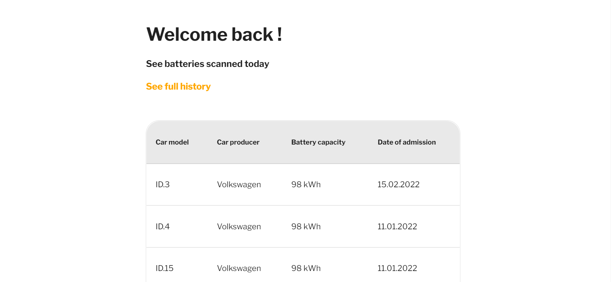
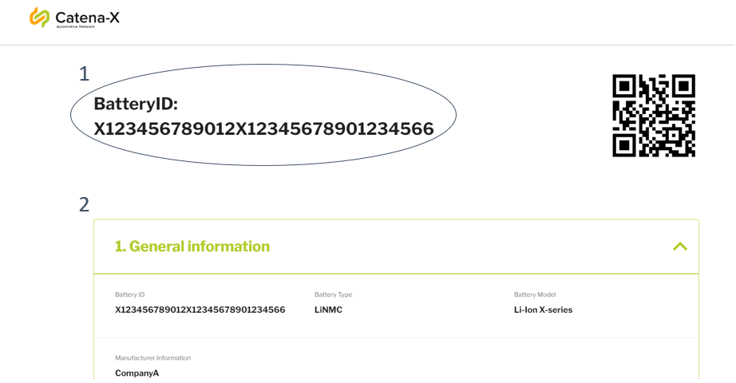

# User Manual

This manual provides a step by step introduction on how to use the Product Pass Viewer app and gives an overview on its functionalities.

## Content

1. [Content](#content)
2. [Getting Started](#getting-started)
3. [Main Menu](#main-menu)  
4. [History Page](#history-page)
5. [Search for Products](#search-for-products)
6. [Results Page](#results-page)  

## Getting Started

After opening the Product Pass Viewer application on your computer or phone, login with your company´s login credentials.
    

## Main Menu

After logging in you will be forwarded to the Product Viewer´s main menu. At the top of the screen you will now be able to find the navigation bar. It allows you to choose switch the Product Viewer´s "[History Page](#history-page)" and the "[QR Code Scanner](#search-for-products)" page (1) and provides a section to view account information and logout of the application (2).  

  
    

Clicking on the blue icon in the upper right corner will not take you to a completely new page, but rather activate a drop-down menu. In this tab you find your general user information and assigned role within Catena-X (1) as well as the option to log out of your account (2).

  
    

## History Page

The [History Page](#history-page) provides the user with an overview on previously scanned products. It enables a quick overview over past scans and the scanned products basic information. Clicking on one of the previously scanned products will take you back to the products results page, giving you a more detailed insight into the respective product pass (for more information see section [results page](#results-page)).

  

## Search for Products

The [QR Code Scanner](#search-for-products) page lets the user request information about a product that is registered with a digital product pass. To request information you can use either of the two ways provided:

1. By using the devies camera, the QR code applied on the respective product can be scanned
2. or the products ID can be entered manually.

    

## Results Page

 After requesting the product data via the [QR Code Scanner](#search-for-products) page or by clicking on a past scan in the [History Page](#history-page) the information will be displayed on the screen. For a scanned battery, the results page currently includes the BatteryID (1) and a section containing general product information (2):

  

  

Whithin section (2) of the the results page, information of the follwoing categories can be found :  

1. General information
2. Cell information
3. Electrochemical information
4. Battery composition
5. State of battery
6. Additional information
