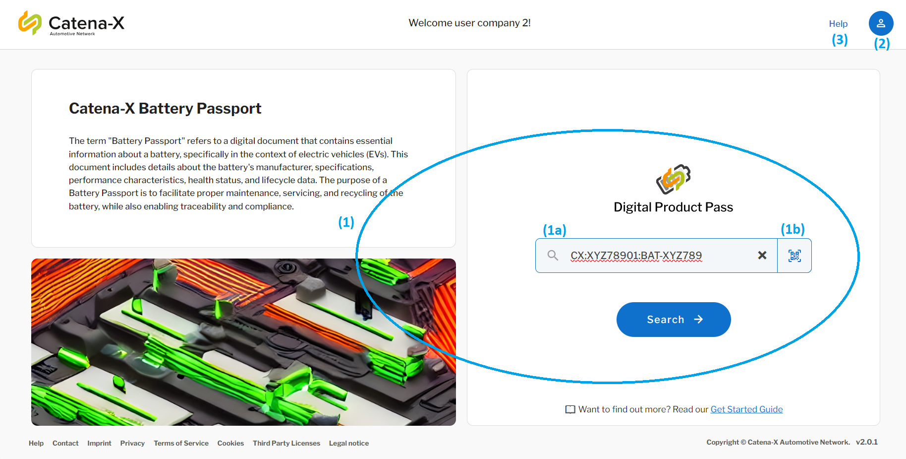
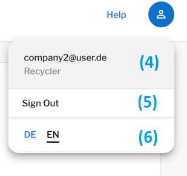
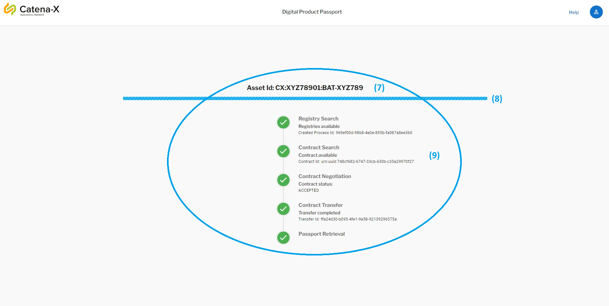
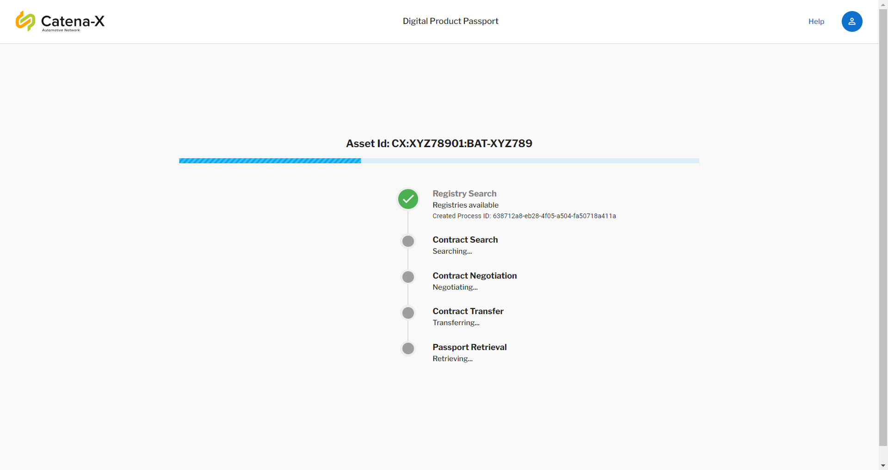
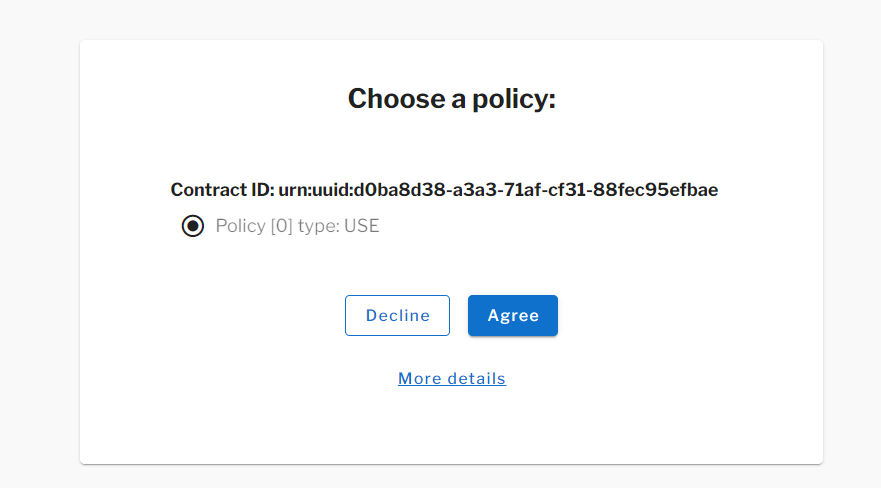
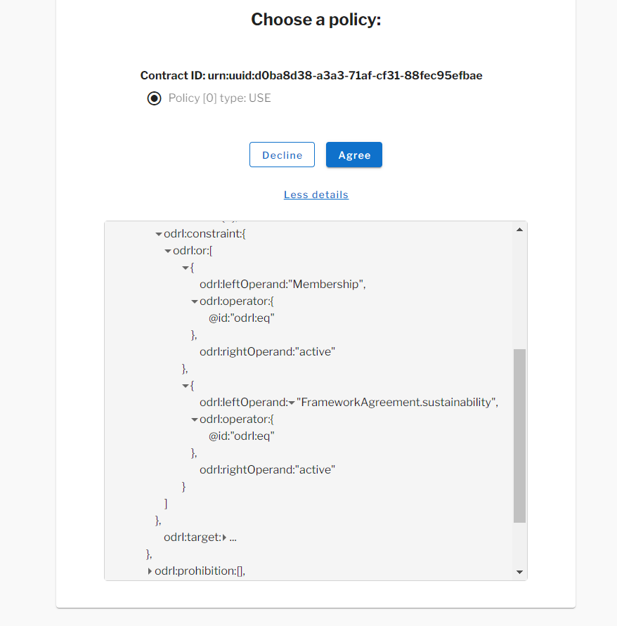
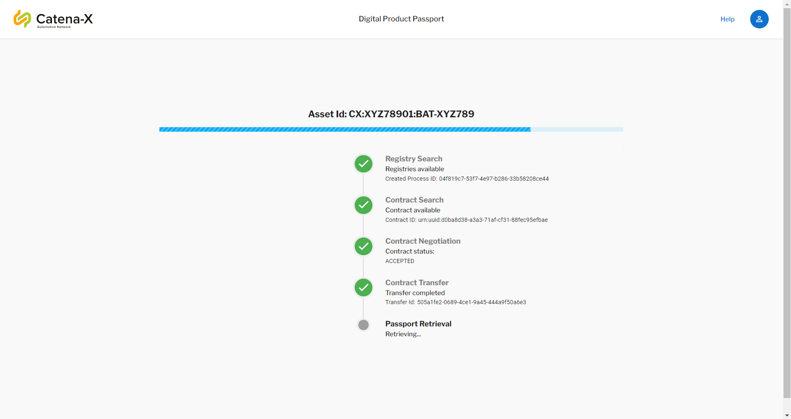
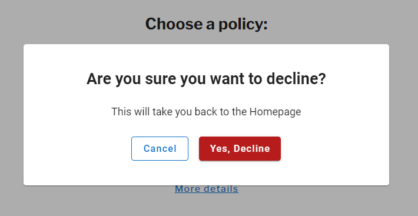

<!-- 
  Catena-X - Digital Product Passport Application 
 
  Copyright (c) 2022, 2024 BASF SE, BMW AG, Henkel AG & Co. KGaA
  Copyright (c) 2022, 2024 Contributors to the Eclipse Foundation

  See the NOTICE file(s) distributed with this work for additional
  information regarding copyright ownership.
 
  This program and the accompanying materials are made available under the
  terms of the Apache License, Version 2.0 which is available at
  https://www.apache.org/licenses/LICENSE-2.0.
 
  Unless required by applicable law or agreed to in writing, software
  distributed under the License is distributed on an "AS IS" BASIS
  WITHOUT WARRANTIES OR CONDITIONS OF ANY KIND,
  either express or implied. See the
  License for the specific language govern in permissions and limitations
  under the License.
 
  SPDX-License-Identifier: Apache-2.0
-->
# User Manual

This manual provides a step by step introduction on how to use the Product Pass Viewer app and gives an overview on its functionalities.

## Content

1. [Content](#content)
2. [Getting Started](#getting-started)
3. [Main Menu](#main-menu)
    1. [Search for a Product Passport](#search-for-a-product-passport)
    2. [Settings and Profile Information](#settings-and-profile-information)
    3. [Catena-X Helpdesk](#catena-x-helpdesk)
4. [Request Digital Product Passport](#request-digital-product-passport)
    1. [Autosign Feature](#autosign-feature)
        1. [Enable Autosign](#enable-autosign)
        2. [Disable Autosign](#disable-autosign)
            1. [Agree Contract](#agree-contract)
            2. [Policy Interpretation](#policy-interpretation)
            3. [Decline Contract](#decline-contract)
    2. [Passport Page](#passport-page)
    3. [Drilling Down Child Components](#drilling-down-child-components)
5. [NOTICE](#notice)

## Getting Started

After opening the Digital Product Pass Viewer application on your computer or phone, login with your company's login credentials.
    

## Main Menu

After logging in, you will be forwarded to the application's main menu. Here you can access three functions:

1. [Search for a Product Passport](#search-for-a-product-passport)
2. [Adjust Settings and see Profile Information](#settings-and-profile-information)
3. [Access the Catena-X Helpdesk](#catena-x-helpdesk)

    

### Search for a Product Passport

The [Main Menu](#main-menu) provides two methods for searching for Product Passports. You can request information by:

1. By entering a product ID manually or
2. By scanning the product's QR code

Both options can be found in the center of the [Main Menu's](#main-menu) screen (1). Whenever you access the [Main Menu](#main-menu), the manual product ID search will be displayed by default (1a). The search text contains the pattern separated by the colon(:) `CX:<manufacturerPartId>:<serializedId>` where CX is a prefix, `<manufacturerPartId>` is the part Id of the manufacturer, and `<serializedId>` is the Id of the product Example: `CX:XYZ78901:X123456789012X12345678901234566`. If the search format is not followed, an error would be displayed.

 By clicking on the switch the back arrow button (1b), you activate the QR code scanner and the application will access your device camera, which you can then capture the QR code with.

> **_NOTE:_**
*Please make sure that the camera permissions must be turned on from the browser, otherwise the QR code cannot be scanned and you have to use the Id manually (1a) as an alternative to retrieve the passport*

  
    

### Settings and Profile Information

Clicking on the blue avatar icon in the upper right corner of the [Main Menu](#main-menu) (2) opens a drop-down menu containing your profile information and language settings. In this tab you find your specific user information and assigned role (is any) within Catena-X (4), you can sign out from your account (5) or change the applications's language (6) as shown in the below screenshot. Currently. the application supports two different languages: English (EN) as a default language and German (DE) as a second language. 

    

### Catena-X Helpdesk

If you need any help or would like to know how to operate the digital product pass application and access its features, you can access the Catena-X Helpdesk through clicking on "Help" in the upper right corner of the [Main Menu](#main-menu) (3).
  

## Request Digital Product Passport

 After requesting data via one of the [product search functions](#search-for-a-product-passport), the information will start loading against the asset Id (7) as illustrated in the screenshot , showing the steps to retrieve the passport (9) and displayed on the screen once progress bar is loaded (8). An exemplary product passport of a high voltage battery can be seen below. It provides an overview on the product's history, technical specifications, its child components using the Item Relationship Service (IRS) and data exchange information:

### Autosign Feature

#### Enable Autosign:
If Autosign setting is enabled, the first contract policy is always choosen as shown in below screenshot.
The passport is shown to the user as shown in a [Passport Page](#passport-page).

  

  

#### Disable Autosign:
This feature requires user action. If disabled, the contract policy must be choosen by the user from the popup menu during the loading process.

  

  

The sign feature basically signs the contract policy before the contract negotiation is done. The right contract policy must be selected by the user, otherwise the contract negotiation is aborted and user is returned back to the [Main Menu](#main-menu). 

  

  

#### Agree Contract

In the **Choose a policy** dialog, there might be more than one policies listed. User needs to select the appriopriate one and click on the **Agree** button.

The policy shown to the user, is written in Open Digital Rights Language (ODRL) format which is not so much human readable form. Therefore, please see the [Policy Interpretation](#policy-interpretation)

##### Policy Interpretation:
This section defines how the policy can be interpreted to make it more understandable. The contract policy contains two different constraints separted by **OR** logical operator against the defined asset Id in a target:
A user or company can have access to this policy either they have **Membership** equals to **active** or **FrameworkAgreemen.sustainability** equals to **acive**.

> **_NOTE:_**
*The contract policy is always checked against the defined asset Id in a target field*

  

  

The user accepts the right contract policy, and click on the **Agree** button which resumes the remaining negotiation and data transfer steps. In the end, the passport data is retrieved and displays to the user [Passport Page](#passport-page).

  

  

#### Decline Contract
If a user is not permitted to accept a particular policy from his company, the contract policy can be declined in this case. The user will be redirected to the [Main Menu](#main-menu).

  

  

The application doesn't support the aspect models which are from older versions and no longer being used.

  

  

#### Passport Page

Here the application shows the digital passport of a product after going through all necessary steps, that have been made in previous sections.

  

  

Hereby, the information is divided into the following sections:

1. Serialization Information
2. Typology Information
3. Metadata Information
4. Components
5. Characteristics
6. Commercial
7. Identification
8. Sources
9. Sustainability
10. Operation
11. Data Exchange Information

Each category can be accessed by clicking on its heading in the selection bar towards the middle of the product passport screen (10).

### Drilling Down Child Components

The application is capable to retrieve the information from the product's child components (if any) that can be seen in the Components section of the passport (11). Once the passport is loaded and displayed to the screen, the drilling down process of the requested product gets started (12) and retrieves the available information from the first level (depth: 1) of the child components. Ths process might take a while to complete (around 4-5 minutes) as it searches the relevant components from the IRS tool.

  

  

In the below figure, the product battery contains one child component (13) named as battery module and its passport can be accessed by clicking the small external arrow (14).

  

  

## NOTICE

This work is licensed under the [Apache-2.0](https://www.apache.org/licenses/LICENSE-2.0).

- SPDX-License-Identifier: Apache-2.0
- SPDX-FileCopyrightText: 2022, 2023 BASF SE, BMW AG, Henkel AG & Co KGaA
- SPDX-FileCopyrightText: 2023, 2024 Contributors to the Eclipse Foundation
- Source URL: https://github.com/eclipse-tractusx/digital-product-pass
