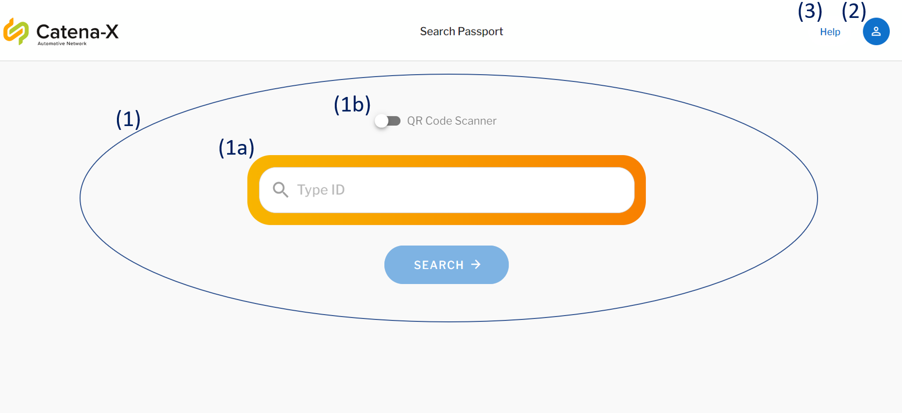
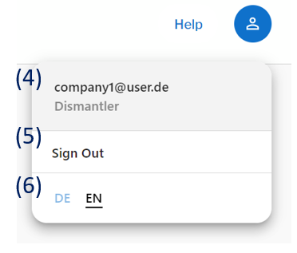
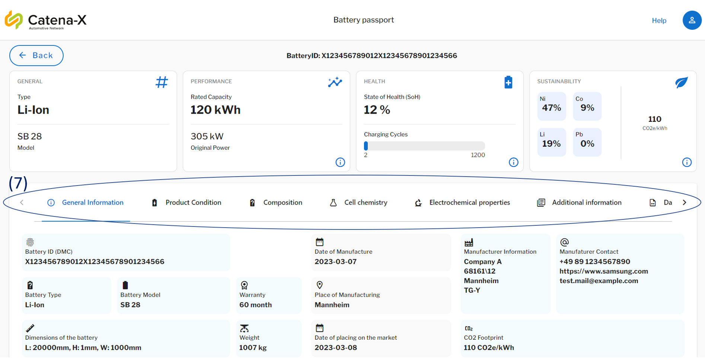

<!--
  Catena-X - Product Passport Consumer Application
 
  Copyright (c) 2022, 2023 BASF SE, BMW AG, Henkel AG & Co. KGaA
 
  See the NOTICE file(s) distributed with this work for additional
  information regarding copyright ownership.
 
  This program and the accompanying materials are made available under the
  terms of the Apache License, Version 2.0 which is available at
  https://www.apache.org/licenses/LICENSE-2.0.
 
  Unless required by applicable law or agreed to in writing, software
  distributed under the License is distributed on an "AS IS" BASIS
  WITHOUT WARRANTIES OR CONDITIONS OF ANY KIND,
  either express or implied. See the
  License for the specific language govern in permissions and limitations
  under the License.
 
  SPDX-License-Identifier: Apache-2.0
-->

# User Manual

This manual provides a step by step introduction on how to use the Product Pass Viewer app and gives an overview on its functionalities.

## Content

1. [Content](#content)
2. [Getting Started](#getting-started)
3. [Main Menu](#main-menu)
    1. [Product Search](#search-for-a-product-passport)
    2. [Profile Information and Settings](#settings-and-profile-information)
    3. [Catena-X Helpdesk](#catena-x-helpdesk)
4. [Results Page](#results-page)
5. [NOTICE](#notice)

## Getting Started

After opening the Product Pass Viewer application on your computer or phone, login with your company's login credentials.
    

## Main Menu

After logging in, you will be forwarded to the Product Viewer's main menu. Here you can access three functions:

1. [Search for a Product Passport](#search-for-a-product-passport)
2. [Adjust Settings and see Profile Information](#settings-and-profile-information)
3. [Access the Catena-X Helpdesk](#catena-x-helpdesk)

  
    

### Search for a Product Passport

The [Main Menu](#main-menu) provides two methods for searching for Product Passports. You can request information by:

1. manually entering a product ID or
2. scanning the product's QR code.

Both options can be found in the center of the [Main Menu's](#main-menu) screen (1). Whenever you access the [Main Menu](#main-menu), the manual product ID search will be displayed by default (1a). The search text contains the pattern separated by the colon(:) `CX:<manufacturerPartId>:<serializedId>` where CX is a prefix, `<manufacturerPartId>` is the part Id of the manufacturer, and `<serializedId>` is the Id of the battery Example: `CX:XYZ78901:X123456789012X12345678901234566`. If the search format is not followed, an error would be displayed.

 By clicking on the switch the back arrow button (1b), you activate the QR code scanner and the application will access your devices camera, which you can then capture the QR code with.

  
    

### Settings and Profile Information

Clicking on the blue icon in the upper right corner of the [Main Menu](#main-menu) (2) activates a drop-down menu containing your profile information and language settings. In this tab you find your specific user information and assigned role within Catena-X (4), can log out of your account (5) or change the applications's language (6) as shown below.

  
    

### Catena-X Helpdesk

If questions arise, you can access the Catena-X Helpdesk through clicking on "Help" in the upper right corner of the [Main Menu](#main-menu) (3).  
  

## Results Page

 After requesting data via one of the [product search functions](#search-for-a-product-passport), the information will be displayed on the screen. An exemplary product passport of a battery can be seen below. It provides an overview on the battery's history, technical specifications and data exchange information:

  

  

Hereby, the information is devided into the following sections:

1. General Information
2. Product Condition
3. Composition
4. Cell Chemistry
5. Electromechanical Properties
6. Additional Information
7. Data exchange Information

Each category can be accessed by clicking on its heading in the selection bar towards the middle of the product passport screen (7).

## NOTICE

This work is licensed under the [Apache-2.0](https://www.apache.org/licenses/LICENSE-2.0).

- SPDX-License-Identifier: Apache-2.0
- SPDX-FileCopyrightText: 2022, 2023 BASF SE, BMW AG, Henkel AG & Co. KGaA
- SPDX-FileCopyrightText: 2023 Contributors to the Eclipse Foundation
- Source URL: https://github.com/eclipse-tractusx/digital-product-pass
