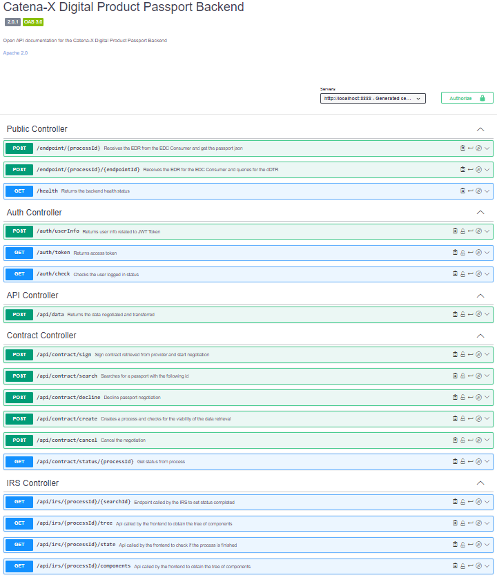
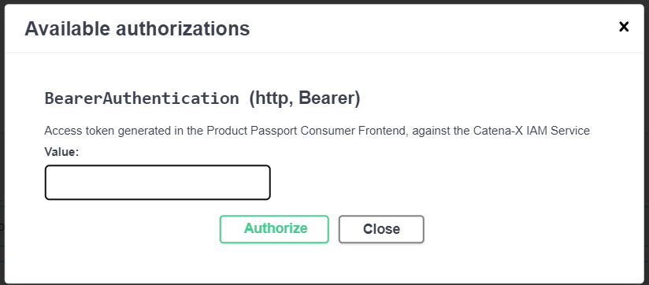

<!-- 
  Tractus-X - Digital Product Passport Application 
 
  Copyright (c) 2022, 2024 BMW AG, Henkel AG & Co. KGaA
  Copyright (c) 2023, 2024 CGI Deutschland B.V. & Co. KG
  Copyright (c) 2022, 2024 Contributors to the Eclipse Foundation

  See the NOTICE file(s) distributed with this work for additional
  information regarding copyright ownership.
 
  This program and the accompanying materials are made available under the
  terms of the Apache License, Version 2.0 which is available at
  https://www.apache.org/licenses/LICENSE-2.0.
 
  Unless required by applicable law or agreed to in writing, software
  distributed under the License is distributed on an "AS IS" BASIS
  WITHOUT WARRANTIES OR CONDITIONS OF ANY KIND,
  either express or implied. See the
  License for the specific language govern in permissions and limitations
  under the License.
 
  SPDX-License-Identifier: Apache-2.0
-->

<h1 style="display:flex; align-items: center;">&nbsp;&nbsp;Digital Product Pass Backend</h1>


<br>

# Table of contents
<!-- TOC -->
- [Table of contents](#table-of-contents)
- [What is this backend app responsible for?](#what-is-this-backend-app-responsible-for)
- [Services Available](#services-available)
  - [Authentication Services](#authentication-services)
- [Open API specification](#open-api-specification)
  - [Digital Product Pass APIs](#digital-product-pass-apis)
    - [Parameters](#parameters)
      - [/api/contract/create](#apicontractcreate)
      - [/api/contract/search](#apicontractsearch)
      - [/api/contract/agree](#apicontractagree)
      - [/api/contract/decline](#apicontractdecline)
      - [/api/contract/cancel](#apicontractcancel)
      - [/api/contract/status/{processId}](#apicontractstatusprocessid)
      - [/api/data](#apidata)
- [Detailed API Services](#detailed-api-services)
    - [/api/data](#apidata-1)
          - [Request body](#request-body)
    - [Contract API](#contract-api)
      - [/api/contract/create](#apicontractcreate-1)
          - [Request body](#request-body-1)
      - [/api/contract/search](#apicontractsearch-1)
          - [Request body](#request-body-2)
      - [/api/contract/agree](#apicontractagree-1)
          - [Request body](#request-body-3)
      - [/api/contract/decline](#apicontractdecline-1)
          - [Request body](#request-body-4)
      - [/api/contract/cancel](#apicontractcancel-1)
          - [Request body](#request-body-5)
      - [/api/contract/status/](#apicontractstatus)
  - [IRS API](#irs-api)
          - [Request parameters](#request-parameters)
  - [Public API](#public-api)
          - [Response](#response)
- [OSS License Check](#oss-license-check)
- [Swagger Docs](#swagger-docs)
- [Run the application](#run-the-application)
  - [Modify the configurations in the deployment files](#modify-the-configurations-in-the-deployment-files)
- [TL;DR](#tldr)
  - [Install](#install)
- [License](#license)
<!-- TOC -->

# What is this backend app responsible for?

This backend includes the services and *logics* to manage the *passports* of the `frontend app`.

# Services Available

## Authentication Services
All Authenticated APIs required a `AccessToken` JWT Token generated by the login in the frontend or in the Catena-X Keycloak instance.

```yaml
{
    headers: {
        Authorization: "Bearer <<AccessToken>>"
    }
}
```

For login and log out!
```bash
------
/auth/check #With this api you can check you authentication status.
------
/auth/token #Request token from the keycloak instance
------
/auth/userInfo #With this api you can get your user information.
------
```


# Open API specification

The Digital Product Pass Open API specification is available at the swagger hub from Tractus-X:

[https://app.swaggerhub.com/apis/eclipse-tractusx-bot/digital-product-pass](https://app.swaggerhub.com/apis/eclipse-tractusx-bot/digital-product-pass)

## Digital Product Pass APIs
The APIs below are the ones contain in the `Digital Product Pass Backend` reference implementation. Which can be reused for retrieving aspects from the Catena-X Network.

 | API                                    | Method | Description                                                                                                                                                                                                                                                                                                                                                                    | Parameters                                  |
 |----------------------------------------| ------ |--------------------------------------------------------------------------------------------------------------------------------------------------------------------------------------------------------------------------------------------------------------------------------------------------------------------------------------------------------------------------------|---------------------------------------------|
 | **/api/contract/create**               | POST   | The `/api/contract/create` api is responsible for calling the `BPN Discovery` service searching for the BPN of a `manufacturerPartId` and validating if there is any `Decentral Digital Twin Registry` available for the BPN number found in the `EDC Discovery` service.                                                                                                      | [Go to Params](#apicontractcreate)          
 | **/api/contract/search**               | POST   | At the **/api/contract/search**  API the user can search for a serialized Id and get its contract. The `Backend` will search for the Digital Twin and will return the contract for the first one that is found. A `sign token` (a sha256 hash) is return also and acts like a "session token" allowing just the user that created the process to sign or decline the contract. | [Go to Params](#apicontractsearch)          |
 | **/api/contract/agree**                | POST   | Once the user has the contract he can call the `/api/contract/agree` API to start the negotiation process and the transfer of the passport. This means that the user accepted the policy and the frame-contracts contained in the contract policy.                                                                                                                             | [Go to Params](#apicontractagree)           |
 | **/api/contract/decline**              | POST   | The other option rather than `/agree` is the `/decline` API, that basically blocks the process and makes it invalid. This means that the user declined the specific contract that was found for this process.                                                                                                                                                                  | [Go to Params](#apicontractdecline)         
 | **/api/contract/cancel**               | POST   | The user can use `/cancel` to interrupt the negotiation process once it is signed by mistake if is the case. It will be only valid until the negotiation is made.                                                                                                                                                                                                              | [Go to Params](#apicontractcancel)          
 | **/api/contract/status/`<processId>`** | GET    | After the user signs the contract he can use the `/status` API to get the process status and see when it is ready to retrieve the passport using the API `/data`..                                                                                                                                                                                                             | [Go to Params](#apicontractstatusprocessid) 
 | **/api/data**                          | POST   | The API `/data` will decrypt the passport file that is encrypted using the session token "sign token", and will delete the file so that it is returned just once to the user and can not be accessed anymore. So a new passport will be always need to be requested..                                                                                                          | [Go to Params](#apidata)                    |
 | **/api/data/request**                  | POST   | The Single API `/data/request` calls the necessary above APIs in order to retrieve the passport with auto-sign capability, it calls the create API, then search API, signs with the agree API and retrieves the data with the data API. The authentication is done with an API Key received as an HTTP header.                                                                 | [Go to Params](#apidataRequest)             |

### Parameters

#### /api/contract/create

| Parameter | Value Name       | Mandatory or Optional Value |
|-----------|------------------|-----------------------------|
| id        | searchIdValue    | [REQUIRED]                  |
| type      | searchIdTypeName | manufacturerPartId          |


#### /api/contract/search

| Parameter | Value Name            | Mandatory or Optional Value |
|-----------|-----------------------|-----------------------------|
| id        | serializedIdValue     | [REQUIRED]                  |
| idType    | serializedIdTypeName  | partInstanceId              |
| processId | processIdentification | [REQUIRED]                  |


 #### /api/contract/agree

| Parameter  | Value Name             | Mandatory or Optional Value                                                     |
|------------|------------------------|---------------------------------------------------------------------------------|
| processId  | processIdentification  | [REQUIRED]                                                                      |
| contractId | contractIdentification | [REQUIRED]                                                                      |
| policyId   | policyIdentification   | If no policyId is specified then the first policy of the contract will be taken |
| token      | searchSessionToken     | [REQUIRED]                                                                      |

#### /api/contract/decline                                                   

| Parameter  | Value Name             | Mandatory or Optional Value |
|------------|------------------------|-----------------------------|
| processId  | processIdentification  | [REQUIRED]                  |
| token      | searchSessionToken     | [REQUIRED]                  |


#### /api/contract/cancel

| Parameter  | Value Name             | Mandatory or Optional Value |
|------------|------------------------|-----------------------------|
| processId  | processIdentification  | [REQUIRED]                  |
| contractId | contractIdentification | [REQUIRED]                  |
| token      | searchSessionToken     | [REQUIRED]                  |


#### /api/contract/status/{processId}   
| Parameter | Value Name            | Mandatory or Optional Value |
|-----------|-----------------------|-----------------------------|
| processId | processIdentification | [REQUIRED]                  |
                                                                                      

#### /api/data 

| Parameter  | Value Name             | Mandatory or Optional Value |
|------------|------------------------|-----------------------------|
| processId  | processIdentification  | [REQUIRED]                  |
| contractId | contractIdentification | [REQUIRED]                  |
| token      | searchSessionToken     | [REQUIRED]                  |

#### /api/data/request

| Parameter       | Value Name             | Mandatory or Optional Value |
|-----------------|------------------------|-----------------------------|
| id              | searchIdValue          | [REQUIRED]                  |
| idType          | searchIdTypeName       | manufacturerPartId          |
| discoveryId     | serializedIdValue      | [REQUIRED]                  |
| discoveryIdType | serializedIdTypeName   | partInstanceId              |
| children        | searchForChildren      | true/false                  |
| semanticId      | semanticIdentification | semanticId                  |
                                                                                                                                                                           

# Detailed API Services
>  **_NOTE:_** You must be authenticated with the keycloak instance to access this APIs


### /api/data
Get data from a Catena-X Provider by using its processId, contractId and a token, this retrieves product passport after a successful negotiation.

```bash
/api/data #Returns the data negotiated and transferred
```
###### Request body
```json
{
    "processId": "string",
    "contractId": "string",
    "token": "string",
    "policyId": "optional:string"
}
```

### /api/data/request
The Single API permits to get data from a Catena-X Provider by abstracting of all the needed APIs to do so. Authenticating with an API Key and with the given id and discoveryId, this API will
create the process and check for the viability of the data retrieval, searches for a passport with the given id, automatically signs the contract retrieved from provider and start negotiation, waits for the negotiation
to be done and returns the data negotiated and transferred.

```bash
/api/data/request #Creates the process, searchs for a passport with the following id, negotiates and signes the contract, returns the data negotiated and transferred.
```
###### Request body
```json
{
    "id": "string",
    "idType": "optional:string",
    "discoveryId": "string",
    "discoveryIdType": "optional:string",
    "children": "optional:boolean",
    "semanticId": "optional:string"
}
```

### Contract API

#### /api/contract/create

```bash
/api/contract/create #Creates a process and checks for the viability of the data retrieval
```
###### Request body
```json
{
    "id": "string",
    "type": "string"
}
```

#### /api/contract/search

```bash
/api/contract/search #Searches for a passport with the following id
```
###### Request body
```json
{
    "processId": "string",
    "id": "string",
    "children": true // Optional Boolean
    "idType": "optional:string",
    "dtIndex": 0, //Optional Integer
    "idShort": "optional:string"
}
```

#### /api/contract/agree

```bash
/api/contract/agree #Sign contract retrieved from provider and start negotiation
```
###### Request body
```json
{
    "processId": "string",
    "contractId": "string",
    "token": "string",
    "policyId": "optional:string"
}
```

#### /api/contract/decline

```bash
/api/contract/decline #Decline passport negotiation
```
###### Request body
```json
{
    "processId": "string",
    "token": "string"
}
```
#### /api/contract/cancel

```bash
/api/contract/cancel #Cancel the negotiation
```
###### Request body
```json
{
    "processId": "string",
    "contractId": "string",
    "token": "string",
    "policyId": "optional:string"
}
```

#### /api/contract/status/<processId>

```bash
/api/contract/status/<processId> #Get status from process
```

## IRS API

```bash
/api/irs/<processId>/<searchId> #Endpoint called by the IRS to set status completed
```
###### Request parameters
```
- Id
- State
```
```bash
/api/irs/<processId>/tree #Api called by the frontend to obtain the tree of components
```
```bash
/api/irs/<processId>/state #Api called by the frontend to check if the process is finished
```
```bash
/api/irs/<processId>/components #Api called by the frontend to obtain the list of components of the tree
```

## Public API

Public APIs don't require authentication
```bash
/health #Get the health status of the server
```
###### Response
```json
{
    "message": "RUNNING",
    "status": 200,
    "data": "24/11/2022 17:48:18.487"
}
```

```bash
/endpoint/<processId> #Receives the EDR from the EDC Consumer and get the passport json 
```

```bash
/endpoint/<processId>/<endpointId> #Receives the EDR for the EDC Consumer and queries for the dDTR
```


# OSS License Check

The third party library dependecies, utilized in this app have to  be approved from The Eclipse Foundation.

The [Dash Licence Tool](https://github.com/eclipse/dash-licenses) is used to scan the dependencies

[OSS License Checks with Dash & Compliance with Apache 2.0](https://confluence.catena-x.net/pages/viewpage.action?pageId=54989501)

At the time of writing this manual, the dependencies have status approved and therefore no need to generate  IP Team Review request further.

[Maven plugin](https://github.com/eclipse/dash-licenses/blob/master/README.md#maven-plugin-options) used to check OSS license

How to run:
```bash
mvn org.eclipse.dash:license-tool-plugin:license-check -Ddash.summary=DEPENDENCIES
```


# Swagger Docs

Swagger documentation is now automatically available at the following path:

```https://<host>/swagger-ui/index.html```



For authorization, you will need to add a JWT Access token from the Catena-X IAM:



# Run the application

Use maven to run the spring boot application:
```bash
mvn spring-boot:run
```

If you want to run the application in a different way checkout the [frequently asked questions](#frequently-asked-questions) section below.

## Modify the configurations in the deployment files

You can use the default configuration to start the application:
```charts/digital-product-pass/values.yaml```

However if you need to change it just create a new environment with this naming convention: ```values-env`.yaml``` where ```env``` is the name of your environment. You can use as an example the following configuration file: ```charts/digital-product-pass/values-int.yaml```.

The configuration for the consumer backend application is a yaml file that is configured in the following tag: ```backend.application```. Before the application starts all the configuration parameters must be specified, since they are required for initialization and will be checked at the test fase.

Once you configured the application use the follow the [TL;DR](#tldr) below to ```build the image and start the application``` using helm charts.

# TL;DR 

## Install
Find more documentation on how to install the backend in the [INSTALL.md](../../INSTALL.md) file.
 
# License
[Apache-2.0](https://raw.githubusercontent.com/catenax-ng/product-battery-passport-consumer-app/main/LICENSE)
