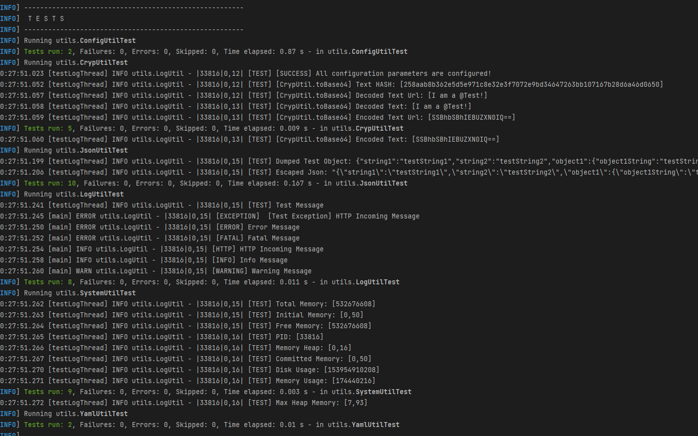

<!--
  Catena-X - Product Passport Consumer Backend
 
  Copyright (c) 2022, 2023 BASF SE, BMW AG, Henkel AG & Co. KGaA

  See the NOTICE file(s) distributed with this work for additional
  information regarding copyright ownership.
 
  This program and the accompanying materials are made available under the
  terms of the Apache License, Version 2.0 which is available at
  https://www.apache.org/licenses/LICENSE-2.0.
 
  Unless required by applicable law or agreed to in writing, software
  distributed under the License is distributed on an "AS IS" BASIS
  WITHOUT WARRANTIES OR CONDITIONS OF ANY KIND,
  either express or implied. See the
  License for the specific language govern in permissions and limitations
  under the License.
 
  SPDX-License-Identifier: Apache-2.0
-->

# Unit Tests Documentation

>  **_NOTE:_** This unit tests can not cover the REST API calls since the server is not running when the tests are performed, API Test are performed with Postman (newman)





## Introduction
The main goal of this unit tests is to test the core components (utils) used by all
the parts from the system.

Behind all the REST APIs the Utils help in logging, in making calculations, handle information, etc...


### JsonUtil
This is a core component from our application.
It permits us to handle JsonStrings, JSON Objects and HashMaps.

The core components that are tested are:
 - toMap -> Tries to parse any object to map
 - isJson -> Check if object is JSON 
 - loadJson -> Loads String Json in Object
 - escapeJson -> Escapes an Json String
 - parseJson -> Transforms a Json String in Object
 - toJson -> Dumps a Json Object into a string (with or without indent)
 - getValue -> Gets a specific value in a Json Path Ex: "object1.key2"
 - setValue -> Sets a specific value in a Json Path Ex: "object1.key2 = value"
 - toJsonNode -> Transforms string in Json Node
 - bindJsonNode -> Binds Json node into an Object Type

### LogUtil
This component is used to print all the logs in files and in the standard output.

Is tested by printing all log levels:

 - printTest -> Test Methods
 - printMessage -> Info
 - printHTTPMessage -> Rest HTTP Info
 - printException -> Exceptions
 - printError -> Error
 - printWarning -> Warning
 - printDebug -> Debug
 - printFatal -> Fatal


### SystemUtil
This util allows us to know important statistics from the system
And are used in every printed log:

Methods tested:
 - getPid
 - getUsedHeapMemory
 - getMemoryUsage
 - getTotalMemory
 - getFreeMemory
 - getCommitedMemory
 - getInitialMemory
 - getMaxHeapMemory
 - getDiskUsage

### ConfigUtil & EnvUtil
All REST API's use the configurations set for each environment.

While testing the ConfigUtil we are testing the EnvUtil since all the configurations
are took from the environment configuration file.

We look for all the fields that need to be included in the configuration file:
```yaml
LogUtil:
  level: 7 
  async: false

maxRetries: 5

keycloak:
  tokenUri: ''

variables:
  default:
    providerUrl: ''
    serverUrl: ''
    registryUrl: ''

passport:
  versions:
    - 'v1'

vault:
  type: 'local'
  file: 'vault.token-dev.yml'
  uri: ''
  pathSep: "." 
  prettyPrint: true
  indent: 2
  defaultValue: '<Add secret value here>'
  attributes:
    - "secret"
    - "secret1.secretkey"
    - "secret1.secretvalue"
```

>  **_WARNING:_**: When a configuration attribute is not specified in the environment set in `<src/main/resources/config/env.yml>` the test will fail!

### CrypUtil
This util is responsible for enabling data integrity and protection in our application.

We test the following methods:
 - toBase64
 - fromBase64
 - toBase64Url
 - fromBase64Url
 - sha256

### YamlUtil
In order to handle Yaml files we need to use this utility.

To check if we are able to parse Yaml we test the following methods:
 - parseYml -> Loads YAML String to a HashMap
 - dumpYml -> Dumps a HashMap into a YAML String

