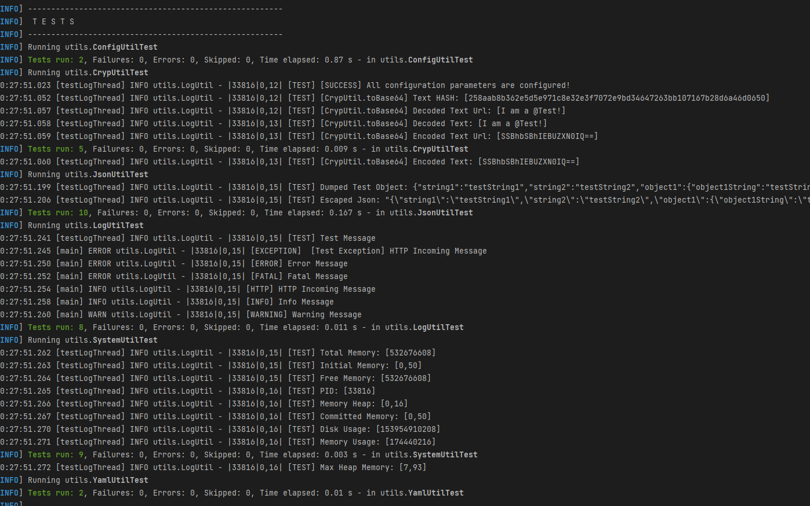

<!-- 
  Tractus-X - Digital Product Passport Application 
 
  Copyright (c) 2022, 2024 BMW AG, Henkel AG & Co. KGaA
  Copyright (c) 2023, 2024 CGI Deutschland B.V. & Co. KG
  Copyright (c) 2022, 2024 Contributors to the Eclipse Foundation

  See the NOTICE file(s) distributed with this work for additional
  information regarding copyright ownership.
 
  This program and the accompanying materials are made available under the
  terms of the Apache License, Version 2.0 which is available at
  https://www.apache.org/licenses/LICENSE-2.0.
 
  Unless required by applicable law or agreed to in writing, software
  distributed under the License is distributed on an "AS IS" BASIS
  WITHOUT WARRANTIES OR CONDITIONS OF ANY KIND,
  either express or implied. See the
  License for the specific language govern in permissions and limitations
  under the License.
 
  SPDX-License-Identifier: Apache-2.0
-->

# Unit Tests Documentation

>  **_NOTE:_** This unit tests can not cover the REST API calls since the server is not running when the tests are performed, API Test are performed with Postman (newman)





## Introduction
The main goal of this unit tests is to test the core components (utils) used by all
the parts from the system.

Behind all the REST APIs the Utils help in logging, in making calculations, handle information, etc...

## Managers
### DtrSearchManager
This is the manager that is responsible to retrieve and manage the Digital Twin Registry (DTR).

The main functionalities tested are:
- createDataModelFile -> creates the data model file to store the DTRs found.
- addConnectionToBpnEntry -> adds a DTR adress connection to a certain BPN number.
- deleteBpns -> delete BPN entries from the data model.
- saveDtrDataModel -> saves data tp the data model file.
- loadDataModel -> loads data from the data model file.

### ProcessDataModel
This is the manager that is responsible to manage the Process' data model 
that stores all the information related to each process.

The main functionalities tested are:
- addProcess -> adds a new process to the data model.
- getProcess -> gets a process from the data model.
- setState -> sets a state to a process.
- getState -> gets the current state of the process.
- processExists -> checks if process exists in the data model.
- startProcess -> starts a new process.

### ProcessManager
This is the manager that is responsible to manage all the processes.

The main functionalities tested are:
- initProcess -> initializes a new process.
- loadDataModel -> gets the data model from the ProcessDataModel manager.
- saveDataModel -> saves data into data model file.
- getProcess -> gets the process of an HTTP request.
- generateStatusToken -> generates a status token containing contractId and status information.
- generateToken -> generates a token containing processId and contractId information.
- createProcess -> creates a new process.
- checkProcess -> checks if a process exists in an HTTP request.
- setProcess -> sets a process to an HTTP request.
- setProcessState -> sets a state in a process.
- getProcessState -> gets the current state of a process.
- setStatus -> set a status information in a process.
- getStatus -> get the current status information of a process.
- setBpn -> sets a BPN number in the process status.
- setTreeState -> sets a state of the Tree components in the process status.
- setJobHistory -> sets a job history in the process status.
- setSemanticId -> sets a semanticId in the process status.
- setEndpoint -> sets an endpoint address in the process status.
- setSearch -> sets a Search information in the process.
- getSearchStatus -> gets the Search information of a process.
- deleteSearchDir -> deletes the search directory of a process.
- addSearchStatusDtr -> adds the DTR information in the process Search status.
- newStatusFile -> createsa new Status file for a process.
- saveTransferInfo -> saves the information related to the Transfer.
- saveNegotiationRequest -> saves the information related to the Negotiation request.
- saveNegotiation -> saves the information related to the Negotiation.
- loadNegotiation -> loads the Negotiation information of the process.
- cancelProcess -> cancels the negotiation of a process.
- setDecline -> declines a contract negotiation of a process.
- setSigned -> signes the contract negotiation of a process.
- saveDataset -> saves the a Dataset information in the process.
- loadDataset -> loads the Dataset information.
- saveTransferRequest -> saves the information related to the Transfer request.
- saveTransfer -> saves the information related to the Transfer.
- savePassport -> saves the retrieved passport in a process.
- loadPassport -> loads a passport information of a process.
- saveDigitalTwin -> saves the DigitalTwin information in a process.

### TreeManager
This is the manager that is responsible to manage the IRS tree components of a process.

The main functionalities tested are:
- getTreeFilePath -> gets the tree file path of a process.
- createTreeFile -> creates a tree file in a process.
- treeExists -> checks if a tree exists in a process.
- generateSearchId -> generates a searchId of an Asset from the Tree from a process.
- populateTree -> fills the tree map with data.
- getTree -> gets the tree map data from a process.
- getTreeComponents -> gets the list of components from a tree of a process.

## Services
### AasService
This services handles with all information related to the DigitalTwins and its submodels.

The main functionalities tested are:
- searchDigitalTwin -> searches for Digital Twins.
- getPathEndpoint -> gets the path endpoint for an asset (e.g: digital twin, submodel).
- searchSubModelBySemanticId -> search submodels within a Digital Twin by it's semanticId.
- getTokenHeader -> gets the authentication token.
- decentralDtrSearch -> searchs for Digital Twin Registries.

### AuthenticationService
This service is responsible to handle the authentication to the application.

The main functionalities tested are:
- getToken -> gets the authentication token.
- isAuthenticated -> checks if an user is authenticated.
- getUserInfo -> gets the user information.

### CatenaXService
This service is responsible to get and handle the information from Catena X such as EDC and BPN discoveries.

The main functionalities tested are:
- start -> starts the Catena X service initializing with default values.
- addEndpoint -> adds an endpoint to the EDC or BPN list.
- getDiscoveryEndpoints -> gets the EDC or BPN discovery endpoints list.
- updateDiscovery -> updates the EDC or BPN discovery with a new entry.
- getEdcDiscovery -> gets the EDC discovery list for a given BPN number list.
- getBpnDiscovery -> gets the BPN discovery list for a given id and type.

### DataPlaneService
This service is exclusively to handle the data plane information such as passports and transfer data.

The main functionalities tested are:
- getPassportFromEndpoint -> Gets the passport data from an endpoint.

### DataTransferService
This service is responsible to provide functionalities to handle the data transfer. Like the contract
offer, negotiation and transfer requests.

The main functionalities tested are:
- checkEdcConsumerConnection -> Checks the EDC consumer connection by trying to establish a connection and retrieve an empty catalog.
- buildRequest -> builds a negotiation request.
- getContractOfferCatalog -> gets the catalog of a Contract Offer from a provider.
- searchDigitalTwinCatalog -> searches for a Digital Twin catalog from a provider.
- buildOffer -> builds an offer to negotiate.
- doContractNegotiation -> does a contract negotiation with a built offer to a provider.
- seeNegotiation -> gets the Negotiation information of a negotiation request.
- initiateTransfer -> initiates a Transfer request.
- seeTransfer -> get the Transfer information of a transfer request.

### IrsService
This service is responsible to make the communications to the IRS Service to get the Tree components information.

The main functionalities tested are:
- startJob -> starts a job in the IRS Service to get the tree component information.
- getChildren -> gets the children of a specified node from the tree component.
- getJob -> gets the job response from the IRS Service.

## Utils
### JsonUtil
This is a core component from our application.
It permits us to handle JsonStrings, JSON Objects and HashMaps.

The core components that are tested are:
 - toMap -> Tries to parse any object to map
 - isJson -> Check if object is JSON 
 - loadJson -> Loads String Json in Object
 - escapeJson -> Escapes an Json String
 - parseJson -> Transforms a Json String in Object
 - toJson -> Dumps a Json Object into a string (with or without indent)
 - getValue -> Gets a specific value in a Json Path Ex: "object1.key2"
 - setValue -> Sets a specific value in a Json Path Ex: "object1.key2 = value"
 - toJsonNode -> Transforms string in Json Node
 - bindJsonNode -> Binds Json node into an Object Type

### LogUtil
This component is used to print all the logs in files and in the standard output.

Is tested by printing all log levels:

 - printTest -> Test Methods
 - printMessage -> Info
 - printHTTPMessage -> Rest HTTP Info
 - printException -> Exceptions
 - printError -> Error
 - printWarning -> Warning
 - printDebug -> Debug
 - printFatal -> Fatal


### SystemUtil
This util allows us to know important statistics from the system
And are used in every printed log:

Methods tested:
 - getPid
 - getUsedHeapMemory
 - getMemoryUsage
 - getTotalMemory
 - getFreeMemory
 - getCommitedMemory
 - getInitialMemory
 - getMaxHeapMemory
 - getDiskUsage

### ConfigUtil & EnvUtil
All REST API's use the configurations set for each environment.

While testing the ConfigUtil we are testing the EnvUtil since all the configurations
are took from the environment configuration file.

We look for all the fields that need to be included in the configuration file:
```yaml
LogUtil:
  level: 7 
  async: false

maxRetries: 5

keycloak:
  tokenUri: ''

variables:
  default:
    providerUrl: ''
    serverUrl: ''
    registryUrl: ''

passport:
  versions:
    - 'v1'

vault:
  type: 'local'
  file: 'vault.token-dev.yml'
  uri: ''
  pathSep: "." 
  prettyPrint: true
  indent: 2
  defaultValue: '<Add secret value here>'
  attributes:
    - "secret"
    - "secret1.secretkey"
    - "secret1.secretvalue"
```

>  **_WARNING:_**: When a configuration attribute is not specified in the environment set in `<src/main/resources/config/env.yml>` the test will fail!

### CrypUtil
This util is responsible for enabling data integrity and protection in our application.

We test the following methods:
 - toBase64
 - fromBase64
 - toBase64Url
 - fromBase64Url
 - sha256

### YamlUtil
In order to handle Yaml files we need to use this utility.

To check if we are able to parse Yaml we test the following methods:
 - parseYml -> Loads YAML String to a HashMap
 - dumpYml -> Dumps a HashMap into a YAML String

