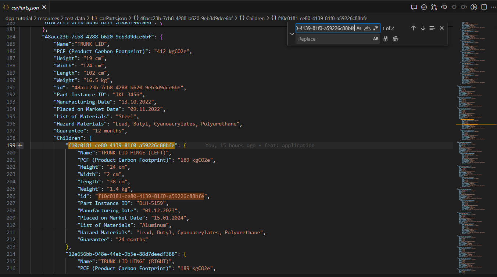
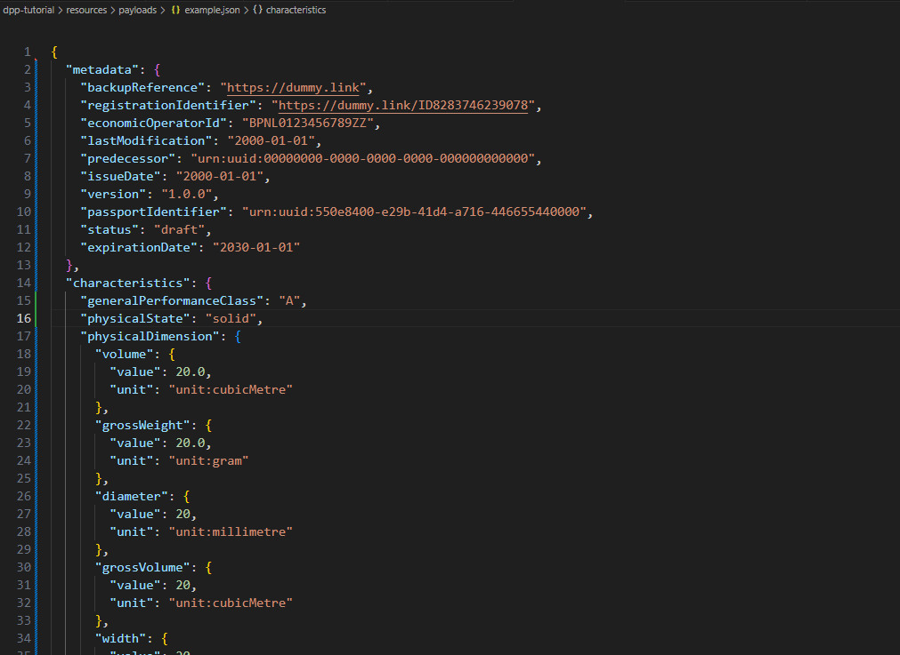
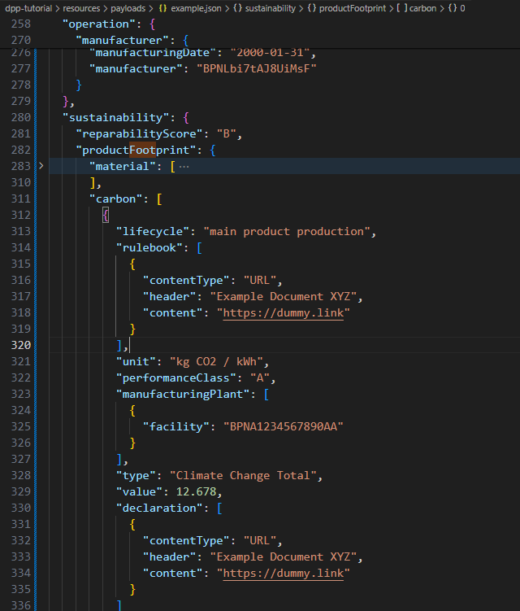

<!--
#######################################################################

Tractus-X - Digital Product Pass Application 

Copyright (c) 2024 BMW AG
Copyright (c) 2024 CGI Deutschland B.V. & Co. KG
Copyright (c) 2024 Contributors to the Eclipse Foundation

See the NOTICE file(s) distributed with this work for additional
information regarding copyright ownership.

This work is made available under the terms of the
Creative Commons Attribution 4.0 International (CC-BY-4.0) license,
which is available at
https://creativecommons.org/licenses/by/4.0/legalcode.

SPDX-License-Identifier: CC-BY-4.0

#######################################################################
-->

# Builder Path

In this Path, you, as a provider, will create a Digital Product Passport (DPP) for a specific Part of the Arena-X Car. To accomplish this, you will use terminal commands to send HTTP request, creating an Aspect Model and a Digital Twin.

## Prerequisites

You must fullfill the following pre-requisites:

- A Catena-X Standarized Aspect Model (in this case we use the [Digital Product Pass v5.0.0 Model](https://github.com/eclipse-tractusx/sldt-semantic-models/tree/main/io.catenax.generic.digital_product_passport/5.0.0))
- JSON Editor like [VS Code](https://code.visualstudio.com/) or [Notepad++](https://notepad-plus-plus.org/downloads/)
- Car Parts JSON Test Data [found here](./resources/test-data/carParts.json)

>[!WARNING]
>
> The model v2.0.0 of the Digital Product Pass is **DEPRECATED** and its used here only as demo purposes, please check the latests models in: [Digital Product Pass Models](https://github.com/eclipse-tractusx/sldt-semantic-models/tree/main/io.catenax.generic.digital_product_passport)


You must have the following components up and running: 

- A Data Service (DS) to store passport payloads in a plain JSON format
- Digital Twin Registry (DTR) to store Digital Twins as Asset Administration Shells (AAS)
- A preconfigured EDC Conenctor (Data provider)
- Familiarity with the JSON structure
- Accessibility of components over the network

## Clone a Git repository

Use the following command in your terminal to clone the digital product pass git repository

```bash
git clone https://github.com/eclipse-tractusx/digital-product-pass.git
```

> [!NOTE]  
> If you already cloned this repository, you can ignore this step

## Aspect Model Creation

This part provides a simple explanation on how to create a digital product pass serialized aspect model payload.

Follow this steps to create a new Digital Product Passport serialized model:

### 1º - Find test data before generating the model

In the worksession you will receive a paper with the test data, you can find the same information [here](./resources/test-data/carParts.json) in a test JSON file.

To find your part and be able to copy and paste the information:

1 - Search by uuid with CTRL + F:



You will get your information in a paper:

Example:

```json
{
 "f10c0181-ce80-4139-81f0-a59226c88bfe": {
      "Name":"TRUNK LID HINGE (LEFT)",
      "PCF (Product Carbon Footprint)": "189 kgCO2e",
      "Height": "24 cm",
      "Width": "2 cm",
      "Length": "38 cm",
      "Weight": "1.4 kg",
      "id": "f10c0181-ce80-4139-81f0-a59226c88bfe",
      "Part Instance ID": "DLH-5159",
      "Manufacturing Date": "01.12.2023",
      "Placed on Market Date": "15.01.2024",
      "List of Materials": "Aluminum",
      "Hazard Materials": "Lead, Butyl, Cyanoacrylates, Polyurethane",
      "Guarantee": "24 months"
  }
}

```

> [!TIP]
> Copy and paste the data for creating your digital product pass faster!


### 2º - Copy the digital product pass aspect model template into a new file or window

Paste this [Digital Product Passport v5.0.0 Payload](./resources/payloads/example.json) in the VS Code/Notepad++:



It is a test data template that can be personalized to your part with the test data provider to you and your creativity!

### 3º - Substitute data in the template

For example for adding the PCF value follow the following path:

```text
sustainability.productFootprint.carbon[0].value
```

Example:



### Where to substitute the data?

Follow this paths to find where the information is located.

| Property              | Path                                          |
|-----------------------|-----------------------------------------------|
| Width                 | characteristics.physicalDimension.width.value |
| Length                | characteristics.physicalDimension.length.value |
| Weight                | characteristics.physicalDimension.grossWeight.value |
| Height                | characteristics.physicalDimension.height.value |
| Guarantee (Value)     | characteristics.lifespan[0].value                   | 
| Guarantee (Unit)      | characteristics.lifespan[0].unit                    |
| Name (Really short)   | identification.type.nameAtManufacturer       |
| Part Instance Id      | identification.serial[0].value               |
| Manufacturing Date    | operation.manufacturer.manufacturingDate     |
| PCF                   | sustainability.productFootprint.carbon[0].value |

Congratulations! You have successfully created your own digital product pass!

The next step will be to register your data in a Data Service.

> [!TIP]
> You can add more relavant data and personalized information at the digital product pass, follow the template and modify the data as you wish!

## Data Provision

             ________EDC-Connector________         ________Registry________         ________Data Service________  
            |                             |       |                        |       |                            |
            | Controlplane <-> Dataplane  | <---> |         AAS DTR        | <---> |     A plain JSON Server    |           
            |_____________________________|       |________________________|       |____________________________|

This part provides the information needed to setup digital twin provisioning services as a data provider. Additionally, it enables you to create and register aspect models into the data service.

## 1º Prepare Digital Product Pass Model

In order to prepare aspect models, please follow the [aspect model guide](./aspect-model.md) 

## Add Aspect Model to the Submodel Server

The data generated in previous step can be stored into the submode data service.

> [!CAUTION]
> The UUID should be written in the format: 6fb9a71b-aee6-4063-a82e-957022aeaa7a

> [!NOTE]
> Generate an additional UUID [here](https://www.uuidgenerator.net/version4). It will be used as the `digitalTwinSubmodelId` which will be the linking between the Aspect Model and the DPP.

Open a new terminal and run the following command to add your data into the data service: 

Substitute the `digitalTwinSubmodelId` for the generated UUID.

*Windows*
<details>
  <summary>Click to see the Windows command</summary>

```bash
curl.exe -X POST "<Data_SERVICE_URL>/urn:uuid:<digitalTwinSubmodelId>" `
    -H "Content-Type: application/json" `
    --data-binary "@<PATH_TO_YOUR_JSON>.json" 
```

</details>

*MAC & Linux*
<details>
  <summary>Click here to see the MAC command</summary>

```bash
curl --location '<DATA_SERVICE_URL>/urn:uuid:<digitalTwinSubmodelId>' \
--header 'Content-Type: application/json' \
--data "@<YOUR_JSON_FILE>.json"
```

</details>

Verify your data is registerd in the service

*Windows*
<details>
  <summary>Click to see the Windows command</summary>

```bash
curl.exe -X POST "<Data_SERVICE_URL>/urn:uuid:<digitalTwinSubmodelId>" `
    -H "Content-Type: application/json" 
```

</details>

*Mac & Linux*
<details>
  <summary>Click here to see the Mac & Linux command</summary>

```bash
curl --location '<DATA_SERVICE_URL>/urn:uuid:<digitalTwinSubmodelId>' \
--header 'Content-Type: application/json' 
```

</details>

## 2º Create Digital Twin

After preparing and registering aspect models, create a digital twin of a part assigned. 
Create a new json and use the template in [resources/digital-twins/example-dt.json](./resources/digital-twins/example-dt.json)

Replace the following placeholders:

```bash
<PART_INSTANCE_ID>                     ->   the value of part instance written on datasheet
<PART_NAME>                            ->   the part number is written on the datasheet from a part
<digitalTwinId>                        ->   the UUID written on datasheet
<digitalTwinSubmodelId>                ->   the UUID generated the step ago
```


> [!Important]
> There are **two instances** of `digitalTwinSubmodelId` in the example. Please replace **both** of them:
> - One is used as `"id"`
> - The other is used as `"href"`

> [!Important]
> There are **two instances** of `digitalTwinId` in the example. Please replace **both** of them:
> - One is used as `"id"`
> - The other is used as `"globalAssetId"`

## 3º Add Digital Twin into Digital Twin Registry (DTR)

After creation of the digital twin in previous step, add the twin into Digital Twin Registry (DTR).

*Windows*
<details>
  <summary>Click to see the Windows command</summary>

```bash
curl.exe -X POST "<DIGITAL_TWIN_REGISTRY_URL>/shell-descriptors" `
    -H "Content-Type: application/json" `
    --data-binary "@resources/<YOUR_DT_JSON>.json" 
```

</details>


*Mac & Linux*
<details>
  <summary>Click here to see the Mac & Linux command</summary>

```bash
curl --location --request POST '<DIGITAL_TWIN_REGISTRY_URL>/shell-descriptors' \
--header 'Content-Type: application/json' \
--data '@resources/<YOUR_DT_JSON>.json'
```

</details>

> [!Note] 
> Instead of using the relative path for `"@resources/<YOUR_DT_JSON>.json"`, you can use the full path if preferred.

> [!Note]  
> Every physical part of vehicle is represented by a Digital Twin object. A car is manufactured with plenty of digital twins.

The registered digital twin can be checked/verified from the following command:

> [!Important]
>  The <DIGITAL_TWIN_ID_BASE64_ENCODED> should be encoded into base64. Use the following url for conversion: https://www.base64encode.org/

```bash
Example:
Digital Twin Id : 3f89d0d4-e11c-f83b-16fd-733c63d4e121
Base64 Encoded: dXJuOnV1aWQ6M2Y4OWQwZDQtZTExYy1mODNiLTE2ZmQtNzMzYzYzZDRlMTIx
```

> GET <DIGITAL_TWIN_REGISTRY_URL>/shell-descriptors/<DIGITAL_TWIN_ID_BASE64_ENCODED>

*Windows*
<details>
  <summary>Click to see the Windows command</summary>

```bash
curl.exe -X GET "<DIGITAL_TWIN_REGISTRY_URL>/shell-descriptors/<DIGITAL_TWIN_ID_BASE64_ENCODED>" `
-H "Content-Type: application/json"
```
</details>

*Mac & Linux*
<details>
  <summary>Click here to see the Mac & Linux command</summary>

```bash
curl --location --request GET '<DIGITAL_TWIN_REGISTRY_URL>/shell-descriptors/<DIGITAL_TWIN_ID_BASE64_ENCODED>' \
--header 'Content-Type: application/json'
```

</details>


## 4º Add Relationships to Digital Twin (Drill Down Feature)

This step enables you to view the component relationships.

Example:

                         ___________________
                        |                   |
                        |      Battery      |
                        |___________________|
                                |     
                                |     ___________________
                                |--->|                   |
                                     |   Battery Module  |
                                     |___________________|
                                               |
                                               |     ___________________
                                               |--->|                   |
                                                    |   Battery Cell    |
                                                    |___________________|


Refer to the [irs-drill-down](./irs-drill-down.md) guide for more information


In case of error, you can always modify your digital twin using the following commands:

> PUT /shell-descriptors/<DIGITAL_TWIN_ID_BASE64_ENCODED>

*Windows*
<details>
  <summary>Click to see the Windows command</summary>

```bash
curl.exe -Method Put -Uri "<DIGITAL_TWIN_REGISTRY_URL>/shell-descriptors/<DIGITAL_TWIN_ID_BASE64_ENCODED>" `
    -ContentType "application/json" `
    -InFile "resources\<YOUR_DT_JSON>.json"
```
</details>

*Mac & Linux*
<details>
  <summary>Click here to see the Mac & Linux command</summary>

```bash
curl --location --request PUT '<DIGITAL_TWIN_REGISTRY_URL>/shell-descriptors/<DIGITAL_TWIN_ID_BASE64_ENCODED>' \
--header 'Content-Type: application/json' \
--data '@resources/<YOUR_DT_JSON>.json'
```

</details>

If everything works fine, then you have reached the end of data provisioning guide.


Congratulations, you have successfully setup the data provider. It is now available and ready to exchange data in the dataspace.

You can now process further with the original DPP-Tutorial at Step 3 - Generate the QR-Code. Click <a href= "/dpp-tutorial/README.md#step-3---generate-the-qr-code" target="_blank">here</a> to access the next steps.

## NOTICE

This work is licensed under the [CC-BY-4.0](https://creativecommons.org/licenses/by/4.0/legalcode).

- SPDX-License-Identifier: CC-BY-4.0
- SPDX-FileCopyrightText: 2024 BMW AG
- SPDX-FileCopyrightText: 2024 CGI Deutschland B.V. & Co. KG
- SPDX-FileCopyrightText: 2024 Contributors to the Eclipse Foundation
- Source URL: https://github.com/eclipse-tractusx/digital-product-pass
