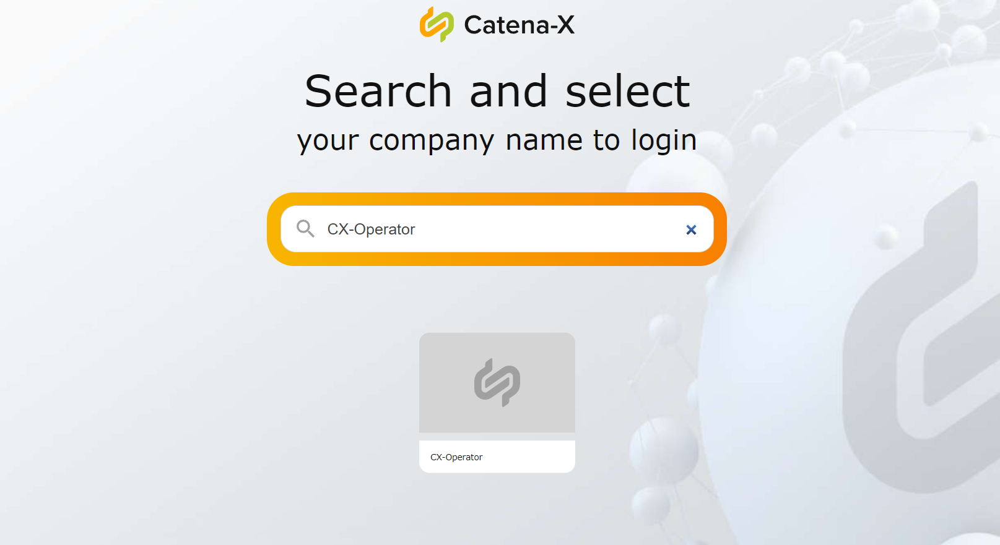
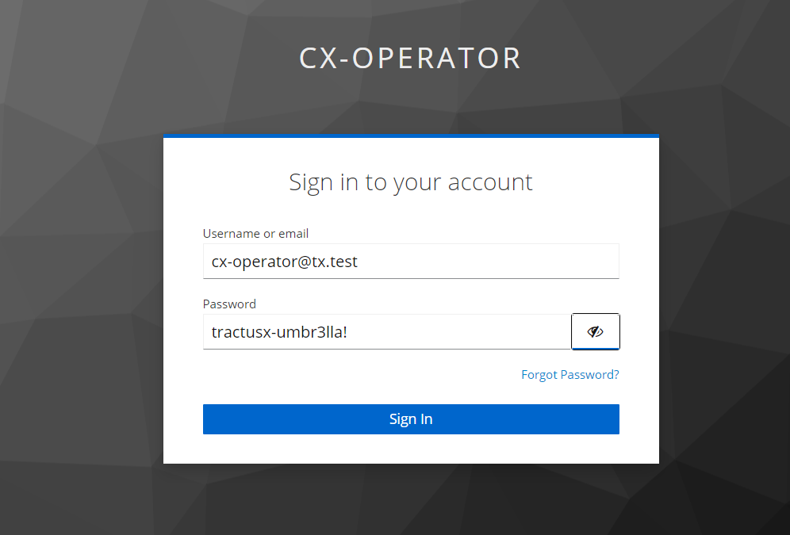

<!-- 
  Tractus-X - Digital Product Passport Application 
 
  Copyright (c) 2022, 2024 BMW AG, Henkel AG & Co. KGaA
  Copyright (c) 2023, 2024 CGI Deutschland B.V. & Co. KG
  Copyright (c) 2022, 2024 Contributors to the Eclipse Foundation

  See the NOTICE file(s) distributed with this work for additional
  information regarding copyright ownership.
 
  This program and the accompanying materials are made available under the
  terms of the Apache License, Version 2.0 which is available at
  https://www.apache.org/licenses/LICENSE-2.0.
 
  Unless required by applicable law or agreed to in writing, software
  distributed under the License is distributed on an "AS IS" BASIS
  WITHOUT WARRANTIES OR CONDITIONS OF ANY KIND,
  either express or implied. See the
  License for the specific language govern in permissions and limitations
  under the License.
 
  SPDX-License-Identifier: Apache-2.0
-->

# DPP Consumption Guide

This guide provides the information needed to setup the Digital product Passport (DPP) application as a data consumer. It describes how to run a local setup to leverage the DPP frontend and backend components using a container platform.

                              DATA CONSUMER  DPP APP                             ___________________
                |     ___________________         __________________    |       |                   | 
                |    |                   |       |                  |   |  -->  |                   |
                |    |   DPP Frontend    | <---> |    DPP Backend   |   |       |   DATA PROVIDER   |
                |    |___________________|       |__________________|   |  <--  |                   |   
                |                                                       |       |___________________|  


        
## Prerequisites

You must have the following tools installed and configured:

- DPP Application with Backend and Frontend components deployed.
- Login credentials to the DPP Frontned component
- Web Browser

## Login in the Frontend Application

Introduce the DPP Application host url in the browser:

```bash

https://<dpp-hostname-url>

```

You will be redirected to:

```bash

https://<dpp-hostname-url>/passport

```

And a login page from Catena-X will pop up. For doing the login follow this steps:

### 1º Introduce Company Name

``` 
CX-Operator
```



### 2º Introduce Test Credentials

```
Username:
cx-operator@tx.test
```
```
Pass:
tractusx-umbr3lla!
```




### 3º Search by ID or Scan an existing QR Code

Change the `<manufacturerPartId>` and `<partInstanceId>` to the actual values in the part specification.

```
CX:<manufacturerPartId>:<partInstanceId>
```


