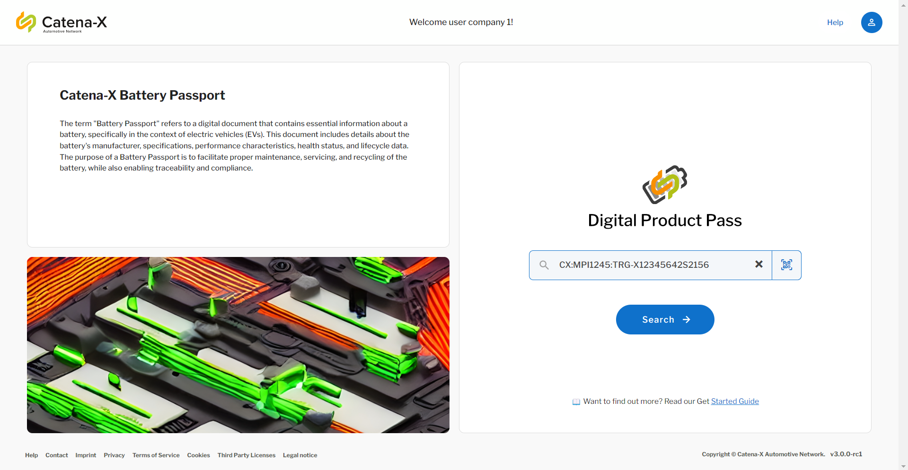
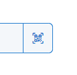
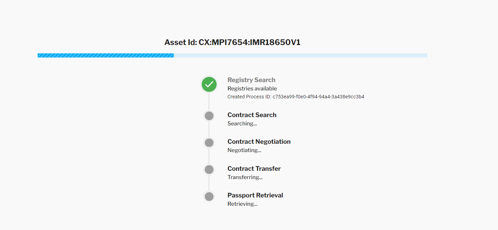
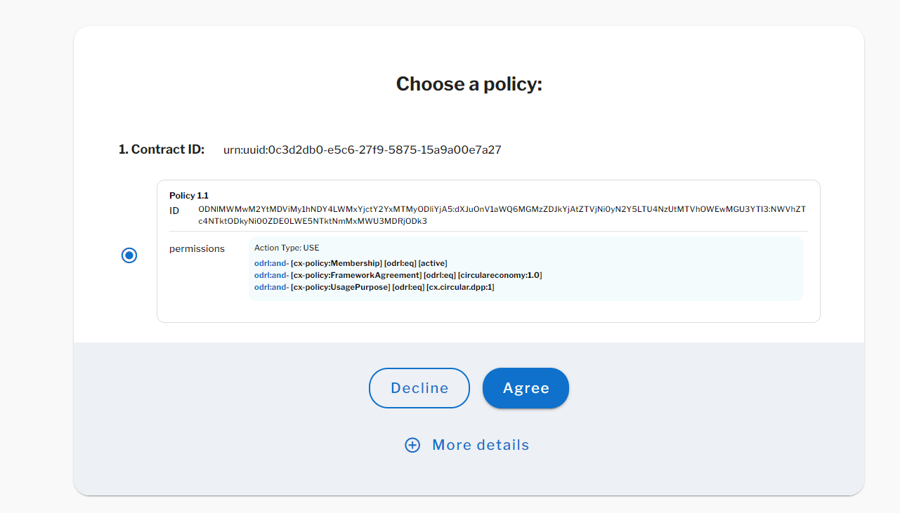
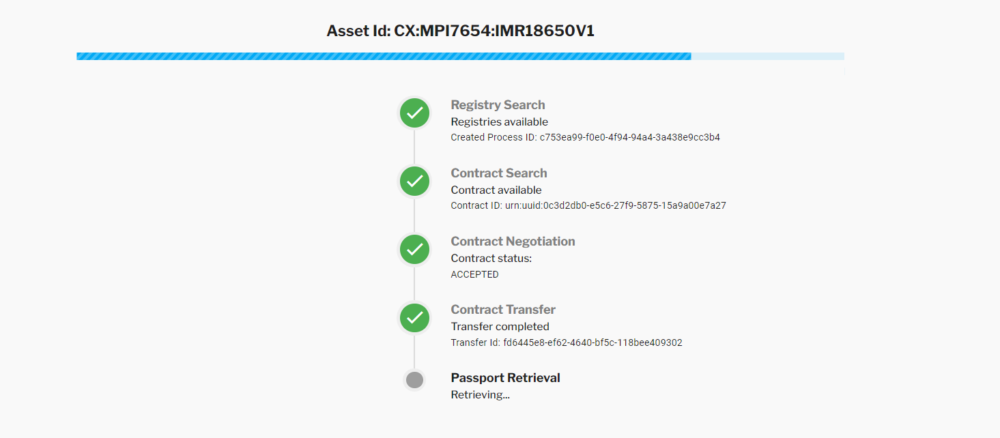
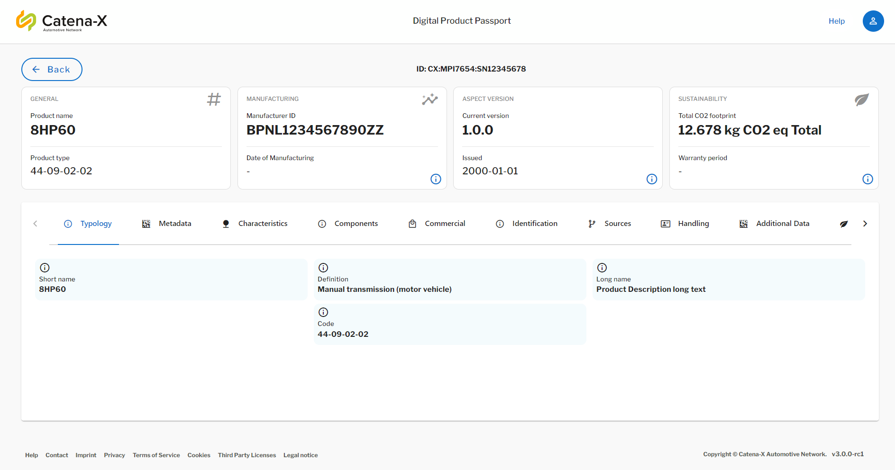
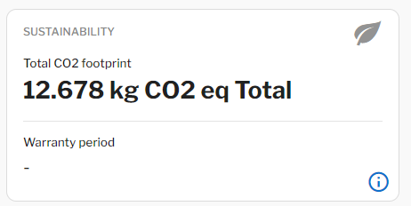
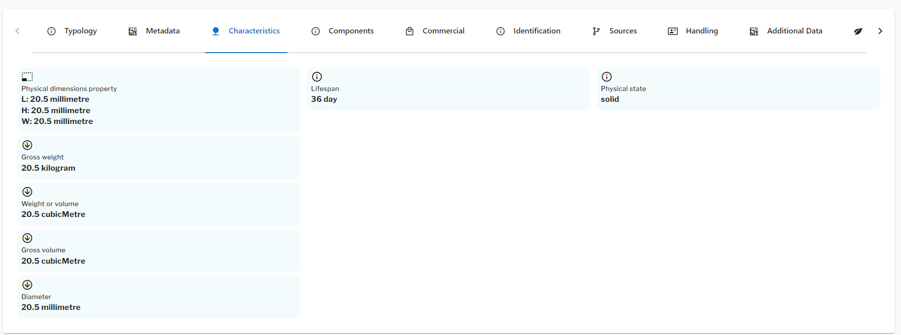

<!-- 
  Tractus-X - Digital Product Passport Application 
 
  Copyright (c) 2022, 2024 BMW AG, Henkel AG & Co. KGaA
  Copyright (c) 2023, 2024 CGI Deutschland B.V. & Co. KG
  Copyright (c) 2022, 2024 Contributors to the Eclipse Foundation

  See the NOTICE file(s) distributed with this work for additional
  information regarding copyright ownership.
 
  This program and the accompanying materials are made available under the
  terms of the Apache License, Version 2.0 which is available at
  https://www.apache.org/licenses/LICENSE-2.0.
 
  Unless required by applicable law or agreed to in writing, software
  distributed under the License is distributed on an "AS IS" BASIS
  WITHOUT WARRANTIES OR CONDITIONS OF ANY KIND,
  either express or implied. See the
  License for the specific language govern in permissions and limitations
  under the License.
 
  SPDX-License-Identifier: Apache-2.0
-->


# DPP Consumption Guide

This guide provides a simple way of accessing the digital product pass consumer application and retrieving data from the network scanning a QR code or introducing an ID.

                              DATA CONSUMER  DPP APP                             ___________________
                |     ___________________         __________________    |       |                   |
                |    |                   |       |                  |   |  -->  |                   |
                |    |   DPP Frontend    | <---> |    DPP Backend   |   |       |   DATA PROVIDER   |
                |    |___________________|       |__________________|   |  <--  |                   |
                |                                                       |       |___________________|

## Prerequisites

You must have the following tools installed and configured:

- DPP Application with Backend and Frontend components deployed.
- Login credentials to the DPP Frontend component
- Web Browser
- Catena-X Central Service Running (Federated IAM, Discovery Finder, BPN Discovery and EDC Discovery)

## Login in the Frontend Application

Introduce the DPP Application host url in the browser:

```bash

https://<dpp-hostname-url>

```

You will be redirected to:

```bash

https://<dpp-hostname-url>/passport

```

And a login page from Catena-X will pop up. To perform the login follow this steps:

### 1º Introduce Company Name

```
CX-Test-Access
```


### 2º Introduce Test Credentials

The credentials will be provided in the workshop


### 3º A Search by ID

Change the `<manufacturerPartId>` and `<partInstanceId>` to the actual values in the part specification.

```
CX:<manufacturerPartId>:<partInstanceId>
```



And click in "SEARCH" to start the search process!

### 3º B Scan an existing QR Code

For scanning the QR code just click in the button with the camera icon:



Give permissions to the camera, and position the window over the QR code frame.


### 5º Wait a few seconds for the policy selection pop-up to appear

When the digital twin registries are being searched in the complete network, the digital product pass will call the following service to find where the digital twin registy with the digital twin data is located:



This steps are done:

- 1º [CX-0053](https://catena-x.net/fileadmin/user_upload/Standard-Bibliothek/Update_Maerz_2024/CX-0053-BPNDiscoveryServiceAPIs-v1.1.0.pdf) Discovery Finder API : [eclipse-tractusx/sldt-discovery-finder](https://github.com/eclipse-tractusx/sldt-discovery-finder)

- 2º [CX-0053](https://catena-x.net/fileadmin/user_upload/Standard-Bibliothek/Update_Maerz_2024/CX-0053-BPNDiscoveryServiceAPIs-v1.1.0.pdf) BPN Discovery API : [eclipse-tractusx/sldt-bpn-discovery](https://github.com/eclipse-tractusx/sldt-bpn-discovery)

- 3º [CX-0001](https://catena-x.net/fileadmin/user_upload/Standard-Bibliothek/Update_September23/CX-0001-EDCDiscoveryAPI_v1.0.2.pdf) EDC Discovery API : [eclipse-tractusx/portal-backend](https://github.com/eclipse-tractusx/portal-backend)

- 4º -> Search for digital twin in the registries found

- 5º -> Retrieve digital twin and find submodel for the digital product pass.

- 6º -> Query with the EDC Consumer the Catalog from the EDC Provider looking for the asset
  - (This information is found in the Digital Twin)

Once the asset policy is found you will get a pop-up similar to this one:



### 6º Agree on the policies

Click on agree to accept the policy you have selected:


> [!IMPORTANT]
> The new Digital Product Pass version (v3.0.0) that will be released in R24.05 allows you to configure the policies in the Backend application.
> There is a [policy configuration guide](https://github.com/eclipse-tractusx/digital-product-pass/blob/main/docs/data-sovereignty/PolicyConfigGuide.md) that can help you understanding this better!

### 7º Wait until contract negotiation is done

In some seconds it should start updating with the latest status of your application.



### 8º Visualize the passport!!!



#### Look for the PCF Information



#### Check characteristics and many more!



Congratulations! Now you are able to access the information regarding digital product passports and many more!

> [!TIP]
> Other models like the Battery Passport and the Transmission Passport are also available to be visualized in the app. You can follow the [CX-0096 Digital Product Pass Triangle Standard](https://catena-x.net/fileadmin/user_upload/Standard-Bibliothek/Update_Maerz_2024/CX-0096-TriangleForDigitalProductPass-v1.1.0.pdf) to configure the other models in the digital twin. For providing data read the [Data Provision Guide](data-provision.md)

## NOTICE

This work is licensed under the [CC-BY-4.0](https://creativecommons.org/licenses/by/4.0/legalcode).

- SPDX-License-Identifier: CC-BY-4.0
- SPDX-FileCopyrightText: 2023, 2024 BMW AG
- SPDX-FileCopyrightText: 2023, 2024 CGI Deutschland B.V. & Co. KG
- SPDX-FileCopyrightText: 2024 Contributors to the Eclipse Foundation
- Source URL: https://github.com/eclipse-tractusx/digital-product-pass
