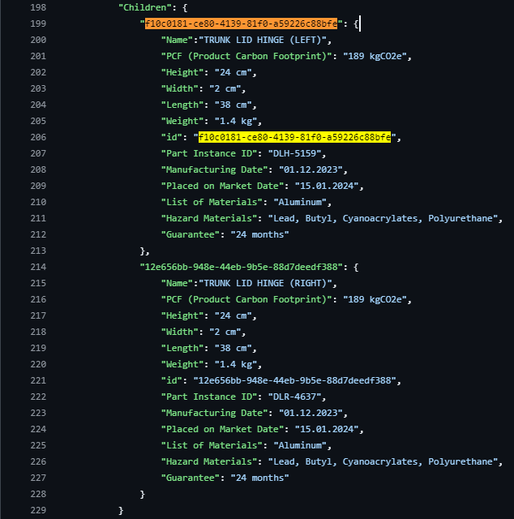

<!--
#######################################################################

Tractus-X - Digital Product Pass Application 

Copyright (c) 2024 BMW AG
Copyright (c) 2024 CGI Deutschland B.V. & Co. KG
Copyright (c) 2024 Contributors to the Eclipse Foundation

See the NOTICE file(s) distributed with this work for additional
information regarding copyright ownership.

This work is made available under the terms of the
Creative Commons Attribution 4.0 International (CC-BY-4.0) license,
which is available at
https://creativecommons.org/licenses/by/4.0/legalcode.

SPDX-License-Identifier: CC-BY-4.0

#######################################################################
-->

# Explorer Path

In this Path, you, as a provider, will create a Digital Product Passport (DPP) for a specific Part of the Arena-X Car. For this purpose, you will use [Insomnia](https://insomnia.rest/), a user-friendly tool for sending and receiving HTTP requests.

> [!Tip]
> if the installation still has to be done, follow this [Get Started Guide](https://docs.insomnia.rest/insomnia/get-started) from Insomnia.

## Pre-Step - Setting Up the Environment

To begin the work in the Explorer Path, you first need to set up the environment. For this tutorial, we will use **Insomnia** as our HTTP communication tool to send and receive data in a visual and user-friendly way. 

To set up the environment follow this steps:

- Open Insomnia
- If necessary: create a new project, click on the **"plus"-button** as shown in the example:

- click on **"Import"**
- choose **"URL"**
- copy the following url
```bash
https://raw.githubusercontent.com/ELebedkin/digital-product-pass/refs/heads/main/dpp-tutorial/resources/explorer_payload/01%20Tractus-X%20Community%20Days.postman_collection.json
```
- paste it into the URL-placeholder box
- click on **"Scan"**
- if done correctly there has to be "Postman Resources to be imported: 5 Requests"
- click on import


Congratulations! You have now imported all the necessary API calls for this tutorial.

---

## Step 1 - Create a Digital Product Passport (DPP) 

In this step, you'll create the Digital Product Passport (DPP) by utilizing data from the Product Carbon Footprint and specifications of a specific car part from the Arena. This guide provides a simple explanation on how to create a digital product pass serialized asepct model payload, by using the digital prodcut pass aspect model template.

> [!Note]  
> For a more technical explanation, refer to: <a href="./aspect-model.md" target="_blank">How to create Aspect Model</a>.

### Aspect Model Creation

Follow this steps to create a new Digital Product Passport serialized model:

---

### Step 1.1: Find test data before generating the model

In the worksession you will receive a paper with the test data, you can find the same information [here](./resources/test-data/carParts.json) in a test JSON file.

To find your part and be able to copy and paste the information:

1 - Search by UUID with `CTRL + F` (or `CMD + F` on Mac):



You will get your information in a paper:

Example:

```json
{
 "f10c0181-ce80-4139-81f0-a59226c88bfe": {
      "Name":"TRUNK LID HINGE (LEFT)",
      "PCF (Product Carbon Footprint)": "189 kgCO2e",
      "Height": "24 cm",
      "Width": "2 cm",
      "Length": "38 cm",
      "Weight": "1.4 kg",
      "id": "f10c0181-ce80-4139-81f0-a59226c88bfe",
      "Part Instance ID": "DLH-5159",
      "Manufacturing Date": "01.12.2023",
      "Placed on Market Date": "15.01.2024",
      "List of Materials": "Aluminum",
      "Hazard Materials": "Lead, Butyl, Cyanoacrylates, Polyurethane",
      "Guarantee": "24 months"
  }
}

```
---
### Step 1.2: Substitute data in the template

In Insomnia, locate the request labeled `Step 2.1.1 Create Aspect Model` and switch to the **Body** tab.

Replace the placeholders in the provided template with the data from your part. For example, to add the Product Carbon Footprint (PCF) value, use the following path:

```text
sustainability.productFootprint.carbon[0].value
```

Example:


---

### Additional: Data Mapping Table

Replace now every placehlders given in the data mapping template with the data from your part. 
Use the following table to identify where to place your part's information in the template:

| Property | Path |
| -------- | ----- |
| Name (Really short) | identification.type.nameAtManufacturer |
| Class/Type of Part | identification.classification.classificationDescription |
| PCF | sustainability.productFootprint.carbon[0].value |
|Height| characteristics.physicalDimension.height.value |
|Width| characteristics.physicalDimension.width.value|
|Length| characteristics.physicalDimension.length.value|
|Weight| characteristics.physicalDimension.grossWeight.value|
|Part Instance Id | identification.serial[0].value |
|Manufacturing Date |operation.manufacturer.manufacturingDate |
| Guarantee | lifespan[0].value (Add value) |
| Guarantee | lifespan[0].unit (Add unit:months) |

Congratulations! You have successfully created your own digital product pass!

> [!TIP]
> You can search for the placeholder `CTRL + F` on Windows or `CMD + F` on MacOS/Linux

> [!Note]
> Delete `""` along with `<width_placeholder>`, `<length_placeholder>`, `<weight_placeholder>`, `<height_placeholder>`, `<guarantee_value>` and `<product_carbon_footprint>`

| Property              | Path                                                | Placeholder                   |
|-----------------------|-----------------------------------------------------|-------------------------------|
| Width                 | characteristics.physicalDimension.width.value       | "<width_placeholder>"         |
| Length                | characteristics.physicalDimension.length.value      | "<length_placeholder>"        |
| Weight                | characteristics.physicalDimension.grossWeight.value | "<weight_placeholder>"        |
| Height                | characteristics.physicalDimension.height.value      | "<height_placeholder>"        |
| Guarantee (Value)     | characteristics.lifespan[0].value                   | "<guarantee_value>"           |
| Guarantee (Unit)      | characteristics.lifespan[0].unit                    | <guarantee_unit>              |
| Name (Really short)   | identification.type.nameAtManufacturer              | <name_placeholder>            |
| Part Instance Id      | identification.serial[0].value                      | <part_instance_id>            |
| Manufacturing Date    | operation.manufacturer.manufacturingDate            | <manufacturing_date>          |
| PCF                   | sustainability.productFootprint.carbon[0].value     | "<product_carbon_footprint>"  |


Congratulations! You have successfully created your own digital product pass aspect model!

---

## Step 2 - Create a Digital Twin integrating the generated DPP as a submodel

In this step, you will create a Digital Twin of your provided Car part and setup Digital Twin provisioning services as a data provider. Additionally, it here you create and register aspect models into the data service. 

The following components are already operational and properly configured.

             ________EDC-Connector________         ________Registry________         ________Data Service________  
            |                             |       |                        |       |                            |
            | Controlplane <-> Dataplane  | <---> |         AAS DTR        | <---> |     A plain JSON Server    |           
            |_____________________________|       |________________________|       |____________________________|

Short Introduction of the components:

- EDC Connector (Data Provider):

A preconfigured EDC Connector, acting as Gateway/Transmitter, is necessary to facilitate secure data exchange within the ecosystem. The connector enables interoperability between different participants, ensuring that the data flow is compliant with industry standards. The EDC Connector is set up and ready to handle requests.

- Digital Twin Registry (DTR):

The Digital Twin Registry is required to manage and store Digital Twins (DT) in the form of Asset Administration Shells (AAS). This component ensures that the Digital Twins are properly registered and accessible for interaction within the ecosystem. The DTR is fully operational and preconfigured to handle incoming Digital Twin data.

- Data Service (DS) (Data Provider):

The Data Service is a crucial component for storing the payloads of Digital Product Passports in plain JSON format. This service should already be running and ready to accept data submissions. It acts as the backend repository where all passport-related information is securely stored and easily retrievable.


> [!Caution]
>  The UUID should be written in the format: 6fb9a71b-aee6-4063-a82e-957022aeaa7a

---

### Step 2.1: Register the Aspect Model


1. In the Insomnia App, locate the request labeled `Step 2.1.1 Create Aspect Model`.
2. Replace `<UUID-1>` with the UUID provided on your datasheet, as shown in the example

Example:

```text
https://data-service.int.catena-x.net/urn:uuid:f10c0181-ce80-4139-81f0-a59226c88bfe
```

3. Send the **POST** request

- If successful, a 200 OK response will appear next to the `Send`-Button, confirming the Aspect Model has been registered in the service.

4. To verify the registration:
- Use the Insomnia request labeled `Step 2.1.2 Verify the Creation`.
- Replace <UUID-1> with your actual UUID from the datasheet.
- Send the request. A 200 OK response confirms that the data has been registered successfully.

---

### Step 2.2 

Now we actually will create the digitil Twin.

1. Open the Insomnia request labeled `Step 2.2.1 Create Digital Twin"`.

> [!Note]
> This request uses the template provided in [resources/digital-twins/example-dt.json](./resources/digital-twins/example-dt.json).

2. Switch to the Body tab and replace the following placeholders:

```bash
<PART_INSTANCE_ID>                     ->  the value of part instance written on datasheet
<PART_NAME>                            ->   the part number is written on the datasheet from a part
<UUID-1>                               ->   the UUID written on datasheet
```

3. Generate a new UUID:

- Visit [this UUID Generator](https://www.uuidgenerator.net/version4) to generate an additional UIID
- Replace `<UUID-2>` with this new UUID

> [!Important]
> There are **two instances** of `UUID-2` in the example. Please replace **both** of them:
> - One is used as `"id"`
> - The other is used as `"href"`

4. Send the POST request to add the Digital Twin to the Digital Twin Registry (DTR).
- A successful request will return a `200 OK` response.

> [!Note]  
> Every physical part of vehicle is represented by a Digital Twin object. A car is manufactured with plenty of digital twins.

---

### Step 2.2.2: Verify the Digital Twin Registration

1. Use the Insomnia request labeled `"Step 2.2.2 Verify the Creation"`.
2. Replace `<DIGITAL_TWIN_ID_BASE64_ENCODED>` `with` the Base64-encoded version of the Digital Twin ID.
- You can encode your Digital Twin ID using this [Base64 Encoder](https://www.base64encode.org/).

Example:

```bash
Digital Twin Id (UUID): 3f89d0d4-e11c-f83b-16fd-733c63d4e121
Base64 Encoded: dXJuOnV1aWQ6M2Y4OWQwZDQtZTExYy1mODNiLTE2ZmQtNzMzYzYzZDRlMTIx
```

3. Replace <UUID-1_BASE64_ENCODED> in the following URL:

```bash
https://dpp-registry.int.catena-x.net/semantics/registry/api/v3/shell-descriptors/<UUID-1_BASE64_ENCODED>
```

4. Send the request. A `200 OK` response confirms that the Digital Twin has been successfully registered.

---

### Step 2.3

If you encounter an error or need to update the Digital Twin, you can use the Insomnia request labeled `Step 2.3 Modify Digital Twin` to make changes.

> [!Note]  
> Copy the **Body** from `Step 2.2.1 Create Digitale Twin` into the new **Body** in `Step 2.3 Modify Digital Twin` and afterwards modify data/attributes.
> Copy also the `<DIGITAL_TWIN_ID_BASE64_ENCODED>` and paste it into the URL:

```bash
https://dpp-registry.int.catena-x.net/semantics/registry/api/v3/shell-descriptors/<DIGITAL_TWIN_ID_BASE64_ENCODED>
```

If everything works fine, then you have reached the end Explorer Path.

Congratulations, you have successfully setup the data provider. It is now available and ready to exchange data in the dataspace.

You can now process further with the original DPP-Tutorial at Step 3 - Generate the QR-Code. Click [here](https://github.com/eclipse-tractusx/digital-product-pass/blob/main/dpp-tutorial/README.md#step-3---generate-the-qr-code) to aaccess the next steps.


## NOTICE

This work is licensed under the [CC-BY-4.0](https://creativecommons.org/licenses/by/4.0/legalcode).

- SPDX-License-Identifier: CC-BY-4.0
- SPDX-FileCopyrightText: 2024 BMW AG
- SPDX-FileCopyrightText: 2024 CGI Deutschland B.V. & Co. KG
- SPDX-FileCopyrightText: 2024 Contributors to the Eclipse Foundation
- Source URL: https://github.com/eclipse-tractusx/digital-product-pass

