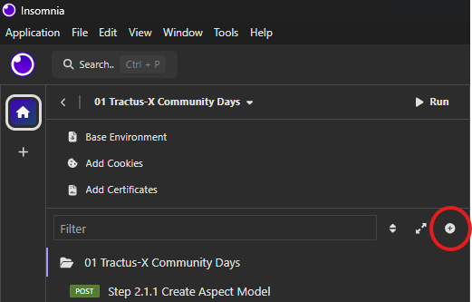
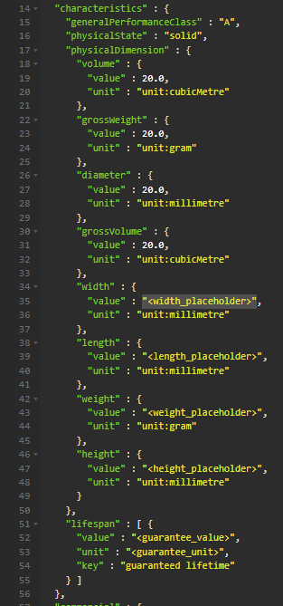

<!--
#######################################################################

Tractus-X - Digital Product Pass Application 

Copyright (c) 2024 BMW AG
Copyright (c) 2024 CGI Deutschland B.V. & Co. KG
Copyright (c) 2024 Contributors to the Eclipse Foundation

See the NOTICE file(s) distributed with this work for additional
information regarding copyright ownership.

This work is made available under the terms of the
Creative Commons Attribution 4.0 International (CC-BY-4.0) license,
which is available at
https://creativecommons.org/licenses/by/4.0/legalcode.

SPDX-License-Identifier: CC-BY-4.0

#######################################################################
-->

# Explorer Path

In this Path, you, as a provider, will create a Digital Product Passport (DPP) for a specific Part of the Arena-X Car. For this purpose, you will use <a href="https://insomnia.rest/" target="_blank">Insomnia</a>, a user-friendly tool for sending and receiving HTTP requests.

> [!TIP]
> If the installation still has to be done, follow this <a href="https://docs.insomnia.rest/insomnia/get-started" target="_blank" rel="noopener noreferrer">Get Started Guide</a> from Insomnia.

## Pre-Step - Setting Up the Environment

To begin the work in the Explorer Path, you first need to set up the environment. For this tutorial, we will use **Insomnia** as our HTTP communication tool to send and receive data in a visual and user-friendly way. 

To set up the environment follow this steps:

- Open Insomnia
- If necessary: create a new project, click on the **"plus"-button** as shown in the example:

- click on **"Import"**
- choose **"URL"**
- copy the following url
```bash
https://raw.githubusercontent.com/eclipse-tractusx/digital-product-pass/refs/heads/main/dpp-tutorial/resources/explorer_payload/01%20Tractus-X%20Community%20Days.postman_collection.json
```
- paste it into the URL-placeholder box
- click on **"Scan"**
- if done correctly there has to be "Postman Resources to be imported: 5 Requests"
- click on import


Congratulations! You have now imported all the necessary API calls for this tutorial.

---

## Step 1 - Create a Digital Product Passport (DPP) Instance Aspect Model 

In this step, you'll create the Digital Product Passport (DPP) by utilizing data from the Product Carbon Footprint and specifications of a specific car part from the Arena. This guide provides a simple explanation on how to create a digital product pass serialized aspect model payload, by using the digital product pass aspect model template.

### Aspect Model Creation

Now, you replace the data from your sheet into the Aspect Model template. This step is crucial because it ensures that your specific car part is properly registered and exists as an Aspect Model in the system.

In a real production environment, this process would typically be automated by your systems. However, for this tutorial, you are manually mapping the data to understand how the correct information about your part will later be linked to the Digital Product Passport (DPP).

By completing this step, you ensure that the part data is accurate and ready to be associated with the DPP, which is vital for traceability and the integrity of the overall process..

You will get your information in a paper:

Example:

```json
{
 "f10c0181-ce80-4139-81f0-a59226c88bfe": {
      "Name":"TRUNK LID HINGE (LEFT)",
      "PCF (Product Carbon Footprint)": "189 kgCO2e",
      "Height": "24 cm",
      "Width": "2 cm",
      "Length": "38 cm",
      "Weight": "1.4 kg",
      "id": "f10c0181-ce80-4139-81f0-a59226c88bfe",
      "Part Instance ID": "DLH-5159",
      "Manufacturing Date": "01.12.2023",
      "Placed on Market Date": "15.01.2024",
      "List of Materials": "Aluminum",
      "Hazard Materials": "Lead, Butyl, Cyanoacrylates, Polyurethane",
      "Guarantee": "24 months"
  }
}

```

> [!NOTE]
> To easily find your data digitally, refer to <a href="./resources/test-data/carParts.json" target="_blank" rel="noopener noreferrer">this JSON file</a>, which contains all elements.
> You can search for your car part (identified by `ID (uuid)` on the sheet) using
> - with `CTRL + F` on Windows or `CMD + F` on MacOS/Linux 

In Insomnia, locate the request labeled `Step 2.1.1 Create Aspect Model` and switch to the **Body** tab.

Replace the placeholders in the provided template with the data from your part. For example, to add the Product Carbon Footprint (PCF) value, use the following path:

```text
characteristics.physicalDimension.width.value  
```

or you can search (`CTRL + F` or `CMD + F`) for the placeholder `<width_placeholder>`

Example:



---

### Data Mapping Table

Replace now every placehlders given in the data mapping template with the data from your part. 
Use the following table to identify where to place your part's information in the template:

> [!TIP]
> You can search for the placeholder `CTRL + F` on Windows or `CMD + F` on MacOS/Linux

> [!NOTE]
> Delete `""` along with `<width_placeholder>`, `<length_placeholder>`, `<weight_placeholder>`, `<height_placeholder>`, `<guarantee_value>` and `<product_carbon_footprint>`

| Property              | Path                                                | Placeholder                   |
|-----------------------|-----------------------------------------------------|-------------------------------|
| Width                 | characteristics.physicalDimension.width.value       | "<width_placeholder>"         |
| Length                | characteristics.physicalDimension.length.value      | "<length_placeholder>"        |
| Weight                | characteristics.physicalDimension.grossWeight.value | "<weight_placeholder>"        |
| Height                | characteristics.physicalDimension.height.value      | "<height_placeholder>"        |
| Guarantee (Value)     | characteristics.lifespan[0].value                   | "<guarantee_value>"           |
| Guarantee (Unit)      | characteristics.lifespan[0].unit                    | <guarantee_unit>              |
| Name (Really short)   | identification.type.nameAtManufacturer              | <name_placeholder>            |
| Part Instance Id      | identification.serial[0].value                      | <part_instance_id>            |
| Manufacturing Date    | operation.manufacturer.manufacturingDate            | <manufacturing_date>          |
| PCF                   | sustainability.productFootprint.carbon[0].value     | "<product_carbon_footprint>"  |


Congratulations! You have successfully created your own digital product pass aspect model!

---

## Step 2 - Create a Digital Twin integrating the generated DPP model as a submodel

In this step, you will create a Digital Twin of your provided Car part and setup Digital Twin provisioning services as a data provider. Additionally, it here you create and register aspect models into the data service. 

The following components are already operational and properly configured.

             ________EDC-Connector________         ________Registry________         ________Data Service________  
            |                             |       |                        |       |                            |
            | Controlplane <-> Dataplane  | <---> |         AAS DTR        | <---> |     A plain JSON Server    |           
            |_____________________________|       |________________________|       |____________________________|

Short Introduction of the components:

- EDC Connector (Data Provider):

A preconfigured EDC Connector, acting as Gateway/Transmitter, is necessary to facilitate secure data exchange within the ecosystem. The connector enables interoperability between different participants, ensuring that the data flow is compliant with industry standards. The EDC Connector is set up and ready to handle requests.

- Digital Twin Registry (DTR):

The Digital Twin Registry is required to manage and store Digital Twins (DT) in the form of Asset Administration Shells (AAS). This component ensures that the Digital Twins are properly registered and accessible for interaction within the ecosystem. The DTR is fully operational and preconfigured to handle incoming Digital Twin data.

- Data Service (DS) (Data Provider):

The Data Service is a crucial component for storing the payloads of Digital Product Passports in plain JSON format. This service should already be running and ready to accept data submissions. It acts as the backend repository where all passport-related information is securely stored and easily retrievable.

---

### Step 2.1: Register the Aspect Model

1. First of all generate a new UUID:
- Visit  <a href="https://www.uuidgenerator.net/version4" target="_blank" rel="noopener noreferrer">this UUID Generator</a> to generate an additional UIID
- This newly generated UUID will serve as the `digitalTwinSubmodelId`, which plays a crucial role in linking the Aspect Model to the Digital Product Passport (DPP) and will be important in later steps.
2. In the Insomnia App, locate the request labeled `Step 2.1.1 Create Aspect Model`.
3. Replace in the URL of the request the parameter `<digitalTwinSubmodelId>` with the new generated UUID, as shown in the example:

Example:

```text
<DATA_SERVICE_URL>/urn:uuid:f10c0181-ce80-4139-81f0-a59226c88bfe
```

4. Replace `<DATA_SERVICE_URL>` with the data service url provided

5. Send the **POST** request

- If successful, a 200 OK response will appear next to the `Send`-button, confirming the Aspect Model has been registered into the submodel data service with the correct reference to the DPP.

6. To verify the registration:
- Use the Insomnia request labeled `Step 2.1.2 Verify the Creation`.
- Replace <digitalTwinSubmodelId> with the generated UUID. 
- Send the request. A 200 OK response confirms that the data has been registered successfully.
- Optionally: Cross-check that the modified data in the response body matches the data you manipulated earlier.

---

### Step 2.2 

Now we actually will create the digital Twin.

1. Open the Insomnia request labeled `Step 2.2.1 Create Digital Twin"`.

2. Replace `<DIGITAL_TWIN_REGISTRY_URL>` with the data service url provided

3. Switch to the Body tab and replace the following placeholders:

```bash
<PART_INSTANCE_ID>                     ->   the value of part instance written on datasheet
<PART_NAME>                            ->   the part number is written on the datasheet from a part
<digitalTwinId>                        ->   the UUID written on datasheet
<digitalTwinSubmodelId>                ->   the UUID generated in the previous step
```


> [!IMPORTANT]
> There are **two instances** of `digitalTwinSubmodelId` in the example. Please replace **both** of them:
> - One is used as `"id"`
> - The other is used as `"href"`

> [!IMPORTANT]
> There are **two instances** of `digitalTwinId` in the example. Please replace **both** of them:
> - One is used as `"id"`
> - The other is used as `"globalAssetId"`

4. Send the POST request to add the Digital Twin to the Digital Twin Registry (DTR).
- A successful request will return a `201 Created` response, which confirms that the Digital Twin has been created successfully.

> [!NOTE]  
> Every physical part of vehicle is represented by a Digital Twin object. A car is manufactured with plenty of digital twins.

---

### Step 2.2.2: Verify the Digital Twin Registration

1. Use the Insomnia request labeled `"Step 2.2.2 Verify the Creation"`.
2. Replace `<DIGITAL_TWIN_ID_BASE64_ENCODED>` `with` the Base64-encoded version of the `digitalTwinId`.
- You can encode your `digitalTwinId` using this <a href="https://www.base64encode.org/Base64" target="_blank" rel="noopener noreferrer"> Encoder</a>

Example:

```bash
digitalTwinId (UUID): 3f89d0d4-e11c-f83b-16fd-733c63d4e121
Base64 Encoded: dXJuOnV1aWQ6M2Y4OWQwZDQtZTExYy1mODNiLTE2ZmQtNzMzYzYzZDRlMTIx
```

3. Replace `<DIGITAL_TWIN_REGISTRY_URL>` and `<UUID-1_BASE64_ENCODED>` in the following URL:

```bash
<DIGITAL_TWIN_REGISTRY_URL>/shell-descriptors/<DIGITAL_TWIN_ID_BASE64_ENCODED>
```

4. Send the request. A `200 OK` response confirms that the Digital Twin has been successfully registered.

---

### Step 2.3 Optional: 

If you encounter an error or need to update the Digital Twin, you can use the Insomnia request labeled `Step 2.3 Modify Digital Twin` to make changes.

> [!NOTE]  
> Copy the **Body** from `Step 2.2.1 Create Digitale Twin` into the new **Body** in `Step 2.3 Modify Digital Twin` and afterwards modify data/attributes.
> Copy also the `<DIGITAL_TWIN_ID_BASE64_ENCODED>` and paste it into the URL:

```bash
<DIGITAL_TWIN_REGISTRY_URL>/shell-descriptors/<DIGITAL_TWIN_ID_BASE64_ENCODED>
```

If everything works fine, then you have reached the end of the Explorer Path.

Congratulations, you have successfully setup the data provider. It is now available and ready to exchange data in the dataspace.

You can now process further with the original DPP-Tutorial at Step 3 - Generate the QR-Code. Click <a href= "/dpp-tutorial/README.md#step-3---generate-the-qr-code" target="_blank" rel="noopener noreferrer">here</a> to access the next steps.


## NOTICE

This work is licensed under the [CC-BY-4.0](https://creativecommons.org/licenses/by/4.0/legalcode).

- SPDX-License-Identifier: CC-BY-4.0
- SPDX-FileCopyrightText: 2024 BMW AG
- SPDX-FileCopyrightText: 2024 CGI Deutschland B.V. & Co. KG
- SPDX-FileCopyrightText: 2024 Contributors to the Eclipse Foundation
- Source URL: https://github.com/eclipse-tractusx/digital-product-pass

