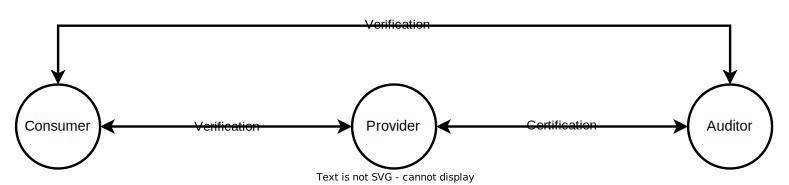
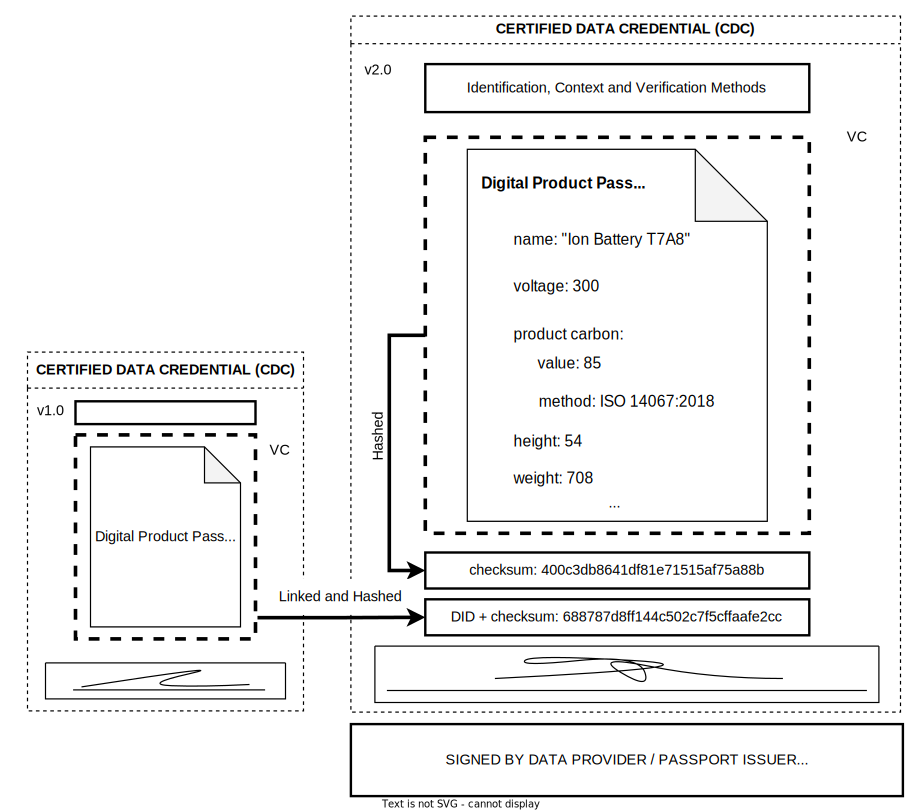
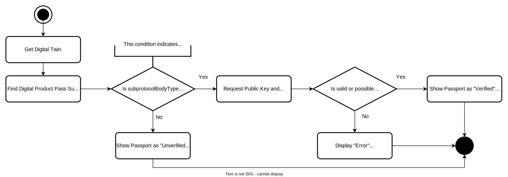
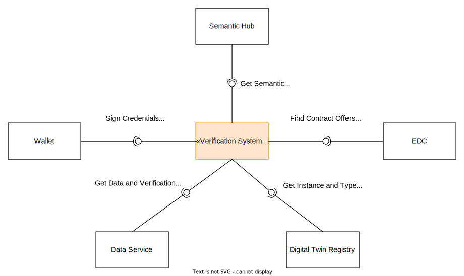
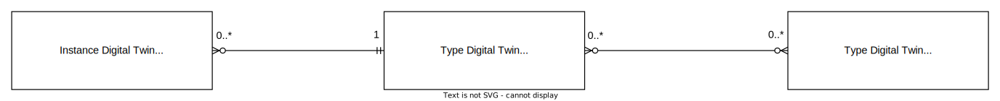
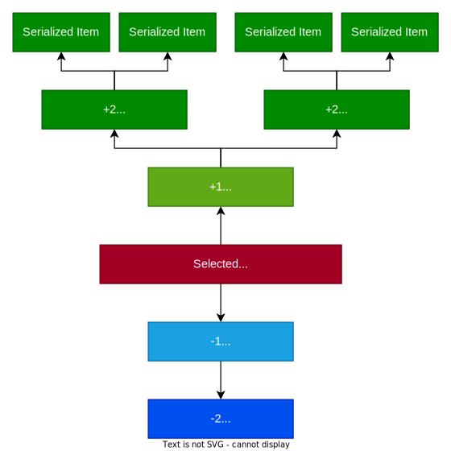

<!--
#######################################################################

Tractus-X - Digital Product Pass Verification Add-on

Copyright (c) 2023, 2024 BMW AG
Copyright (c) 2023, 2024 CGI Deutschland B.V. & Co. KG
Copyright (c) 2024 Contributors to the Eclipse Foundation

See the NOTICE file(s) distributed with this work for additional
information regarding copyright ownership.

This work is made available under the terms of the
Creative Commons Attribution 4.0 International (CC-BY-4.0) license,
which is available at
https://creativecommons.org/licenses/by/4.0/legalcode.

SPDX-License-Identifier: CC-BY-4.0

#######################################################################
-->


<div align="center">
  
  <br><br>
  
  
  <h3> A Catena-X Data Verification Framework </h3>
  <h1> Digital Product Pass Verification Add-on </h1>
  
</div>

# Metadata

|                      | Date              | Authors & Reviewers                                   |
| -------------------- | ----------------- | ----------------------------------------------------- |
| **Created**          | December 29, 2023 | [Mathias Brunkow Moser](https://github.com/matbmoser) |
| **Lastest Revision** | July 09, 2024      | [Mathias Brunkow Moser](https://github.com/matbmoser) |

## Authors


| Name                  | Company | GitHub                                     | Role                                    |
| --------------------- | ------- | ------------------------------------------ | --------------------------------------- |
| Mathias Brunkow Moser | CGI     | [@matbmoser](https://github.com/matbmoser) | Digital Product Pass Software Architect |
|                       |         |                                            |                                         |
|                       |         |                                            |                                         |

## Tags

> [!NOTE]
> #Cybersecurity #DataVerification #DataCertification #Catena-X #DigitalProductPassVerification #DPP #SignedDocuments #DataCredentials # Framework
> #DigitalProductPass #VerifiableCredentials #Wallets #DecentralIdentities #SSI #ProductDataExchangeTrust #Verification #Innovation #Ed25519 #JWS #Web3.0

## Knowledge Prerequisites

This concept contains detailed technical content and uses Catena-X vocabulary. More information about the technical abbreviations is available at the [Glossary](#glossary).
For a better understanding of this documentation, it is recommended to read and inform yourself about the following topics:

- [Learn the Catena-X Network & Basic Principles](https://catena-x.net/en/about-us)
- [Learn the W3C Basic DID Principles](https://www.w3.org/TR/did-core/)
- [Learn the W3C Verifiable Credential Basics](https://www.w3.org/TR/vc-data-model-2.0/)
- [Learn the Tractus-X Context](https://github.com/eclipse-tractusx)
- [Learn the EcoPass KIT or Digital Product Pass Context](https://eclipse-tractusx.github.io/docs-kits/kits/Eco_Pass_KIT/page-adoption-view)

This documentation of interest can be useful during the reading and understanding of this Catena-X Data Verification/Certification Concept.

# Introduction

When talking about increasing trust in data ecosystems there are multiple possible ways to be followed. Contractual and Policy solutions can be taken into consideration to ensure data sovereignty based on analog framework agreement contracts. Blockchain solutions can be implemented to assure that transactions and ownership is mathematically proofed, creating an assertive level of trust in the complete chain. Artificial Intelligence can be used as a neutral party for doing moderation and certification of data of partners and member of the network. However, if you want to maintain your data and identify under your control assuring data sovereignty and keeping it decentralized the best option to choose are Decentralized Identities from the W3C.

Decentralized Identities are already used in the Catena-X Network to digitally identify parties and authorizations across all data exchanges done through an EDC from a peer to peer perspective. This technology is implemented in the current SSI concept used in the network and has been proofed to work and also to be successful when bringing trust to all the data exchanges done which take place in the network.

The data exchanged during the peer to peer connections between EDCs can have different formats, shapes and content. It varies from use case to use case and its up to the owner of the data to choose which data will be provided to who and which one not. However once this data is exchanged there is no assertive way to determine if the data provided is really true or false. Framework agreements cover the legal part of the transaction and participation in the use cases however do not cover the specific product information assertion and confirmation of veracity.

Product Information Certification is the way to go when it comes to creating trust over complete or partial data provided in peer to peer connections between two partners in a network. Once the consumer is allowed to visualize the data he can verify if it was certified by its data issuer or by an external auditor party. This is relevant when we start to talk about bringing the Catena-X Automotive Network to a productive environment, specially where human lives are at stake and mistakes can cause huge monetary and image losses.

This Digital Product Pass Verification and Certification concept aims to create an assertive second layer of trust over the actual peer to peer data exchanges of Product Information. Basing itself in the SSI technology already in place in Catena-X, this concept sets the first steps for data verification statements creation starting with the CX Generic Digital Product Pass Aspect Model. Giving the data providers the possibility of creating self-signed documents confirming the information placed into the aspect models and gives data auditors the possibility to certify one or more specific attributes from Aspect Model documents that are relevant to the data provider business cases. It allows the data consumer to base its processes and decisions based on actual production data which has been assertive verified by external auditors, giving safety that not just the data issuer by also a third party has certified that specific data is true or compliant to standards.

The technology concept consists of creating Signed Documents (Verification Statements) using the Verifiable Credentials 2.0 Technology. Which is in resume a JSON-LD structure standardized by the W3C Consortium for Web 3.0 for data trust and identity assurance. Using JSON Web Signatures (JWS) and a wallet component which is connected to Catena-X and identified by the unique company Business Partner Number (BPN), the data issuer and auditor can sign using their Ed25519 private key and the data consumer can access their public key by resolving the DID contained in the signature proof at the certified document credential. The certified data will be stored in the Data Provider infrastructure sub-model server, in order to assure the data sovereignty. Data consumer can access this data if they are allowed by the data provider simply by looking for the Digital Twin from the specific asset type or instance depending on the specific use case. This data will be retrieved using the EDC connector proxy which is protected by Policies and require data consumers to sign "odrl" contracts to maintain data sovereignty.

In this way decentralize data exchange trust is assertive assured. Making possible and easing the transition from the Catena-X network product data exchange from Pre-Production to Production environments. Enabling better decision taking, saving possible human lives, boosting the circular economy use case, creating justification as form of digital proof for possible framework contracts trust breaks or frauds, assuring product quality and increasing employee safety when hazard materials/products are handled.

This concept has been proved to be of high interest from the Certification and Verification roles in the Catena-X Community, generating value for multiple use cases and bringing the Catena-X Network Data Exchange Trust Level to a totally new level. Enabling the different network parties to exchange data with electronic proof of an external party certification revision, reducing the risk of failure and error. Allowing data consumers to comfortably invest and deposit their trust in bring their data into a Catena-X Network Production Data Ecosystem Environment.

## Table of Contents

- [Metadata](#metadata)
  - [Authors](#authors)
  - [Tags](#tags)
  - [Knowledge Prerequisites](#knowledge-prerequisites)
- [Introduction](#introduction)
  - [Table of Contents](#table-of-contents)
- [Scope](#scope)
  - [Context Diagram](#context-diagram)
  - [Value Proposition Motivators](#value-proposition-motivators)
  - [Objectives](#objectives)
  - [Use Cases](#use-cases)
- [Previous Investigation](#previous-investigation)
- [Assumptions](#assumptions)
- [Processes Terminology](#processes-terminology)
  - [Abstract Interaction (Business Interaction)](#abstract-interaction-business-interaction)
  - [Roles/Actors](#rolesactors)
- [Creating Trust and Risk Mitigation Assets](#creating-trust-and-risk-mitigation-assets)
  - [Verifiable Credential Documents](#verifiable-credential-documents)
    - [What is a Verifiable Credential?](#what-is-a-verifiable-credential)
    - [Credential Schema](#credential-schema)
- [Verification Statements](#verification-statements)
  - [Abstract Types](#abstract-types)
  - [Verification Statements Documents/Credentials](#verification-statements-documentscredentials)
  - [Document Exchange Details](#document-exchange-details)
- [Certification Processes](#certification-processes)
  - [Attribute Certification Process](#attribute-certification-process)
  - [Self-Testify Certification Process](#self-testify-certification-process)
  - [Total Certification Process](#total-certification-process)
- [Certification and Verification Methods](#certification-and-verification-methods)
  - [Certified Snapshot Credential Certification](#certified-snapshot-credential-certification)
  - [Certified Data Credential Certification](#certified-data-credential-certification)
  - [Complete Data Certification](#complete-data-certification)
- [Verification Processes](#verification-processes)
  - [Certified Data Credential Verification](#certified-data-credential-verification)
  - [Certified Snapshot Credential Verification](#certified-snapshot-credential-verification)
  - [Flow Diagrams](#flow-diagrams)
    - [CDC Technical Verification Flow](#cdc-technical-verification-flow)
    - [CSC Technical Verification Flow](#csc-technical-verification-flow)
- [Technical Specification](#technical-specification)
  - [Certification Aspects Specification](#certification-aspects-specification)
    - [Verifiable Credential Required Fields](#verifiable-credential-required-fields)
      - [Issuer Structure](#issuer-structure)
    - [Context Definition](#context-definition)
    - [Cryptography Signatures \& Keys in Self-Descriptions](#cryptography-signatures--keys-in-self-descriptions)
      - [Signature Header](#signature-header)
      - [Signature Payload](#signature-payload)
      - [Signature Generation](#signature-generation)
      - [Signature Verification](#signature-verification)
    - [Certified Data Credential Schema](#certified-data-credential-schema)
    - [CDC Semantic](#cdc-semantic)
      - [CDC SemanticId](#cdc-semanticid)
    - [CDC Reference to Parent](#cdc-reference-to-parent)
    - [CDC JSON-LD Context Schema](#cdc-json-ld-context-schema)
    - [Wrapped Aspect Model](#wrapped-aspect-model)
    - [CDC Credential Types Definition](#cdc-credential-types-definition)
    - [CDC Example](#cdc-example)
  - [Certified Snapshot Credential Schema](#certified-snapshot-credential-schema)
    - [CSC Semantic](#csc-semantic)
      - [CSC SemanticId](#csc-semanticid)
    - [CSC Reference to Origin](#csc-reference-to-origin)
    - [CSC JSON-LD Context Schema](#csc-json-ld-context-schema)
    - [Attribute List Description](#attribute-list-description)
      - [Validation Method Description](#validation-method-description)
      - [Validation Method Types](#validation-method-types)
    - [CSC Credential Types Definition](#csc-credential-types-definition)
    - [CSC Example](#csc-example)
  - [Attribute Certification Record Schema](#attribute-certification-record-schema)
    - [ACR Credential Fields Definition](#acr-credential-fields-definition)
    - [ACR JSON-LD Context Schema](#acr-json-ld-context-schema)
    - [ACR Semantic](#acr-semantic)
      - [ACR SemanticId](#acr-semanticid)
    - [ACR CSC Verifiable Credentials List](#acr-csc-verifiable-credentials-list)
    - [ACR Submodel Reference](#acr-submodel-reference)
    - [ACR Example](#acr-example)
- [Technical Integration Design](#technical-integration-design)
  - [Interfaces](#interfaces)
  - [Self-Testify Data Certification and Verification Implementation](#self-testify-data-certification-and-verification-implementation)
    - [Simple Wallet](#simple-wallet)
  - [Attribute Certification Blueprint](#attribute-certification-blueprint)
    - [Attribute Certification Components](#attribute-certification-components)
      - [Attribute Certification Registry](#attribute-certification-registry)
      - [Attribute Certification System](#attribute-certification-system)
    - [Attribute Certification Journey](#attribute-certification-journey)
  - [Digital Twin Configuration](#digital-twin-configuration)
    - [Certified Data Credential Submodel](#certified-data-credential-submodel)
    - [CDC Semantic ID Keys](#cdc-semantic-id-keys)
    - [CDC ID Short](#cdc-id-short)
    - [CDC Submodel Example](#cdc-submodel-example)
    - [Attribute Certification Record Submodel](#attribute-certification-record-submodel)
    - [AMR Semantic ID Keys](#amr-semantic-id-keys)
    - [AMR ID Short](#amr-id-short)
    - [AMR Submodel Example](#amr-submodel-example)
  - [Certification Sequence Diagrams](#certification-sequence-diagrams)
    - [CSC Certification Sequence Diagram](#csc-certification-sequence-diagram)
    - [CDC + CSC Certification Sequence Diagram](#cdc--csc-certification-sequence-diagram)
  - [Verification Sequence Diagrams](#verification-sequence-diagrams)
    - [CSC Verification Sequence Diagram](#csc-verification-sequence-diagram)
    - [CDC + CSC Verification Sequence Diagram](#cdc--csc-verification-sequence-diagram)
- [Additional Information](#additional-information)
  - [Linking Digital Twins in Type Level](#linking-digital-twins-in-type-level)
    - [Cardinality](#cardinality)
    - [Instance to Type Level and Vice Versa](#instance-to-type-level-and-vice-versa)
    - [Type Level to Type Level](#type-level-to-type-level)
- [References](#references)
- [Special Thanks](#special-thanks)
- [Glossary](#glossary)
  - [NOTICE](#notice)
  - [AUTHORS](#authors-1)

# Scope

The Digital Product Pass Verification Add-on aims to create a second layer of trust over the EDC data exchanges between consumers and data providers.
It enables auditors to verify specific attributes or complete aspect models for data providers and allowing consumers to retrieve and verify the "validity" of the verification done.
Using a simple wallet, a Data Provider is able to certify its attributes or the complete semantic models from Catena-X and include it in a Verifiable Credential,
which can then be verified on the Data Consumer side.

## Context Diagram


In this context diagram we can see how a provider generates a `@context` for its verifiable credential and then issues it using the `simple wallet` component, then he registers its data in the standardized Catena-X infrastructure (Digital Twin Registry + Data Service) so that it can be retrieved by data consumers or auditors.

The auditor is responsible for retrieving data from the data provider and "certifying" specific attributes from the data provider credential or JSON payload. In this way when the data is retrieved from the data provider the signature contained in the Verifiable Credential can be verified by the data consumer.

The data consumer retrieves the data (Aspect Model Payload Verifiable Credential) from the data provider using the EDC proxy, then the data consumer will "verify" in his own wallet the "proof" contained in the credential, resolving the `DID Web` and checking the integrity of the content in the signature.

## Value Proposition Motivators

When talking about certification and verification of data there are a series of motivators that create value for data exchanges done in a production environment.

|     | Motivator             | Description                                                                                                             |
| --- | --------------------- | ----------------------------------------------------------------------------------------------------------------------- |
| 1   | Trustworthiness       | Important for **Accurate Decision Taking** and **Money Loss Avoidance**                                                 |
| 2   | Quality Assurance     | Proof the quality of the products and be able to **audit product quality standards**                                    |
| 3   | Regulatory Compliance | For regulatory reasons in some specific products a **rigorous verification process is mandatory to protect consumers.** |

## Objectives

When defining for the first time the way of doing certification and verification of data aspect models and digital product passports in Catena-X some objectives must be set.

In case of the use case we are aiming our objectives are the following:

1. **Create Value and Draft a Verification Process**
   - Get external auditors to check the data and generate verifiable credentials or certificates.
   - Define a process for the business verification of data
   - Investigate on the existing market solutions
   - Talk with Catena-X Partners for defining a solid Verification Process draft

2. **Implement the Verification Concept in Catena-X**
   - Design a technical concept for verifying passports in Catena-X
   - **“Be able to verify the data without changing the existent architecture”.**
   - Investigate on existent verification solutions in Catena-X
   - Research and talk with other Catena-X Components/Use Cases about how to integrate the verification in the network.
   - Implement a Technical PoC in the Digital Product Pass application

3. **Define how to create Verification Statements in Catena-X**
   - Set the first steps for other use cases like PCF Verification which need a Verification Statement to be defined.
   - Create a technical solution that can be scaled to other aspect models rather than the Digital Product Pass Use Case
   - Talk with different use cases/components in Catena-X to find a common way of using the network to Certify and Verify data.
   - Following the CX Standards and ideas like Data Sovereignty, Decentralization and Self Sovereign Identities (SSI)

Once these objectives are achieved we will be able to scale the solution and implemented in real life so the benefits of the technology and process defined here can contribute to the automotive industry and increase trust in data exchanges using Catena-X.

## Use Cases

When talking about the certification and verification of data we can find several use cases. Here we have some examples:

| Name                                  | Description                                                                                                                                                                                                                                                               |
| :------------------------------------ | :------------------------------------------------------------------------------------------------------------------------------------------------------------------------------------------------------------------------------------------------------------------------ |
| **Assuring Product Quality**          | The final serialized product data manufactured may have flaws/imperfections that can be detected with external type level verified aspects.                                                                                                                               |
| **Digital Proof of Trust Breaks**     | If contractual clauses are broken, having external verified proofs of the actual data provided at a specific time **can be used as legal assets.** This increases the trust of exchanging real production data in Catena-X                                                |
| **Employee Safety Assurance**         | When handling/maintaining a product which contains **critical raw materials**, confirming that the materials present on the product can prevent accidents and fatal human loses.                                                                                          |
| **Production Inefficiency Detection** | When assets are not performing as they were “design” for, external verified attributes **can certify inefficiency** of the product performance in use. Leading to future changes in manufacturing and design.                                                             |
| **Human Life Handling Products**      | Products which handle human lives like Cars, Airplanes and Trains have a strict regulation when it comes to Data Quality requiring the **critical specification data to be “certified/verified** **”** before production for safety reasons                               |
| **Easing Decision Taking**            | When companies need to take important decisions, having external verified attributes/aspect can make a huge difference in which way to go or which product to choose.                                                                                                     |
| **Secure Data Against Fraud**         | The data providers by verifying and signing digitally their data when issued, are **transparently being protected against fraud or false accusations**, because they can demonstrate the data was verified by an external auditor or their internal quality management. |

# Previous Investigation

For gathering the requirements and scope of the Verification Concept several interviews were done with different Catena-X Stakeholders/Products at the Consortia Phase.
Different options and architecture decisions were found during the concept review phases.

The following Tractus-X products teams & Demonstrators were considered to be important stakeholders for the concept design and development phase during the previous investigation phase. Different alignment meetings were conducted in order to investigate needs and requirements from the Catena-X community.

|Product | Description | Reference |
|:- | ---- | --- |
| CX Data Integrity Demonstrator | Important Catena-X example of usage of verifiable credentials to trace changes and modification in the supply chain with version control | https://github.com/boschresearch/cx-data-integrity-demonstrator |
| Eclipse Dataspace Connector | Important alignment when it comes to PUSHING and PULLING data. It was found that both actions are possible and can be used to exchange data between parties | https://github.com/eclipse-edc/Connector - https://github.com/eclipse-tractusx/tractusx-edc |
| Item Relationship Service | The Item Relationship Service product is excellent when it comes to search Digital Twins in the Catena-X network, the first discussions where started when talking about linking digital twins in type level, from type to instance and vice versa | https://github.com/eclipse-tractusx/item-relationship-service |
| PCF Exchange KIT | The PCF Exchange KIT has many guidelines on how to validate and create trust on the specific PCF Values, giving guidelines on how to calculate the PCF from different assets using the PCF Rulebook. The concept here developed can be a lighthouse for the PCF Verification demonstrating how to create Verification Assets for Catena-X standardized aspect models. | https://eclipse-tractusx.github.io/docs-kits/kits/PCF%20Exchange%20Kit/Adoption%20View |
| Portal | The portal is responsible for providing solutions like the policy hub and other central components that could be useful for a verification concept. No direct dependencies were found to the product. | https://github.com/eclipse-tractusx/portal |
| Managed Identity Wallet | Several alignment sessions were conducted with the MIW product, since it is vital Catena-X component and utilizes already the SSI logic for giving trust for the Catena-X data exchanges using the EDC. Was found the wallets in the following releases will be decentralized, was found that the wallet is already able to sign credentials in the name of the Business Partners and it could be used in the future to issue the product credentials. | https://github.com/eclipse-tractusx/managed-identity-wallet |
| Digital Twin Registry | The digital twin registry is responsible for providing the digital twins with the verification information included. Alignment meetings were done to find solutions on how to reference the Certification of specific aspect models in the Digital Twins complying to the IDTA. It was important the alignment for the correct definition of the submodels. | https://github.com/eclipse-tractusx/sldt-digital-twin-registry |
| Semantic Hub | The semantic hub is an ideal product to provide semantic information of aspect models. It was identified as possible "repository" to include and provide JSON-LD schemas for the different aspect models in Catena-X. It was found that the functionality is not available yet, however JSON Schemas can be accessed. | https://github.com/eclipse-tractusx/sldt-semantic-hub |
| Industry Core KIT | The industry core kit provides information on how to link digital twins, how to manage the digital twins and define them accordingly. Meetings were arranged to find and propose an architecture concept for [linking digital twins in type level](#linking-digital-twins-in-type-level). | https://eclipse-tractusx.github.io/docs-kits/kits/Industry%20Core%20Kit/Business%20View%20Industry%20Core%20Kit |
| Traceability KIT | The traceability kit gives the overview on how to find and investigate the source of incidents that can occur in the supply chain. Therefore, the Verification/Certification of aspect is considered essential for creating a second layer of data trust in the complete supply chain | https://eclipse-tractusx.github.io/docs-kits/kits/Traceability%20Kit/Business%20View%20Traceability%20Kit | 
| CX-ART Architecture | The concept was reviewed by the Platform Capability architects and considered as prominent for the network, since it enables a second layer of data trust over the existing data sovereignty exchange secured by the SSI and EDC data exchanges. Since the concept is not changing the main architecture from Catena-X it complies to the existing standards and provides guidelines for any aspect model to be certified and verified. Aiming to create the first Catena-X Verification/Certification Framework for Standardized Aspect Models. | https://github.com/eclipse-tractusx |

# Assumptions

When we talk about verification and certification processes, several questions and concerns can be raised in regard to making it productive and implementable.
When a concept is developed not all the processes and problems can be addressed, therefore this concept has some conditions that should be considered.
Therefore, we have decided to list the initial assumptions that are required for this verification process to be successful:

| Assumption                                                                           | Description                                                                                                                                                                                                                                                                                                                                                                                     |
| ----------------------------------------------------------------------------------- | ----------------------------------------------------------------------------------------------------------------------------------------------------------------------------------------------------------------------------------------------------------------------------------------------------------------------------------------------------------------------------------------------- |
| **Digital Product Pass Process Creation is established**                            | The digital product pass process is a complex process that is implemented in each *Data Provider* and is tailored to the systems and application available in each company. This concept starts its journey from the assumption that the digital product pass data is already available in the **Data Provider** infrastructure as a **Serialized Aspect Model Payload**                      |
| **Data Exchange is Standardized**                                                   | As we know in Catena-X the data exchange between partners in this case need to be standardized, therefore the digital product pass data and all the related statements will be standardized and available for all members of the network to be able to parse and handle the fields and certifications.                                                                                         |
| **Data Certification Process is defined by Data Auditor**                           | The complexity of the certification process is high and can vary from auditor company to company. Therefore, in this concept there was decided to resume the certification of attributes to the most unitary and simple **Technical Solution**, allowing each company to adopt and implement the process according to its needs and requirements.                                                |
| **Only minimum exchanged data is specified**                                        | Only the minimum exchanged data is specified when transferring data from one company to another. When a certification process is triggered there are many other attributes, data and elements to be specified. Only the necessary attributes to retrieve the data are specified in this concept to keep things simple and indicate the MVP attributes needed to make it possible.               |
| **All legal requirements are fulfilled**                                           | In this company we assume that the company has all the necessary legal requirements and agreements to exchange data with its partners in the Catena-X network, policies and permissions are not going to be specified, all the EDC configurations are the ones specified by the Catena-X network. For more information [see this specification](https://github.com/catenax-eV/cx-odrl-profile). |
| **The digital product pass standards are followed**                                 | The digital twin registry and data service must be implemented as indicated in the latest CX standard for digital product passports and other products.                                                                                                                                                                                                                                         |
| **The certification and verification are not limited to digital product passports** | This concept sets the initial path to verify any aspect model payload in Catena-X that uses JSON as its serialized representation. The concept is tailored to digital product passports since the **EcoDesign** regulations are playing an important role in the future of Data Ecosystems like *Catena-X*.                                                                                      |
| **The wallets used in the concept allow to sign any type of credential**            | In order for the concept to work the wallets need to be able to sign any credential document using the private key, and also enable the "DID" endpoint to retrieve the public keys through the internet (DID WEB).                                                                                                                                                                              |
| **Each company MUST have a decentralized wallet**                                      | In order to sign the credentials by your own as company you need to have a valid that fits to the decentralized wallets concept that is going to be standardized in Catena-X.                                                                                                                                                                                                                   |
| **All data exchanges are done through the Eclipse DataSpace Connector**             | Every company **MUST** have an EDC in order to provide data to other parties and consume data from other partners. Data sovereignty is followed and shall use the guidelines provided by the Catena-X network.                                                                                                                                                                                  |

# Processes Terminology

The naming from the different processes is important when it comes to differentiating the role from each actor.

The process terminology from **Data Consumer** to **Data Provider** is called **Data Verification Process** and can optionally be also done between the data auditor and the data consumer.

The other terminology from **Data Provider** to **Data Auditor** is called **Data Certification Process.**



| **Process Terminology** |                 **Actors**                 | **Description**                                                                                                                                                                                                                                                                                                                                                                                                                                                                                                                                                                                           |                      **Artifacts**                      |
| :---------------------- | :----------------------------------------: | :-------------------------------------------------------------------------------------------------------------------------------------------------------------------------------------------------------------------------------------------------------------------------------------------------------------------------------------------------------------------------------------------------------------------------------------------------------------------------------------------------------------------------------------------------------------------------------------------------------- | :-----------------------------------------------------: |
| **Data Verification**   | Data Consumer, Data Provider, Data Auditor | The data verification process englobes the complete journey from retrieving data as a data consumer from a data provider. It includes the search for verification statements and attribute level verification in digital twins. At the end of the journey attribute specific verification may or not be found. Other types of verification like self attestations may be or not retrieved. Depends on the available verification information. In the data verification process is included the verification of the signatures included in the data created and certified in the Data Certification Process. |     **Verification Result** *with the status/flaws*     |
| **Data Certification**  |        Data Provider, Data Auditor         | The data certification process includes all the processes related to triggering the verification until providing the data for certifying specific attributes. The data provider triggers the certification for an external or internal data auditor, which generates and optionally stores a verification statements                                                                                                                                                                                                                                                                                        | **Certified Data Aspects** *as Verification Statements* |

## Abstract Interaction (Business Interaction)

In the following diagram we can observe how the data provider, the data auditor and the data consumer interact:


The **Data Provider** is always the one that has control from its own data, following the data sovereignty concept. He offers its own data to the **data consumers** and **data auditors**.
The **Data Consumer** `verifies` the data incoming from the **data provider** and certified by the **data auditor**.
The **Data Auditor** retrieves data from the **data provider** and `certifies` the data against standards, then sends the `verification statement or certificate` to the **data provider**.

## Roles/Actors

Three main roles are defined and have certain responsibilities or can conduct actions in the processes. Each role can have more than one W3C role and generate different artifacts as specified in the following table:

| **Role/Actors** | **Company Types**                                            | **W3C Roles**                | **Responsibilities/Actions**                                                                                                                                                                                                                                                                                                                                                                                                                                             | **Use Cases**                                                                                                                                                                                                                                                                        | **Artifacts**                                                                                                                                                                                                                                |
| :-------------- | ------------------------------------------------------------ | ---------------------------- | :----------------------------------------------------------------------------------------------------------------------------------------------------------------------------------------------------------------------------------------------------------------------------------------------------------------------------------------------------------------------------------------------------------------------------------------------------------------------- | :----------------------------------------------------------------------------------------------------------------------------------------------------------------------------------------------------------------------------------------------------------------------------------- | :------------------------------------------------------------------------------------------------------------------------------------------------------------------------------------------------------------------------------------------- |
| Data Provider   | OEMs, Tier-1                                                 | Issuer, Holder               | - Creating and Issuing Data- Reference/Provision of data in a Digital Twin Registry <br>- Store and link complete data submodels in an infrastructure <br>- **[OPTIONAL]:** Self-sign data when issuing aspects <br>- **[OPTIONAL]:** Provide and Store certified credentials from external parties <br>- Store link to external parties certified credential aspects in Digital Twin Registry <br>- Requests and pays external parties (data auditors) to audit their data | As a data provider I want to be able to hand over my data to consumers and auditors. I want also to be able to manage my data and verified assets. In some cases I want to be able to self-testify my own issued data.                                                               | **Digital Twin + Submodels with EDC Endpoints for CDC and CSC** Certified Data Credential (CDC) or Plain **Digital Product Pass** <br> **[OPTIONAL]:** Storage of Certified Snapshot Credentials (CSC) in **Verification Statements Aspect** |
| Data Auditor    | Auditors, Certification Agencies, Consulting Companies, OEMs | Issuer, **Optional: Holder** | - Selects from the data provider data some attributes following selective disclosure.- Certifies Attributes against "methods". And indicate in the generated credential which methods were used for certifying  For example: &emsp;- Standards&emsp;- Rule books&emsp;- Regulations&emsp;- Manuals&emsp;- Technical Specifications&emsp;- etc...- Creates and issues a **Certified Verification Statement**- **[OPTIONAL]:** Provide and Store certified credentials      | As a data auditor I want to be able to retrieve and visualize the data I need to audit. I also want to be able to "select" then "certify" specific attributes I was paid to audit by a Data Provider.                                                                               | Certified Snapshot Credentials (CSC) in **Verification Statements Aspect** <br> **[OPTIONAL]:** Storage of Verification Aspect and provision through EDC                                                                                     |
| Data Consumer   | Recyclers, Dismantlers, OEMs, Tier-1                         | Verifier                     | - Initializes the data retrieval process (Requesting the Data Provider).- Searches for the Verification Data after the data retrieval process. (Looking in the Data Provider Digital Twin)- Verifies signatures against a wallet if the data and attribute credentials received are correct.- Verifies data semantics and data plausibility against the data model semantics/restrictions.- Presents the verification result                                             | As a data consumer I want to be able to know if the data I received is verified and which attributes are certified by an external auditor. I also want to be able to verify that the data certified is authentic and has been issued and signed by a Data Auditor or a Data Provider | **Verification Result Presentation**                                                                                                                                                                                                         |


# Creating Trust and Risk Mitigation Assets

> Why to place trust in companies which certify data?

We know we humans make mistakes. When third party companies already known
in the business of providing trust and certifications for specific assets. These assets would be audited, or its original data would be audited, and then will be compared to the different **Regulations**, **Standards** and **Rule books** that define if the data content is:

- Certify data plausibility (that the values make sense)
- Certify that the attribute values in the data that follow the standards.
- Certify Structure and semantics that follow the standards
- Certify that the actual physical asset has the content which is placed in the Digital Product Pass serialized or type payload.
- Certify that issuance of data to prevent fraud

Companies that audit data are trusted by regulators, by several members of the supply chain and also by governments that require this companies to do inspections, auditing processes and other companies in other to generate proofs that companies are following the rules. Therefore, when talking about Catena-X were a Business to Business data exchange is done, allowing the data exchange between parties, to be audited by a third neutral party which will "certify" and "validate" if the data exchanged is correct and plausible. In this way the consumer company can trust that the data received from the data provider party is correct and then more accurate decisions can be taken over this data, knowing that the "data" auditor company has liability, during the certified time, in case something goes wrong.

## Verifiable Credential Documents

The idea behind the verifiable credentials is to provide signed proof
for a content. This credential is a JSON-LD structure, which contains
the "data" that was certified, and the proof can be verified by
resolving the "DID Method" contained in the bottom of the credential.

But what is a verifiable credential?

### What is a Verifiable Credential?

According to the W3C
(<https://www.w3.org/TR/vc-data-model-2.0/#what-is-a-verifiable-credential>)
a verifiable credential is:

- Information related to identifying
    the [subject](https://www.w3.org/TR/vc-data-model-2.0/#dfn-subjects) of
    the [credential](https://www.w3.org/TR/vc-data-model-2.0/#dfn-credential) (for
    example, a photo, name, or identification number)

- Information related to the issuing authority (for example, a city
    government, national agency, or certification body)

- Information related to the type
    of [credential](https://www.w3.org/TR/vc-data-model-2.0/#dfn-credential) this
    is (for example, a Dutch passport, an American driving license, or a
    health insurance card)

- Information related to specific attributes or properties being
    asserted by the issuing authority about
    the [subject](https://www.w3.org/TR/vc-data-model-2.0/#dfn-subjects) (for
    example, nationality, the classes of vehicle entitled to drive, or
    date of birth)

- Evidence related to how
    the [credential](https://www.w3.org/TR/vc-data-model-2.0/#dfn-credential) was
    derived

- Information related to constraints on the credential (for example,
    validity period, or terms of use).

A [verifiable
credential](https://www.w3.org/TR/vc-data-model-2.0/#dfn-verifiable-credential) can
represent all the same information that a
physical [credential](https://www.w3.org/TR/vc-data-model-2.0/#dfn-credential) represents.
The addition of technologies, such as digital signatures,
makes [verifiable
credentials](https://www.w3.org/TR/vc-data-model-2.0/#dfn-verifiable-credential) more
tamper-evident and more trustworthy than their physical counterparts.

In this concept **Verifiable Credentials** are not representing the identities from the Product but are some sort of **Documents** which contain the actual information from a product and are **signed** by issuer of the data or in case of partial data certified, signed by a data auditor.

### Credential Schema

The issued document credential has the following resumed schema:


Depending on each verification types different configuration will be provided in the location of the payload aspect or specific attributes. The detailed configuration is defined in the [Technical Integration Design](#technical-integration-design) chapter.

| Section                                 | Description                                                                                                                                                                                                                                              |
| --------------------------------------- | -------------------------------------------------------------------------------------------------------------------------------------------------------------------------------------------------------------------------------------------------------- |
| **Metadata**                            | The metadata contains the context information and credential schema details. Also contains the identification of the credential and which documents it contained.                                                                                        |
| **Aspect Model Data / Credential Data** | In this section is defined all the necessary data of each credential type. The specific attributes with methods and proof from data auditor or the original data issued and signed by the data provider.                                                |
| **Proof and Verification Methods**      | This section contain the digital signature from the Data Provider or Data Auditor. It also contains all the methods for a Data Verifier/Data Consumer to access the verification requirements to check if the credential is still valid and not revoked. |


# Verification Statements

For our technical implementation from the Certification/Verification of aspect models and attributes we can abstract two type of verification statements:

## Abstract Types

| Type                                 | Description                                                                                                                                                           |
| ------------------------------------ | --------------------------------------------------------------------------------------------------------------------------------------------------------------------- |
| Complete Data Verification Statement | Self Signed Document containing the complete data from an aspect model payload.                                                                                        |
| Partial Data Verification Statement  | Attribute level certified document containing one or more attributes from the **Complete Data Verification Statement** or from a **Plain JSON Aspect Model payload**. |

## Verification Statements Documents/Credentials

The different verification statement types were mapped to certain technical verification statement documents which encapsulate the certification and verification of attributes in the framework. Using the **Verifiable Credential** technology from the W3C we are able to identity to different documents to have signature from different issuers:

> [!TIP]
>
> For more information about what is a verifiable credential [go to this chapter](#what-is-a-verifiable-credential).

| Document/Credential Name          | Short Name | Issuer        | Verification Statement Type          | Content                                                                                                                                                                                                                                          | Description                                                                                                                                                                                                                                                                                                                                                                              |
| --------------------------------- | ---------- | ------------- | ------------------------------------ | ------------------------------------------------------------------------------------------------------------------------------------------------------------------------------------------------------------------------------------------------ | ---------------------------------------------------------------------------------------------------------------------------------------------------------------------------------------------------------------------------------------------------------------------------------------------------------------------------------------------------------------------------------------- |
| **Certified Data Credential**     | **CDC**    | Data Provider | Complete Data Verification Statement | 1. Complete Aspect Model Payload Data <br> 2. Signature from Data Issuer <br> 3. Version Control                                                                                                                                                 | Credential that contains the complete passport and is signed by the issuer of the data. It allows tracking changes during the updates from the passport in the supply chain. <br> It can be "self-testified" by the data provider when creating/issuing the passport data.                                                                                                               |
| **Certified Snapshot Credential** | **CSC**    | Data Auditor  | Partial Data Verification Statement  | 1. Selected attributes from the Aspect Model Payload Data <br> 2. Hashed "proofs" per attribute and data auditor signature <br> 3. Methods used to "certify" each attribute <br> 4. Reference to Audited Complete Verification Statement Content | Credential that follows "selective disclosure" by hashing the verified fields allowing the verification in milliseconds by just comparing hashes. It contains the "partial" digital product pass. <br> It is signed by the Auditor of the data attributes at the end of the certification, indicating the attributes which are included there were certified against specific "methods". |

## Document Exchange Details

The different roles will exchange different document which will contain, information and proof of the data which is being exchanged.


**Data Providers** will be providing data for the *Data Consumers* and the *Data Auditors*.
This data may vary depending on the data exchanged and certified by the *Data Auditors*. The auditors will consume data from the **Data Provider** creating "Verification Statements" for the data consumed, signing the data and sending it back to the **Data Provider**. In this way the provider will be able to present the data to the consumers and the consumer will be able to verify the signature with the **Data Auditor**.


# Certification Processes

For easing the understanding from the certification process and the interaction between the Data Provider and the Data Auditor, some diagrams are provided where the different interactions and artifacts generated are mapped.

> [!NOTE]
>
> The Certification Processes of data are valid equally for `Type` level digital twins (Aspect Model in Type Level) or `Instance` digital twins (Aspect Model in Serialized Level). The difference relies on the configuration of the digital twin, and in which level the certification wants to be done.
> Is important to know that the certification **MUST** be at the same level always. If we talk about a Digital Twin in Type Level, then the Digital Product Pass or any aspect model will contain Type level data, as well as the verified attributes.

## Attribute Certification Process

The attribute certification is based on a plain JSON Aspect Model Payload that contains the information from a digital product pass. It starts with the `data provider` that creates the `digital product passport` with the available information from and storing it in the `data service`.
Once that is done the data will be linked in a `digital twin`, so in this way by receiving the digital twin and searching for the passport submodel it can be found. After that it will be stored in the `digital twin registry`. Now if any attribute level certification is required to be done by an auditor, a `request` will be triggered from the data provider side, so a `EDC Push Notification` will be sent to the `data auditor` with the EDC Provider URL, the Digital Twin ID and the DPP Aspect Submodel ID (unique identification)

> [!TIP]
>
> A possible optimization to be done is to send directly the digital product pass data and the path to the attributes to be verified. However, for maintaining data sovereignty and the data not being transmitted without a contact exchange, the best way would be to send the IDs and then the `data auditor` will retrieve the data using the EDC.

Once the EDC Push Notification is received by the `data auditor` the Digital Twin and the Digital Product Pass (JSON aspect model payload to be audited) will be retrieved using the `EDC Connector` and through the `EDC Data Plane proxy`. When the passport aspect is available the data auditor can certify the `specific attributes requested` from the product against the different Catena-X standards and regulations. The `data auditor` will create a new document (a certified snapshot credential) which contains the proof of compliance of the specific attributes audited in the passport using selective disclosure, there the data is not copied it is hashed, so it can be signed and stored in the wallet from the `data auditor` for tracking reasons.

The `CSC Document` (the certificate) will then be sent to the `data provider` using the EDC Push Notification functionality. When the data arrives in the data provider it will be then added to the `Attribute Certification Record (ACR)` or an `Attribute Certification Registry (AMReg) Application` both which contains all the attribute certifications for a specific aspect model payload submodel. It contains a list of credentials provided by one or more auditors for this aspect. It will be linked in the digital twin where the aspect is and if additional certification is required it will be triggered and the process repeats.


## Self-Testify Certification Process

The self-testify certification process consist in the data provided singing its own data which is being provided. Basically giving proof that he was the one that aggregated and created this data.


## Total Certification Process

The total certification process is the same as the attribute verification process however the complete process is not starting with a plain JSON file. In this case the data provider can `self testify` its own data. The rest of the process is same and will result in the verification from the specific attributes from the aspect.


# Certification and Verification Methods

## Certified Snapshot Credential Certification

By using `hashes` and indicating which attributes were verified we are able to use `Selective Disclosure` to indicate which values were present in the original data audited. In this way the data gets not duplicated and the verification using the data retrieved from the data provider is still possible.


## Certified Data Credential Certification

In this case just the data provider would sign its own digital product pass credential and generating the corresponding Certified Data Credential with the proof of the content issued in a specific date time.



## Complete Data Certification

The complete verification comparative would happen when both Certified Data Credential (CDC) and one or more the Certified Snapshot Credentials (CSC) are available. The different partial credential (CSCs) you be compared against the CDC credential hashes. This allows the application to know which attributes were certified by the data-auditor and with each value.


# Verification Processes

In Catena-X a **Data Consumer** you are able to retrieve data from a **Data Provider** by searching for the asset in a digital twin at the provider side and looking up for the desired "submodel" you want to retrieve.

## Certified Data Credential Verification

The Digital Product Pass Application acts like a **Data Consumer** which retrieves the data and verifies the signature. This functionality is implemented in the **R24.08** in the Digital Product Pass Application:


In this Diagram we can observe how a **Data Provider** enables its data to be consumer though an EDC. The data provider is responsible for building the Digital Product Pass Aspect or any other data structure, and then issuing the `Certified Data Credential` of the respective aspect in his own wallet. Once this is done it will be registered as a submodel in the `digital twin registry` so that the consumer can find it.

Once the consumer retrieves the data, if it is a Verifiable Credential, he will be able to verify the signature using his own wallet, which will then use the `DID:WEB` method to find the public key of the provider and check the integrity of the data.

## Certified Snapshot Credential Verification


In this Diagram we can see the complete attribute certification process and how **Data Consumers** are able to find the data in Catena-X. The **Data Provider** will create the Digital Product Pass aspect and link it in the Digital Twin. In this way when an Attribute Certification is required to the Data Auditor he will be able to retrieve the data from the Digital Twin, using the EDC connector. Once that is done the Auditor will certify the specific attributes and document them in the `validationMethods` field at the Certified Snapshot Credential.

Once the `CSC` is issued it will be transferred to the Data Provider Premises using the EDC Push Notification. This credential will be placed in a "Verifiable Presentation" aspect called `Attribute Verification Record` that contains the list of verifiable credentials, and it is issued by the Data Provider.

The **Data Consumer** once both aspects are retrieved will be able to verify the specific attributes by hashing the original "Digital Product Pass" and comparing the certified attribute hashes. Additionally, the `CSC` signature will be verified against the wallet from the Data Auditor and the overall signature in the `AMR` will be verified against the wallet of the data provider.

If all signature are verified then the data consumer will know that the data certification is still valid and the attributes certified can be trusted!

## Flow Diagrams

In order for the Certified Data Credential and Certified Snapshot Credential to be retrieved, the consumer application **MUST** be able to access the digital twin in the data auditor registry.

### CDC Technical Verification Flow

By simply accessing the digital twin the data will be available as a submodel, the same way as a normal digital product pass serialized payload is available:



### CSC Technical Verification Flow

For the partial credential the data will be available in a "Verification" aspect called `Attribute Certification Record` (ACR) which contains the different attribute verification for a particular submodel in a digital twin.



# Technical Specification

## Certification Aspects Specification

The following Verification Statements defined in this concept inherit attributes from the standardized [Verifiable Credential Data Model v2](https://www.w3.org/TR/vc-data-model-2.0/) by the W3C. This are the following types of Verifiable Credentials used for the different documents:

| Credential | Type |
| :--- | --- |
| Certified Data Credential | Verifiable Credential v2 |
| Certified Snapshot Credential | Verifiable Credential v2 |
| Attribute Certification Record | Verifiable Presentation v2 |

### Verifiable Credential Required Fields

For the **Certified Data Credential** and the **Certified Snapshot Credential** the following fields **MUST** be specified in the root level of the credential, following the [Verifiable Credential Data Model v2](https://www.w3.org/TR/vc-data-model-2.0/):

| Field | Description | Example |
| :--- | --- | --- |
| `id` | The uuid4 unique identification of the Verifiable Credential aspect. |  `urn:uuid:d2e47115-c430-4145-bbde-1c743804a379` |
| `issuer` | The DID web of the Wallet Public Key DID Document with Business Partner Number | `did:web:dpp-provider-wallet.int.demo.catena-x.net:BPNL00000000W3BS` |
| `validFrom` | The ISO datetime format of the time when the credential was issued | `2024-06-21T16:52:40Z` |
| `validUntil` | The ISO datetime format of the time when the credential will expire. The time period can vary from issuer to issuer |  `2024-12-06T16:52:40Z` |
| `@context` | The context field contains the list of schemas and JSON-LD context definitions. It **MAY** contain URLs to the context definitions. It **MAY** also contain context definitions embedded. | [-> Go to @context definition](#context-definition) |
| `type` | The type field, contains the list of types defined in the `@context` of the credential. In this way the content of the credential `claim` can be defined. It **MAY** vary from credential to credential. | `["VerifiableCredential","CertifiedDataCredential","DigitalProductPassport"]` |

#### Issuer Structure

In case of Catena-X every party in the network is identified with the Business Partner Number (BPN). Therefore, the issuer **MUST** contain the BPN in the DID:WEB path, in order to identify correctly who is the issuer of the verifiable credential:

```
did:web:<<WALLET-URI>>:<<BPN>>
```

Example: `did:web:dpp-provider-wallet.int.demo.catena-x.net:BPNL00000000W3BS`

### Context Definition

The `@context` field definition **MAY** vary from credential to credential. However, the following context URLs **MUST** be defined when following this concept.

- W3C Verifiable Credential Data Model v2: https://www.w3.org/ns/credentials/v2
- W3C JSON Web Signature 2020 Context: https://w3c.github.io/vc-jws-2020/contexts/v1/

Additionally, if more specific contexts want to be defined, the following context URL **MAY** be added:

- W3C Data Integrity Context: https://w3id.org/security/data-integrity/v2  

For every credential [`Certified Data Credential`](#cdc-json-ld-context-schema), [`Certified Snapshot Credential`](#csc-json-ld-context-schema), [`Attribute Certification Record`](#amr-json-ld-context-schema) the individual JSON-LD context schema specification **MUST** be also added to the `@context` list.

### Cryptography Signatures & Keys in Self-Descriptions

The technology used for signatures of [Verifiable Credentials in Gaia-X](https://gaia-x.eu/wp-content/uploads/2022/06/Gaia-x-Architecture-Document-22.04-Release.pdf) is the `JsonWebSignature2020` and the corresponding keys are the following: `JsonWebKey2020`.

The [simple-wallet](./simple-wallet) component already takes care of complying with the DID:Web standard from the W3C. When resolving a DID it will display a `did.json` in this format:

```json
{
    "@context": [
        "https://www.w3.org/ns/did/v1",
        "https://w3c.github.io/vc-jws-2020/contexts/v1"
    ],
    "id": "did:web:dpp-provider-wallet.int.demo.catena-x.net:BPNL00000000W3BS",
    "verificationMethod": [
        {
            "controller": "did:web:dpp-provider-wallet.int.demo.catena-x.net:BPNL00000000W3BS",
            "id": "did:web:dpp-provider-wallet.int.demo.catena-x.net:BPNL00000000W3BS#N4bTDb14GEnCvwZdFRqK5lwL4nje3bB5Y4nvb01VBKA",
            "publicKeyJwt": {
                "crv": "Ed25519",
                "kid": "N4bTDb14GEnCvwZdFRqK5lwL4nje3bB5Y4nvb01VBKA",
                "kty": "OKP",
                "x": "j3NLrd7Qq_EqW4zx9nuispEt7l8CO-GYJp9dlrWFmvg"
            },
            "type": "JsonWebKey2020"
        }
    ]
}
```

In this way when a `JsonWebSignature2020` proof is added to a Verifiable Credential, the `verificationMethod` DID can be resolved and the wallet will be providing the `JsonWebKey2020` with the same `kid` (key id) as the credential. In this way the public key can be used to verify the credential signature proof (example):

```json
"proof": {
    "type": "JsonWebSignature2020",
    "proofPurpose": "assertionMethod",
    "verificationMethod": "did:web:dpp-provider-wallet.int.demo.catena-x.net:BPNL00000000W3BS#N4bTDb14GEnCvwZdFRqK5lwL4nje3bB5Y4nvb01VBKA",
    "created": "2024-06-21T16:52:40+00:00Z",
    "jws": "eyJ0eXAiOiAidmMrbGQiLCAiYjY0IjogZmFsc2UsICJjcnYiOiAiRWQyNTUxOSJ9..c_xfb7TCumZqWxeZHXCiu1xWgyzx2JgeAJjPteDbr3gxRtIZvobsxfWR5s5UTMKgp47vC6Mh0_Uq6cN7vB6ABA"
}
```

The `jws` (JSON Web Signature) field is organized in the following structure:

```
<<HEADER>>..<<ED25519-SIGNATURE>>
```

#### Signature Header

The `HEADER` content **MUST** be the following structure defined in the [W3C Standard for JSON Web Signatures 2020 Proof Representations](https://www.w3.org/TR/vc-jws-2020/#proof-representation), [JOSE Signature Structure](https://datatracker.ietf.org/doc/draft-ietf-jose-json-web-signature/32/) and the [JOSE Non-Encoded Payload Signature](https://datatracker.ietf.org/doc/html/rfc7797) :

```json
{
  "typ": "vc+ld",
  "b64": false,
  "alg": "HS256",
  "crv": "Ed25519",
  "crit": ["b64"]
}
```

#### Signature Payload

The signature payload **MUST** not be mentioned. It will be consider when verifying the signature, as:

**CREDENTIAL CONTENT** - **PROOF** = **PAYLOAD**

In this way the payload does not need to be duplicated in the signature in BASE64.

For more information about Non-Encoded JOSE JSON Signatures consult the [RFC7797 Standard](https://datatracker.ietf.org/doc/html/rfc7797).

#### Signature Generation

For generating the signature a `Ed25519` Ecliptic Curve Private Key **MUST** be created by the Wallet. In this way public keys in JWK can be generated and verified mathematically correctly.

While generating the signature follow this logic (pseudocode):

```c++ pseudocode
// Generate signature content
signature_digest = base64NoPadding(dumpJsonBytesInUtf8(HEADER))+toByte('.')+base64NoPadding(dumpJsonBytesInUtf8(PAYLOAD));

// Sign with private key and encode to base64
signature = base64NoPadding(private_key.sign(signature_digest));

// Build the JSON Web Signature and add it to the Verifiable Credential
VERIFIABLE_CREDENTIAL['proof']['jws'] = toString(base64NoPadding(dumpJsonBytesInUtf8(HEADER)) + toByte('..') + signature);
```

For details on how to implement the logic and code for the signature consult the [simple-wallet Cryptool Util](./simple-wallet/utilities/cryptool.py).

#### Signature Verification

When Verifying a Credential Signature, a wallet **MUST** be able to resolve the DID:Web and retrieve the private key contained in the `publicKeyJwt` field, [example above](#cryptography-signatures--keys-in-self-descriptions).

Once the public key is available for verifying the following procedure **MUST** be done (pseudocode):

```c++ pseudocode

// Check if the expiration date has passed
if(VERIFIABLE_CREDENTIAL['validUntil'] >= currentIsoDateTime()){
    fail;
}

// Split JWS signature content with the '.' separator
signature_array = splitBySeparator(VERIFIABLE_CREDENTIAL['proof']['jws'], ".");

// Retrieve JWS elements
HEADER = loadJson(signature_array[0]);
SIGNATURE = signature_array[2];
PAYLOAD = delete VERIFIABLE_CREDENTIAL['proof'];

// Build the Verification Digest to match the Issue Logic
verification_digest = base64NoPadding(dumpJsonBytesInUtf8(HEADER))+toByte('.')+base64NoPadding(dumpJsonBytesInUtf8(PAYLOAD));

// Verify the signature against the verification digest
if(not public_key.verify(signature, verification_digest)){
    fail;
}

// Verifiable Credential is Verified!
success;
```

>[!TIP]
>
> An idea for a future implementation or version of this documentation is to use `RevocationList` to block and invalidate the verification of the Credentials. In this implementation **JUST** the expiration data in `validUntil` was used as invalidation method.
>
> Another functionality could be to check if the `issuer` from the credential has a Verifiable Credential that allows the company to issue verifiable credentials in the Network, and fail the verification when not authorized.
>
> And finally other options like `TrustedIssuersList` could be used to identify & specify if the `issuer` is trustable in the network or not.

### Certified Data Credential Schema


The CDC schema contains the complete passport and some additional information, as well as the signature of the data provider.

Here we have an example with the [Digital Product Passport v5.0.0](https://raw.githubusercontent.com/eclipse-tractusx/sldt-semantic-models/main/io.catenax.generic.digital_product_passport/5.0.0) Aspect Model.

### CDC Semantic

The Certified Data Credential uses the [Verifiable Credential Data Model in V2](https://www.w3.org/TR/vc-data-model-2.0/) as an aspect model "parent" instance. Diverse attributes are already modeled and have their JSON-LD `@context` defined in the following URL: [https://www.w3.org/ns/credentials/v2](https://www.w3.org/ns/credentials/v2).

In order to detail the special attributes used in the Certified Data Credential a SAMM Model was created specifying the fields.

#### CDC SemanticId

```
urn:samm:io.catenax.dpp_verification.cdc:1.0.0#CertifiedDataCredential
```

The SAMM RDF file can be found in the following path: [dpp-verification/semantics/io.catenax.dpp_verification.cdc/1.0.0/CertifiedDataCredential.ttl](semantics/io.catenax.dpp_verification.cdc/1.0.0/CertifiedDataCredential.ttl)

### CDC Reference to Parent

A Certified Data Credential **MAY** have a reference to a parent credential with older version. The idea is to link the credentials and maintain a version control of the content. In this way traceability can be improved. The fields included are:

|Field | Description | Example |
| --- |-- | -- |
| `@id` | Contains the DID Web or URL for the parent version of the credential. In this case because we are using Catena-X Standards, it will contain the HREF for the EDC data plane. |`did:web:dpp-test-system.com:BPNL000000000000:api:public:urn%3Auuid%3A1c5b6a7c-90d4-3481-0538-f134ff53076d` |
| `digestMultibase` | This is a standard field from the W3C security data model specifications, it contains in this case a [HASH SHA3-512](https://nvlpubs.nist.gov/nistpubs/FIPS/NIST.FIPS.202.pdf), that is generated as a checksum from the complete parent credential. | `64b1a523da600e8fc0018cf57b8f7756b83bb6e9b11c81b1c7444272fab239902321b1b6ae6624d6846fd010616ae98c118f12491f922badd64e58b782c6a115` |

### CDC JSON-LD Context Schema

Using the [simple-wallet](./simple-wallet/README.md) `/context` any SAMM Aspect Model JSON Schema can be converted into a fully functional JSON-LD Context Schema.

In order to simply the usage of the context schema, it was uploaded to this github repository and can be accessed in its raw version at the credential context in the following way:

|CDC @Context| [https://raw.githubusercontent.com/eclipse-tractusx/digital-product-pass/main/dpp-verification/schemas/cdc/1.0.0/certifiedDataCredential.jsonld](https://raw.githubusercontent.com/eclipse-tractusx/digital-product-pass/main/dpp-verification/schemas/cdc/1.0.0/certifiedDataCredential.jsonld) |
| - | - |

### Wrapped Aspect Model

In the case of the CDC credential, an aspect model payload will be included in the `credentialSubject` field from the verifiable credential.

The aspect model `semanticId` **MUST** be referenced as a root attribute in the credential. In this way it is easy to know which aspect model is wrapped in the `credentialSubject`.

For enabling the **semantic context** in the credential when it is expanded, using the [simple-wallet](./simple-wallet/README.md) `/context` any SAMM Aspect Model JSON Schema can be converted into a fully functional JSON-LD Context Schema.

The JSON-LD context schema for the aspect model can be generated for **any Catena-X standardized aspect model**, based on the JSON schema provided in the SAMM aspect modeler and in the semanticId.

For easing the PoC implementation the `@context` for the Digital Product Passport v5.0.0 model was generated:


|Digital Product Passport @Context| [https://raw.githubusercontent.com/eclipse-tractusx/digital-product-pass/main/dpp-verification/schemas/dpp/5.0.0/digitalProductPass.jsonld](https://raw.githubusercontent.com/eclipse-tractusx/digital-product-pass/main/dpp-verification/schemas/dpp/5.0.0/digitalProductPass.jsonld) |
| - | - |

It is really important to **define the semantic model id key** in the `credentialSubject`, example:

```json
"credentialSubject": {
    "DigitalProductPassport": {
        "metadata": {
          ...
        }
        ...
    }
}
```

The value can be found in the end of the semantic id, for example in the digital product pass is: `DigitalProductPassport` because the semanticId is the following:

```
urn:samm:io.catenax.generic.digital_product_passport:5.0.0#DigitalProductPassport
```

In this way the semantic structure, can be expanded in the JSON-LD context and each field from the aspect model can be found in context from the standardized aspect model.

>[!IMPORTANT]
>
> When creating the verifiable credentials using the CDC aspect model, is recommended to use a JSON-LD Playground for expanding the credential and verifying that all the attributes from the aspect model are referenced in a context. Otherwise, the JSON-LD verifiable credential is not valid. JSON-LD Playground Example: [https://json-ld.org/playground/](https://json-ld.org/playground/)


### CDC Credential Types Definition

The following list of types **MUST** be provided in the following order for the Certified Data Credential:

```json
"type": [
    "VerifiableCredential",
    "CertifiedDataCredential",
    "<<SemanticModelId>>"
]
```

The last field `<<SemanticModelId>>` represents the aspect model semantic id name.

Example for the Digital Product Passport:

```
urn:samm:io.catenax.generic.digital_product_passport:5.0.0#DigitalProductPassport
```

The value can be found in the end of the semantic id, and shall be referenced.

```json
"type": [
    "VerifiableCredential",
    "CertifiedDataCredential",
    "DigitalProductPassport"
]
```


### CDC Example

Here is an example of how the Certified Data Credential looks like for a Digital Product Passport aspect model in version v5.0.0:

<details>
<summary>🚀 Expand Certified Data Credential (CDC) Aspect Example </summary>

```json
{
    "@context": [
        "https://www.w3.org/ns/credentials/v2",
        "https://w3c.github.io/vc-jws-2020/contexts/v1/",
        "https://raw.githubusercontent.com/eclipse-tractusx/digital-product-pass/main/dpp-verification/schemas/cdc/1.0.0/certifiedDataCredential.jsonld",
        "https://raw.githubusercontent.com/eclipse-tractusx/digital-product-pass/main/dpp-verification/schemas/dpp/5.0.0/digitalProductPass.jsonld"
    ],
    "type": [
        "VerifiableCredential",
        "CertifiedDataCredential",
        "DigitalProductPassport"
    ],
    "parent": {
        "@id": "did:web:dpp-test-system.com:BPNL000000000000:api:public:urn%3Auuid%3A1c5b6a7c-90d4-3481-0538-f134ff53076d",
        "digestMultibase": "64b1a523da600e8fc0018cf57b8f7756b83bb6e9b11c81b1c7444272fab239902321b1b6ae6624d6846fd010616ae98c118f12491f922badd64e58b782c6a115"
    },
    "semanticId": "urn:samm:io.catenax.generic.digital_product_passport:5.0.0#DigitalProductPassport",
    "credentialSubject": {
        "DigitalProductPassport": {
            "metadata": {
                "backupReference": "https://dummy.link",
                "registrationIdentifier": "https://dummy.link/ID8283746239078",
                "economicOperatorId": "BPNL0123456789ZZ",
                "lastModification": "2000-01-01",
                "predecessor": "urn:uuid:00000000-0000-0000-0000-000000000000",
                "issueDate": "2000-01-01",
                "version": "1.0.0",
                "passportIdentifier": "urn:uuid:550e8400-e29b-41d4-a716-446655440000",
                "status": "draft",
                "expirationDate": "2030-01-01"
            },
            "characteristics": {
                "generalPerformanceClass": "A",
                "physicalState": "solid",
                "physicalDimension": {
                    "volume": {
                        "value": 20,
                        "unit": "unit:cubicMetre"
                    },
                    "grossWeight": {
                        "value": 20,
                        "unit": "unit:gram"
                    },
                    "diameter": {
                        "value": 20,
                        "unit": "unit:millimetre"
                    },
                    "grossVolume": {
                        "value": 20,
                        "unit": "unit:cubicMetre"
                    },
                    "width": {
                        "value": 20,
                        "unit": "unit:millimetre"
                    },
                    "length": {
                        "value": 20,
                        "unit": "unit:millimetre"
                    },
                    "weight": {
                        "value": 20,
                        "unit": "unit:gram"
                    },
                    "height": {
                        "value": 20,
                        "unit": "unit:millimetre"
                    }
                },
                "lifespan": [
                    {
                        "value": 36,
                        "unit": "unit:day",
                        "key": "guaranteed lifetime"
                    }
                ]
            },
            "commercial": {
                "placedOnMarket": "2000-01-01",
                "purpose": [
                    "automotive"
                ]
            },
            "identification": {
                "batch": [
                    {
                        "value": "BID12345678",
                        "key": "batchId"
                    }
                ],
                "codes": [
                    {
                        "value": "8703 24 10 00",
                        "key": "TARIC"
                    }
                ],
                "type": {
                    "manufacturerPartId": "123-0.740-3434-A",
                    "nameAtManufacturer": "Mirror left"
                },
                "classification": [
                    {
                        "classificationStandard": "GIN 20510-21513",
                        "classificationID": "1004712",
                        "classificationDescription": "Generic standard for classification of parts in the automotive industry."
                    }
                ],
                "serial": [
                    {
                        "value": "SN12345678",
                        "key": "partInstanceId"
                    }
                ],
                "dataCarrier": {
                    "carrierType": "QR",
                    "carrierLayout": "upper-left side"
                }
            },
            "sources": [
                {
                    "header": "Example Document XYZ",
                    "category": "Product Specifications",
                    "type": "URL",
                    "content": "https://dummy.link"
                }
            ],
            "materials": {
                "substancesOfConcern": {
                    "applicable": true,
                    "content": [
                        {
                            "unit": "unit:partPerMillion",
                            "hazardClassification": {
                                "category": "category 1A",
                                "statement": "Causes severe skin burns and eye damage.",
                                "class": "Skin corrosion"
                            },
                            "documentation": [
                                {
                                    "contentType": "URL",
                                    "header": "Example Document XYZ",
                                    "content": "https://dummy.link"
                                }
                            ],
                            "concentrationRange": [
                                {
                                    "max": 2.6,
                                    "min": 2.1
                                }
                            ],
                            "location": "Housing",
                            "concentration": 5.3,
                            "exemption": "shall not apply to product x containing not more than 1,5 ml of liquid",
                            "id": [
                                {
                                    "type": "CAS",
                                    "name": "phenolphthalein",
                                    "id": "201-004-7"
                                }
                            ]
                        }
                    ]
                },
                "materialComposition": {
                    "applicable": true,
                    "content": [
                        {
                            "unit": "unit:partPerMillion",
                            "recycled": 12.5,
                            "critical": true,
                            "renewable": 23.5,
                            "documentation": [
                                {
                                    "contentType": "URL",
                                    "header": "Example Document XYZ",
                                    "content": "https://dummy.link"
                                }
                            ],
                            "concentration": 5.3,
                            "id": [
                                {
                                    "type": "CAS",
                                    "name": "phenolphthalein",
                                    "id": "201-004-7"
                                }
                            ]
                        }
                    ]
                }
            },
            "handling": {
                "applicable": true,
                "content": {
                    "producer": [
                        {
                            "id": "BPNL0123456789ZZ"
                        }
                    ],
                    "sparePart": [
                        {
                            "manufacturerPartId": "123-0.740-3434-A",
                            "nameAtManufacturer": "Mirror left"
                        }
                    ]
                }
            },
            "additionalData": [
                {
                    "description": "Description of an attribute",
                    "label": "Maximum permitted battery power",
                    "type": {
                        "typeUnit": "unit:volume",
                        "dataType": "array"
                    },
                    "data": "23",
                    "children": [
                        {
                            "description": "Description of an attribute",
                            "label": "Maximum permitted battery power",
                            "type": {
                                "typeUnit": "unit:volume",
                                "dataType": "array"
                            },
                            "data": "23"
                        },
                        {
                            "description": "Description of an attribute",
                            "label": "Maximum permitted battery power",
                            "type": {
                                "typeUnit": "unit:volume",
                                "dataType": "array"
                            },
                            "data": "null",
                            "children": [
                                {
                                    "description": "Description of an attribute",
                                    "label": "Maximum permitted battery power",
                                    "type": {
                                        "typeUnit": "unit:volume",
                                        "dataType": "object"
                                    },
                                    "children": [
                                        {
                                            "description": "Description of an attribute",
                                            "label": "Maximum permitted battery power",
                                            "type": {
                                                "typeUnit": "unit:volume",
                                                "dataType": "string"
                                            },
                                            "data": "asdasdasd",
                                            "children": [
                                                {
                                                    "description": "Description of an attribute",
                                                    "label": "Maximum permitted battery power",
                                                    "type": {
                                                        "typeUnit": "unit:volume",
                                                        "dataType": "string"
                                                    },
                                                    "data": "asdasdasd"
                                                }
                                            ]
                                        }
                                    ]
                                },
                                {
                                    "description": "Description of an attribute",
                                    "label": "Maximum permitted battery power",
                                    "type": {
                                        "typeUnit": "unit:volume",
                                        "dataType": "string"
                                    },
                                    "data": "4323"
                                }
                            ]
                        }
                    ]
                }
            ],
            "operation": {
                "import": {
                    "applicable": true,
                    "content": {
                        "eori": "GB123456789000",
                        "id": "BPNL0123456789ZZ"
                    }
                },
                "other": {
                    "id": "BPNL0123456789XX",
                    "role": "distributor"
                },
                "manufacturer": {
                    "facility": [
                        {
                            "facility": "BPNA1234567890AA"
                        }
                    ],
                    "manufacturingDate": "2000-01-31",
                    "manufacturer": "BPNLbi7tAJ8UiMsF"
                }
            },
            "sustainability": {
                "reparabilityScore": "B",
                "productFootprint": {
                    "material": [
                        {
                            "lifecycle": "main product production",
                            "rulebook": [
                                {
                                    "contentType": "URL",
                                    "header": "Example Document XYZ",
                                    "content": "https://dummy.link"
                                }
                            ],
                            "unit": "kg CO2 / kWh",
                            "performanceClass": "A",
                            "manufacturingPlant": [
                                {
                                    "facility": "BPNA1234567890AA"
                                }
                            ],
                            "type": "Climate Change Total",
                            "value": 12.678,
                            "declaration": [
                                {
                                    "contentType": "URL",
                                    "header": "Example Document XYZ",
                                    "content": "https://dummy.link"
                                }
                            ]
                        }
                    ],
                    "carbon": [
                        {
                            "lifecycle": "main product production",
                            "rulebook": [
                                {
                                    "contentType": "URL",
                                    "header": "Example Document XYZ",
                                    "content": "https://dummy.link"
                                }
                            ],
                            "unit": "kg CO2 / kWh",
                            "performanceClass": "A",
                            "manufacturingPlant": [
                                {
                                    "facility": "BPNA1234567890AA"
                                }
                            ],
                            "type": "Climate Change Total",
                            "value": 12.678,
                            "declaration": [
                                {
                                    "contentType": "URL",
                                    "header": "Example Document XYZ",
                                    "content": "https://dummy.link"
                                }
                            ]
                        }
                    ],
                    "environmental": [
                        {
                            "lifecycle": "main product production",
                            "rulebook": [
                                {
                                    "contentType": "URL",
                                    "header": "Example Document XYZ",
                                    "content": "https://dummy.link"
                                }
                            ],
                            "unit": "kg CO2 / kWh",
                            "performanceClass": "A",
                            "manufacturingPlant": [
                                {
                                    "facility": "BPNA1234567890AA"
                                }
                            ],
                            "type": "Climate Change Total",
                            "value": 12.678,
                            "declaration": [
                                {
                                    "contentType": "URL",
                                    "header": "Example Document XYZ",
                                    "content": "https://dummy.link"
                                }
                            ]
                        }
                    ]
                },
                "status": "original",
                "durabilityScore": "A"
            }
        }
    },
    "id": "urn:uuid:d2e47115-c430-4145-bbde-1c743804a379",
    "issuer": "did:web:dpp-provider-wallet.int.demo.catena-x.net:BPNL00000000W3BS",
    "validFrom": "2024-06-21T16:52:40Z",
    "validUntil": "2024-12-06T16:52:40Z",
    "proof": {
        "type": "JsonWebSignature2020",
        "proofPurpose": "assertionMethod",
        "verificationMethod": "did:web:dpp-provider-wallet.int.demo.catena-x.net:BPNL00000000W3BS#N4bTDb14GEnCvwZdFRqK5lwL4nje3bB5Y4nvb01VBKA",
        "created": "2024-06-21T16:52:40+00:00Z",
        "jws": "eyJ0eXAiOiAidmMrbGQiLCAiYjY0IjogZmFsc2UsICJjcnYiOiAiRWQyNTUxOSJ9..c_xfb7TCumZqWxeZHXCiu1xWgyzx2JgeAJjPteDbr3gxRtIZvobsxfWR5s5UTMKgp47vC6Mh0_Uq6cN7vB6ABA"
    }
}
```

</details>

## Certified Snapshot Credential Schema


The CSC schema contains the partial passport with different attributes, all them with the methods used for the certification, as well as the signature of the data provider.

Here we have an example of the generated CSC from the [previous CDC Aspect](#certified-data-credential-schema) the [Digital Product Passport v5.0.0](https://raw.githubusercontent.com/eclipse-tractusx/sldt-semantic-models/main/io.catenax.generic.digital_product_passport/5.0.0) Aspect Model.

### CSC Semantic

The Certified Snapshot Credential uses the [Verifiable Credential Data Model in V2](https://www.w3.org/TR/vc-data-model-2.0/) as an aspect model "parent" instance. Diverse attributes are already modeled and have their JSON-LD `@context` defined in the following URL: [https://www.w3.org/ns/credentials/v2](https://www.w3.org/ns/credentials/v2).

In order to detail the special attributes used in the Certified Snapshot Credential a SAMM Model was created specifying the fields.

#### CSC SemanticId

```
urn:samm:io.catenax.dpp_verification.csc:1.0.0#CertifiedSnapshotCredential
```

The SAMM RDF file can be found in the following path: [dpp-verification/semantics/io.catenax.dpp_verification.cdc/1.0.0/CertifiedSnapshotCredential.ttl](./semantics/io.catenax.dpp_verification.cdc/1.0.0/CertifiedSnapshotCredential.ttl)

### CSC Reference to Origin

A Certified Snapshot Credential **MUST** have a reference to an origin credential. When issued it **MUST** have used another credential as reference for the attribute certification. In this way if both origin credential and the Certified Snapshot Credential are available a comparative between the hashed values and the original values hashed will result in the Verification of the fields in an assertive manner.

|Field | Description | Example |
| --- |-- | :-- |
| `@id` | Contains the DID Web or URL for the origin structure used for the attribute certification. In this case because we are using Catena-X Standards, it will contain the HREF for the EDC data plane. |`did:web:dpp-test-system.com:BPNL000000000000:api:public:urn%3Auuid%3A1c5b6a7c-90d4-3481-0538-f134ff53076d` |
| `@type` | Contains the mimetype of the data which was used for the certification. |`application/vc+ld+json` |
| `semanticId` | Contains the semanticId of the origin data, allowing anyone to know the structure of the attribute path | `urn:samm:io.catenax.generic.digital_product_passport:5.0.0#DigitalProductPassport` |
| `digestMultibase` | This is a standard field from the W3C security data model specifications, it contains in this case a [HASH SHA3-512](https://nvlpubs.nist.gov/nistpubs/FIPS/NIST.FIPS.202.pdf), that is generated as a checksum from the complete origin file | `64b1a523da600e8fc0018cf57b8f7756b83bb6e9b11c81b1c7444272fab239902321b1b6ae6624d6846fd010616ae98c118f12491f922badd64e58b782c6a115` |

### CSC JSON-LD Context Schema

Using the [simple-wallet](./simple-wallet/README.md) `/context` any SAMM Aspect Model JSON Schema can be converted into a fully functional JSON-LD Context Schema.

In order to simply the usage of the context schema, it was uploaded to this github repository and can be accessed in its raw version at the credential context in the following way:

|CSC @Context| [https://raw.githubusercontent.com/eclipse-tractusx/digital-product-pass/main/dpp-verification/schemas/csc/1.0.0/certifiedSnapshotCredential.jsonld](https://raw.githubusercontent.com/eclipse-tractusx/digital-product-pass/main/dpp-verification/schemas/csc/1.0.0/certifiedSnapshotCredential.jsonld) |
| - | - |

### Attribute List Description

In the case of the CSC credential, a list of certified attributes will be included in the `credentialSubject` field from the verifiable credential.

As described in the [CSC SAMM Aspect Model](./semantics/io.catenax.dpp_verification.cdc/1.0.0/CertifiedSnapshotCredential.ttl)

At the `attribute` key in the `credentialSubject` field each certified attribute **MUST** be included.

Each certified attribute **MUST** follow this structure (example):

```json
{
    "validationMethod": [
        {
            "@type": "Standard",
            "label": "Catena-X PCF Rulebook Standard",
            "@id": "CX-0029",
            "uri": "https://catena-x.net/fileadmin/user_upload/Standard-Bibliothek/Update_September23/CX-0029-ProductCarbonFootprintRulebook-v2.0.0.pdf"
        }
    ],
    "@id": "dpp:sustainability.productFootprint.carbon[0].value",
    "digestMultibase": "d05da06852ad3b7f8ac51cf20b4ff07be758878643da52cc3418cf15eea3e2e91d93dbc69de977560d4561109021d5b39c9f26cbc6546b39298e8ae70694ec32"
}
```

These are the field descriptions and rules:

| Field | Description | Syntax or Example |
| -- | -- | :- |
| `@id` | Contains the path, using "." as separator and "[<Index>]" for array access reference, it shall indicate the specific attribute in the aspect model JSON Payload | `<< modelShortName >> : << path.to.attribute >>`  <br>Example: `dpp:physicalProperties.height.value`|
| `digestMultibase` | This is a standard field from the W3C security data model specifications, it contains in this case a [HASH SHA3-512](https://nvlpubs.nist.gov/nistpubs/FIPS/NIST.FIPS.202.pdf) of the value of the attribute key certified | `d05da06852ad3b7f8ac51cf20b4ff07be758878643da52cc3418cf15eea3e2e91d93dbc69de977560d4561109021d5b39c9f26cbc6546b39298e8ae70694ec32` |
| `validationMethod` | This field key name is based on W3W that exist like `verificationMethod`. It is a list of documents, sources, applications, standards, manuals used for the **Validation** of the attribute value. | [-> Go to the Validation Method Schema Description](#validation-method-description) |

#### Validation Method Description

The `validationMethod` key contains the list of documents, sources, applications, standards used to validate the value of the attribute audited.

The structure of each validation method is described in the following way (example):

```json
{
    "@type": "Standard",
    "label": "Catena-X PCF Rulebook Standard",
    "@id": "CX-0029",
    "uri": "https://catena-x.net/fileadmin/user_upload/Standard-Bibliothek/Update_September23/CX-0029-ProductCarbonFootprintRulebook-v2.0.0.pdf"
}
```

| Field | Description | Syntax or Example |
| -- | -- | :- |
| `label`| It describes the "prefferedName" of the validation method, in order to be visualized in a more human-readable way | Catena-X PCF Rulebook Standard |
| `@id` | Makes reference to the Identification of the specific documentation used. It can be used for quick identification of the verification methods selected. | `CX-0029` |
| `uri` | Indicates the direct url or DID:Web to the "resource" or "document" used to validate the value. | `https://catena-x.net/fileadmin/user_upload/Standard-Bibliothek/Update_September23/CX-0029-ProductCarbonFootprintRulebook-v2.0.0.pdf` |
| `@type` | It describes the validation method type. There is a fixed list of possible values to be selected. | [Go to Validation Method Types Enumeration](#validation-method-types) |

#### Validation Method Types

The validation method types **MUST** be one of the following:

| Type | Description |
| - | - |
| `Standard` | Makes reference to a recognized standard by an official entity/organization. |
| `Regulation` | Makes reference to an official regulation published or in draft state. |
| `Rulebook` | Makes reference to a document where calculation methods and guidelines are mentioned. |
| `Document` | Makes reference to a physical or electronic document with no specific type classification. |
| `Book` | Makes reference to a physical or electronic book. |
| `Application` | Makes reference to an application or API used to validate the field. |
| `Process` | Makes reference to a specific process defined to validate the field. |
| `Other` | Allows any other validation method type to be specified |

> [!NOTE]
>
> The types mentioned here are an example of possible validation methods to be standardized in the future. In order to align in a common specification of validation methods types accross the industry.

### CSC Credential Types Definition

The following list of types **MUST** be provided in the following order for the Certified Snapshot Credential:

```json
"type": [
    "VerifiableCredential",
    "CertifiedSnapshotCredential",
    "<<SemanticModelId>>"
]
```

The last field `<<SemanticModelId>>` represents the aspect model semantic id name that was used for the attribute certification.

Example for the Digital Product Passport:

```
urn:samm:io.catenax.generic.digital_product_passport:5.0.0#DigitalProductPassport
```

The value can be found in the end of the semantic id, and shall be referenced:

```json
"type": [
    "VerifiableCredential",
    "CertifiedSnapshotCredential",
    "DigitalProductPassport"
]
```
>[!IMPORTANT]
>
> When creating any verifiable credentials is recommended to use a JSON-LD Playground for expanding the credential and verifying that all the attributes from the aspect model are referenced in a context. Otherwise, the JSON-LD verifiable credential is not valid. JSON-LD Playground Example: [https://json-ld.org/playground/](https://json-ld.org/playground/)

### CSC Example

Here is an example of how the Certified Snapshot Credential looks like for a Digital Product Passport aspect model attributes from the model version v5.0.0:


<details>
<summary>🚀 Expand Certified Snapshot Credential (CSC) Aspect Example </summary>

```json
{
  "@context": [
      "https://www.w3.org/ns/credentials/v2",
      "https://w3c.github.io/vc-jws-2020/contexts/v1/",
      "https://w3id.org/security/data-integrity/v2",
      "https://raw.githubusercontent.com/eclipse-tractusx/digital-product-pass/main/dpp-verification/schemas/csc/1.0.0/certifiedSnapshotCredential.jsonld",
      "https://raw.githubusercontent.com/eclipse-tractusx/digital-product-pass/main/dpp-verification/schemas/dpp/5.0.0/digitalProductPass.jsonld"
  ],
  "type": [
      "VerifiableCredential",
      "CertifiedSnapshotCredential",
      "DigitalProductPassport"
  ],
  "credentialSubject": {
      "attributes": [
          {
              "validationMethod": [
                  {
                      "@type": "Standard",
                      "label": "Catena-X PCF Rulebook Standard",
                      "@id": "CX-0029",
                      "uri": "https://catena-x.net/fileadmin/user_upload/Standard-Bibliothek/Update_September23/CX-0029-ProductCarbonFootprintRulebook-v2.0.0.pdf"
                  }
              ],
              "@id": "dpp:sustainability.productFootprint.carbon[0].value",
              "digestMultibase": "d05da06852ad3b7f8ac51cf20b4ff07be758878643da52cc3418cf15eea3e2e91d93dbc69de977560d4561109021d5b39c9f26cbc6546b39298e8ae70694ec32"
          }
      ]
  },
  "origin": {
      "digestMultibase": "c118df3b7bf603a86bd79f03c692153bdb4212ab80d49c12154c92415ae83d6d59187d9ba5af9c4e40208f7d7b1d4c727de78cfbe51e768aae743723ee197374",
      "semanticId": "urn:samm:io.catenax.generic.digital_product_passport:5.0.0#DigitalProductPass",
      "@id": "did:web:dpp-test-system.com:BPNL000000000000:api:public:urn%3Auuid%3Acd1c0904-27e2-4ae2-8751-5c8c8e4b6812",
      "@type": "application/vc+ld+json"
  },
  "id": "urn:uuid:281a8b98-933c-4d80-ad86-721f1adbe5b3",
  "issuer": "did:web:dpp-provider-wallet.int.demo.catena-x.net:BPNL00000000W3BS",
  "validFrom": "2024-07-10T15:08:13Z",
  "validUntil": "2024-12-25T15:08:13Z",
  "proof": {
      "type": "JsonWebSignature2020",
      "proofPurpose": "assertionMethod",
      "verificationMethod": "did:web:dpp-provider-wallet.int.demo.catena-x.net:BPNL00000000W3BS#N4bTDb14GEnCvwZdFRqK5lwL4nje3bB5Y4nvb01VBKA",
      "created": "2024-07-10T15:08:13Z",
      "jws": "eyJ0eXAiOiAidmMrbGQiLCAiYjY0IjogZmFsc2UsICJjcnYiOiAiRWQyNTUxOSJ9..Rpq5BU3Y_-pwQofpWyEaG75muQ2ojRAxr7TZP4PMacO6cXZVeGHD_2qd3EzmEITcXEiV1u3Ct-SHyc7AI9cPCA"
  }
}
```

</details>

## Attribute Certification Record Schema


The attribute certification record (AMR) is a Verifiable Presentation (VP) file that contains all the certificates (Verifiable Credentials) in the format of Certified Snapshot Credentials. These credentials can be issued from different auditors for different attributes in an Aspect Model Payload.

The only requirement is that this attributes belong to a specific submodel referenced in the digital twin. It **MUST** be referenced in the AMR file in the field `origin`, from which file and submodel are the Certified Snapshot Credentials from.

> [!NOTE]
> The Attribute Certification Record (AMR) makes reference to a specific file that contains all the certificates. For enableling the storage, access and management of these credentials, and `Attribute Certification Record` can be generated dynamically using an `Attribute Certification Registry (AMReg) Application` which will then generate the Verifiable Presentation Records dynamically.

### ACR Credential Fields Definition

The following list of types **MUST** be provided in the following order for the Attribute Certification Record:

```json
"type": [
    "VerifiablePresentation",
    "AttributeCertificationRecord"
]
```

Because it is a `Verificable Presentation` it **MUST** the `holder` field in the root level of the credential.
It is defined as a DID:Web for asserting the wallet validity, it **MUST** be defined as described in the W3C standards for Verifiable Credentials. It **MUST** be defined like the `issuer` field in the other credentials, example:

```json
"holder": "did:web:dpp-provider-wallet.int.demo.catena-x.net:BPNL00000000W3BS"
```

### ACR JSON-LD Context Schema

Using the [simple-wallet](./simple-wallet/README.md) `/context` any SAMM Aspect Model JSON Schema can be converted into a fully functional JSON-LD Context Schema.

In order to simply the usage of the context schema, it was uploaded to this github repository and can be accessed in its raw version at the credential context in the following way:

|ACR @Context| [https://raw.githubusercontent.com/eclipse-tractusx/digital-product-pass/main/dpp-verification/schemas/acr/1.0.0/attributeCertificationRecord.jsonld](https://raw.githubusercontent.com/eclipse-tractusx/digital-product-pass/main/dpp-verification/schemas/acr/1.0.0/attributeCertificationRecord.jsonld) |
| - | - |

### ACR Semantic

The Attribute Certification Record uses the [Verifiable Presentation Data Model in Version 2.0](https://www.w3.org/TR/vc-data-model-2.0/) as an aspect model "parent" instance. It is in this case Diverse attributes are already modeled and have their JSON-LD `@context` defined in the following URL: [https://www.w3.org/ns/credentials/v2](https://www.w3.org/ns/credentials/v2).

In order to detail the special attributes used in the Attribute Certification Record a SAMM Model was created specifying the fields.

#### ACR SemanticId

```
urn:samm:io.catenax.dpp_verification.acr:1.0.0#AttributeCertificationRecord
```

The SAMM RDF file can be found in the following path: [dpp-verification/semantics/io.catenax.dpp_verification.acr/1.0.0/AttributeCertificationRecord.ttl](./semantics/io.catenax.dpp_verification.acr/1.0.0/AttributeCertificationRecord.ttl)


### ACR CSC Verifiable Credentials List

In the field `verifiableCredential` there **MUST** be a list of Certified Snapshot Credentials.
The Certified Snapshot Credentials listed **MUST** be belonging and linked to the **SAME** aspect model.

### ACR Submodel Reference

|Field | Description | Syntax or Example |
| --- |-- | :-- |
| `@id` | Contains the URN of the id of the digital twin and the submodel id of the "certified" submodel aspect used for the fields described in the list of Certified Snaphshot Credentials.| `<< digitalTwinId> >> - << submodelId >>` <br> Example: `urn:uuid:f32fd936-4330-42d9-b230-8cc291cc4140-urn:uuid:cd1c0904-27e2-4ae2-8751-5c8c8e4b6812` |
| `semanticId` | Contains the semanticId of the aspect model "certified". It defines the syntax of the aspect model attribute certifications contained in the list of verifiable credentials. | `urn:samm:io.catenax.generic.digital_product_passport:5.0.0#DigitalProductPassport` |


>[!IMPORTANT]
>
> When creating any verifiable credentials is recommended to use a JSON-LD Playground for expanding the credential and verifying that all the attributes from the aspect model are referenced in a context. Otherwise, the JSON-LD verifiable credential is not valid. JSON-LD Playground Example: [https://json-ld.org/playground/](https://json-ld.org/playground/)

### ACR Example

<details>
<summary>🚀 Expand to see Attribute Certification Record (AMR) Example </summary>

```json
{
  "@context": [
      "https://www.w3.org/ns/credentials/v2",
      "https://w3c.github.io/vc-jws-2020/contexts/v1/",
      "https://w3id.org/security/data-integrity/v2",
      "https://raw.githubusercontent.com/eclipse-tractusx/digital-product-pass/main/dpp-verification/schemas/amr/1.0.0/attributeCertificationRecord.jsonld"
  ],
  "type": [
      "VerifiablePresentation",
      "AttributeCertificationRecord"
  ],
  "verifiableCredential": [
    {
        "@context": [
            "https://www.w3.org/ns/credentials/v2",
            "https://w3c.github.io/vc-jws-2020/contexts/v1/",
            "https://w3id.org/security/data-integrity/v2",
            "https://raw.githubusercontent.com/eclipse-tractusx/digital-product-pass/main/dpp-verification/schemas/csc/1.0.0/certifiedSnapshotCredential.jsonld",
            "https://raw.githubusercontent.com/eclipse-tractusx/digital-product-pass/main/dpp-verification/schemas/dpp/5.0.0/digitalProductPass.jsonld"
        ],
        "type": [
            "VerifiableCredential",
            "CertifiedSnapshotCredential",
            "DigitalProductPassport"
        ],
        "credentialSubject": {
            "attributes": [
                {
                    "validationMethod": [
                        {
                            "@type": "Standard",
                            "label": "Catena-X PCF Rulebook Standard",
                            "@id": "CX-0029",
                            "uri": "https://catena-x.net/fileadmin/user_upload/Standard-Bibliothek/Update_September23/CX-0029-ProductCarbonFootprintRulebook-v2.0.0.pdf"
                        }
                    ],
                    "@id": "dpp:sustainability.productFootprint.carbon[0].value",
                    "digestMultibase": "d05da06852ad3b7f8ac51cf20b4ff07be758878643da52cc3418cf15eea3e2e91d93dbc69de977560d4561109021d5b39c9f26cbc6546b39298e8ae70694ec32"
                }
            ]
        },
        "origin": {
            "digestMultibase": "c118df3b7bf603a86bd79f03c692153bdb4212ab80d49c12154c92415ae83d6d59187d9ba5af9c4e40208f7d7b1d4c727de78cfbe51e768aae743723ee197374",
            "semanticId": "urn:samm:io.catenax.generic.digital_product_passport:5.0.0#DigitalProductPass",
            "@id": "did:web:dpp-test-system.com:BPNL000000000000:api:public:urn%3Auuid%3Acd1c0904-27e2-4ae2-8751-5c8c8e4b6812",
            "@type": "application/vc+ld+json"
        },
        "id": "urn:uuid:281a8b98-933c-4d80-ad86-721f1adbe5b3",
        "issuer": "did:web:dpp-provider-wallet.int.demo.catena-x.net:BPNL00000000W3BS",
        "validFrom": "2024-07-10T15:08:13Z",
        "validUntil": "2024-12-25T15:08:13Z",
        "proof": {
            "type": "JsonWebSignature2020",
            "proofPurpose": "assertionMethod",
            "verificationMethod": "did:web:dpp-provider-wallet.int.demo.catena-x.net:BPNL00000000W3BS#N4bTDb14GEnCvwZdFRqK5lwL4nje3bB5Y4nvb01VBKA",
            "created": "2024-07-10T15:08:13Z",
            "jws": "eyJ0eXAiOiAidmMrbGQiLCAiYjY0IjogZmFsc2UsICJjcnYiOiAiRWQyNTUxOSJ9..Rpq5BU3Y_-pwQofpWyEaG75muQ2ojRAxr7TZP4PMacO6cXZVeGHD_2qd3EzmEITcXEiV1u3Ct-SHyc7AI9cPCA"
        }
      }
  ],
  "submodel": {
      "semanticId": "urn:samm:io.catenax.generic.digital_product_passport:5.0.0#DigitalProductPass",
      "@id": "urn:uuid:f32fd936-4330-42d9-b230-8cc291cc4140-urn:uuid:cd1c0904-27e2-4ae2-8751-5c8c8e4b6812"
  },
  "id": "urn:uuid:974d35dd-3e5e-4782-ad61-6c49fe294650",
  "holder": "did:web:dpp-provider-wallet.int.demo.catena-x.net:BPNL00000000W3BS",
  "validFrom": "2024-07-10T15:08:13Z",
  "validUntil": "2024-12-25T15:08:13Z",
  "proof": {
      "type": "JsonWebSignature2020",
      "proofPurpose": "assertionMethod",
      "verificationMethod": "did:web:dpp-provider-wallet.int.demo.catena-x.net:BPNL00000000W3BS#N4bTDb14GEnCvwZdFRqK5lwL4nje3bB5Y4nvb01VBKA",
      "created": "2024-07-10T15:08:13Z",
      "jws": "eyJ0eXAiOiAidmMrbGQiLCAiYjY0IjogZmFsc2UsICJjcnYiOiAiRWQyNTUxOSJ9..Rpq5BU3Y_-pwQofpWyEaG75muQ2ojRAxr7TZP4PMacO6cXZVeGHD_2qd3EzmEITcXEiV1u3Ct-SHyc7AI9cPCA"
  }
}
```

</details>

# Technical Integration Design

## Interfaces

The digital product pass application would act in the dpp-verification concept as the "Verification System" which is able to communicate with different systems, behind or not behind an EDC connector. Data would be exchange using the EDC however components like the Wallet could be accessed using the "DID Web" method, or the Semantic Hub using the central interface provided by the operator of the network.



## Self-Testify Data Certification and Verification Implementation

In the release R24.08 the self-testification using Certified Data Credentials was successfully implemented. Demonstrating the maturity of the concept and its plausibility.

Here is a diagram that describes how the self-testification implementation works:


>[!IMPORTANT]
>
> No *Aspect Management System* was provided because the scope of the Digital Product Pass Application is to be a data consumer application.
> Therefore, the registration and certification of assets was done manually.
> For more information for doing a manual registration and certification of Aspect Models like the Digital Product Pass consult the postman collection provider: [DPP-VERIFICATION POSTMAN COLLECTION](./resources/postman/Digital%20Product%20Pass%20Verification%20Add-on.postman_collection.json)
>

The data provider **MUST** self-testify and create the Certified Data Credential as described in the [Certified Data Credential Schema](#certified-data-credential-schema).


### Simple Wallet

In order to ease the testing and to demonstrate the functionality of Verifiable Digital Product Passports using Catena-X as a data exchange motor and the DID:Web methods to find and retrieve the public keys, a minimum viable wallet was developed using `python`.

The simple wallet documentation and details are all available in the `dpp-verification/simple-wallet` directory, here more information can be found:

- [Simple Wallet + Docs](./simple-wallet/)
- [Simple Wallet Chart](./charts/simple-wallet/)

The simple wallet is able to:

- Issue Verifiable Credentials with the following specifications:
  - With Verifiable Credentials Data Model Version 2.0 Schema
  - JsonWebSignature2020 signatures, which are used in Gaia-X standards
- Verify Verifiable Credentials with the following functionality:
  - Resolve DID:Web from credentials
  - Get JsonWebKey2020 public keys from another wallet `did.json` interface.
  - Check the expiration data and data integrity.
- Authenticate & Authorize via Business Partner Numbers (BPN) and API Keys.

Additionally, in order to allow the certification of any aspect model standardized in Catena-X, it would be necessary to create valid JSON-LDs.

Therefore, the `@context` from the credentials **MUST** be defined in the correct way so that the *JSON-LD* Verifiable Credential can be expanded.

The `simple-wallet` component provides a solution to this problem, it has an API called `/context` that allows the transformation from JSON Schemas produced by the SAMM Aspect Modeler into valid JSON-LD context schemas. In this way any Catena-X Standardized in SAMM will be able to be "Certified" and included in a credential, so that the attributes keys remain in context (using the `semanticId`) when the JSON-LD is expanded.

## Attribute Certification Blueprint

As defined in the [Data Certification Process Chapter](#certification-processes) the data auditor and data provider will engage in a communication process, so that the data provider can send the data with the attributes to be "Validated" or "Certified" by the data auditor.

### Attribute Certification Components

For enabling the process of certifying attributes, different systems need to be used in order to automate the process. This is a context diagram that explains the interaction in between the systems:


#### Attribute Certification Registry

The **Attribute Certification Registry** (ACReg), is an Aspect Management System which initiates the process and requests the certification of specific aspect models for data auditors using the `EDC Push Notification` functionality. The registry is also responsible for managing the storage, issuance and presentation of Attribute Certification Records (ACR) when called by an EDC component.

#### Attribute Certification System

The **Attribute Certification System** provides the auditor with the capability of receiving and processing aspect audit requests. As well as providing the auditor the possibility to select and perform the data validation of specific attributes an aspect model. It is responsible for 

### Attribute Certification Journey

For the certification journey of specific attributes of a Digital Product Pass or any other JSON Aspect Model payload the following process **MAY** be followed:


## Digital Twin Configuration

The Digital Twins are a critical component of this Catena-X Data Verification Concept. They reference where the data and which EDC Assets should be negotiated in order to retrieve data from the EDC Dataplane Proxy. Therefore, the definition of a structure that can be used to differentiate between submodels in a Part Digital Twin is essential.

Following the [IDTA standard of AAS 3.0](https://industrialdigitaltwin.org/wp-content/uploads/2023/04/IDTA-01002-3-0_SpecificationAssetAdministrationShell_Part2_API.pdf) the specification of the Digital Twin and Submodels below are supported in the current version [v0.5.0] of the [Digital Twin Registry Application](https://github.com/eclipse-tractusx/sldt-digital-twin-registry/releases/tag/v0.5.0).

> [!TIP]
>
> Revise if the latest version of the Digital Twin Registry is compliant with the following SemanticId annotations: `Entity`, `DataElement`, `Submodel`, `Operation`.

According to the standards of the IDTA, the semanticId defines the 'content type' and context from which type of data will be retrieved when the endpoint of a submodel is called. It supports multiple keys that specify the data structure to be retrieved.

For referencing if a submodel contains verifiable credentials or verifiable presentations wrapping the submodel aspect model payload the following fields in the `semanticId` field **MUST** be used:

| Type | Description | Example |
| --- | ----- | -- |
| `Entity` | Indicates in the highest abstraction level possible in which format is the submodel contained in the twin. In this concept the entity makes reference to which W3C credential/presentation data model is used. | `https://www.w3.org/ns/credentials/v2` |
| `DataElement` | Indicate which type of verifiable credential/verifiable presentation is used. In this concept it makes reference to the semanticId of types of credentials specified. |`urn:samm:io.catenax.dpp_verification.cdc:1.0.0#CertifiedDataCredential` |
| `Submodel` | Required by the Catena-X Standards to reference the Aspect Model type and structure used. It identifies which aspect model are we retrieving, inside or outside a verifiable credential. | `urn:samm:io.catenax.generic.digital_product_passport:5.0.0#DigitalProductPassport` |
| `Operation` | In order to support and identify different signature types the "operation" semantic type key is used. It includes the context for specific signature types. | `https://w3c.github.io/vc-jws-2020/contexts/v1/` |

For the different submodels different structures and values are used to identify the different aspects and content-types. All the different fields much match to indicate that the submodel data we are retrieving is the corresponding one.

### Certified Data Credential Submodel

For the CDC submodel the following structure **MUST** be followed:

### CDC Semantic ID Keys

| Type | Value | Description |
| --- | -- | -- |
| `Entity` | `https://www.w3.org/ns/credentials/v2` | Verifiable Credential Version |
| `DataElement` | `urn:samm:io.catenax.dpp_verification.cdc:1.0.0#CertifiedDataCredential` | Certified Data Credential Version |
| `Submodel` | `urn:samm:io.catenax.generic.digital_product_passport:5.0.0#DigitalProductPassport` | Version of the Aspect Model which is contained in the `credentialSubject` field. |
| `Operation` | `https://w3c.github.io/vc-jws-2020/contexts/v1/` | The version and context of the signature type used in the credential |

### CDC ID Short

In the case of the Certified Data Credential, the idShort remains the same as the one required by every aspect standarization.

In case of the Digital Product Passport aspect, the standard [CX-0143](https://catenax-ev.github.io/docs/standards/overview) the idShort to be used is the following: `digitalProductPass`.

Therefore, every aspect model used **MUST** follow the idShort defined in the corresponding standard.

### CDC Submodel Example

```json
{
  "endpoints": [
      {
          "interface": "SUBMODEL-3.0",
          "protocolInformation": {
              "href": "https://<dpp-app-url>/BPNL000000000000/api/public/data/urn:uuid:a377ff49-6bde-4215-8d38-b8f02c991a35",
              "endpointProtocol": "HTTP",
              "endpointProtocolVersion": [
                  "1.1"
              ],
              "subprotocol": "DSP",
              "subprotocolBody": "id=urn:uuid:3e4a5957-f226-478a-ab18-79ced49d6195;dspEndpoint=https://dpp.int.demo.catena-x.net/BPNL000000000000",
              "subprotocolBodyEncoding": "plain",
              "securityAttributes": [
                  {
                      "type": "NONE",
                      "key": "NONE",
                      "value": "NONE"
                  }
              ]
          }
      }
  ],
  "idShort": "digitalProductPass",
  "id": "urn:uuid:a377ff49-6bde-4215-8d38-b8f02c991a35",
  "semanticId": {
      "type": "ExternalReference",
      "keys": [
          {
              "type": "Entity",
              "value": "https://www.w3.org/ns/credentials/v2"
          },
          {
              "type": "DataElement",
              "value": "urn:samm:io.catenax.dpp_verification.cdc:1.0.0#CertifiedDataCredential"
          },
          {
              "type": "Submodel",
              "value": "urn:samm:io.catenax.generic.digital_product_passport:5.0.0#DigitalProductPassport"
          },
          {
              "type": "Operation",
              "value": "https://w3c.github.io/vc-jws-2020/contexts/v1/"
          }
      ]
  },
  "description": [
      {
          "language": "en",
          "text": "Verifiable Digital Product Passport Submodel"
      }
  ],
  "displayName": []
}
```

### Attribute Certification Record Submodel

The Attribute Certification Record submodel contains the reference to the verifiable presentation with the different attribute verification Certified Snapshot Credentials(CSC).

For the AMR submodel the following structure **MUST** be followed.

### AMR Semantic ID Keys

| Type | Value | Description |
| --- | -- | -- |
| `Entity` | `https://www.w3.org/ns/credentials/v2` | Verifiable Credential Version |
| `DataElement` | `urn:samm:io.catenax.dpp_verification.amr:1.0.0#AttributeCertificationRecord` | Attribute Certification Record Version |
| `Submodel` | `urn:samm:io.catenax.generic.digital_product_passport:5.0.0#DigitalProductPassport` | The semanticId from the semantic model attributes certified in the CSC contained in the `verifiableCredential` field in the Verifiable Presentation. |
| `Operation` | `https://w3c.github.io/vc-jws-2020/contexts/v1/` | The version and context of the signature type used in the credential |

### AMR ID Short

For easing the identification of the Attribute Verification the following structure of ID short was chosen to link the submodels inside a digital twin.

Since every aspect model has a standardized idShort the following structure was chosen for referencing the submodel that had their attributes certified:

```
<StandardizedIdShortPrefix>Verification
```

**Examples**:

- For Digital Product Passports use: `digitalProductPassVerification`
- For Battery Passports use: `batteryPassVerification`

By concatenating the "Verification" sufix the consumer applications are able to identify to each idShort in the digital twin submodel list. For every standardized aspect model, an idShort **MUST** be provided. This same idShort shall then be provided as a prefix.


### AMR Submodel Example

```json
{
  "endpoints": [
      {
          "interface": "SUBMODEL-3.0",
          "protocolInformation": {
              "href": "https://<dpp-app-url>/BPNL000000000000/api/public/data/urn:uuid:a377ff49-6bde-4215-8d38-b8f02c991a35",
              "endpointProtocol": "HTTP",
              "endpointProtocolVersion": [
                  "1.1"
              ],
              "subprotocol": "DSP",
              "subprotocolBody": "id=urn:uuid:3e4a5957-f226-478a-ab18-79ced49d6195;dspEndpoint=https://dpp.int.demo.catena-x.net/BPNL000000000000",
              "subprotocolBodyEncoding": "plain",
              "securityAttributes": [
                  {
                      "type": "NONE",
                      "key": "NONE",
                      "value": "NONE"
                  }
              ]
          }
      }
  ],
  "idShort": "digitalProductPassVerification",
  "id": "0f861bc8-2ef4-41dc-8fc6-b2a8ef365694",
  "semanticId": {
      "type": "ExternalReference",
      "keys": [
          {
              "type": "Entity",
              "value": "https://www.w3.org/ns/credentials/v2"
          },
          {
              "type": "DataElement",
              "value": "urn:samm:io.catenax.dpp_verification.amr:1.0.0#AttributeCertificationRecord"
          },
          {
              "type": "Submodel",
              "value": "urn:samm:io.catenax.generic.digital_product_passport:5.0.0#DigitalProductPassport"
          },
          {
              "type": "Operation",
              "value": "https://w3c.github.io/vc-jws-2020/contexts/v1/"
          }
      ]
  },
  "description": [
      {
          "language": "en",
          "text": "Attributes from Digital Product Passport Submodel"
      }
  ],
  "displayName": []
}
```

## Certification Sequence Diagrams

> [!WARNING]
> Some details may be missing or incorrect, since that is the first implementation concept for the certification and verification. The concept is still being elaborated and will be determined in the new release with the actual implementation!

### CSC Certification Sequence Diagram

In this sequence diagram we can see how a data auditor retrieved the data as a normal Digital Product Pass Application. It will select then the different attributes and then sign his certificate against its own `decentral wallet`. After he will send it to the data provider.


### CDC + CSC Certification Sequence Diagram

In this sequence diagram we have the same as the first one, however the data auditor can also indicate which data needs to be updated in the original data for being `compliant`. Therefore, the data provider can also update its data in the original data and verify it once again.


## Verification Sequence Diagrams

### CSC Verification Sequence Diagram

In this verification sequence diagram we can observe the digital product pass application will retrieve the data first and then will request for any verification data available.


### CDC + CSC Verification Sequence Diagram

In this verification sequence diagram the complete verification is found. The CDC credential is retrieved in the first step and checked if it verified against a wallet. And then the data is displayed, after that the user requests more verification and gets it from the data provider if allowed.


# Additional Information

## Linking Digital Twins in Type Level

During the [Previous Investigation](#previous-investigation) phase several meetings were held with the Industry Core KIT team for defining how to link digital twins in type level.

The concept of linking digital twins in type level is important when it comes to certifying products. Use cases like the product carbon footprint require digital twins to be placed in instance level instances, but when it comes to the certification of several products from the same type, is more likable to perform the certification in digital twins at type level.

A concept was proposed to the Industry Core KIT for linking the digital twins from Type to Type level, Instance to Type and Vice Versa.

### Cardinality

As specified the Instance Level must have at least one Type Level digital twin and will also belong to just one digital twin in type level, and a type level digital twin can or can not have many instance level digital twins.



In the same way type level digital twins can also have other type level digital twins which specify even more the type.

Example:

I produce a Car that was "Engineered" in Germany with the different components and required material etc....

However, my Car "Model" will be produced by three different companies in three different countries. Therefore, creating the need to have another type for my product.

This both Cars will generate the following digital twins:



### Instance to Type Level and Vice Versa

When it comes to link digital twins from instance to type level, the digital twin can be searched by the following `specificAssetIds`:

| Specific Asset ID | Description | Example |
| --- | ---- | --- |
| `manufacturerId` | Indicates the Business Partner Number (BPN) of the manufacturer | BPNL000000000012 | 
| `manufacturerPartId`| Indicate the ID of the part being manufactured from type to instance level | MPI754-544 | 
| `digitalTwinType` | Indicates the type of the digital twin. | "PartInstance" or "PartType" | 

By searching for the three specific asset assets the type level digital twin from an instance digital twin can be found. By searching with `digitalTwinType`=`partType`.

For finding the other digital twins a reverse search can be done from type to instance level by applying the key `digitalTwinType`=`partInstance` in combination with the other keys provided in the table above.

> [!TIP]
>
> For finding the most updated information and definition of the Industry Core guidelines in Catena-X consult the latest version of the [Industry Core KIT](https://eclipse-tractusx.github.io/docs-kits/kits/Industry%20Core%20Kit/Business%20View%20Industry%20Core%20Kit) in the Eclipse Tractus-X webpage.

### Type Level to Type Level

For linking in type level there exists no concept yet available. Therefore, a concept for creating a `singleLevelTypeLinkingAspect` aspect was proposed.
In this case we can reference the linking in between types, when there is the case that I want to know who is my type -1 or +1.



The linking of digital twins from type level could be optimized if an aspect is created and registered as a submodel. In this way the search time can be reduced, and type level digital twins can be found without high complexity. The aspect would look similar to this one:

```json
{
    "catenaXId": "urn:uuid:055c1128-0375-47c8-98de-7cf802c3241d",
    "parentTypes": [
        {
            "catenaXId": "urn:uuid:00ab4fd3-baa5-4056-b1f8-a0469c0e550c",
            "businessPartner": "BPNL500968945NXY",
            "createdOn" : "2022-02-03T14:48:54.709Z",
            "lastModifiedOn" : "2022-02-03T14:48:54.709Z",
            "identifiers": [
                {
                    "key": "manufacturerPartId",
                    "value": "T12A5312X56"
                },
                {
                    "key": "partTypeId",
                    "value": "KJ-4521D34"
                }
            ]
            
        }
    ],
    "childTypes": [
        {
            "catenaXId": "urn:uuid:b61633e2-3e2d-4840-9f67-528e76f0b5ba",
            "businessPartner": "BPNL500968945NXY",
            "createdOn" : "2022-02-03T14:48:54.709Z",
            "lastModifiedOn" : "2022-02-03T14:48:54.709Z",
            "identifiers": [
                {
                    "key": "manufacturerPartId",
                    "value": "Y45A1Z265A4"
                },
                {
                    "key": "partTypeId",
                    "value": "GH-SA5212SHS"
                }
            ]
            
        }
    ]
}
```

By referencing the father and the child type digital twins the search for the different digital twins in the Digital Twin Registry is easier. It requires just one query for moving from type to type digital twin, and permits a **MANY to MANY** approach. In the following diagram we can visualize the exchange and movement from type to type level digital twins:


# References

The following references were used as inspiration for understanding more how product credentials are done in the market. Is also included references to components in Tractus-X that were used to understand on how the different components behave in the network.

No content with copyright was copied. All the information used as reference in this documentation is open source, is available for the public or released under creative commons license.

| Name                                                                                   | Author                                                                                                                                                                                                                  | Date        | Link                                                                                                                                                                               |
| :------------------------------------------------------------------------------------- | :---------------------------------------------------------------------------------------------------------------------------------------------------------------------------------------------------------------------- | :---------- | :--------------------------------------------------------------------------------------------------------------------------------------------------------------------------------- |
| Data Integrity Demonstrator (TRS) in Supply Chain                                      | [Matthias Binzer](https://github.com/matgnt) - Bosch                                                                                                                                                                    | 2023        | https://github.com/boschresearch/cx-data-integrity-demonstrator                                                                                                                    |
| ID Union Data Integrity Demonstrator                                                   | [Matthias Binzer](https://github.com/matgnt) - Bosch                                                                                                                                                                    | 2023        | https://github.com/IDunion/i40-examples/tree/main/nameplate-vc                                                                                                                     |
| Digital Product Passport Verifiable Credential Demo                                    | Spherity                                                                                                                                                                                                                | 2023        | https://acme.dpp.spherity.com/                                                                                                                                                     |
| Verifiable Credentials Data Model v1.1/v2.0                                            | W3C                                                                                                                                                                                                                     | 2022 - 2024 | https://www.w3.org/TR/vc-data-model/ https://www.w3.org/TR/vc-data-model-2.0/                                                                                                      |
| Tractus-X SSI Documentation                                                            | Catena-X Core-ART Architects & Eclipse Tractus-X Contributors                                                                                                                                                           | 2023        | https://github.com/eclipse-tractusx/ssi-docu/tree/main/docs/architecture/cx-3-2                                                                                                    |
| Ed25519: high-speed high-security signatures                                           | Daniel J. Bernstein, University of Illinois at Chicago  Niels Duif, Technische Universiteit Eindhoven Tanja Lange, TechnischeUniversiteit Eindhoven Peter Schwabe,National Taiwan UniversityBo-Yin Yang,Academia Sinica | 2017        | https://ed25519.cr.yp.to/                                                                                                                                                          |
| Digital Product Pass Documentation and Arc42                                           | [Mathias Brunkow Moser](https://github.com/matbmoser) & [Muhammad Saud Khan](https://github.com/saudkhan116) - CGI - Tractus-X Contributors                                                                             | 2021-2024   | https://github.com/eclipse-tractusx/digital-product-pass/ https://github.com/eclipse-tractusx/digital-product-pass/blob/main/docs/arc42/Arc42.md                                   |
| Managed Identity Wallets                                                               | Tractus-X Contributors                                                                                                                                                                                                  | 2022-2024   | https://github.com/eclipse-tractusx/managed-identity-wallet                                                                                                                        |
| Digital Twin Registry                                                                  | Bosch - Tractus-X Contributors                                                                                                                                                                                          | 2021-2024   | https://github.com/eclipse-tractusx/sldt-digital-twin-registry                                                                                                                     |
| Tractus-X EDC                                                                          | Tractus-X Contributors                                                                                                                                                                                                  | 2021-2024   | https://github.com/eclipse-tractusx/tractusx-edc                                                                                                                                   |
| Eclipse Connector                                                                      | Eclipse Foundation Contributors                                                                                                                                                                                         | 2021-2024   | https://github.com/eclipse-edc/Connector                                                                                                                                           |
| Universal Resolver for DIDs                                                            | Universal Resolver                                                                                                                                                                                                      | 2017-2024   | https://dev.uniresolver.io/ https://github.com/decentralized-identity/universal-resolver                                                                                           |
| Decentralized Identifiers (DIDs) v1.0                                                  | W3C                                                                                                                                                                                                                     | 2022        | https://www.w3.org/TR/did-core/                                                                                                                                                    |
| Decentralized Identifier Resolution (DID Resolution) v0.3                              | W3C                                                                                                                                                                                                                     | 2023        | https://w3c-ccg.github.io/did-resolution/                                                                                                                                          |
| Self-Sovereign Identity - Decentralized Digital Identity and Verifiable Credentials v2 | Manning Publications: manning.com                                                                                                                                                                                       | 2020        | https://livebook.manning.com/book/self-sovereign-identity/chapter-8/v-2/7                                                                                                          |
| EECC Verifier for Verifiable Credentials                                               | Free Software Foundation, Inc (https://fsf.org)                                                                                                                                                                         | 2022-2024   | https://github.com/european-epc-competence-center/vc-verifier [ssi.eecc.de/verifier](ssi.eecc.de/verifier/)                                                                        |
| Identity Resolution Verification                                                       | European EPC Competence Center GmbHhttps://eecc.info/                                                                                                                                                                   | 2022-2024   | https://id.eecc.de/                                                                                                                                                                |
| SuplyTree - The Inter-company Tamper-evidence Protocol for Supply Chain Traceability   | Matthias Guenther, Robert Bosch GmbH, Economy of Things Dominie Woerner, Robert Bosch Switzerland, Economy of Things                                                                                                    | 2023        |                                                                                                                                                                                    |
| A Beginners Guide to Decentralized Identifiers (DIDs)                                  | Amarachi Johnson-Ubah - Medium                                                                                                                                                                                          | 2022        | https://medium.com/veramo/a-beginners-guide-to-decentralized-identifiers-dids-5e842398e82c#:~:text=A%20decentralized%20identifier%20is%20an,the%20signatures%20of%20that%20subject |
| Schema Organization for JSON-LD                                                        | W3C                                                                                                                                                                                                                     | 2021-2024   | https://schema.org/                                                                                                                                                                |
| IDTA AAS 3.0 Standard | IDTA | April 2023 | https://industrialdigitaltwin.org/wp-content/uploads/2023/04/IDTA-01002-3-0_SpecificationAssetAdministrationShell_Part2_API.pdf |
| SHA-3 Standard | U.S. Federal Infromation Technology Laboratory | August 2015 | https://nvlpubs.nist.gov/nistpubs/FIPS/NIST.FIPS.202.pdf |


# Special Thanks

We would like to thank [Matthias Binzer](https://github.com/matgnt) for contributing in the refactoring of the initial concept by giving some insights on how he has done the Supply Chain data integrity concept using Verifiable Credentials (TRS) Data Integrity Demonstrator. He supported us on finding a way and giving the hints for maintaining selective disclosure when it comes to verify specific attributes from an aspect.
We also thank for all the Platform Capability Architects for their disposition for reviewing and supporting the concept from an architecture perspective. We thank the Wallet Catena-X Experts for the time they took review the concept and for the feedback that was given.
Furthermore, we thank the managed identify wallets product owner for the support and availability for answering questions which were relevant to the adaptation of the concept to the architecture.
Last but not least a special thanks for all the Tractus-X and Catena-X Stakeholders that participated in the elaboration and review of this concept.


# Glossary

Here are the abbreviations and complete terms used during the
explanation of this Certification and Verification Concept.

| **Abbreviation**      | **Complete Term**                                          |
| --------------------- | ---------------------------------------------------------- |
| AAS                   | Asset Administration Shell                                 |
| ACR                   | Attribute Certification Registry                           |
| API                   | Application Programming Interfaces                         |
| BPN(BPNL, BPNA, BPNS) | Business Partner Number (Legal Entities, Addresses, Sites) |
| CSC                   | Certified Snapshot Credential                              |
| CDC                   | Certified Data Credential                                  |
| DTR                   | Digital Twin Registry                                      |
| dDTR                  | Decentralized Digital Twin Registry                        |
| DID                   | Decentralized Identifier                                       |
| DPP                   | Digital Product Passport                                   |
| DT                    | Digital Twin                                               |
| EDC                   | Eclipse Data Space Connector                               |
| IRS                   | Item Relationship Service                                  |
| JSON                  | JavaScript Object Notation                                 |
| JWT                   | JSON Web Token                                             |
| JWS                   | JSON Web Signature                                         |
| JSON-LD               | JavaScript Object Notation for Linked Data                 |
| MIW                   | Managed Identity Wallet                                    |
| PCF                   | Product Carbon Footprint                                   |
| SSI                   | Self-Sovereign Identity                                    |
| TRG                   | Tractus-X Release Guideline                                |
| TTL                   | Terse RDF Triple Language                                  |
| VC                    | Verifiable Credential                                      |
| VP                    | Verifiable Presentation                                    |
| AMReg                    | Attribute Certification Registry                                    |
| AMR                    | Attribute Certification Record                                    |
| W3C                   | World Wide Web Consortium                                  |

## NOTICE

This work is licensed under the [CC-BY-4.0](https://creativecommons.org/licenses/by/4.0/legalcode).

- SPDX-License-Identifier: CC-BY-4.0
- SPDX-FileCopyrightText: 2023 BMW AG
- SPDX-FileCopyrightText: 2023 CGI Deutschland B.V. & Co. KG
- SPDX-FileCopyrightText: 2024 Contributors to the Eclipse Foundation
- Source URL: https://github.com/eclipse-tractusx/digital-product-pass

## AUTHORS

- [Mathias Brunkow Moser](https://github.com/matbmoser)
