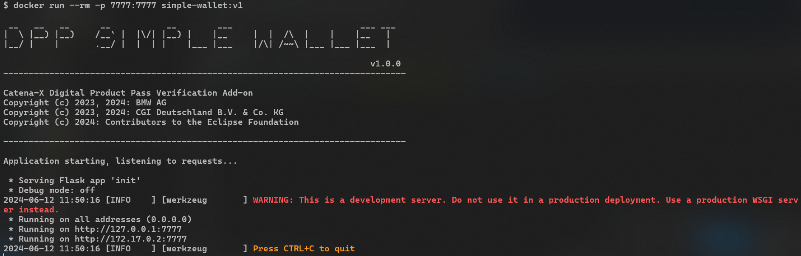

<!--
#######################################################################

Tractus-X - Digital Product Passport Verification Add-on

Copyright (c) 2023 BMW AG
Copyright (c) 2023 CGI Deutschland B.V. & Co. KG
Copyright (c) 2024 Contributors to the Eclipse Foundation

See the NOTICE file(s) distributed with this work for additional
information regarding copyright ownership.

This work is made available under the terms of the
Creative Commons Attribution 4.0 International (CC-BY-4.0) license,
which is available at
https://creativecommons.org/licenses/by/4.0/legalcode.

SPDX-License-Identifier: CC-BY-4.0

#######################################################################
-->

<div align="center">
  
  <br><br>
  
  <h3> Digital Product Pass Verification Add-on</h3>
  <h1> Simple Wallet </h1>
  
</div>

## Table of Contents
- [What is the simple wallet?](#what-is-the-simple-wallet)
- [Helm Charts](#helm-charts)
  - [Credential Storage](#credential-storage)
  - [Keys Creation](#keys-creation)
- [Docker Local Deployment](#docker-local-deployment)
  - [1º- Image creation](#1º--image-creation)
  - [2º- Run container](#2º--run-container)
  - [3º - Start sending requests](#3º---start-sending-requests)
- [Local Start without Docker](#local-start-without-docker)
  - [Execute init script with or without parameters](#execute-init-script-with-or-without-parameters)
  - [Parameters](#parameters)
- [Technical Integration](#technical-integration)
  - [API Specification](#api-specification)
  - [Health API](#health-api)
    - [Health API response](#health-api-response)
  - [Context API](#context-api)
    - [Context API Header](#context-api-header)
    - [Context API Request](#context-api-request)
    - [Context API Response](#context-api-response)
  - [Issue API](#issue-api)
    - [Issue API Header](#issue-api-header)
    - [Issue API Request](#issue-api-request)
    - [Issue API Response](#issue-api-response)
  - [Verify API](#verify-api)
    - [Verify API Header](#verify-api-header)
    - [Verify API Request](#verify-api-request)
    - [Verify API Response](#verify-api-response)
      - [Successfull Verification Response](#successfull-verification-response)
      - [Unsuccessfull Verification Response](#unsuccessfull-verification-response)
  - [DID API](#did-api)
    - [DID API Path Params](#did-api-path-params)
    - [DID API Response](#did-api-response)
- [Authorization and Authentication Configuration](#authorization-and-authentication-configuration)
  - [More information](#more-information)
  - [NOTICE](#notice)
  - [AUTHORS](#authors)


# What is the simple wallet?

This simple wallet application is an extention testing application for the Digital Product Pass Verification Add-On.

It provides a functional wallet able to:
  - Sign verifiable credentials with JsonWebSignature2020 proofs
  - Verify verifiable credentials with JsonWebSignature2020 proofs
  - Manage private and public keys, providing via DID Documents public keys in JsonWebKey2020 format

Additionally the simple wallet contains a extension for creating JSON-LD @contexts using Catena-X SAMM Models Schemas.
This allows the verifiable credentials to be valid JSON-LDs documents and enables the context of the existing and future modeled documents.

# Helm Charts

The helm charts are available at the following path:

[`../charts/simple-wallet`](../charts/simple-wallet)

It can be used to deploy the application.

The URL for hosting the wallet is configured here:

```yaml
ingress:
  enabled: true
  className: "nginx"
  annotations:
    ingressClassName: nginx
    nginx.ingress.kubernetes.io/force-ssl-redirect: "true"
    nginx.ingress.kubernetes.io/ssl-passthrough: "false"
    nginx.ingress.kubernetes.io/backend-protocol: "HTTP"
  hosts:
    - host: &hostname "<url-from-wallet>"
      paths:
        - path: /
          pathType: Prefix
  tls:
    - secretName: tls-secret
      hosts:
        - *hostname
```

## Credential Storage

The wallet configuration for storing credentials are in the following location:

```yaml
credentials:
  storage: 
    # -- Enables the storage of credentials
    enabled: true
```

If the storage is disabled the credentials will not be stored.
And in case it is enabled credentials will be stored in the following dynamic path:

`./credentials/<partner-bpn>/<issue-date>/<credentialUUID>.jsonld`

## Keys Creation

For every BPN configured in the wallet configuration a key will be created in the first request.

Three keys will be created in the following path `./keys/<partner-bpn>`:

- `key.jwt` -> The JWT key generated from the private key
- `private_key.pem` -> The private key from the partner
- `public_ket.pem` -> The public key in format pem

# Docker Local Deployment

To deploy the digital product pass simple wallet follow this steps:

Asure you are in the right folder:

```
cd dpp-verification/simple-wallet
```

## 1º- Image creation

```
docker build -t simple-wallet:v1 .
```

## 2º- Run container

```
docker run --rm -p 7777:7777 simple-wallet:v1
```

## 3º - Start sending requests

One it is deployed you will see this starting message:




# Local Start without Docker

```
cd dpp-verification/simple-wallet
```

## Execute init script with or without parameters

```
py init.py --host <HOST> --port <PORT> <--debug>
```

## Parameters

| Name | Description | Default Value |
| --- | -- | -- |
| HOST | The IP address or hostname where it will be hosted | `localhost` |
| PORT | The port where the service will be exposed | `7777` | 
| --debug | The logging level debug flag, if true it will be activated | If not mentioned is `false` |

# Technical Integration

## API Specification

| API | Method | Description | Header Params | Request/Parameters | Response |
| :-: | :-----: | ----------- | ---| ---------- | --- |
| `/health` | GET | This api will show if the application is running or not. | | | [Go to Response](#health-api-response)| 
| `/context` | POST | This api will transform a JSON Schema into a JSON-LD Schema that can be used in a verifiable credential to give context of the "SAMM" model content.| [Go to Header](#context-api-header) | [Go to Request](#context-api-request) | [Go to Response](#context-api-response) |
| `/issue` | POST | Signs and issues a verifiable credential of data model version 2 with a JsonWebSignature2020 proof. | [Go to Header](#issue-api-header) | [Go to Request](#issue-api-request) | [Go to Response](#issue-api-response) |
| `/verify` | POST | Verifies a verifiable credential of model version 2 with a JsonWebSignature2020 proof from itself or form an external wallet source resolving the DID web method. | [Go to Header](#verify-api-header) | [Go to Request](#verify-api-request) | [Go to Response](#verify-api-response) |
| `/<BPN>/did.json` | GET | Retrieves a valid DID JSON | [Go to Header](#did-api-header) | [Go to Request](#did-api-request) | [Go to Response](#did-api-response) |

## Health API

The health api is from type `public` and gives the status from the server health.

### Health API response

It retrieves the status and the timestamp of the status.

```json
{
    "status": "RUNNING",
    "timestamp": 1719576357.002888
}
```

## Context API

The context api will transfer the JSON Schema structure to a generic JSON-LD context schema.

### Context API Header

| Key | Description | Example | Mandatory |
| --- | ----  | ------- | :-----: |
| `BPN` | A valid Catena-X Bussiness Partner Number identifying the company owner of the keys and signing the credentials | `BPNL000000000012` | X |
| `X-Api-Key` | The correspondent api key assigned for the BPN specified | walletPassword | X |

### Context API Request


| Key | Description | Mandatory or Default Value |
| --- | ----  | :-----: |
| `semanticId` | The semantic identifier shows what is the identification of the model and schema to be parsed to json-ld | X |
| `schema` | A valid JSON Schema from a SAMM Aspect Modeler | X |
| `shortName` | The aspect needs to be named and referenced with a specific key in the JSON-LD Context schema, therefore the name can be specified. | `aspect` |

<details>

<summary>Expand to see the example request content!</summary>

```json
{
    "semanticId": "urn:samm:io.catenax.generic.digital_product_passport:5.0.0#DigitalProductPassport",
    "schema": {
        "$schema": "http://json-schema.org/draft-04/schema",
        "description": "The Digital Product Passport (DPP) allows to share process and product-related information amongst supply chain businesses, authorities and consumers. The DPP allows for efficient information flows following best practices; and the possibility of accompanying the measures under this Regulation with mitigating measures so that impacts are expected to remain proportionate for SMEs.This is expected to increase transparency, both for supply chain businesses and for the general public, and increase efficiencies in terms of information transfer to support the data exchange between economic actors in integrating circularity in product design and manufacturing.\nIn particular, it is likely to help facilitate and streamline the monitoring and enforcement of the regulation carried out by EU and Member State authorities. It is also likely to provide a market-intelligence tool that may be used for revising and refining obligations in the future.\nThe DPP includes data about components, materials and chemical substances, information on reparability, spare parts, environmental impact and professional disposal for a product.\nThe data model will be updated, as newer versions of the regulation will be published.\nThe main basis is provided by the document \"Proposal for a REGULATION OF THE EUROPEAN PARLIAMENT AND OF THE COUNCIL establishing a framework for setting ecodesign requirements for sustainable products and repealing Directive 2009/125/EC\" from March 30th, 2022. The latest version of the document was the provisional agreement between the EU Council and the Parliament from January 9th, 2024. The text is informal, but the content of the final regulation was agreed between these two institutions.\nThe Title of Ecodesign Regulation has been changed to: Proposal for a REGULATION OF THE EUROPEAN PARLIAMENT AND OF THE COUNCIL establishing a framework for setting ecodesign requirements for sustainable products, amending Regulation (EU) 2023/1542 and repealing Directive 2009/125/EC.",
        "type": "object",
        "components": {
            "schemas": {
                "urn_samm_org.eclipse.esmf.samm_characteristic_2.1.0_Text": {
                    "type": "string",
                    "description": "Describes a Property which contains plain text. This is intended exclusively for human readable strings, not for identifiers, measurement values, etc."
                },
                "urn_samm_io.catenax.generic.digital_product_passport_5.0.0_StatusEnumeration": {
                    "type": "string",
                    "description": "The current status of the product passport declared through either: draft, approved, invalid or expired.",
                    "enum": [
                        "draft",
                        "approved",
                        "invalid",
                        "expired"
                    ]
                },
                "urn_samm_io.catenax.generic.digital_product_passport_5.0.0_DateTrait": {
                    "type": "string",
                    "description": "Constraint fo a timestamp in the format (yyyy-mm-dd).",
                    "pattern": "^\\d{4}-\\d{2}-\\d{2}$"
                },
                "urn_samm_io.catenax.shared.business_partner_number_2.0.0_BpnlTrait": {
                    "type": "string",
                    "description": "The provided regular expression ensures that the BPNL is composed of prefix 'BPNL', 10 digits and two alphanumeric letters.",
                    "pattern": "^BPNL[a-zA-Z0-9]{12}$"
                },
                "urn_samm_io.catenax.shared.uuid_2.0.0_UuidV4Trait": {
                    "type": "string",
                    "description": "The provided regular expression ensures that the UUID is composed of five groups of characters separated by hyphens, in the form 8-4-4-4-12 for a total of 36 characters (32 hexadecimal characters and 4 hyphens), optionally prefixed by \"urn:uuid:\" to make it an IRI.",
                    "pattern": "(^[0-9a-fA-F]{8}-[0-9a-fA-F]{4}-[0-9a-fA-F]{4}-[0-9a-fA-F]{4}-[0-9a-fA-F]{12}$)|(^urn:uuid:[0-9a-fA-F]{8}-[0-9a-fA-F]{4}-[0-9a-fA-F]{4}-[0-9a-fA-F]{4}-[0-9a-fA-F]{12}$)"
                },
                "urn_samm_io.catenax.generic.digital_product_passport_5.0.0_IdentifierCharacteristic": {
                    "type": "string",
                    "description": "Characteristic for Identifiers."
                },
                "urn_samm_io.catenax.generic.digital_product_passport_5.0.0_MetadataCharacteristic": {
                    "description": "Characteristic for the passport metadata of the digital product passport.",
                    "type": "object",
                    "properties": {
                        "version": {
                            "description": "The current version of the product passport. The possibility of modification/ updating the product passport needs to include versioning of the dataset. This attribute is an internal versioning from the passport issuer. This attribute is mentioned in the ESPR provisional agreement from January 9th, 2024 Article 8:\n(1) [...] The information in the product passport shall be accurate, complete, and up to date.",
                            "$ref": "#/components/schemas/urn_samm_org.eclipse.esmf.samm_characteristic_2.1.0_Text"
                        },
                        "status": {
                            "description": "The current status of the product passport declared through either: draft, approved, invalid or expired.",
                            "$ref": "#/components/schemas/urn_samm_io.catenax.generic.digital_product_passport_5.0.0_StatusEnumeration"
                        },
                        "expirationDate": {
                            "description": "The timestamp in the format (yyyy-mm-dd) for the product passport until when it is available or a comment describing this period. This attribute is mentioned in the ESPR provisional agreement from January 9th, 2024 Article 8:\n(2) (h) the period during which the product passport is to remain available, which shall correspond to at least the expected lifetime of a specific product.",
                            "$ref": "#/components/schemas/urn_samm_io.catenax.generic.digital_product_passport_5.0.0_DateTrait"
                        },
                        "issueDate": {
                            "description": "The timestamp in the format (yyyy-mm-dd) since when the product passport is available.",
                            "$ref": "#/components/schemas/urn_samm_io.catenax.generic.digital_product_passport_5.0.0_DateTrait"
                        },
                        "economicOperatorId": {
                            "description": "The identification of the owner/economic operator of the passport. Proposed, according to ISO 15459, is the CIN (company identification code). Other identification numbers like the tax identification number, value added tax identification number, commercial register number and the like are also valid entries. In the Catena-X network, the BPNL is used for the identification of companies and the information stored like contact information and addresses. This attribute is mentioned in the ESPR proposal from March 30th, 2022 Annex III:\n(k) the [...] unique operator identifier code of the economic operator established in the Union responsible for carrying out the tasks set out in Article 4 of Regulation (EU) 2019/1020, or Article 15 of Regulation (EU) on general product safety, or similar tasks pursuant to other EU legislation applicable to the product.",
                            "$ref": "#/components/schemas/urn_samm_io.catenax.shared.business_partner_number_2.0.0_BpnlTrait"
                        },
                        "passportIdentifier": {
                            "description": "The identifier of the product passport, which is an uuidv4.",
                            "$ref": "#/components/schemas/urn_samm_io.catenax.shared.uuid_2.0.0_UuidV4Trait"
                        },
                        "predecessor": {
                            "description": "Identification of the preceding product passport. If there is no preceding passport, input a dummy value. This attribute is mentioned in the ESPR provisional agreement from January 9th, 2024 Article 8:\n(2)(g) [...] Any new product passport shall be linked to the product passport or passports of the original product whenever appropriate.",
                            "$ref": "#/components/schemas/urn_samm_io.catenax.shared.uuid_2.0.0_UuidV4Trait"
                        },
                        "backupReference": {
                            "description": "A reference to the data backup of the passport. This mandatory attribute will be further defined in the future. This attribute is mentioned in the ESPR provisional agreement from January 9th, 2024 Annex III:\n(kb) the reference of the certified independent third-party product passport service provider hosting the back-up copy of the product passport.\nArticle 10 also mentions:\n(c) the data included in the product passport shall be stored by the economic operator responsible for its creation or by certified independent third-party product passport service providers authorised to act on their behalf.",
                            "$ref": "#/components/schemas/urn_samm_org.eclipse.esmf.samm_characteristic_2.1.0_Text"
                        },
                        "registrationIdentifier": {
                            "description": "Identifier in the respective registry. This will be further defined in the future. This attribute is mentioned in the ESPR provisional agreement from January 9th, 2024 in Article 12:\nBy [2 years from entering into force of this Regulation], the Commission shall set up and manage a digital registry (\"the registry\") storing in a secure manner at least the unique product identifier, the unique operator identifier, the unique facility identifiers. In case of products intended to be placed under the customs procedure 'release for free circulation', the registry shall also store the product commodity code. The registry shall also store the batteries' unique identifiers referred to in Article 77(3) of Regulation (EU) 2023/1542.",
                            "$ref": "#/components/schemas/urn_samm_io.catenax.generic.digital_product_passport_5.0.0_IdentifierCharacteristic"
                        },
                        "lastModification": {
                            "description": "Date of the latest modification.",
                            "$ref": "#/components/schemas/urn_samm_io.catenax.generic.digital_product_passport_5.0.0_DateTrait"
                        }
                    },
                    "required": [
                        "version",
                        "expirationDate",
                        "issueDate",
                        "economicOperatorId",
                        "passportIdentifier",
                        "predecessor",
                        "backupReference"
                    ]
                },
                "urn_samm_io.catenax.serial_part_3.0.0_KeyTrait": {
                    "type": "string",
                    "description": "Constraint that ensures that the standard keys and custom key prefixes can be used.",
                    "pattern": "^(manufacturerId|partInstanceId|batchId|van|customKey:\\w+)$"
                },
                "urn_samm_io.catenax.serial_part_3.0.0_ValueCharacteristic": {
                    "type": "string",
                    "description": "The value of an identifier."
                },
                "urn_samm_io.catenax.serial_part_3.0.0_KeyValueList": {
                    "description": "A list of key value pairs for local identifiers, which are composed of a key and a corresponding value.",
                    "type": "object",
                    "properties": {
                        "key": {
                            "description": "The key of a local identifier. ",
                            "$ref": "#/components/schemas/urn_samm_io.catenax.serial_part_3.0.0_KeyTrait"
                        },
                        "value": {
                            "description": "The value of an identifier.",
                            "$ref": "#/components/schemas/urn_samm_io.catenax.serial_part_3.0.0_ValueCharacteristic"
                        }
                    },
                    "required": [
                        "key",
                        "value"
                    ]
                },
                "urn_samm_io.catenax.serial_part_3.0.0_LocalIdentifierCharacteristic": {
                    "description": "A single serialized part may have multiple attributes, that uniquely identify a that part in a specific dataspace (e.g. the manufacturer`s dataspace)",
                    "type": "array",
                    "items": {
                        "$ref": "#/components/schemas/urn_samm_io.catenax.serial_part_3.0.0_KeyValueList"
                    },
                    "uniqueItems": true
                },
                "urn_samm_io.catenax.batch_3.0.0_KeyTrait": {
                    "type": "string",
                    "description": "Constraint that ensures that the predefined keys are used.",
                    "pattern": "^(manufacturerId|batchId|customKey:\\w+)$"
                },
                "urn_samm_io.catenax.batch_3.0.0_ValueCharacteristic": {
                    "type": "string",
                    "description": "The value of an identifier."
                },
                "urn_samm_io.catenax.batch_3.0.0_KeyValueList": {
                    "description": "A list of key value pairs for local identifiers, which are composed of a key and a corresponding value.",
                    "type": "object",
                    "properties": {
                        "key": {
                            "description": "The key of a local identifier.",
                            "$ref": "#/components/schemas/urn_samm_io.catenax.batch_3.0.0_KeyTrait"
                        },
                        "value": {
                            "description": "The value of an identifier.",
                            "$ref": "#/components/schemas/urn_samm_io.catenax.batch_3.0.0_ValueCharacteristic"
                        }
                    },
                    "required": [
                        "key",
                        "value"
                    ]
                },
                "urn_samm_io.catenax.batch_3.0.0_LocalIdentifierCharacteristic": {
                    "description": "A batch may have multiple attributes, which uniquely identify that batch in a specific dataspace(e.g. the manufacturer`s dataspace)",
                    "type": "array",
                    "items": {
                        "$ref": "#/components/schemas/urn_samm_io.catenax.batch_3.0.0_KeyValueList"
                    },
                    "uniqueItems": true
                },
                "urn_samm_io.catenax.part_type_information_1.0.0_PartIdCharacteristic": {
                    "type": "string",
                    "description": "The part ID is a multi-character string, usually assigned by an ERP system."
                },
                "urn_samm_io.catenax.part_type_information_1.0.0_PartNameCharacteristic": {
                    "type": "string",
                    "description": "Part name in string format from the respective system in the value chain."
                },
                "urn_samm_io.catenax.generic.digital_product_passport_5.0.0_PartTypeCharacteristic": {
                    "description": "Characteristic for the part type.",
                    "type": "object",
                    "properties": {
                        "manufacturerPartId": {
                            "description": "Part ID as assigned by the manufacturer of the part. The part ID identifies the part in the manufacturer`s dataspace. The part ID references a specific version of a part. The version number must be included in the part ID if it is available. The part ID does not reference a specific instance of a part and must not be confused with the serial number.",
                            "$ref": "#/components/schemas/urn_samm_io.catenax.part_type_information_1.0.0_PartIdCharacteristic"
                        },
                        "nameAtManufacturer": {
                            "description": "Name of the part as assigned by the manufacturer.",
                            "$ref": "#/components/schemas/urn_samm_io.catenax.part_type_information_1.0.0_PartNameCharacteristic"
                        }
                    },
                    "required": [
                        "manufacturerPartId",
                        "nameAtManufacturer"
                    ]
                },
                "urn_samm_io.catenax.generic.digital_product_passport_5.0.0_CodeEntity": {
                    "description": "Code entity with code key and value.",
                    "type": "object",
                    "properties": {
                        "key": {
                            "description": "The code key for the identification of the product. Examples are GTIN, hash, DID, ISBN, TARIC. This attribute is mentioned in the ESPR proposal from March 30th, 2022 ANNEX III:\n(b) the unique product identifier at the level indicated in the applicable delegated act adopted pursuant to Article 4;\n(c) the Global Trade Identification Number as provided for in standard ISO/IEC 15459-6 or equivalent of products or their parts;\n(d) relevant commodity codes, such as a TARIC code as defined in Council Regulation (EEC) No 2658/87.",
                            "$ref": "#/components/schemas/urn_samm_io.catenax.generic.digital_product_passport_5.0.0_IdentifierCharacteristic"
                        },
                        "value": {
                            "description": "The code value for the identification of the product in regard to the chosen code name.",
                            "$ref": "#/components/schemas/urn_samm_io.catenax.generic.digital_product_passport_5.0.0_IdentifierCharacteristic"
                        }
                    },
                    "required": [
                        "key",
                        "value"
                    ]
                },
                "urn_samm_io.catenax.generic.digital_product_passport_5.0.0_CodeList": {
                    "description": "A list of additional codes.",
                    "type": "array",
                    "items": {
                        "$ref": "#/components/schemas/urn_samm_io.catenax.generic.digital_product_passport_5.0.0_CodeEntity"
                    }
                },
                "urn_samm_io.catenax.generic.digital_product_passport_5.0.0_DataCarrierCharacteristic": {
                    "description": "Data Carrier Characteristic for the product.",
                    "type": "object",
                    "properties": {
                        "carrierType": {
                            "description": "The type of data carrier such as a QR code on the product. This attribute is mentioned in the ESPR proposal from March 30th, 2022 Article 8:\n(2) (b) the types of data carrier to be used.",
                            "$ref": "#/components/schemas/urn_samm_org.eclipse.esmf.samm_characteristic_2.1.0_Text"
                        },
                        "carrierLayout": {
                            "description": "The positioning of data carrier on the product. This attribute is mentioned in the ESPR proposal from March 30th, 2022 Article 8:\n(2) (c) the layout in which the data carrier shall be presented and its positioning.",
                            "$ref": "#/components/schemas/urn_samm_org.eclipse.esmf.samm_characteristic_2.1.0_Text"
                        }
                    },
                    "required": [
                        "carrierType",
                        "carrierLayout"
                    ]
                },
                "urn_samm_io.catenax.shared.part_classification_1.0.0_ClassificationStandardCharacteristic": {
                    "type": "string",
                    "description": "Identified classification standards that align to the Catena-X needs."
                },
                "urn_samm_io.catenax.shared.part_classification_1.0.0_ClassificationIDCharacteristic": {
                    "type": "string",
                    "description": "It can be numeric or a string, depending on the chosen classification standard."
                },
                "urn_samm_io.catenax.shared.part_classification_1.0.0_ClassificationEntity": {
                    "description": "Encapsulates data related to the classification of the part.",
                    "type": "object",
                    "properties": {
                        "classificationStandard": {
                            "description": "Identified classification standards that align to the Catena-X needs.",
                            "$ref": "#/components/schemas/urn_samm_io.catenax.shared.part_classification_1.0.0_ClassificationStandardCharacteristic"
                        },
                        "classificationID": {
                            "description": "The classification ID of the part type according to the corresponding standard definition mentioned in the key value pair.",
                            "$ref": "#/components/schemas/urn_samm_io.catenax.shared.part_classification_1.0.0_ClassificationIDCharacteristic"
                        },
                        "classificationDescription": {
                            "description": "Optional property describing the classification standard.",
                            "$ref": "#/components/schemas/urn_samm_org.eclipse.esmf.samm_characteristic_2.1.0_Text"
                        }
                    },
                    "required": [
                        "classificationStandard",
                        "classificationID"
                    ]
                },
                "urn_samm_io.catenax.shared.part_classification_1.0.0_ClassificationCharacteristic": {
                    "description": "Classification characteristic enabling a set of further properties.",
                    "type": "array",
                    "items": {
                        "$ref": "#/components/schemas/urn_samm_io.catenax.shared.part_classification_1.0.0_ClassificationEntity"
                    },
                    "uniqueItems": true
                },
                "urn_samm_io.catenax.generic.digital_product_passport_5.0.0_IdentificationCharacteristic": {
                    "description": "Identification information of the product.",
                    "type": "object",
                    "properties": {
                        "serial": {
                            "description": "Identifier for a serial part if available. This is mentioned in the ESPR provisional agreement from January 9th, 2024 Recital (27):\n[...] an 'item' usually means a single unit of a model.",
                            "$ref": "#/components/schemas/urn_samm_io.catenax.serial_part_3.0.0_LocalIdentifierCharacteristic"
                        },
                        "batch": {
                            "description": "Identifier for a batch part if available. Identifier for a serial part if available. This is mentioned in the ESPR provisional agreement from January 9th, 2024 Recital (27):\n[...] a 'batch' usually means a subset of a specific model composed of all products produced in a specific manufacturing plant at a specific moment in time [...].",
                            "$ref": "#/components/schemas/urn_samm_io.catenax.batch_3.0.0_LocalIdentifierCharacteristic"
                        },
                        "type": {
                            "description": "Identifier on the level of a part model or type. Identifier for a serial part if available. This is mentioned in the ESPR provisional agreement from January 9th, 2024 Recital (27):\n[...] A 'model' usually means a version of a product of which all units share the same technical characteristics relevant for the ecodesign requirements and the same model identifier [...].",
                            "$ref": "#/components/schemas/urn_samm_io.catenax.generic.digital_product_passport_5.0.0_PartTypeCharacteristic"
                        },
                        "codes": {
                            "description": "Codes for identification.",
                            "$ref": "#/components/schemas/urn_samm_io.catenax.generic.digital_product_passport_5.0.0_CodeList"
                        },
                        "dataCarrier": {
                            "description": "The type and layout of the data carrier on the product. These are mentioned in the ESPR proposal from March 30th, 2022 Article 8:\n(b) the types of data carrier to be used;\n(c) the layout in which the data carrier shall be presented and its positioning;\nArticle 2 defines:\n(30) 'data carrier' means a linear bar code symbol, a two-dimensional symbol or other automatic identification data capture medium that can be read by a device.",
                            "$ref": "#/components/schemas/urn_samm_io.catenax.generic.digital_product_passport_5.0.0_DataCarrierCharacteristic"
                        },
                        "classification": {
                            "description": "Property describing the classification of a part.",
                            "$ref": "#/components/schemas/urn_samm_io.catenax.shared.part_classification_1.0.0_ClassificationCharacteristic"
                        }
                    },
                    "required": [
                        "type",
                        "codes",
                        "dataCarrier",
                        "classification"
                    ]
                },
                "urn_samm_io.catenax.shared.business_partner_number_2.0.0_BpnaTrait": {
                    "type": "string",
                    "description": "The provided regular expression ensures that the BPNA is composed of prefix 'BPNA', 10 digits and two alphanumeric letters.",
                    "pattern": "^BPNA[a-zA-Z0-9]{12}$"
                },
                "urn_samm_io.catenax.generic.digital_product_passport_5.0.0_FacilityEntity": {
                    "description": "The entity for a facility with the BPNA identifier.",
                    "type": "object",
                    "properties": {
                        "facility": {
                            "description": "The identifier used for a location. This attribute is mentioned in the ESPR provisional agreement from January 9th 2024 Annex III:\n(i) unique facility identifiers;\nArticle 2 Definitions: (33) 'unique facility identifier' means a unique string of characters for the identification of locations or buildings involved in the value chain of a product or used by actors involved in the value chain of a product.",
                            "$ref": "#/components/schemas/urn_samm_io.catenax.shared.business_partner_number_2.0.0_BpnaTrait"
                        }
                    },
                    "required": [
                        "facility"
                    ]
                },
                "urn_samm_io.catenax.generic.digital_product_passport_5.0.0_FacilityList": {
                    "description": "List of facilities.",
                    "type": "array",
                    "items": {
                        "$ref": "#/components/schemas/urn_samm_io.catenax.generic.digital_product_passport_5.0.0_FacilityEntity"
                    }
                },
                "urn_samm_io.catenax.generic.digital_product_passport_5.0.0_ManufacturerCharacteristic": {
                    "description": "Manufacturing information.",
                    "type": "object",
                    "properties": {
                        "facility": {
                            "description": "The identifier used for a location.  In the CATENA-X use case, the BPNA can be stated. This attribute is mentioned in the ESPR provisional agreement from January 9th 2024 Annex III:\n(i) unique facility identifiers;\nArticle 2 Definitions: (33) 'unique facility identifier' means a unique string of characters for the identification of locations or buildings involved in the value chain of a product or used by actors involved in the value chain of a product.",
                            "$ref": "#/components/schemas/urn_samm_io.catenax.generic.digital_product_passport_5.0.0_FacilityList"
                        },
                        "manufacturer": {
                            "description": "The main manufacturer, if different from the passport owner, represented by an identification number. In the Catena-X use case, the BPNL can be stated. This attribute is mentioned in the ESPR provisional agreement from January 9th 2024 Annex III:\n(h) unique operator identifiers other than that of the manufacturer;\n(k) the name, contact details and unique operator identifier code of the economic operator established in the Union responsible for carrying out the tasks set out in Article 4 of Regulation (EU) 2019/1020, or Article 15 of Regulation (EU) [.../...] on general product safety, or similar tasks pursuant to other EU legislation applicable to the product.",
                            "$ref": "#/components/schemas/urn_samm_io.catenax.shared.business_partner_number_2.0.0_BpnlTrait"
                        },
                        "manufacturingDate": {
                            "description": "The timestamp in the format (yyyy-mm-dd) of the manufacturing date as the final step in production process (e.g. final quality check, ready-for-shipment event).",
                            "$ref": "#/components/schemas/urn_samm_io.catenax.generic.digital_product_passport_5.0.0_DateTrait"
                        }
                    },
                    "required": [
                        "facility",
                        "manufacturer"
                    ]
                },
                "urn_samm_io.catenax.generic.digital_product_passport_5.0.0_EoriTrait": {
                    "type": "string",
                    "description": "Constraint with a pattern which ensures that the EORI number starts with two alphanumeric characters, followed by two alphabetic characters, and ends with 2 to 15 alphanumeric characters.",
                    "pattern": "^[A-Z]{2}[A-Z0-9]{1,18}$"
                },
                "urn_samm_io.catenax.generic.digital_product_passport_5.0.0_ImporterCharacteristic": {
                    "description": "Characteristic with information regarding the importer.",
                    "type": "object",
                    "properties": {
                        "eori": {
                            "description": "An economic operator established in the customs territory of the Union needs, for customs purposes, an EORI number. EORI stands for economic operators registration and identification number. In this case, the importer's EORI must be provided. This attribute is mentioned in the ESPR proposal from March 30th, 2022 Annex III:\n(j) information related to the importer, including the information referred to in Article 23(3) and its EORI number.",
                            "$ref": "#/components/schemas/urn_samm_io.catenax.generic.digital_product_passport_5.0.0_EoriTrait"
                        },
                        "id": {
                            "description": "The importer of the product, if different from the owner of the passport. In the Catena-X network, the BPNL is used for the identification of companies and the information stored for this like contact information and addresses.\nThis attribute is mentioned in the ESPR provisional agreement from January 9th, 2024  Annex III:\n(j) information related to the importer, including the information referred to in Article 23(3) and its EORI number;\nArticle 23 states:\n(3) Importers shall, for products covered by a delegated act adopted pursuant to Article 4, indicate their name, registered trade name or registered trade mark and the postal address and electronic means of communication, where they can be contacted:  (a) on the public part of the product passport, when applicable, and\n(b) on the product or, where this is not possible, on the packaging, or in a document accompanying the product.",
                            "$ref": "#/components/schemas/urn_samm_io.catenax.shared.business_partner_number_2.0.0_BpnlTrait"
                        }
                    },
                    "required": [
                        "eori",
                        "id"
                    ]
                },
                "urn_samm_org.eclipse.esmf.samm_characteristic_2.1.0_Boolean": {
                    "type": "boolean",
                    "description": "Represents a boolean value (i.e. a \"flag\")."
                },
                "urn_samm_io.catenax.generic.digital_product_passport_5.0.0_ImportCharacteristic": {
                    "description": "Import Characteristic for the product.",
                    "type": "object",
                    "properties": {
                        "content": {
                            "description": "Information regarding the importer of the product, if different from the owner of the passport. This attribute is mentioned in the ESPR provisional agreement from January 9th, 2024 Annex III:\n(j) information related to the importer, including the information referred to in Article 23(3) and its EORI number;\nArticle 23 states:\n(3) Importers shall, for products covered by a delegated act adopted pursuant to Article 4, indicate their name, registered trade name or registered trade mark and the postal address and electronic means of communication, where they can be contacted:  (a) on the public part of the product passport, when applicable, and\n(b) on the product or, where this is not possible, on the packaging, or in a document accompanying the product.",
                            "$ref": "#/components/schemas/urn_samm_io.catenax.generic.digital_product_passport_5.0.0_ImporterCharacteristic"
                        },
                        "applicable": {
                            "description": "Check whether the connected attributes are applicable to the product. If it is not applicable (false), dummy data can be delivered.",
                            "$ref": "#/components/schemas/urn_samm_org.eclipse.esmf.samm_characteristic_2.1.0_Boolean"
                        }
                    },
                    "required": [
                        "content",
                        "applicable"
                    ]
                },
                "urn_samm_io.catenax.generic.digital_product_passport_5.0.0_OperatorCharacteristic": {
                    "description": "Other operators characteristic.",
                    "type": "object",
                    "properties": {
                        "id": {
                            "description": "Identifier of the other operator. This can be a BPN.",
                            "$ref": "#/components/schemas/urn_samm_org.eclipse.esmf.samm_characteristic_2.1.0_Text"
                        },
                        "role": {
                            "description": "Role of the other operator.",
                            "$ref": "#/components/schemas/urn_samm_org.eclipse.esmf.samm_characteristic_2.1.0_Text"
                        }
                    },
                    "required": [
                        "id",
                        "role"
                    ]
                },
                "urn_samm_io.catenax.generic.digital_product_passport_5.0.0_OperationCharacteristic": {
                    "description": "Operational information of the product.",
                    "type": "object",
                    "properties": {
                        "manufacturer": {
                            "description": "Manufacturing information of the product. In the CATENA-X use case, the BPNL and BPNA can be stated. These attributes are mentioned in the ESPR provisional agreement from January 9th 2024 Annex III:\n(h) unique operator identifiers other than that of the manufacturer;\n(k) the name, contact details and unique operator identifier code of the economic operator established in the Union responsible for carrying out the tasks set out in Article 4 of Regulation (EU) 2019/1020, or Article 15 of Regulation (EU) [.../...] on general product safety, or similar tasks pursuant to other EU legislation applicable to the product.",
                            "$ref": "#/components/schemas/urn_samm_io.catenax.generic.digital_product_passport_5.0.0_ManufacturerCharacteristic"
                        },
                        "import": {
                            "description": "Importer details such as the identification.",
                            "$ref": "#/components/schemas/urn_samm_io.catenax.generic.digital_product_passport_5.0.0_ImportCharacteristic"
                        },
                        "other": {
                            "description": "Other operators relevant for the product.",
                            "$ref": "#/components/schemas/urn_samm_io.catenax.generic.digital_product_passport_5.0.0_OperatorCharacteristic"
                        }
                    },
                    "required": [
                        "manufacturer",
                        "import"
                    ]
                },
                "urn_samm_io.catenax.generic.digital_product_passport_5.0.0_SourcesEntity": {
                    "description": "Entity for a possible spare part sources.",
                    "type": "object",
                    "properties": {
                        "id": {
                            "description": "The identifier of a spare part producer of the product. In the Catena-X network, the BPNL is used for the identification of companies and the information stored for this like contact information and addresses.",
                            "$ref": "#/components/schemas/urn_samm_io.catenax.shared.business_partner_number_2.0.0_BpnlTrait"
                        }
                    },
                    "required": [
                        "id"
                    ]
                },
                "urn_samm_io.catenax.generic.digital_product_passport_5.0.0_SourcesList": {
                    "description": "List of possible spare part sources.",
                    "type": "array",
                    "items": {
                        "$ref": "#/components/schemas/urn_samm_io.catenax.generic.digital_product_passport_5.0.0_SourcesEntity"
                    }
                },
                "urn_samm_io.catenax.generic.digital_product_passport_5.0.0_PartsEntity": {
                    "description": "Possible spare parts of the product with identifiers and names.",
                    "type": "object",
                    "properties": {
                        "manufacturerPartId": {
                            "description": "Part ID as assigned by the manufacturer of the part. The part ID identifies the part in the manufacturer`s dataspace. The part ID references a specific version of a part. The version number must be included in the part ID if it is available. The part ID does not reference a specific instance of a part and must not be confused with the serial number.",
                            "$ref": "#/components/schemas/urn_samm_io.catenax.part_type_information_1.0.0_PartIdCharacteristic"
                        },
                        "nameAtManufacturer": {
                            "description": "Name of the part as assigned by the manufacturer.",
                            "$ref": "#/components/schemas/urn_samm_io.catenax.part_type_information_1.0.0_PartNameCharacteristic"
                        }
                    },
                    "required": [
                        "manufacturerPartId",
                        "nameAtManufacturer"
                    ]
                },
                "urn_samm_io.catenax.generic.digital_product_passport_5.0.0_PartList": {
                    "description": "A list of possible spare parts of the product.",
                    "type": "array",
                    "items": {
                        "$ref": "#/components/schemas/urn_samm_io.catenax.generic.digital_product_passport_5.0.0_PartsEntity"
                    }
                },
                "urn_samm_io.catenax.generic.digital_product_passport_5.0.0_SparePart": {
                    "description": "Characteristic describing sources and spare parts.",
                    "type": "object",
                    "properties": {
                        "producer": {
                            "description": "Sources of possible spare parts.",
                            "$ref": "#/components/schemas/urn_samm_io.catenax.generic.digital_product_passport_5.0.0_SourcesList"
                        },
                        "sparePart": {
                            "description": "Possible spare parts of the product.",
                            "$ref": "#/components/schemas/urn_samm_io.catenax.generic.digital_product_passport_5.0.0_PartList"
                        }
                    },
                    "required": [
                        "producer",
                        "sparePart"
                    ]
                },
                "urn_samm_io.catenax.generic.digital_product_passport_5.0.0_HandlingCharacteristic": {
                    "description": "Characteristic to describe aspects which are connected with the handling of the product.",
                    "type": "object",
                    "properties": {
                        "content": {
                            "description": "The list of spare parts available for the product from various suppliers.",
                            "$ref": "#/components/schemas/urn_samm_io.catenax.generic.digital_product_passport_5.0.0_SparePart"
                        },
                        "applicable": {
                            "description": "Check whether the connected attributes are applicable to the product. If it is not applicable (false), dummy data can be delivered.",
                            "$ref": "#/components/schemas/urn_samm_org.eclipse.esmf.samm_characteristic_2.1.0_Boolean"
                        }
                    },
                    "required": [
                        "content",
                        "applicable"
                    ]
                },
                "urn_samm_io.catenax.generic.digital_product_passport_5.0.0_LifeEnumeration": {
                    "type": "string",
                    "description": "Enumeration with the possible units day, month, cycle, year and runningOrOperatingHour.",
                    "enum": [
                        "unit:day",
                        "unit:month",
                        "unit:year",
                        "unit:cycle",
                        "unit:runningOrOperatingHour"
                    ]
                },
                "urn_samm_io.catenax.generic.digital_product_passport_5.0.0_LifeValueCharacteristic": {
                    "type": "number",
                    "description": "Characteristic for the life span value as an integer."
                },
                "urn_samm_io.catenax.generic.digital_product_passport_5.0.0_LifeTypeEnumeration": {
                    "type": "string",
                    "description": "Enumeration with the values guaranteed lifetime, technical lifetime and mean time between failures.",
                    "enum": [
                        "guaranteed lifetime",
                        "technical lifetime",
                        "mean time between failures"
                    ]
                },
                "urn_samm_io.catenax.generic.digital_product_passport_5.0.0_LifespanEntity": {
                    "description": "Entity for the lifespan of a product with type, unit and value.",
                    "type": "object",
                    "properties": {
                        "unit": {
                            "description": "The unit of the respective lifespan expressed through the possible units day, month, cycle, year and runningOrOperatingHour.",
                            "$ref": "#/components/schemas/urn_samm_io.catenax.generic.digital_product_passport_5.0.0_LifeEnumeration"
                        },
                        "value": {
                            "description": "The value as an integer for the respective lifespan.",
                            "$ref": "#/components/schemas/urn_samm_io.catenax.generic.digital_product_passport_5.0.0_LifeValueCharacteristic"
                        },
                        "key": {
                            "description": "The type of lifespan represented with the values guaranteed lifetime, technical lifetime and mean time between failures. This attribute is mentioned in the ESPR proposal from March 30th, 2022 ANNEX I:\n(a) durability and reliability of the product or its components as expressed through the product's guaranteed lifetime, technical lifetime [or] mean time between failures [...].",
                            "$ref": "#/components/schemas/urn_samm_io.catenax.generic.digital_product_passport_5.0.0_LifeTypeEnumeration"
                        }
                    },
                    "required": [
                        "unit",
                        "value",
                        "key"
                    ]
                },
                "urn_samm_io.catenax.generic.digital_product_passport_5.0.0_LifespanList": {
                    "description": "List of different life spans of a product.",
                    "type": "array",
                    "items": {
                        "$ref": "#/components/schemas/urn_samm_io.catenax.generic.digital_product_passport_5.0.0_LifespanEntity"
                    }
                },
                "urn_samm_io.catenax.shared.quantity_2.0.0_QuantityValueCharacteristic": {
                    "type": "number",
                    "description": "The quantity value associated with the unit expressed as float."
                },
                "urn_samm_io.catenax.shared.quantity_2.0.0_LinearUnitEnumeration": {
                    "type": "string",
                    "pattern": "[a-zA-Z]*:[a-zA-Z]+",
                    "description": "The unit of a linear attribute that may be used for height, width, length and diameter.",
                    "enum": [
                        "unit:millimetre",
                        "unit:centimetre",
                        "unit:metre",
                        "unit:kilometre",
                        "unit:inch",
                        "unit:foot",
                        "unit:yard"
                    ]
                },
                "urn_samm_io.catenax.shared.quantity_2.0.0_LinearCharacteristic": {
                    "description": "Characteristic for linear measurements of an item.",
                    "type": "object",
                    "properties": {
                        "value": {
                            "description": "The quantity value associated with the unit.",
                            "$ref": "#/components/schemas/urn_samm_io.catenax.shared.quantity_2.0.0_QuantityValueCharacteristic"
                        },
                        "unit": {
                            "description": "The unit of a linear attribute.",
                            "$ref": "#/components/schemas/urn_samm_io.catenax.shared.quantity_2.0.0_LinearUnitEnumeration"
                        }
                    },
                    "required": [
                        "value",
                        "unit"
                    ]
                },
                "urn_samm_io.catenax.shared.quantity_2.0.0_MassUnitEnumeration": {
                    "type": "string",
                    "pattern": "[a-zA-Z]*:[a-zA-Z]+",
                    "description": "Enumeration for mass units.",
                    "enum": [
                        "unit:gram",
                        "unit:kilogram",
                        "unit:tonneMetricTon",
                        "unit:tonUsOrShortTonUkorus",
                        "unit:ounceAvoirdupois",
                        "unit:pound"
                    ]
                },
                "urn_samm_io.catenax.shared.quantity_2.0.0_MassCharacteristic": {
                    "description": "Characteristic for mass measurements of an item.",
                    "type": "object",
                    "properties": {
                        "value": {
                            "description": "The quantity value associated with the unit.",
                            "$ref": "#/components/schemas/urn_samm_io.catenax.shared.quantity_2.0.0_QuantityValueCharacteristic"
                        },
                        "unit": {
                            "description": "The unit of a mass related attribute.",
                            "$ref": "#/components/schemas/urn_samm_io.catenax.shared.quantity_2.0.0_MassUnitEnumeration"
                        }
                    },
                    "required": [
                        "value",
                        "unit"
                    ]
                },
                "urn_samm_io.catenax.shared.quantity_2.0.0_VolumeUnitEnumeration": {
                    "type": "string",
                    "pattern": "[a-zA-Z]*:[a-zA-Z]+",
                    "description": "Enumeration for volume units.",
                    "enum": [
                        "unit:cubicMetre",
                        "unit:litre",
                        "unit:millilitre",
                        "unit:cubicCentimetre",
                        "unit:cubicInch",
                        "unit:cubicFoot",
                        "unit:cubicYard",
                        "unit:hectolitre"
                    ]
                },
                "urn_samm_io.catenax.shared.quantity_2.0.0_VolumeCharacteristic": {
                    "description": "Characteristic for volume measurements of an item.",
                    "type": "object",
                    "properties": {
                        "value": {
                            "description": "The quantity value associated with the unit.",
                            "$ref": "#/components/schemas/urn_samm_io.catenax.shared.quantity_2.0.0_QuantityValueCharacteristic"
                        },
                        "unit": {
                            "description": "The unit of a volume related attribute.",
                            "$ref": "#/components/schemas/urn_samm_io.catenax.shared.quantity_2.0.0_VolumeUnitEnumeration"
                        }
                    },
                    "required": [
                        "value",
                        "unit"
                    ]
                },
                "urn_samm_io.catenax.generic.digital_product_passport_5.0.0_PhysicalDimensionCharacteristic": {
                    "description": "Characteristic for physical dimensions with linear, mass and capacity attributes.",
                    "type": "object",
                    "properties": {
                        "width": {
                            "description": "The width of the item measured in a specific linear unit which can be declared in the corresponding unit attribute.",
                            "$ref": "#/components/schemas/urn_samm_io.catenax.shared.quantity_2.0.0_LinearCharacteristic"
                        },
                        "length": {
                            "description": "The length of the item measured in a specific linear unit which can be declared in the corresponding unit attribute.",
                            "$ref": "#/components/schemas/urn_samm_io.catenax.shared.quantity_2.0.0_LinearCharacteristic"
                        },
                        "diameter": {
                            "description": "The diameter of the item, if applicable, measured in a specific linear unit which can be declared in the corresponding unit attribute.",
                            "$ref": "#/components/schemas/urn_samm_io.catenax.shared.quantity_2.0.0_LinearCharacteristic"
                        },
                        "height": {
                            "description": "The height of the item measured in a specific linear unit which can be declared in the corresponding unit attribute.",
                            "$ref": "#/components/schemas/urn_samm_io.catenax.shared.quantity_2.0.0_LinearCharacteristic"
                        },
                        "grossWeight": {
                            "description": "The gross weight of the item measured in a specific mass unit which can be declared in the corresponding unit attribute. Gross weight refers to the total weight of a product, including the weight of the packaging. This attribute is mentioned in the ESPR proposal from March 30th, 2022 Article 7:\n(2) (b) (i) information on the performance of the product in relation to the product parameters referred to in Annex I;\nAnnex I (i) weight and volume of the product and its packaging, and the product-to-packaging ratio.",
                            "$ref": "#/components/schemas/urn_samm_io.catenax.shared.quantity_2.0.0_MassCharacteristic"
                        },
                        "grossVolume": {
                            "description": "The gross volume of the item, if possible, measured in a specific capacity unit which can be declared in the corresponding unit attribute. If there is no separate packing, the volume of the product shall be given. Gross volume refers to the total volume of a product, including the volume of the packaging. This attribute is mentioned in the ESPR proposal from March 30th, 2022 Article 7:\n(2) (b) (i) information on the performance of the product in relation to the product parameters referred to in Annex I;\nAnnex I (i) weight and volume of the product and its packaging, and the product-to-packaging ratio.",
                            "$ref": "#/components/schemas/urn_samm_io.catenax.shared.quantity_2.0.0_VolumeCharacteristic"
                        },
                        "weight": {
                            "description": "Weight of the product measured in a specific mass unit which can be declared in the corresponding unit attribute.  This attribute is mentioned in the ESPR proposal from March 30th, 2022 Article 7:\n(2) (b) (i) information on the performance of the product in relation to the product parameters referred to in Annex I;\nAnnex I (i) weight and volume of the product [...].",
                            "$ref": "#/components/schemas/urn_samm_io.catenax.shared.quantity_2.0.0_MassCharacteristic"
                        },
                        "volume": {
                            "description": "Volume of the product, if possible, measured in a specific capacity unit which can be declared in the corresponding unit attribute. This attribute is mentioned in the ESPR proposal from March 30th, 2022 Article 7:\n(2) (b) (i) information on the performance of the product in relation to the product parameters referred to in Annex I;\nAnnex I (i) weight and volume of the product [...].",
                            "$ref": "#/components/schemas/urn_samm_io.catenax.shared.quantity_2.0.0_VolumeCharacteristic"
                        }
                    },
                    "required": [
                        "grossWeight",
                        "grossVolume",
                        "weight",
                        "volume"
                    ]
                },
                "urn_samm_io.catenax.generic.digital_product_passport_5.0.0_PhysicalStateEnumeration": {
                    "type": "string",
                    "description": "Enumeration with the values solid, liquid, gas and plasma.",
                    "enum": [
                        "solid",
                        "liquid",
                        "gas",
                        "plasma"
                    ]
                },
                "urn_samm_io.catenax.generic.digital_product_passport_5.0.0_ProductCharacteristics": {
                    "description": "Defines a set of specific characteristics of a product.",
                    "type": "object",
                    "properties": {
                        "lifespan": {
                            "description": "The type of lifespan represented with the values guaranteed lifetime, technical lifetime and mean time between failures. Both can be described through the attributes: type, which defines the type such as guaranteed lifetime or technical lifetime, the unit for the lifetime, and the value represented by an integer. These attributes are mentioned in the ESPR proposal from March 30th, 2022 ANNEX I:\n(a) durability and reliability of the product or its components as expressed through the products guaranteed lifetime, technical lifetime [or] mean time between failures [...].",
                            "$ref": "#/components/schemas/urn_samm_io.catenax.generic.digital_product_passport_5.0.0_LifespanList"
                        },
                        "physicalDimension": {
                            "description": "Physical dimensions are properties  associated with physical quantities for purposes of classification or differentiation. These attributes are mentioned in the ESPR provisional agreement from January 9th, Article 7:\n(2) (b) (i) information on the performance of the product in relation to one or more of the product parameters referred to in Annex I;\nAnnex I (i) weight and volume of the product and its packaging, and the product-to-packaging ratio.",
                            "$ref": "#/components/schemas/urn_samm_io.catenax.generic.digital_product_passport_5.0.0_PhysicalDimensionCharacteristic"
                        },
                        "physicalState": {
                            "description": "The physical state of the item. There are four states of matter solid, liquid, gas and plasma which can be chosen from an enumeration.",
                            "$ref": "#/components/schemas/urn_samm_io.catenax.generic.digital_product_passport_5.0.0_PhysicalStateEnumeration"
                        },
                        "generalPerformanceClass": {
                            "description": "The performance class of the product. This attribute is mentioned ESPR provisional agreement from January 9th, 2024 Article 7:\n4. When establishing the information requirements referred to in paragraph 2, point (b), point (i), the Commission shall, as appropriate in view of the specificity of the product group, determine classes of performance. Classes of performance may be based on single parameters, on aggregated scores, in absolute terms or in any other form that enables potential customers to choose the best performing products. Those classes of performance shall correspond to significant improvements in performance levels. Where classes of performance are based on parameters in relation to which performance requirements are established, they shall use as the minimum level the minimum performance required at the time when the classes of performance start to apply.\nDefinition:\n'class of performance': means a range of performance levels in relation to one or more product parameters referred to in Annex I, based on a common methodology for the product or product group, ordered into successive steps to allow for product differentiation.",
                            "$ref": "#/components/schemas/urn_samm_org.eclipse.esmf.samm_characteristic_2.1.0_Text"
                        }
                    },
                    "required": [
                        "lifespan",
                        "physicalDimension"
                    ]
                },
                "urn_samm_io.catenax.generic.digital_product_passport_5.0.0_StringList": {
                    "description": "List of strings.",
                    "type": "array",
                    "items": {
                        "type": "string"
                    }
                },
                "urn_samm_io.catenax.generic.digital_product_passport_5.0.0_CommercialCharacteristic": {
                    "description": "Commercial information of the product.",
                    "type": "object",
                    "properties": {
                        "placedOnMarket": {
                            "description": "The timestamp in the format (yyyy-mm-dd) with or without time zone when the product was put in the market.",
                            "$ref": "#/components/schemas/urn_samm_io.catenax.generic.digital_product_passport_5.0.0_DateTrait"
                        },
                        "purpose": {
                            "description": "One or more intended industry/industries of the product described by the digital product passport. If exchanged via Catena-X, 'automotive ' is a must choice included in the list.",
                            "$ref": "#/components/schemas/urn_samm_io.catenax.generic.digital_product_passport_5.0.0_StringList"
                        }
                    },
                    "required": [
                        "purpose"
                    ]
                },
                "urn_samm_io.catenax.generic.digital_product_passport_5.0.0_ConcentrationEnumeration": {
                    "type": "string",
                    "description": "Enumeration of possible units of concentration with percent, volume percent, parts per thousand, parts per million, parts per billion and parts per trillion.",
                    "enum": [
                        "unit:partPerMillion",
                        "unit:percent",
                        "unit:percentVolume",
                        "unit:partPerThousand",
                        "unit:partPerTrillionUs",
                        "unit:partPerBillionUs"
                    ]
                },
                "urn_samm_io.catenax.generic.digital_product_passport_5.0.0_PositiveTrait": {
                    "type": "number",
                    "description": "Constraint for only positive values.",
                    "minimum": 0.0,
                    "exclusiveMinimum": false
                },
                "urn_samm_io.catenax.generic.digital_product_passport_5.0.0_HazardCharacteristic": {
                    "description": "Characteristic for the hazardous classification.",
                    "type": "object",
                    "properties": {
                        "category": {
                            "description": "The hazard category of the substance of concern. Defined in Article 2 of Regulation (EC) No 1272/2008 of the European Parliament and of the Council of 16 December 2008 on classification, labelling and packaging of substances and mixtures, amending and repealing Directives 67/548/EEC and 1999/45/EC, and amending Regulation (EC) No 1907/2006:\n2. 'hazard category' means the division of criteria within each hazard class, specifying hazard severity.",
                            "$ref": "#/components/schemas/urn_samm_org.eclipse.esmf.samm_characteristic_2.1.0_Text"
                        },
                        "class": {
                            "description": "The hazard class of the substance of concern. Defined in Article 2 of Regulation (EC) No 1272/2008 of the European Parliament and of the Council of 16 December 2008 on classification, labelling and packaging of substances and mixtures, amending and repealing Directives 67/548/EEC and 1999/45/EC, and amending Regulation (EC) No 1907/2006:\n1. 'hazard class' means the nature of the physical, health or environmental hazard.",
                            "$ref": "#/components/schemas/urn_samm_org.eclipse.esmf.samm_characteristic_2.1.0_Text"
                        },
                        "statement": {
                            "description": "The hazard statement of the substance of concern. Defined in Article 2 of Regulation (EC) No 1272/2008 of the European Parliament and of the Council of 16 December 2008 on classification, labelling and packaging of substances and mixtures, amending and repealing Directives 67/548/EEC and 1999/45/EC, and amending Regulation (EC) No 1907/2006:\n5. 'hazard statement' means a phrase assigned to a hazard class and category that describes the nature of the hazards of a hazardous substance or mixture, including, where appropriate, the degree of hazard.",
                            "$ref": "#/components/schemas/urn_samm_org.eclipse.esmf.samm_characteristic_2.1.0_Text"
                        }
                    },
                    "required": [
                        "category",
                        "class",
                        "statement"
                    ]
                },
                "urn_samm_io.catenax.generic.digital_product_passport_5.0.0_RangeEntity": {
                    "description": "Entity for the concentration range with two values, the highest and the lowest of the concentration range.",
                    "type": "object",
                    "properties": {
                        "min": {
                            "description": "The minimum concentration of the substance of concern at the level of the product. This attribute is mentioned in the ESPR proposal from March 30th, 2022 Article 7:\n(5) (c) [...] concentration range of the substances of concern, at the level of the product [...].",
                            "$ref": "#/components/schemas/urn_samm_io.catenax.generic.digital_product_passport_5.0.0_PositiveTrait"
                        },
                        "max": {
                            "description": "The maximum concentration of the substance of concern at the level of the product. This attribute is mentioned in the ESPR proposal from March 30th, 2022 Article 7:\n(5) (c) the concentration, maximum concentration or concentration range of the substances of concern, at the level of the product [...].",
                            "$ref": "#/components/schemas/urn_samm_io.catenax.generic.digital_product_passport_5.0.0_PositiveTrait"
                        }
                    },
                    "required": [
                        "max"
                    ]
                },
                "urn_samm_io.catenax.generic.digital_product_passport_5.0.0_RangeCharacteristic": {
                    "description": "Range characteristic with two values, the highest and the lowest of the concentration range. Only providing the maximum range is also possible.",
                    "type": "array",
                    "items": {
                        "$ref": "#/components/schemas/urn_samm_io.catenax.generic.digital_product_passport_5.0.0_RangeEntity"
                    }
                },
                "urn_samm_io.catenax.generic.digital_product_passport_5.0.0_ListTypeEnumerationId": {
                    "type": "string",
                    "description": "Enumeration of different systems and organizations related to the identification and classification of chemical substances in the field of chemistry. The enumeration values are EC or CAS.",
                    "enum": [
                        "CAS",
                        "EC",
                        "IUPAC"
                    ]
                },
                "urn_samm_io.catenax.generic.digital_product_passport_5.0.0_MaterialIdEntity": {
                    "description": "Id Entity with identifier, name and list type.",
                    "type": "object",
                    "properties": {
                        "id": {
                            "description": "The substance identification, in accordance with the specification in the attribute for the list type.",
                            "$ref": "#/components/schemas/urn_samm_io.catenax.generic.digital_product_passport_5.0.0_IdentifierCharacteristic"
                        },
                        "type": {
                            "description": "The type of standard used for the identification of the substances. Selected can be for example CAS, IUPAC or EC.",
                            "$ref": "#/components/schemas/urn_samm_io.catenax.generic.digital_product_passport_5.0.0_ListTypeEnumerationId"
                        },
                        "name": {
                            "description": "The name of the material which is present in the product.",
                            "$ref": "#/components/schemas/urn_samm_org.eclipse.esmf.samm_characteristic_2.1.0_Text"
                        }
                    },
                    "required": [
                        "id",
                        "type",
                        "name"
                    ]
                },
                "urn_samm_io.catenax.generic.digital_product_passport_5.0.0_MaterialIdList": {
                    "description": "List of ids for the identification.",
                    "type": "array",
                    "items": {
                        "$ref": "#/components/schemas/urn_samm_io.catenax.generic.digital_product_passport_5.0.0_MaterialIdEntity"
                    }
                },
                "urn_samm_io.catenax.generic.digital_product_passport_5.0.0_HeaderTrait": {
                    "type": "string",
                    "description": "Constraint for a maximum of 100 characters.",
                    "maxLength": 100
                },
                "urn_samm_io.catenax.generic.digital_product_passport_5.0.0_DocumentationEntity": {
                    "description": "Entity for a document with a header, type and content.",
                    "type": "object",
                    "properties": {
                        "content": {
                            "description": "The content of the document e.g a link.",
                            "$ref": "#/components/schemas/urn_samm_org.eclipse.esmf.samm_characteristic_2.1.0_Text"
                        },
                        "contentType": {
                            "description": "The type of content which can be expected in the \"content\" property. Examples are a link, restricted link, pdf, excel, etc.",
                            "$ref": "#/components/schemas/urn_samm_org.eclipse.esmf.samm_characteristic_2.1.0_Text"
                        },
                        "header": {
                            "description": "The header as a short description of the document with a maximum of 100 characters.",
                            "$ref": "#/components/schemas/urn_samm_io.catenax.generic.digital_product_passport_5.0.0_HeaderTrait"
                        }
                    },
                    "required": [
                        "content",
                        "contentType",
                        "header"
                    ]
                },
                "urn_samm_io.catenax.generic.digital_product_passport_5.0.0_DocumentList": {
                    "description": "List of documents.",
                    "type": "array",
                    "items": {
                        "$ref": "#/components/schemas/urn_samm_io.catenax.generic.digital_product_passport_5.0.0_DocumentationEntity"
                    }
                },
                "urn_samm_io.catenax.generic.digital_product_passport_5.0.0_SubstanceEntity": {
                    "description": "Information regarding substances of concern in the product.",
                    "type": "object",
                    "properties": {
                        "location": {
                            "description": "The location of the substances of concern within the product. This attribute is mentioned in the ESPR proposal from March 30th, 2022 Article 7:\n(5) (b) the location of the substances of concern within the product.",
                            "$ref": "#/components/schemas/urn_samm_org.eclipse.esmf.samm_characteristic_2.1.0_Text"
                        },
                        "unit": {
                            "description": "The unit of concentration chosen from an enumeration: mass percent, volume percent, parts per thousand, parts per million, parts per billion and  parts per trillion.",
                            "$ref": "#/components/schemas/urn_samm_io.catenax.generic.digital_product_passport_5.0.0_ConcentrationEnumeration"
                        },
                        "concentration": {
                            "description": "Concentration of the material at the level of the product. This attribute is specially mentioned for substances of concern mentioned in the ESPR proposal from March 30th, 2022 Article 7:\n(5) (c) the concentration, maximum concentration or concentration range of the substances of concern, at the level of the product [...].\nOther substances are mentioned for the purpose of recycling in the ESPR provisional agreement from January 9th, 2024 Annex I:\n(d) design for recycling, ease and quality of recycling as expressed through: use of easily recyclable materials, safe, easy and non-destructive access to recyclable components and materials or components and materials containing hazardous substances and material composition and homogeneity, possibility for high-purity sorting, number of materials and components used, use of standard components, use of component and material coding standards for the identification of components and materials, number and complexity of processes and tools needed, ease of nondestructive disassembly and re-assembly, conditions for access to product data, conditions for access to or use of hardware and software needed.\n",
                            "$ref": "#/components/schemas/urn_samm_io.catenax.generic.digital_product_passport_5.0.0_PositiveTrait"
                        },
                        "exemption": {
                            "description": "Exemptions to the substance of concern. This attribute is mentioned in the ESPR provisional agreement from January 9th, 2024 Article 7:\n(5) (c) provide duly justified exemptions for substances of concern or information elements from the information requirements referred to in the first subparagraph based on the technical feasibility or relevance of tracking substances of concern, the existence of analytical methods to detect and quantify them, the need to protect confidential business information or in other duly justified cases. Substances of concern within the meaning of Article 2(28), point a), shall not be exempted if they are present in products, their relevant components or spare parts in a concentration above 0,1 % weight by weight.",
                            "$ref": "#/components/schemas/urn_samm_org.eclipse.esmf.samm_characteristic_2.1.0_Text"
                        },
                        "hazardClassification": {
                            "description": "The specification of the hazard class. This attribute is mentioned in the ESPR provisional agreement from January 9th, 2024 Annex I:\n(f) use of substances, and in particular the use of substances of concern, on their own, as constituents of substances or in mixtures, during the production process of products, or leading to their presence in products, including once these products become waste, and their impacts on human health and the environment;\nFurther defined is this by Regulation (EC) No 1272/2008 of the European Parliament and of the Council of 16 December 2008 on classification, labelling and packaging of substances and mixtures, amending and repealing Directives 67/548/EEC and 1999/45/EC, and amending Regulation (EC) No 1907/2006.\nDefined in Article 2:\n1. 'hazard class' means the nature of the physical, health or environmental hazard;\n2. 'hazard category' means the division of criteria within each hazard class, specifying hazard severity;\n5. 'hazard statement' means a phrase assigned to a hazard class and category that describes the nature of the hazards of a hazardous substance or mixture, including, where appropriate, the degree of hazard;",
                            "$ref": "#/components/schemas/urn_samm_io.catenax.generic.digital_product_passport_5.0.0_HazardCharacteristic"
                        },
                        "concentrationRange": {
                            "description": "The concentration range for the substance of concern. This attribute is mentioned in the ESPR proposal from March 30th, 2022 Article 7:\n(5) (c) [...] concentration range of the substances of concern, at the level of the product [...].",
                            "$ref": "#/components/schemas/urn_samm_io.catenax.generic.digital_product_passport_5.0.0_RangeCharacteristic"
                        },
                        "id": {
                            "description": "The chemical material name and identification, in accordance with the specification in the attribute for the list type. Preference is given to the IUPAC name. This attribute is mentioned in the ESPR provisional agreement from January 9th, 2024 Article 7:\n(5) (a) the name of the substances of concern present in the product, as follows:\n - name(s) in the International Union of Pure and Applied Chemistry (IUPAC) nomenclature, or another international name when IUPAC name is not available; \n- other names (usual name, trade name, abbreviation);\n- European Community (EC) number, as indicated in the European Inventory of Existing Commercial Chemical Substances (EINECS), the European List of Notified Chemical Substances (ELINCS) or the No Longer Polymer (NLP) list or assigned by the European Chemicals Agency (ECHA), if available;\n- the Chemical Abstract Service (CAS) name(s) and number(s), if available; .",
                            "$ref": "#/components/schemas/urn_samm_io.catenax.generic.digital_product_passport_5.0.0_MaterialIdList"
                        },
                        "documentation": {
                            "description": "Documentation accompanying the material.",
                            "$ref": "#/components/schemas/urn_samm_io.catenax.generic.digital_product_passport_5.0.0_DocumentList"
                        }
                    },
                    "required": [
                        "location",
                        "unit",
                        "concentration",
                        "exemption",
                        "hazardClassification",
                        "concentrationRange",
                        "id",
                        "documentation"
                    ]
                },
                "urn_samm_io.catenax.generic.digital_product_passport_5.0.0_SubstanceList": {
                    "description": "Characteristic for a list of substances of concern.",
                    "type": "array",
                    "items": {
                        "$ref": "#/components/schemas/urn_samm_io.catenax.generic.digital_product_passport_5.0.0_SubstanceEntity"
                    }
                },
                "urn_samm_io.catenax.generic.digital_product_passport_5.0.0_SubstanceOfConcernCharacteristic": {
                    "description": "Substance of concern Characteristic of the product.",
                    "type": "object",
                    "properties": {
                        "applicable": {
                            "description": "Check whether the connected attributes are applicable to the product. If it is not applicable (false), dummy data can be delivered.",
                            "$ref": "#/components/schemas/urn_samm_org.eclipse.esmf.samm_characteristic_2.1.0_Boolean"
                        },
                        "content": {
                            "description": "Information regarding substances of concern in the product. Attributes are among others substance names, ids, concentration, location and hazard class. This is mentioned in the ESPR provisional agreement from January 9th, 2024 Article 7:\n(5) (a) the name of the substances of concern present in the product, as follows:\n- name(s) in the International Union of Pure and Applied Chemistry (IUPAC) nomenclature, or another international name when IUPAC name is not available; \n- other names (usual name, trade name, abbreviation);\n- European Community (EC) number, as indicated in the European Inventory of Existing Commercial Chemical Substances (EINECS), the European List of Notified Chemical Substances (ELINCS) or the No Longer Polymer (NLP) list or assigned by the European Chemicals Agency (ECHA), if available;\n- the Chemical Abstract Service (CAS) name(s) and number(s), if available;\n(5) (b) the location of the substances of concern within the product.\n(5) (c) the concentration, maximum concentration or concentration range of the substances of concern, at the level of the product its relevant components, or spare parts;\n(d) relevant instructions for the safe use of the product;\n(e) information relevant for disassembly, preparation for reuse, reuse, recycling and the environmentally sound management of the product at the end of its life.\nAnd in the next paragraph:\n(c) provide duly justified exemptions for substances of concern or information elements from the information requirements referred to in the first subparagraph.",
                            "$ref": "#/components/schemas/urn_samm_io.catenax.generic.digital_product_passport_5.0.0_SubstanceList"
                        }
                    },
                    "required": [
                        "applicable",
                        "content"
                    ]
                },
                "urn_samm_io.catenax.generic.digital_product_passport_5.0.0_PercentageTrait": {
                    "type": "number",
                    "description": "Range constraint for a positive percentage value.",
                    "maximum": 100.0,
                    "exclusiveMaximum": false,
                    "minimum": 0.0,
                    "exclusiveMinimum": false
                },
                "urn_samm_io.catenax.generic.digital_product_passport_5.0.0_MaterialEntity": {
                    "description": "Information regarding recycled and/or renewable materials in the product.",
                    "type": "object",
                    "properties": {
                        "recycled": {
                            "description": "The share of the material, which is recovered recycled content from the product. This attribute is mentioned in the ESPR provisional agreement from January 9th, 2024 Annex I:\n(h) use or content of recycled materials and recovery of materials, including critical raw materials;",
                            "$ref": "#/components/schemas/urn_samm_io.catenax.generic.digital_product_passport_5.0.0_PercentageTrait"
                        },
                        "renewable": {
                            "description": "The share of the material, which is from a renewable resource that can be replenished. Renewable resources are those that can be reproduced by physical, chemical, or mechanical processes. These are the kind of resources that can be regenerated throughout time. Forest wood, for example, can be grown through reforestation. This attribute is mentioned in the ESPR provisional agreement from January 9th, 2024 Annex I:\n(ha) use or content of sustainable renewable materials;\n",
                            "$ref": "#/components/schemas/urn_samm_io.catenax.generic.digital_product_passport_5.0.0_PercentageTrait"
                        },
                        "unit": {
                            "description": "The unit of concentration chosen from an enumeration: mass percent, volume percent, parts per thousand, parts per million, parts per billion and  parts per trillion.",
                            "$ref": "#/components/schemas/urn_samm_io.catenax.generic.digital_product_passport_5.0.0_ConcentrationEnumeration"
                        },
                        "id": {
                            "description": "The chemical material name and identification, in accordance with the specification in the attribute for the list type. Preference is given to the IUPAC name. This attribute is mentioned in the ESPR provisional agreement from January 9th, 2024 Article 7:\n(5) (a) the name of the substances of concern present in the product, as follows:\n - name(s) in the International Union of Pure and Applied Chemistry (IUPAC) nomenclature, or another international name when IUPAC name is not available; \n- other names (usual name, trade name, abbreviation);\n- European Community (EC) number, as indicated in the European Inventory of Existing Commercial Chemical Substances (EINECS), the European List of Notified Chemical Substances (ELINCS) or the No Longer Polymer (NLP) list or assigned by the European Chemicals Agency (ECHA), if available;\n- the Chemical Abstract Service (CAS) name(s) and number(s), if available; .",
                            "$ref": "#/components/schemas/urn_samm_io.catenax.generic.digital_product_passport_5.0.0_MaterialIdList"
                        },
                        "critical": {
                            "description": "A flag, if the material is a critical raw material. This attribute is mentioned in the ESPR provisional agreement from January 9th, 2024 Annex I:\n(h) use or content of recycled materials and recovery of materials, including critical raw materials;\nIn Annex II of the connected proposal Act of Critical Raw Materials, a list of critical raw materials can be found.",
                            "$ref": "#/components/schemas/urn_samm_org.eclipse.esmf.samm_characteristic_2.1.0_Boolean"
                        },
                        "concentration": {
                            "description": "Concentration of the material at the level of the product. This attribute is specially mentioned for substances of concern mentioned in the ESPR proposal from March 30th, 2022 Article 7:\n(5) (c) the concentration, maximum concentration or concentration range of the substances of concern, at the level of the product [...].\nOther substances are mentioned for the purpose of recycling in the ESPR provisional agreement from January 9th, 2024 Annex I:\n(d) design for recycling, ease and quality of recycling as expressed through: use of easily recyclable materials, safe, easy and non-destructive access to recyclable components and materials or components and materials containing hazardous substances and material composition and homogeneity, possibility for high-purity sorting, number of materials and components used, use of standard components, use of component and material coding standards for the identification of components and materials, number and complexity of processes and tools needed, ease of nondestructive disassembly and re-assembly, conditions for access to product data, conditions for access to or use of hardware and software needed.\n",
                            "$ref": "#/components/schemas/urn_samm_io.catenax.generic.digital_product_passport_5.0.0_PositiveTrait"
                        },
                        "documentation": {
                            "description": "Documentation accompanying the material.",
                            "$ref": "#/components/schemas/urn_samm_io.catenax.generic.digital_product_passport_5.0.0_DocumentList"
                        }
                    },
                    "required": [
                        "recycled",
                        "renewable",
                        "unit",
                        "id",
                        "critical",
                        "concentration",
                        "documentation"
                    ]
                },
                "urn_samm_io.catenax.generic.digital_product_passport_5.0.0_MaterialList": {
                    "description": "A list of different materials in the product.",
                    "type": "array",
                    "items": {
                        "$ref": "#/components/schemas/urn_samm_io.catenax.generic.digital_product_passport_5.0.0_MaterialEntity"
                    }
                },
                "urn_samm_io.catenax.generic.digital_product_passport_5.0.0_MaterialCharacteristic": {
                    "description": "Material Characteristic with information on the materials.",
                    "type": "object",
                    "properties": {
                        "applicable": {
                            "description": "Check whether the connected attributes are applicable to the product. If it is not applicable (false), dummy data can be delivered.",
                            "$ref": "#/components/schemas/urn_samm_org.eclipse.esmf.samm_characteristic_2.1.0_Boolean"
                        },
                        "content": {
                            "description": "Information on different materials in the product.",
                            "$ref": "#/components/schemas/urn_samm_io.catenax.generic.digital_product_passport_5.0.0_MaterialList"
                        }
                    },
                    "required": [
                        "applicable",
                        "content"
                    ]
                },
                "urn_samm_io.catenax.generic.digital_product_passport_5.0.0_MaterialsCharacteristic": {
                    "description": "Materials Characteristic on product level.",
                    "type": "object",
                    "properties": {
                        "substancesOfConcern": {
                            "description": "Information regarding substances of concern in the product. The ESPR provisional agreement from January 9th, 2024 defines:\n(52) 'hazardous substance' means a substance classified as hazardous pursuant to Article 3 of Regulation (EC) No 1272/2008.",
                            "$ref": "#/components/schemas/urn_samm_io.catenax.generic.digital_product_passport_5.0.0_SubstanceOfConcernCharacteristic"
                        },
                        "materialComposition": {
                            "description": "Material composition of the product with information on recycled and renewable materials.",
                            "$ref": "#/components/schemas/urn_samm_io.catenax.generic.digital_product_passport_5.0.0_MaterialCharacteristic"
                        }
                    },
                    "required": [
                        "substancesOfConcern",
                        "materialComposition"
                    ]
                },
                "urn_samm_io.catenax.generic.digital_product_passport_5.0.0_StateEnumeration": {
                    "type": "string",
                    "description": "Enumeration defined as original, repurposed, re-used, remanufactured or waste.",
                    "enum": [
                        "original",
                        "repurposed",
                        "re-used",
                        "remanufactured",
                        "waste"
                    ]
                },
                "urn_samm_io.catenax.generic.digital_product_passport_5.0.0_CategoryEnumeration": {
                    "type": "string",
                    "description": "Enumeration of the 19 impact categories in accordance to EN15804+A2.",
                    "enum": [
                        "Climate Change Total",
                        "Climate Change Fossil",
                        "Climate Change Biogenic Removals and Emissions",
                        "Climate Change Land Use and Land Use Change",
                        "Ozone Depletion",
                        "Acidification",
                        "Eutrophication Aquatic Freshwater",
                        "Eutrophication Fresh Marine",
                        "Eutrophication Terrestrial",
                        "Photochemical Ozone Formation",
                        "Abiotic Depletion- Minerals and Metals",
                        "Fossil Fuels",
                        "Water Use",
                        "Particulate Matter Emissions",
                        "Ionizing Radiation, Human Health",
                        "Eco-Toxicity",
                        "Human Toxicity, Cancer Effects",
                        "Human Toxicity, Non-Cancer Effects",
                        "Land Use Related Impacts/Soil Quality"
                    ]
                },
                "urn_samm_io.catenax.generic.digital_product_passport_5.0.0_FootprintEntity": {
                    "description": "Footprint Entity for the carbon and environmental footprint with the total value, unit, impact category type, lifecycle, rulebook, declaration, performance class and the facility.",
                    "type": "object",
                    "properties": {
                        "value": {
                            "description": "The value of the footprint of the product. This attribute is mentioned in the ESPR proposal from March 30th, 2022 Annex I:\n(l) the environmental footprint of the product, expressed as a quantification, in accordance with the applicable delegated act, of a product's life cycle environmental impacts, whether in relation to one or more environmental impact categories or an aggregated set of impact categories;\n(m) the carbon footprint of the product;\n(ma) the material footprint of the product.\n",
                            "$ref": "#/components/schemas/urn_samm_io.catenax.generic.digital_product_passport_5.0.0_PositiveTrait"
                        },
                        "rulebook": {
                            "description": "The applied rulebook for the environmental footprint of the product.",
                            "$ref": "#/components/schemas/urn_samm_io.catenax.generic.digital_product_passport_5.0.0_DocumentList"
                        },
                        "lifecycle": {
                            "description": "The lifecycle stage, to which the environmental footprint corresponds. These could be for example \"raw material acquisition and pre-processing\", \"main product production\", \"distribution\" or \"end of life and recycling\".",
                            "$ref": "#/components/schemas/urn_samm_org.eclipse.esmf.samm_characteristic_2.1.0_Text"
                        },
                        "unit": {
                            "description": "The unit of measurement of the environmental impact category. For each impact category a specific unit is used. If an aggregation is used, utilize the normalization and weighting methods used in the referenced rulebook.",
                            "$ref": "#/components/schemas/urn_samm_org.eclipse.esmf.samm_characteristic_2.1.0_Text"
                        },
                        "type": {
                            "description": "The type of the environmental footprint of the product. This could be one of the environmental impact categories. This attribute is mentioned in the ESPR provisional agreement from January 9th 2024 Article 7:\n(2)(b)(i) information on the performance of the product in relation to one or more of the product parameters referred to in Annex I, including a scoring of reparability or durability, carbon footprint or environmental footprint;\nAnnex I:\n(l) the environmental footprint of the product, expressed as a quantification, in accordance with the applicable delegated act, of a product's life cycle environmental impacts, whether in relation to one or more environmental impact categories or an aggregated set of impact categories.\n(m) the carbon footprint of the product;\n(ma) the material footprint of the product.",
                            "$ref": "#/components/schemas/urn_samm_io.catenax.generic.digital_product_passport_5.0.0_CategoryEnumeration"
                        },
                        "performanceClass": {
                            "description": "The performance classification of the footprint.",
                            "$ref": "#/components/schemas/urn_samm_org.eclipse.esmf.samm_characteristic_2.1.0_Text"
                        },
                        "manufacturingPlant": {
                            "description": "The manufacturing plant of the footprint in the specific lifecycle phase.",
                            "$ref": "#/components/schemas/urn_samm_io.catenax.generic.digital_product_passport_5.0.0_FacilityList"
                        },
                        "declaration": {
                            "description": "The footprint declaration in the format of a link ",
                            "$ref": "#/components/schemas/urn_samm_io.catenax.generic.digital_product_passport_5.0.0_DocumentList"
                        }
                    },
                    "required": [
                        "value",
                        "rulebook",
                        "lifecycle",
                        "unit",
                        "type",
                        "manufacturingPlant",
                        "declaration"
                    ]
                },
                "urn_samm_io.catenax.generic.digital_product_passport_5.0.0_FootprintList": {
                    "description": "Footprint List for the environmental footprint.",
                    "type": "array",
                    "items": {
                        "$ref": "#/components/schemas/urn_samm_io.catenax.generic.digital_product_passport_5.0.0_FootprintEntity"
                    }
                },
                "urn_samm_io.catenax.generic.digital_product_passport_5.0.0_ProductFootprintCharacteristic": {
                    "description": "The Product Footprint Characteristic with sustainability information.",
                    "type": "object",
                    "properties": {
                        "environmental": {
                            "description": "The environmental footprint of the product. This attribute is mentioned in the ESPR provisional agreement from January 9th, 2024 Annex I:\nThe following parameters shall, as appropriate, and where necessary supplemented by others, be used, individually or combined, as a basis for improving the product aspects referred to in Article 5(1):\n(l) the environmental footprint of the product, expressed as a quantification, in accordance with the applicable delegated act, of a product's life cycle environmental impacts, whether in relation to one or more environmental impact categories or an aggregated set of impact categories.\nand Article 7:\n(2)(b)(i) information on the performance of the product in relation to one or more of the product parameters referred to in Annex I, including a scoring of reparability or durability, carbon footprint or environmental footprint;\nand defined by Article 2:\n(23) 'environmental footprint' means a quantification of product environmental impacts throughout its life cycle, whether in relation to a single environmental impact category or an aggregated set of impact categories based on the Product Environmental Footprint method or other scientific methods developed by international organisations and widely tested in collaboration with different industry sectors and adopted or implemented by the Commission in other Union legislation;\n(24) 'Product Environmental Footprint method' means the life cycle assessment method to quantify the environmental impacts of products established by Recommendation (EU) 2021/2279.",
                            "$ref": "#/components/schemas/urn_samm_io.catenax.generic.digital_product_passport_5.0.0_FootprintList"
                        },
                        "carbon": {
                            "description": "The carbon footprint of the product. This is mentioned in the ESPR provisional agreement from January 9th, 2024 Annex I:\nThe following parameters shall, as appropriate, and where necessary supplemented by others, be used, individually or combined, as a basis for improving the product aspects referred to in Article 5(1):\n(m) the carbon footprint of the product;\nand Article 7:\n(2)(b)(i) information on the performance of the product in relation to one or more of the product parameters referred to in Annex I, including a scoring of reparability or durability, carbon footprint or environmental footprint;\nand defined by Article 2:\n(25) 'carbon footprint' means the sum of greenhouse gas (GHG) emissions and GHG removals in a product system, expressed as CO2 equivalents and based on a life cycle assessment using the single impact category of climate change.",
                            "$ref": "#/components/schemas/urn_samm_io.catenax.generic.digital_product_passport_5.0.0_FootprintList"
                        },
                        "material": {
                            "description": "The material footprint of the product. This is mentioned in the ESPR provisional agreement from January 9th, 2024 Annex I:\n(ma) the material footprint of the product;\nand defined by Article 2:\n(25a) 'material footprint' refers to the total amount of raw materials extracted to meet final consumption demands.",
                            "$ref": "#/components/schemas/urn_samm_io.catenax.generic.digital_product_passport_5.0.0_FootprintList"
                        }
                    },
                    "required": [
                        "carbon"
                    ]
                },
                "urn_samm_io.catenax.generic.digital_product_passport_5.0.0_SustainabilityCharacteristic": {
                    "description": "Characteristic which describes relevant information for the sustainability of the product.",
                    "type": "object",
                    "properties": {
                        "status": {
                            "description": "The status of the product (original, repurposed, re-used, remanufactured or waste) to indicated, whether it is a used product. This attribute is mentioned in the ESPR proposal from March 30th, 2022 Annex I:\n(j) incorporation of used components.",
                            "$ref": "#/components/schemas/urn_samm_io.catenax.generic.digital_product_passport_5.0.0_StateEnumeration"
                        },
                        "productFootprint": {
                            "description": "The carbon and environmental footprint or material footprint of the product. These attributes are mentioned in the ESPR provisional agreement from January 9th 2024 Annex I:\n(l) the environmental footprint of the product, expressed as a quantification, in accordance with the applicable delegated act, of a product's life cycle environmental impacts, whether in relation to one or more environmental impact categories or an aggregated set of impact categories;\n(m) the carbon footprint of the product;\n(ma) the material footprint of the product;\nAll are defined by Article 2:\n(23) 'environmental footprint' means a quantification of product environmental impacts throughout its life cycle, whether in relation to a single environmental impact category or an aggregated set of impact categories based on the Product Environmental Footprint method or other scientific methods developed by international organisations and widely tested in collaboration with different industry sectors and adopted or implemented by the Commission in other Union \nlegislation;\n(25) 'carbon footprint' means the sum of greenhouse gas (GHG) emissions and GHG removals in a product system, expressed as CO2 equivalents and based on a life cycle assessment using the single impact category of climate change.\n(25a) 'material footprint' refers to the total amount of raw materials extracted to meet final consumption demands;",
                            "$ref": "#/components/schemas/urn_samm_io.catenax.generic.digital_product_passport_5.0.0_ProductFootprintCharacteristic"
                        },
                        "reparabilityScore": {
                            "description": "The reparability score. This attribute is mentioned ESPR provisional agreement from January 9th, 2024 Article 7:\n(b) as appropriate, also require products to be accompanied by:\n(i) information on the performance of the product in relation to one or more of the product parameters referred to in Annex I, including a scoring of reparability or durability [...].",
                            "$ref": "#/components/schemas/urn_samm_org.eclipse.esmf.samm_characteristic_2.1.0_Text"
                        },
                        "durabilityScore": {
                            "description": "The durability score. This attribute is mentioned ESPR provisional agreement from January 9th, 2024 Article 7:\n(b) as appropriate, also require products to be accompanied by:\n(i) information on the performance of the product in relation to one or more of the product parameters referred to in Annex I, including a scoring of reparability or durability [...].",
                            "$ref": "#/components/schemas/urn_samm_org.eclipse.esmf.samm_characteristic_2.1.0_Text"
                        }
                    },
                    "required": [
                        "status",
                        "productFootprint"
                    ]
                },
                "urn_samm_io.catenax.generic.digital_product_passport_5.0.0_SourceCategoryEnumeration": {
                    "type": "string",
                    "description": "The types of sources that can be linked in a digital product passport can vary depending on the nature of the product and the information that needs to be included. This is an enumeration of possible sources.",
                    "enum": [
                        "Product Specifications",
                        "Manufacturer Information",
                        "User Manuals and Guides",
                        "Certifications and Compliance",
                        "Product Images and Videos",
                        "Warranty Information",
                        "Reviews and Ratings",
                        "Product Variations",
                        "Supply Chain Information",
                        "Environmental Impact",
                        "Compatibility and Accessories",
                        "FAQs and Support",
                        "Purchase and Retail Information",
                        "Privacy and Data Handling",
                        "Third-Party Integrations",
                        "Legal Information",
                        "Safety Information",
                        "Repair and Installation",
                        "Waste Generation and Prevention",
                        "Specific Voluntary Labels",
                        "Product Packaging",
                        "Return and Disposal",
                        "End of Life",
                        "Material and Substance Information",
                        "Technical Documentation",
                        "Treatment facilities",
                        "Other"
                    ]
                },
                "urn_samm_io.catenax.generic.digital_product_passport_5.0.0_DocumentEntity": {
                    "description": "Document entity with header, content, category and type.",
                    "type": "object",
                    "properties": {
                        "content": {
                            "description": "The content of the document e.g a link.",
                            "$ref": "#/components/schemas/urn_samm_org.eclipse.esmf.samm_characteristic_2.1.0_Text"
                        },
                        "category": {
                            "description": "The category in which the document can be sorted. These are mentioned in the ESPR proposal from March 30th, 2022 ANNEX III:\n(e) compliance documentation and information required under this Regulation or other Union law applicable to the product, such as the declaration of conformity, technical documentation or conformity certificates;\nANNEX IV states additional information regarding the content of the technical documentation\nFurther information on documents are mentioned in the proposal from March 30th, 2022 ANNEX III:\n(f) user manuals, instructions, warnings or safety information, as required by other Union legislation applicable to the product.\nAdditionally requirements are mentioned in Article 21:\n(7) Manufacturers shall ensure that that a product covered by a delegated act adopted pursuant to Article 4 is accompanied by instructions that enable consumers and other end-users to safely assemble, install, operate, store, maintain, repair and dispose of the product in a language that can be easily understood by consumers and other end-users, as determined by the Member State concerned. Such instructions shall be clear, understandable and legible and include at least the information specified in the delegated acts adopted pursuant to Article 4 and pursuant to Article 7(2)(b), point (ii).\nArticle 7 states additionally:\n(2) (b) (ii) information for consumers and other end-users on how to install, use, maintain and repair the product in order to minimize its impact on the environment and to ensure optimum durability, as well as on how to return or dispose of the product at end-of-life;\n(2) (b) (iii) information for treatment facilities on disassembly, recycling, or disposal at end-of-life;\n(2) (b) (iv) other information that may influence the way the product is handled by parties other than the manufacturer in order to improve performance in relation to product parameters referred to in Annex I.\n(5) (d) relevant instructions for the safe use of the product.",
                            "$ref": "#/components/schemas/urn_samm_io.catenax.generic.digital_product_passport_5.0.0_SourceCategoryEnumeration"
                        },
                        "type": {
                            "description": "The type of content which can be expected in the \"content\" property. Examples are a link, restricted link, pdf, excel, etc.",
                            "$ref": "#/components/schemas/urn_samm_org.eclipse.esmf.samm_characteristic_2.1.0_Text"
                        },
                        "header": {
                            "description": "The header as a short description of the document with a maximum of 100 characters.",
                            "$ref": "#/components/schemas/urn_samm_io.catenax.generic.digital_product_passport_5.0.0_HeaderTrait"
                        }
                    },
                    "required": [
                        "content",
                        "category",
                        "type",
                        "header"
                    ]
                },
                "urn_samm_io.catenax.generic.digital_product_passport_5.0.0_SourceList": {
                    "description": "A list of documents.",
                    "type": "array",
                    "items": {
                        "$ref": "#/components/schemas/urn_samm_io.catenax.generic.digital_product_passport_5.0.0_DocumentEntity"
                    }
                },
                "urn_samm_io.catenax.generic.digital_product_passport_5.0.0_UnitCatalog": {
                    "type": "string",
                    "description": "Link to the unit catalog with all possible units in the format \"unit:xxx\"."
                },
                "urn_samm_io.catenax.generic.digital_product_passport_5.0.0_DataTypeEnumeration": {
                    "type": "string",
                    "description": "Data type that describe the content of the attributes children and data. In case \"object\" is selected in the enumeration, the children field will be used in the AdditionalDataEntity instead of the \"data\" property. If it is an other type, the content will be specified in \"data\" as a string.",
                    "enum": [
                        "array",
                        "object",
                        "xsd:string",
                        "xsd:integer",
                        "xsd:boolean",
                        "xsd:double",
                        "xsd:float",
                        "xsd:byte"
                    ]
                },
                "urn_samm_io.catenax.generic.digital_product_passport_5.0.0_TypeCharacteristic": {
                    "description": "Characteristic for the data type.",
                    "type": "object",
                    "properties": {
                        "typeUnit": {
                            "description": "Choose a unit type from the unit catalog, or if the property \"children\" is filled, leave empty.",
                            "$ref": "#/components/schemas/urn_samm_io.catenax.generic.digital_product_passport_5.0.0_UnitCatalog"
                        },
                        "dataType": {
                            "description": "Data type that describe the content of the attributes children and data. In case \"object\" is selected in the enumeration, the children field will be used in the AdditionalDataEntity instead of the \"data\" property. If it is an other type, the content will be specified in \"data\" as a string.",
                            "$ref": "#/components/schemas/urn_samm_io.catenax.generic.digital_product_passport_5.0.0_DataTypeEnumeration"
                        }
                    },
                    "required": [
                        "dataType"
                    ]
                },
                "urn_samm_io.catenax.generic.digital_product_passport_5.0.0_AdditionalDataEntity": {
                    "description": "Entity with additional data. Properties are label, description, type, data and children. Either the fields data or children filled. Children constructs a hierarchy with the same attributes. Data is filled as the end of an path/leaf.",
                    "type": "object",
                    "properties": {
                        "label": {
                            "description": "The human readable name of the attribute.",
                            "$ref": "#/components/schemas/urn_samm_org.eclipse.esmf.samm_characteristic_2.1.0_Text"
                        },
                        "description": {
                            "description": "The description of the attribute context.",
                            "$ref": "#/components/schemas/urn_samm_org.eclipse.esmf.samm_characteristic_2.1.0_Text"
                        },
                        "type": {
                            "description": "The complex description of the type.",
                            "$ref": "#/components/schemas/urn_samm_io.catenax.generic.digital_product_passport_5.0.0_TypeCharacteristic"
                        },
                        "data": {
                            "description": "The content from the attribute which is a depended of the data type and typeUnit.",
                            "$ref": "#/components/schemas/urn_samm_org.eclipse.esmf.samm_characteristic_2.1.0_Text"
                        },
                        "children": {
                            "description": "Children of the hierarchy.",
                            "$ref": "#/components/schemas/urn_samm_io.catenax.generic.digital_product_passport_5.0.0_AdditionalDataList"
                        }
                    },
                    "required": [
                        "label",
                        "description",
                        "type"
                    ]
                },
                "urn_samm_io.catenax.generic.digital_product_passport_5.0.0_AdditionalDataList": {
                    "description": "List of additional data.",
                    "type": "array",
                    "items": {
                        "$ref": "#/components/schemas/urn_samm_io.catenax.generic.digital_product_passport_5.0.0_AdditionalDataEntity"
                    }
                }
            }
        },
        "properties": {
            "metadata": {
                "description": "Metadata of the product passport. These are mentioned in the ESPR proposal from March 30th, 2022 and some changed by the provisional agreement from January 9th, 2024.",
                "$ref": "#/components/schemas/urn_samm_io.catenax.generic.digital_product_passport_5.0.0_MetadataCharacteristic"
            },
            "identification": {
                "description": "Identification information of the product, especially identifiers and codes. These are mentioned in the ESPR provisional agreement from January 9th, 2024 ANNEX III:\n(b) the unique product identifier at the level indicated in the applicable delegated act adopted pursuant to Article 4.\nAdditionally in Article 9 regarding general requirements for the product passport is stated that:\nA product passport shall meet the following conditions:\n(a) it shall be connected through a data carrier to a persistent unique product identifier;\n(e) the information included in the product passport shall refer to the product model, batch, or item as specified in the delegated act adopted pursuant to Article 4.\nArticle 2 Definitions: \n(31) 'unique product identifier' means a unique string of characters for the identification of products that also enables a web link to the product passport;\nRecital (27): A 'model' usually means a version of a product of which all units share the same technical characteristics relevant for the ecodesign requirements and the same model identifier, a 'batch' usually means a subset of a specific model composed of all products produced in a specific manufacturing plant at a specific moment in time and an 'item' usually means a single unit of a model.",
                "$ref": "#/components/schemas/urn_samm_io.catenax.generic.digital_product_passport_5.0.0_IdentificationCharacteristic"
            },
            "operation": {
                "description": "Operational information of the product.",
                "$ref": "#/components/schemas/urn_samm_io.catenax.generic.digital_product_passport_5.0.0_OperationCharacteristic"
            },
            "handling": {
                "description": "Properties connected with the handling of the product.",
                "$ref": "#/components/schemas/urn_samm_io.catenax.generic.digital_product_passport_5.0.0_HandlingCharacteristic"
            },
            "characteristics": {
                "description": "Defines specific characteristics of a product.",
                "$ref": "#/components/schemas/urn_samm_io.catenax.generic.digital_product_passport_5.0.0_ProductCharacteristics"
            },
            "commercial": {
                "description": "Commercial information of the product.",
                "$ref": "#/components/schemas/urn_samm_io.catenax.generic.digital_product_passport_5.0.0_CommercialCharacteristic"
            },
            "materials": {
                "description": "Properties which are relevant for the materials of the product.",
                "$ref": "#/components/schemas/urn_samm_io.catenax.generic.digital_product_passport_5.0.0_MaterialsCharacteristic"
            },
            "sustainability": {
                "description": "Sustainability related attributes.",
                "$ref": "#/components/schemas/urn_samm_io.catenax.generic.digital_product_passport_5.0.0_SustainabilityCharacteristic"
            },
            "sources": {
                "description": "Documents that are mandatory if applicable for the product. These are mentioned in the ESPR provisional agreement from January 9th, 2024 ANNEX III:\n(e) compliance documentation and information required under this Regulation or other Union law applicable to the product, such as the declaration of conformity, technical documentation or conformity certificates;\n(f) user manuals, instructions, warnings or safety information, as required by other Union legislation applicable to the product.\nAdditionally requirements are mentioned in Article 21:\n7. Manufacturers shall ensure that a product covered by a delegated act adopted pursuant to Article 4 is accompanied by instructions in digital format that enable customers and other relevant actors to assemble, install, operate, store, maintain, repair and dispose of the product in a language that can be easily understood, as determined by the Member State concerned. Such instructions shall be clear, understandable and legible and include at least the information set out in Article 7(2), point (b), point (ii) specified in the delegated acts adopted pursuant to Article 4.\nArticle 7 states additionally:\n(ii) information for customers and other actors on how to install, use, maintain and repair the product, in order to minimise its impact on the environment and to ensure optimum durability, on how to install third-party operating systems where relevant, as well as on collection for refurbishment or remanufacture, and on how to return or handle the product at the end of its life;\n(2) (b) (iii) information for treatment facilities on disassembly, reuse, refurbishment, recycling, or disposal at end-of-life;\n(2) (b) (iv) other information that may influence sustainable product choices for customers and the way the product is handled by parties other than the manufacturer in order to facilitate appropriate use, value retaining operations and correct treatment at end-of-life.\n(5) (d) relevant instructions for the safe use of the product.\n(5) (e) information relevant for disassembly, preparation for reuse, reuse, recycling and the environmentally sound management of the product at the end of its life.\nAnnex I:\n(b) [...] availability of repair and maintenance instructions, number of materials and components used, use of standard components,[...] number and complexity of processes and whether specialised toolsare needed, ease of non-destructive disassembly and re-assembly, conditions for access to product data, conditions for access to or use of hardware and software needed;\n(c) ease of upgrading, re-use, remanufacturing and refurbishment as expressed through: [...] number and complexity of processes and tools needed, ease of non-destructive disassembly and re-assembly, conditions for access to product data, conditions for access to or use of hardware and software needed, conditions of access to test protocols or not commonly available testing equipment, availability of guarantees specific to remanufactured or refurbished products, conditions for access to or use of technologies protected by intellectual property rights, modularity;\n(d) design for recycling, ease and quality of recycling as expressed through: use of easily recyclable materials, safe, easy and non-destructive access to recyclable components and materials or components and materials containing hazardous substances and material composition and homogeneity, possibility for high-purity sorting, [...] number and complexity of processes and tools needed, ease of nondestructive disassembly and re-assembly, conditions for access to product data, conditions for access to or use of hardware and software needed;\n(q) functional performance and conditions for use including as expressed through ability in performing its intended use, precautions of use, skills required, compatibility with other products or systems.\nAdditionally to consider are guidelines and instructions regarding the proper management and disposal of packaging materials after use. This can include instructions for separation, reuse, and recycling.",
                "$ref": "#/components/schemas/urn_samm_io.catenax.generic.digital_product_passport_5.0.0_SourceList"
            },
            "additionalData": {
                "description": "Data in form of open fields which need to be transferred in addition. The regulation is still under development and may change in the future. To accommodate this, additional data allows the option to include additional data required by future changes to the regulation. In addition, the DPP can be easily updated and adapted to the new requirements. \nThe ESPR provisional agreement from January 9th, 2024 Article 9 mentions:\n2. Where other Union legislation requires or allows the inclusion of specific information in the product passport, that information may be included in the product passport pursuant to the applicable delegated act adopted pursuant to Article 4.",
                "$ref": "#/components/schemas/urn_samm_io.catenax.generic.digital_product_passport_5.0.0_AdditionalDataList"
            }
        },
        "required": [
            "metadata",
            "identification",
            "operation",
            "handling",
            "characteristics",
            "commercial",
            "materials",
            "sustainability",
            "sources"
        ]
    }
}

```

</details>

### Context API Response

The response will be the content to be used as the context for a CDC verifiable credential.

<details>

<summary>Expand to see the example response content!</summary>

```json
{
    "@context": {
        "@version": 1.1,
        "DigitalProductPassport": {
            "@context": {
                "@definition": "The Digital Product Passport (DPP) allows to share process and product-related information amongst supply chain businesses, authorities and consumers. The DPP allows for efficient information flows following best practices; and the possibility of accompanying the measures under this Regulation with mitigating measures so that impacts are expected to remain proportionate for SMEs.This is expected to increase transparency, both for supply chain businesses and for the general public, and increase efficiencies in terms of information transfer to support the data exchange between economic actors in integrating circularity in product design and manufacturing.\nIn particular, it is likely to help facilitate and streamline the monitoring and enforcement of the regulation carried out by EU and Member State authorities. It is also likely to provide a market-intelligence tool that may be used for revising and refining obligations in the future.\nThe DPP includes data about components, materials and chemical substances, information on reparability, spare parts, environmental impact and professional disposal for a product.\nThe data model will be updated, as newer versions of the regulation will be published.\nThe main basis is provided by the document \"Proposal for a REGULATION OF THE EUROPEAN PARLIAMENT AND OF THE COUNCIL establishing a framework for setting ecodesign requirements for sustainable products and repealing Directive 2009/125/EC\" from March 30th, 2022. The latest version of the document was the provisional agreement between the EU Council and the Parliament from January 9th, 2024. The text is informal, but the content of the final regulation was agreed between these two institutions.\nThe Title of Ecodesign Regulation has been changed to: Proposal for a REGULATION OF THE EUROPEAN PARLIAMENT AND OF THE COUNCIL establishing a framework for setting ecodesign requirements for sustainable products, amending Regulation (EU) 2023/1542 and repealing Directive 2009/125/EC.",
                "@version": 1.1,
                "additionalData": {
                    "@container": "@list",
                    "@context": {
                        "@context": {
                            "@version": 1.1,
                            "children": {
                                "@container": "@list",
                                "@context": {
                                    "@context": {
                                        "@version": 1.1,
                                        "data": {
                                            "@context": {
                                                "@definition": "The content from the attribute which is a depended of the data type and typeUnit."
                                            },
                                            "@id": "aspect:data",
                                            "@type": "schema:string"
                                        },
                                        "description": {
                                            "@context": {
                                                "@definition": "The description of the attribute context."
                                            },
                                            "@id": "aspect:description",
                                            "@type": "schema:string"
                                        },
                                        "id": "@id",
                                        "label": {
                                            "@context": {
                                                "@definition": "The human readable name of the attribute."
                                            },
                                            "@id": "aspect:label",
                                            "@type": "schema:string"
                                        },
                                        "type": {
                                            "@context": {
                                                "@definition": "The complex description of the type.",
                                                "@version": 1.1,
                                                "dataType": {
                                                    "@context": {
                                                        "@definition": "Data type that describe the content of the attributes children and data. In case \"object\" is selected in the enumeration, the children field will be used in the AdditionalDataEntity instead of the \"data\" property. If it is an other type, the content will be specified in \"data\" as a string."
                                                    },
                                                    "@id": "aspect:dataType",
                                                    "@type": "schema:string"
                                                },
                                                "id": "@id",
                                                "type": "@type",
                                                "typeUnit": {
                                                    "@context": {
                                                        "@definition": "Choose a unit type from the unit catalog, or if the property \"children\" is filled, leave empty."
                                                    },
                                                    "@id": "aspect:typeUnit",
                                                    "@type": "schema:string"
                                                }
                                            },
                                            "@id": "aspect:type"
                                        }
                                    },
                                    "@definition": "Children of the hierarchy.",
                                    "@version": 1.1,
                                    "id": "@id",
                                    "type": "@type"
                                },
                                "@id": "aspect:children"
                            },
                            "data": {
                                "@context": {
                                    "@definition": "The content from the attribute which is a depended of the data type and typeUnit."
                                },
                                "@id": "aspect:data",
                                "@type": "schema:string"
                            },
                            "description": {
                                "@context": {
                                    "@definition": "The description of the attribute context."
                                },
                                "@id": "aspect:description",
                                "@type": "schema:string"
                            },
                            "id": "@id",
                            "label": {
                                "@context": {
                                    "@definition": "The human readable name of the attribute."
                                },
                                "@id": "aspect:label",
                                "@type": "schema:string"
                            },
                            "type": {
                                "@context": {
                                    "@definition": "The complex description of the type.",
                                    "@version": 1.1,
                                    "dataType": {
                                        "@context": {
                                            "@definition": "Data type that describe the content of the attributes children and data. In case \"object\" is selected in the enumeration, the children field will be used in the AdditionalDataEntity instead of the \"data\" property. If it is an other type, the content will be specified in \"data\" as a string."
                                        },
                                        "@id": "aspect:dataType",
                                        "@type": "schema:string"
                                    },
                                    "id": "@id",
                                    "type": "@type",
                                    "typeUnit": {
                                        "@context": {
                                            "@definition": "Choose a unit type from the unit catalog, or if the property \"children\" is filled, leave empty."
                                        },
                                        "@id": "aspect:typeUnit",
                                        "@type": "schema:string"
                                    }
                                },
                                "@id": "aspect:type"
                            }
                        },
                        "@definition": "Data in form of open fields which need to be transferred in addition. The regulation is still under development and may change in the future. To accommodate this, additional data allows the option to include additional data required by future changes to the regulation. In addition, the DPP can be easily updated and adapted to the new requirements. \nThe ESPR provisional agreement from January 9th, 2024 Article 9 mentions:\n2. Where other Union legislation requires or allows the inclusion of specific information in the product passport, that information may be included in the product passport pursuant to the applicable delegated act adopted pursuant to Article 4.",
                        "@version": 1.1,
                        "id": "@id",
                        "type": "@type"
                    },
                    "@id": "aspect:additionalData"
                },
                "characteristics": {
                    "@context": {
                        "@definition": "Defines specific characteristics of a product.",
                        "@version": 1.1,
                        "generalPerformanceClass": {
                            "@context": {
                                "@definition": "The performance class of the product. This attribute is mentioned ESPR provisional agreement from January 9th, 2024 Article 7:\n4. When establishing the information requirements referred to in paragraph 2, point (b), point (i), the Commission shall, as appropriate in view of the specificity of the product group, determine classes of performance. Classes of performance may be based on single parameters, on aggregated scores, in absolute terms or in any other form that enables potential customers to choose the best performing products. Those classes of performance shall correspond to significant improvements in performance levels. Where classes of performance are based on parameters in relation to which performance requirements are established, they shall use as the minimum level the minimum performance required at the time when the classes of performance start to apply.\nDefinition:\n'class of performance': means a range of performance levels in relation to one or more product parameters referred to in Annex I, based on a common methodology for the product or product group, ordered into successive steps to allow for product differentiation."
                            },
                            "@id": "aspect:generalPerformanceClass",
                            "@type": "schema:string"
                        },
                        "id": "@id",
                        "lifespan": {
                            "@container": "@list",
                            "@context": {
                                "@context": {
                                    "@version": 1.1,
                                    "id": "@id",
                                    "key": {
                                        "@context": {
                                            "@definition": "The type of lifespan represented with the values guaranteed lifetime, technical lifetime and mean time between failures. This attribute is mentioned in the ESPR proposal from March 30th, 2022 ANNEX I:\n(a) durability and reliability of the product or its components as expressed through the product's guaranteed lifetime, technical lifetime [or] mean time between failures [...]."
                                        },
                                        "@id": "aspect:key",
                                        "@type": "schema:string"
                                    },
                                    "type": "@type",
                                    "unit": {
                                        "@context": {
                                            "@definition": "The unit of the respective lifespan expressed through the possible units day, month, cycle, year and runningOrOperatingHour."
                                        },
                                        "@id": "aspect:unit",
                                        "@type": "schema:string"
                                    },
                                    "value": {
                                        "@context": {
                                            "@definition": "The value as an integer for the respective lifespan."
                                        },
                                        "@id": "aspect:value",
                                        "@type": "schema:number"
                                    }
                                },
                                "@definition": "The type of lifespan represented with the values guaranteed lifetime, technical lifetime and mean time between failures. Both can be described through the attributes: type, which defines the type such as guaranteed lifetime or technical lifetime, the unit for the lifetime, and the value represented by an integer. These attributes are mentioned in the ESPR proposal from March 30th, 2022 ANNEX I:\n(a) durability and reliability of the product or its components as expressed through the products guaranteed lifetime, technical lifetime [or] mean time between failures [...].",
                                "@version": 1.1,
                                "id": "@id",
                                "type": "@type"
                            },
                            "@id": "aspect:lifespan"
                        },
                        "physicalDimension": {
                            "@context": {
                                "@definition": "Physical dimensions are properties  associated with physical quantities for purposes of classification or differentiation. These attributes are mentioned in the ESPR provisional agreement from January 9th, Article 7:\n(2) (b) (i) information on the performance of the product in relation to one or more of the product parameters referred to in Annex I;\nAnnex I (i) weight and volume of the product and its packaging, and the product-to-packaging ratio.",
                                "@version": 1.1,
                                "diameter": {
                                    "@context": {
                                        "@definition": "The diameter of the item, if applicable, measured in a specific linear unit which can be declared in the corresponding unit attribute.",
                                        "@version": 1.1,
                                        "id": "@id",
                                        "type": "@type",
                                        "unit": {
                                            "@context": {
                                                "@definition": "The unit of a linear attribute."
                                            },
                                            "@id": "aspect:unit",
                                            "@type": "schema:string"
                                        },
                                        "value": {
                                            "@context": {
                                                "@definition": "The quantity value associated with the unit."
                                            },
                                            "@id": "aspect:value",
                                            "@type": "schema:number"
                                        }
                                    },
                                    "@id": "aspect:diameter"
                                },
                                "grossVolume": {
                                    "@context": {
                                        "@definition": "The gross volume of the item, if possible, measured in a specific capacity unit which can be declared in the corresponding unit attribute. If there is no separate packing, the volume of the product shall be given. Gross volume refers to the total volume of a product, including the volume of the packaging. This attribute is mentioned in the ESPR proposal from March 30th, 2022 Article 7:\n(2) (b) (i) information on the performance of the product in relation to the product parameters referred to in Annex I;\nAnnex I (i) weight and volume of the product and its packaging, and the product-to-packaging ratio.",
                                        "@version": 1.1,
                                        "id": "@id",
                                        "type": "@type",
                                        "unit": {
                                            "@context": {
                                                "@definition": "The unit of a volume related attribute."
                                            },
                                            "@id": "aspect:unit",
                                            "@type": "schema:string"
                                        },
                                        "value": {
                                            "@context": {
                                                "@definition": "The quantity value associated with the unit."
                                            },
                                            "@id": "aspect:value",
                                            "@type": "schema:number"
                                        }
                                    },
                                    "@id": "aspect:grossVolume"
                                },
                                "grossWeight": {
                                    "@context": {
                                        "@definition": "The gross weight of the item measured in a specific mass unit which can be declared in the corresponding unit attribute. Gross weight refers to the total weight of a product, including the weight of the packaging. This attribute is mentioned in the ESPR proposal from March 30th, 2022 Article 7:\n(2) (b) (i) information on the performance of the product in relation to the product parameters referred to in Annex I;\nAnnex I (i) weight and volume of the product and its packaging, and the product-to-packaging ratio.",
                                        "@version": 1.1,
                                        "id": "@id",
                                        "type": "@type",
                                        "unit": {
                                            "@context": {
                                                "@definition": "The unit of a mass related attribute."
                                            },
                                            "@id": "aspect:unit",
                                            "@type": "schema:string"
                                        },
                                        "value": {
                                            "@context": {
                                                "@definition": "The quantity value associated with the unit."
                                            },
                                            "@id": "aspect:value",
                                            "@type": "schema:number"
                                        }
                                    },
                                    "@id": "aspect:grossWeight"
                                },
                                "height": {
                                    "@context": {
                                        "@definition": "The height of the item measured in a specific linear unit which can be declared in the corresponding unit attribute.",
                                        "@version": 1.1,
                                        "id": "@id",
                                        "type": "@type",
                                        "unit": {
                                            "@context": {
                                                "@definition": "The unit of a linear attribute."
                                            },
                                            "@id": "aspect:unit",
                                            "@type": "schema:string"
                                        },
                                        "value": {
                                            "@context": {
                                                "@definition": "The quantity value associated with the unit."
                                            },
                                            "@id": "aspect:value",
                                            "@type": "schema:number"
                                        }
                                    },
                                    "@id": "aspect:height"
                                },
                                "id": "@id",
                                "length": {
                                    "@context": {
                                        "@definition": "The length of the item measured in a specific linear unit which can be declared in the corresponding unit attribute.",
                                        "@version": 1.1,
                                        "id": "@id",
                                        "type": "@type",
                                        "unit": {
                                            "@context": {
                                                "@definition": "The unit of a linear attribute."
                                            },
                                            "@id": "aspect:unit",
                                            "@type": "schema:string"
                                        },
                                        "value": {
                                            "@context": {
                                                "@definition": "The quantity value associated with the unit."
                                            },
                                            "@id": "aspect:value",
                                            "@type": "schema:number"
                                        }
                                    },
                                    "@id": "aspect:length"
                                },
                                "type": "@type",
                                "volume": {
                                    "@context": {
                                        "@definition": "Volume of the product, if possible, measured in a specific capacity unit which can be declared in the corresponding unit attribute. This attribute is mentioned in the ESPR proposal from March 30th, 2022 Article 7:\n(2) (b) (i) information on the performance of the product in relation to the product parameters referred to in Annex I;\nAnnex I (i) weight and volume of the product [...].",
                                        "@version": 1.1,
                                        "id": "@id",
                                        "type": "@type",
                                        "unit": {
                                            "@context": {
                                                "@definition": "The unit of a volume related attribute."
                                            },
                                            "@id": "aspect:unit",
                                            "@type": "schema:string"
                                        },
                                        "value": {
                                            "@context": {
                                                "@definition": "The quantity value associated with the unit."
                                            },
                                            "@id": "aspect:value",
                                            "@type": "schema:number"
                                        }
                                    },
                                    "@id": "aspect:volume"
                                },
                                "weight": {
                                    "@context": {
                                        "@definition": "Weight of the product measured in a specific mass unit which can be declared in the corresponding unit attribute.  This attribute is mentioned in the ESPR proposal from March 30th, 2022 Article 7:\n(2) (b) (i) information on the performance of the product in relation to the product parameters referred to in Annex I;\nAnnex I (i) weight and volume of the product [...].",
                                        "@version": 1.1,
                                        "id": "@id",
                                        "type": "@type",
                                        "unit": {
                                            "@context": {
                                                "@definition": "The unit of a mass related attribute."
                                            },
                                            "@id": "aspect:unit",
                                            "@type": "schema:string"
                                        },
                                        "value": {
                                            "@context": {
                                                "@definition": "The quantity value associated with the unit."
                                            },
                                            "@id": "aspect:value",
                                            "@type": "schema:number"
                                        }
                                    },
                                    "@id": "aspect:weight"
                                },
                                "width": {
                                    "@context": {
                                        "@definition": "The width of the item measured in a specific linear unit which can be declared in the corresponding unit attribute.",
                                        "@version": 1.1,
                                        "id": "@id",
                                        "type": "@type",
                                        "unit": {
                                            "@context": {
                                                "@definition": "The unit of a linear attribute."
                                            },
                                            "@id": "aspect:unit",
                                            "@type": "schema:string"
                                        },
                                        "value": {
                                            "@context": {
                                                "@definition": "The quantity value associated with the unit."
                                            },
                                            "@id": "aspect:value",
                                            "@type": "schema:number"
                                        }
                                    },
                                    "@id": "aspect:width"
                                }
                            },
                            "@id": "aspect:physicalDimension"
                        },
                        "physicalState": {
                            "@context": {
                                "@definition": "The physical state of the item. There are four states of matter solid, liquid, gas and plasma which can be chosen from an enumeration."
                            },
                            "@id": "aspect:physicalState",
                            "@type": "schema:string"
                        },
                        "type": "@type"
                    },
                    "@id": "aspect:characteristics"
                },
                "commercial": {
                    "@context": {
                        "@definition": "Commercial information of the product.",
                        "@version": 1.1,
                        "id": "@id",
                        "placedOnMarket": {
                            "@context": {
                                "@definition": "The timestamp in the format (yyyy-mm-dd) with or without time zone when the product was put in the market."
                            },
                            "@id": "aspect:placedOnMarket",
                            "@type": "schema:string"
                        },
                        "purpose": {
                            "@container": "@list",
                            "@context": {
                                "@definition": "One or more intended industry/industries of the product described by the digital product passport. If exchanged via Catena-X, 'automotive ' is a must choice included in the list."
                            },
                            "@id": "aspect:purpose",
                            "@type": "schema:string"
                        },
                        "type": "@type"
                    },
                    "@id": "aspect:commercial"
                },
                "handling": {
                    "@context": {
                        "@definition": "Properties connected with the handling of the product.",
                        "@version": 1.1,
                        "applicable": {
                            "@context": {
                                "@definition": "Check whether the connected attributes are applicable to the product. If it is not applicable (false), dummy data can be delivered."
                            },
                            "@id": "aspect:applicable",
                            "@type": "schema:boolean"
                        },
                        "content": {
                            "@context": {
                                "@definition": "The list of spare parts available for the product from various suppliers.",
                                "@version": 1.1,
                                "id": "@id",
                                "producer": {
                                    "@container": "@list",
                                    "@context": {
                                        "@context": {
                                            "@version": 1.1,
                                            "id": {
                                                "@context": {
                                                    "@definition": "The identifier of a spare part producer of the product. In the Catena-X network, the BPNL is used for the identification of companies and the information stored for this like contact information and addresses."
                                                },
                                                "@id": "aspect:id",
                                                "@type": "schema:string"
                                            },
                                            "type": "@type"
                                        },
                                        "@definition": "Sources of possible spare parts.",
                                        "@version": 1.1,
                                        "id": "@id",
                                        "type": "@type"
                                    },
                                    "@id": "aspect:producer"
                                },
                                "sparePart": {
                                    "@container": "@list",
                                    "@context": {
                                        "@context": {
                                            "@version": 1.1,
                                            "id": "@id",
                                            "manufacturerPartId": {
                                                "@context": {
                                                    "@definition": "Part ID as assigned by the manufacturer of the part. The part ID identifies the part in the manufacturer`s dataspace. The part ID references a specific version of a part. The version number must be included in the part ID if it is available. The part ID does not reference a specific instance of a part and must not be confused with the serial number."
                                                },
                                                "@id": "aspect:manufacturerPartId",
                                                "@type": "schema:string"
                                            },
                                            "nameAtManufacturer": {
                                                "@context": {
                                                    "@definition": "Name of the part as assigned by the manufacturer."
                                                },
                                                "@id": "aspect:nameAtManufacturer",
                                                "@type": "schema:string"
                                            },
                                            "type": "@type"
                                        },
                                        "@definition": "Possible spare parts of the product.",
                                        "@version": 1.1,
                                        "id": "@id",
                                        "type": "@type"
                                    },
                                    "@id": "aspect:sparePart"
                                },
                                "type": "@type"
                            },
                            "@id": "aspect:content"
                        },
                        "id": "@id",
                        "type": "@type"
                    },
                    "@id": "aspect:handling"
                },
                "id": "@id",
                "identification": {
                    "@context": {
                        "@definition": "Identification information of the product, especially identifiers and codes. These are mentioned in the ESPR provisional agreement from January 9th, 2024 ANNEX III:\n(b) the unique product identifier at the level indicated in the applicable delegated act adopted pursuant to Article 4.\nAdditionally in Article 9 regarding general requirements for the product passport is stated that:\nA product passport shall meet the following conditions:\n(a) it shall be connected through a data carrier to a persistent unique product identifier;\n(e) the information included in the product passport shall refer to the product model, batch, or item as specified in the delegated act adopted pursuant to Article 4.\nArticle 2 Definitions: \n(31) 'unique product identifier' means a unique string of characters for the identification of products that also enables a web link to the product passport;\nRecital (27): A 'model' usually means a version of a product of which all units share the same technical characteristics relevant for the ecodesign requirements and the same model identifier, a 'batch' usually means a subset of a specific model composed of all products produced in a specific manufacturing plant at a specific moment in time and an 'item' usually means a single unit of a model.",
                        "@version": 1.1,
                        "batch": {
                            "@container": "@list",
                            "@context": {
                                "@context": {
                                    "@version": 1.1,
                                    "id": "@id",
                                    "key": {
                                        "@context": {
                                            "@definition": "The key of a local identifier."
                                        },
                                        "@id": "aspect:key",
                                        "@type": "schema:string"
                                    },
                                    "type": "@type",
                                    "value": {
                                        "@context": {
                                            "@definition": "The value of an identifier."
                                        },
                                        "@id": "aspect:value",
                                        "@type": "schema:string"
                                    }
                                },
                                "@definition": "Identifier for a batch part if available. Identifier for a serial part if available. This is mentioned in the ESPR provisional agreement from January 9th, 2024 Recital (27):\n[...] a 'batch' usually means a subset of a specific model composed of all products produced in a specific manufacturing plant at a specific moment in time [...].",
                                "@version": 1.1,
                                "id": "@id",
                                "type": "@type"
                            },
                            "@id": "aspect:batch"
                        },
                        "classification": {
                            "@container": "@list",
                            "@context": {
                                "@context": {
                                    "@version": 1.1,
                                    "classificationDescription": {
                                        "@context": {
                                            "@definition": "Optional property describing the classification standard."
                                        },
                                        "@id": "aspect:classificationDescription",
                                        "@type": "schema:string"
                                    },
                                    "classificationID": {
                                        "@context": {
                                            "@definition": "The classification ID of the part type according to the corresponding standard definition mentioned in the key value pair."
                                        },
                                        "@id": "aspect:classificationID",
                                        "@type": "schema:string"
                                    },
                                    "classificationStandard": {
                                        "@context": {
                                            "@definition": "Identified classification standards that align to the Catena-X needs."
                                        },
                                        "@id": "aspect:classificationStandard",
                                        "@type": "schema:string"
                                    },
                                    "id": "@id",
                                    "type": "@type"
                                },
                                "@definition": "Property describing the classification of a part.",
                                "@version": 1.1,
                                "id": "@id",
                                "type": "@type"
                            },
                            "@id": "aspect:classification"
                        },
                        "codes": {
                            "@container": "@list",
                            "@context": {
                                "@context": {
                                    "@version": 1.1,
                                    "id": "@id",
                                    "key": {
                                        "@context": {
                                            "@definition": "The code key for the identification of the product. Examples are GTIN, hash, DID, ISBN, TARIC. This attribute is mentioned in the ESPR proposal from March 30th, 2022 ANNEX III:\n(b) the unique product identifier at the level indicated in the applicable delegated act adopted pursuant to Article 4;\n(c) the Global Trade Identification Number as provided for in standard ISO/IEC 15459-6 or equivalent of products or their parts;\n(d) relevant commodity codes, such as a TARIC code as defined in Council Regulation (EEC) No 2658/87."
                                        },
                                        "@id": "aspect:key",
                                        "@type": "schema:string"
                                    },
                                    "type": "@type",
                                    "value": {
                                        "@context": {
                                            "@definition": "The code value for the identification of the product in regard to the chosen code name."
                                        },
                                        "@id": "aspect:value",
                                        "@type": "schema:string"
                                    }
                                },
                                "@definition": "Codes for identification.",
                                "@version": 1.1,
                                "id": "@id",
                                "type": "@type"
                            },
                            "@id": "aspect:codes"
                        },
                        "dataCarrier": {
                            "@context": {
                                "@definition": "The type and layout of the data carrier on the product. These are mentioned in the ESPR proposal from March 30th, 2022 Article 8:\n(b) the types of data carrier to be used;\n(c) the layout in which the data carrier shall be presented and its positioning;\nArticle 2 defines:\n(30) 'data carrier' means a linear bar code symbol, a two-dimensional symbol or other automatic identification data capture medium that can be read by a device.",
                                "@version": 1.1,
                                "carrierLayout": {
                                    "@context": {
                                        "@definition": "The positioning of data carrier on the product. This attribute is mentioned in the ESPR proposal from March 30th, 2022 Article 8:\n(2) (c) the layout in which the data carrier shall be presented and its positioning."
                                    },
                                    "@id": "aspect:carrierLayout",
                                    "@type": "schema:string"
                                },
                                "carrierType": {
                                    "@context": {
                                        "@definition": "The type of data carrier such as a QR code on the product. This attribute is mentioned in the ESPR proposal from March 30th, 2022 Article 8:\n(2) (b) the types of data carrier to be used."
                                    },
                                    "@id": "aspect:carrierType",
                                    "@type": "schema:string"
                                },
                                "id": "@id",
                                "type": "@type"
                            },
                            "@id": "aspect:dataCarrier"
                        },
                        "id": "@id",
                        "serial": {
                            "@container": "@list",
                            "@context": {
                                "@context": {
                                    "@version": 1.1,
                                    "id": "@id",
                                    "key": {
                                        "@context": {
                                            "@definition": "The key of a local identifier. "
                                        },
                                        "@id": "aspect:key",
                                        "@type": "schema:string"
                                    },
                                    "type": "@type",
                                    "value": {
                                        "@context": {
                                            "@definition": "The value of an identifier."
                                        },
                                        "@id": "aspect:value",
                                        "@type": "schema:string"
                                    }
                                },
                                "@definition": "Identifier for a serial part if available. This is mentioned in the ESPR provisional agreement from January 9th, 2024 Recital (27):\n[...] an 'item' usually means a single unit of a model.",
                                "@version": 1.1,
                                "id": "@id",
                                "type": "@type"
                            },
                            "@id": "aspect:serial"
                        },
                        "type": {
                            "@context": {
                                "@definition": "Identifier on the level of a part model or type. Identifier for a serial part if available. This is mentioned in the ESPR provisional agreement from January 9th, 2024 Recital (27):\n[...] A 'model' usually means a version of a product of which all units share the same technical characteristics relevant for the ecodesign requirements and the same model identifier [...].",
                                "@version": 1.1,
                                "id": "@id",
                                "manufacturerPartId": {
                                    "@context": {
                                        "@definition": "Part ID as assigned by the manufacturer of the part. The part ID identifies the part in the manufacturer`s dataspace. The part ID references a specific version of a part. The version number must be included in the part ID if it is available. The part ID does not reference a specific instance of a part and must not be confused with the serial number."
                                    },
                                    "@id": "aspect:manufacturerPartId",
                                    "@type": "schema:string"
                                },
                                "nameAtManufacturer": {
                                    "@context": {
                                        "@definition": "Name of the part as assigned by the manufacturer."
                                    },
                                    "@id": "aspect:nameAtManufacturer",
                                    "@type": "schema:string"
                                },
                                "type": "@type"
                            },
                            "@id": "aspect:type"
                        }
                    },
                    "@id": "aspect:identification"
                },
                "materials": {
                    "@context": {
                        "@definition": "Properties which are relevant for the materials of the product.",
                        "@version": 1.1,
                        "id": "@id",
                        "materialComposition": {
                            "@context": {
                                "@definition": "Material composition of the product with information on recycled and renewable materials.",
                                "@version": 1.1,
                                "applicable": {
                                    "@context": {
                                        "@definition": "Check whether the connected attributes are applicable to the product. If it is not applicable (false), dummy data can be delivered."
                                    },
                                    "@id": "aspect:applicable",
                                    "@type": "schema:boolean"
                                },
                                "content": {
                                    "@container": "@list",
                                    "@context": {
                                        "@context": {
                                            "@version": 1.1,
                                            "concentration": {
                                                "@context": {
                                                    "@definition": "Concentration of the material at the level of the product. This attribute is specially mentioned for substances of concern mentioned in the ESPR proposal from March 30th, 2022 Article 7:\n(5) (c) the concentration, maximum concentration or concentration range of the substances of concern, at the level of the product [...].\nOther substances are mentioned for the purpose of recycling in the ESPR provisional agreement from January 9th, 2024 Annex I:\n(d) design for recycling, ease and quality of recycling as expressed through: use of easily recyclable materials, safe, easy and non-destructive access to recyclable components and materials or components and materials containing hazardous substances and material composition and homogeneity, possibility for high-purity sorting, number of materials and components used, use of standard components, use of component and material coding standards for the identification of components and materials, number and complexity of processes and tools needed, ease of nondestructive disassembly and re-assembly, conditions for access to product data, conditions for access to or use of hardware and software needed.\n"
                                                },
                                                "@id": "aspect:concentration",
                                                "@type": "schema:number"
                                            },
                                            "critical": {
                                                "@context": {
                                                    "@definition": "A flag, if the material is a critical raw material. This attribute is mentioned in the ESPR provisional agreement from January 9th, 2024 Annex I:\n(h) use or content of recycled materials and recovery of materials, including critical raw materials;\nIn Annex II of the connected proposal Act of Critical Raw Materials, a list of critical raw materials can be found."
                                                },
                                                "@id": "aspect:critical",
                                                "@type": "schema:boolean"
                                            },
                                            "documentation": {
                                                "@container": "@list",
                                                "@context": {
                                                    "@context": {
                                                        "@version": 1.1,
                                                        "content": {
                                                            "@context": {
                                                                "@definition": "The content of the document e.g a link."
                                                            },
                                                            "@id": "aspect:content",
                                                            "@type": "schema:string"
                                                        },
                                                        "contentType": {
                                                            "@context": {
                                                                "@definition": "The type of content which can be expected in the \"content\" property. Examples are a link, restricted link, pdf, excel, etc."
                                                            },
                                                            "@id": "aspect:contentType",
                                                            "@type": "schema:string"
                                                        },
                                                        "header": {
                                                            "@context": {
                                                                "@definition": "The header as a short description of the document with a maximum of 100 characters."
                                                            },
                                                            "@id": "aspect:header",
                                                            "@type": "schema:string"
                                                        },
                                                        "id": "@id",
                                                        "type": "@type"
                                                    },
                                                    "@definition": "Documentation accompanying the material.",
                                                    "@version": 1.1,
                                                    "id": "@id",
                                                    "type": "@type"
                                                },
                                                "@id": "aspect:documentation"
                                            },
                                            "id": {
                                                "@container": "@list",
                                                "@context": {
                                                    "@context": {
                                                        "@version": 1.1,
                                                        "id": {
                                                            "@context": {
                                                                "@definition": "The substance identification, in accordance with the specification in the attribute for the list type."
                                                            },
                                                            "@id": "aspect:id",
                                                            "@type": "schema:string"
                                                        },
                                                        "name": {
                                                            "@context": {
                                                                "@definition": "The name of the material which is present in the product."
                                                            },
                                                            "@id": "aspect:name",
                                                            "@type": "schema:string"
                                                        },
                                                        "type": {
                                                            "@context": {
                                                                "@definition": "The type of standard used for the identification of the substances. Selected can be for example CAS, IUPAC or EC."
                                                            },
                                                            "@id": "aspect:type",
                                                            "@type": "schema:string"
                                                        }
                                                    },
                                                    "@definition": "The chemical material name and identification, in accordance with the specification in the attribute for the list type. Preference is given to the IUPAC name. This attribute is mentioned in the ESPR provisional agreement from January 9th, 2024 Article 7:\n(5) (a) the name of the substances of concern present in the product, as follows:\n - name(s) in the International Union of Pure and Applied Chemistry (IUPAC) nomenclature, or another international name when IUPAC name is not available; \n- other names (usual name, trade name, abbreviation);\n- European Community (EC) number, as indicated in the European Inventory of Existing Commercial Chemical Substances (EINECS), the European List of Notified Chemical Substances (ELINCS) or the No Longer Polymer (NLP) list or assigned by the European Chemicals Agency (ECHA), if available;\n- the Chemical Abstract Service (CAS) name(s) and number(s), if available; .",
                                                    "@version": 1.1,
                                                    "id": "@id",
                                                    "type": "@type"
                                                },
                                                "@id": "aspect:id"
                                            },
                                            "recycled": {
                                                "@context": {
                                                    "@definition": "The share of the material, which is recovered recycled content from the product. This attribute is mentioned in the ESPR provisional agreement from January 9th, 2024 Annex I:\n(h) use or content of recycled materials and recovery of materials, including critical raw materials;"
                                                },
                                                "@id": "aspect:recycled",
                                                "@type": "schema:number"
                                            },
                                            "renewable": {
                                                "@context": {
                                                    "@definition": "The share of the material, which is from a renewable resource that can be replenished. Renewable resources are those that can be reproduced by physical, chemical, or mechanical processes. These are the kind of resources that can be regenerated throughout time. Forest wood, for example, can be grown through reforestation. This attribute is mentioned in the ESPR provisional agreement from January 9th, 2024 Annex I:\n(ha) use or content of sustainable renewable materials;\n"
                                                },
                                                "@id": "aspect:renewable",
                                                "@type": "schema:number"
                                            },
                                            "type": "@type",
                                            "unit": {
                                                "@context": {
                                                    "@definition": "The unit of concentration chosen from an enumeration: mass percent, volume percent, parts per thousand, parts per million, parts per billion and  parts per trillion."
                                                },
                                                "@id": "aspect:unit",
                                                "@type": "schema:string"
                                            }
                                        },
                                        "@definition": "Information on different materials in the product.",
                                        "@version": 1.1,
                                        "id": "@id",
                                        "type": "@type"
                                    },
                                    "@id": "aspect:content"
                                },
                                "id": "@id",
                                "type": "@type"
                            },
                            "@id": "aspect:materialComposition"
                        },
                        "substancesOfConcern": {
                            "@context": {
                                "@definition": "Information regarding substances of concern in the product. The ESPR provisional agreement from January 9th, 2024 defines:\n(52) 'hazardous substance' means a substance classified as hazardous pursuant to Article 3 of Regulation (EC) No 1272/2008.",
                                "@version": 1.1,
                                "applicable": {
                                    "@context": {
                                        "@definition": "Check whether the connected attributes are applicable to the product. If it is not applicable (false), dummy data can be delivered."
                                    },
                                    "@id": "aspect:applicable",
                                    "@type": "schema:boolean"
                                },
                                "content": {
                                    "@container": "@list",
                                    "@context": {
                                        "@context": {
                                            "@version": 1.1,
                                            "concentration": {
                                                "@context": {
                                                    "@definition": "Concentration of the material at the level of the product. This attribute is specially mentioned for substances of concern mentioned in the ESPR proposal from March 30th, 2022 Article 7:\n(5) (c) the concentration, maximum concentration or concentration range of the substances of concern, at the level of the product [...].\nOther substances are mentioned for the purpose of recycling in the ESPR provisional agreement from January 9th, 2024 Annex I:\n(d) design for recycling, ease and quality of recycling as expressed through: use of easily recyclable materials, safe, easy and non-destructive access to recyclable components and materials or components and materials containing hazardous substances and material composition and homogeneity, possibility for high-purity sorting, number of materials and components used, use of standard components, use of component and material coding standards for the identification of components and materials, number and complexity of processes and tools needed, ease of nondestructive disassembly and re-assembly, conditions for access to product data, conditions for access to or use of hardware and software needed.\n"
                                                },
                                                "@id": "aspect:concentration",
                                                "@type": "schema:number"
                                            },
                                            "concentrationRange": {
                                                "@container": "@list",
                                                "@context": {
                                                    "@context": {
                                                        "@version": 1.1,
                                                        "id": "@id",
                                                        "max": {
                                                            "@context": {
                                                                "@definition": "The maximum concentration of the substance of concern at the level of the product. This attribute is mentioned in the ESPR proposal from March 30th, 2022 Article 7:\n(5) (c) the concentration, maximum concentration or concentration range of the substances of concern, at the level of the product [...]."
                                                            },
                                                            "@id": "aspect:max",
                                                            "@type": "schema:number"
                                                        },
                                                        "min": {
                                                            "@context": {
                                                                "@definition": "The minimum concentration of the substance of concern at the level of the product. This attribute is mentioned in the ESPR proposal from March 30th, 2022 Article 7:\n(5) (c) [...] concentration range of the substances of concern, at the level of the product [...]."
                                                            },
                                                            "@id": "aspect:min",
                                                            "@type": "schema:number"
                                                        },
                                                        "type": "@type"
                                                    },
                                                    "@definition": "The concentration range for the substance of concern. This attribute is mentioned in the ESPR proposal from March 30th, 2022 Article 7:\n(5) (c) [...] concentration range of the substances of concern, at the level of the product [...].",
                                                    "@version": 1.1,
                                                    "id": "@id",
                                                    "type": "@type"
                                                },
                                                "@id": "aspect:concentrationRange"
                                            },
                                            "documentation": {
                                                "@container": "@list",
                                                "@context": {
                                                    "@context": {
                                                        "@version": 1.1,
                                                        "content": {
                                                            "@context": {
                                                                "@definition": "The content of the document e.g a link."
                                                            },
                                                            "@id": "aspect:content",
                                                            "@type": "schema:string"
                                                        },
                                                        "contentType": {
                                                            "@context": {
                                                                "@definition": "The type of content which can be expected in the \"content\" property. Examples are a link, restricted link, pdf, excel, etc."
                                                            },
                                                            "@id": "aspect:contentType",
                                                            "@type": "schema:string"
                                                        },
                                                        "header": {
                                                            "@context": {
                                                                "@definition": "The header as a short description of the document with a maximum of 100 characters."
                                                            },
                                                            "@id": "aspect:header",
                                                            "@type": "schema:string"
                                                        },
                                                        "id": "@id",
                                                        "type": "@type"
                                                    },
                                                    "@definition": "Documentation accompanying the material.",
                                                    "@version": 1.1,
                                                    "id": "@id",
                                                    "type": "@type"
                                                },
                                                "@id": "aspect:documentation"
                                            },
                                            "exemption": {
                                                "@context": {
                                                    "@definition": "Exemptions to the substance of concern. This attribute is mentioned in the ESPR provisional agreement from January 9th, 2024 Article 7:\n(5) (c) provide duly justified exemptions for substances of concern or information elements from the information requirements referred to in the first subparagraph based on the technical feasibility or relevance of tracking substances of concern, the existence of analytical methods to detect and quantify them, the need to protect confidential business information or in other duly justified cases. Substances of concern within the meaning of Article 2(28), point a), shall not be exempted if they are present in products, their relevant components or spare parts in a concentration above 0,1 % weight by weight."
                                                },
                                                "@id": "aspect:exemption",
                                                "@type": "schema:string"
                                            },
                                            "hazardClassification": {
                                                "@context": {
                                                    "@definition": "The specification of the hazard class. This attribute is mentioned in the ESPR provisional agreement from January 9th, 2024 Annex I:\n(f) use of substances, and in particular the use of substances of concern, on their own, as constituents of substances or in mixtures, during the production process of products, or leading to their presence in products, including once these products become waste, and their impacts on human health and the environment;\nFurther defined is this by Regulation (EC) No 1272/2008 of the European Parliament and of the Council of 16 December 2008 on classification, labelling and packaging of substances and mixtures, amending and repealing Directives 67/548/EEC and 1999/45/EC, and amending Regulation (EC) No 1907/2006.\nDefined in Article 2:\n1. 'hazard class' means the nature of the physical, health or environmental hazard;\n2. 'hazard category' means the division of criteria within each hazard class, specifying hazard severity;\n5. 'hazard statement' means a phrase assigned to a hazard class and category that describes the nature of the hazards of a hazardous substance or mixture, including, where appropriate, the degree of hazard;",
                                                    "@version": 1.1,
                                                    "category": {
                                                        "@context": {
                                                            "@definition": "The hazard category of the substance of concern. Defined in Article 2 of Regulation (EC) No 1272/2008 of the European Parliament and of the Council of 16 December 2008 on classification, labelling and packaging of substances and mixtures, amending and repealing Directives 67/548/EEC and 1999/45/EC, and amending Regulation (EC) No 1907/2006:\n2. 'hazard category' means the division of criteria within each hazard class, specifying hazard severity."
                                                        },
                                                        "@id": "aspect:category",
                                                        "@type": "schema:string"
                                                    },
                                                    "class": {
                                                        "@context": {
                                                            "@definition": "The hazard class of the substance of concern. Defined in Article 2 of Regulation (EC) No 1272/2008 of the European Parliament and of the Council of 16 December 2008 on classification, labelling and packaging of substances and mixtures, amending and repealing Directives 67/548/EEC and 1999/45/EC, and amending Regulation (EC) No 1907/2006:\n1. 'hazard class' means the nature of the physical, health or environmental hazard."
                                                        },
                                                        "@id": "aspect:class",
                                                        "@type": "schema:string"
                                                    },
                                                    "id": "@id",
                                                    "statement": {
                                                        "@context": {
                                                            "@definition": "The hazard statement of the substance of concern. Defined in Article 2 of Regulation (EC) No 1272/2008 of the European Parliament and of the Council of 16 December 2008 on classification, labelling and packaging of substances and mixtures, amending and repealing Directives 67/548/EEC and 1999/45/EC, and amending Regulation (EC) No 1907/2006:\n5. 'hazard statement' means a phrase assigned to a hazard class and category that describes the nature of the hazards of a hazardous substance or mixture, including, where appropriate, the degree of hazard."
                                                        },
                                                        "@id": "aspect:statement",
                                                        "@type": "schema:string"
                                                    },
                                                    "type": "@type"
                                                },
                                                "@id": "aspect:hazardClassification"
                                            },
                                            "id": {
                                                "@container": "@list",
                                                "@context": {
                                                    "@context": {
                                                        "@version": 1.1,
                                                        "id": {
                                                            "@context": {
                                                                "@definition": "The substance identification, in accordance with the specification in the attribute for the list type."
                                                            },
                                                            "@id": "aspect:id",
                                                            "@type": "schema:string"
                                                        },
                                                        "name": {
                                                            "@context": {
                                                                "@definition": "The name of the material which is present in the product."
                                                            },
                                                            "@id": "aspect:name",
                                                            "@type": "schema:string"
                                                        },
                                                        "type": {
                                                            "@context": {
                                                                "@definition": "The type of standard used for the identification of the substances. Selected can be for example CAS, IUPAC or EC."
                                                            },
                                                            "@id": "aspect:type",
                                                            "@type": "schema:string"
                                                        }
                                                    },
                                                    "@definition": "The chemical material name and identification, in accordance with the specification in the attribute for the list type. Preference is given to the IUPAC name. This attribute is mentioned in the ESPR provisional agreement from January 9th, 2024 Article 7:\n(5) (a) the name of the substances of concern present in the product, as follows:\n - name(s) in the International Union of Pure and Applied Chemistry (IUPAC) nomenclature, or another international name when IUPAC name is not available; \n- other names (usual name, trade name, abbreviation);\n- European Community (EC) number, as indicated in the European Inventory of Existing Commercial Chemical Substances (EINECS), the European List of Notified Chemical Substances (ELINCS) or the No Longer Polymer (NLP) list or assigned by the European Chemicals Agency (ECHA), if available;\n- the Chemical Abstract Service (CAS) name(s) and number(s), if available; .",
                                                    "@version": 1.1,
                                                    "id": "@id",
                                                    "type": "@type"
                                                },
                                                "@id": "aspect:id"
                                            },
                                            "location": {
                                                "@context": {
                                                    "@definition": "The location of the substances of concern within the product. This attribute is mentioned in the ESPR proposal from March 30th, 2022 Article 7:\n(5) (b) the location of the substances of concern within the product."
                                                },
                                                "@id": "aspect:location",
                                                "@type": "schema:string"
                                            },
                                            "type": "@type",
                                            "unit": {
                                                "@context": {
                                                    "@definition": "The unit of concentration chosen from an enumeration: mass percent, volume percent, parts per thousand, parts per million, parts per billion and  parts per trillion."
                                                },
                                                "@id": "aspect:unit",
                                                "@type": "schema:string"
                                            }
                                        },
                                        "@definition": "Information regarding substances of concern in the product. Attributes are among others substance names, ids, concentration, location and hazard class. This is mentioned in the ESPR provisional agreement from January 9th, 2024 Article 7:\n(5) (a) the name of the substances of concern present in the product, as follows:\n- name(s) in the International Union of Pure and Applied Chemistry (IUPAC) nomenclature, or another international name when IUPAC name is not available; \n- other names (usual name, trade name, abbreviation);\n- European Community (EC) number, as indicated in the European Inventory of Existing Commercial Chemical Substances (EINECS), the European List of Notified Chemical Substances (ELINCS) or the No Longer Polymer (NLP) list or assigned by the European Chemicals Agency (ECHA), if available;\n- the Chemical Abstract Service (CAS) name(s) and number(s), if available;\n(5) (b) the location of the substances of concern within the product.\n(5) (c) the concentration, maximum concentration or concentration range of the substances of concern, at the level of the product its relevant components, or spare parts;\n(d) relevant instructions for the safe use of the product;\n(e) information relevant for disassembly, preparation for reuse, reuse, recycling and the environmentally sound management of the product at the end of its life.\nAnd in the next paragraph:\n(c) provide duly justified exemptions for substances of concern or information elements from the information requirements referred to in the first subparagraph.",
                                        "@version": 1.1,
                                        "id": "@id",
                                        "type": "@type"
                                    },
                                    "@id": "aspect:content"
                                },
                                "id": "@id",
                                "type": "@type"
                            },
                            "@id": "aspect:substancesOfConcern"
                        },
                        "type": "@type"
                    },
                    "@id": "aspect:materials"
                },
                "metadata": {
                    "@context": {
                        "@definition": "Metadata of the product passport. These are mentioned in the ESPR proposal from March 30th, 2022 and some changed by the provisional agreement from January 9th, 2024.",
                        "@version": 1.1,
                        "backupReference": {
                            "@context": {
                                "@definition": "A reference to the data backup of the passport. This mandatory attribute will be further defined in the future. This attribute is mentioned in the ESPR provisional agreement from January 9th, 2024 Annex III:\n(kb) the reference of the certified independent third-party product passport service provider hosting the back-up copy of the product passport.\nArticle 10 also mentions:\n(c) the data included in the product passport shall be stored by the economic operator responsible for its creation or by certified independent third-party product passport service providers authorised to act on their behalf."
                            },
                            "@id": "aspect:backupReference",
                            "@type": "schema:string"
                        },
                        "economicOperatorId": {
                            "@context": {
                                "@definition": "The identification of the owner/economic operator of the passport. Proposed, according to ISO 15459, is the CIN (company identification code). Other identification numbers like the tax identification number, value added tax identification number, commercial register number and the like are also valid entries. In the Catena-X network, the BPNL is used for the identification of companies and the information stored like contact information and addresses. This attribute is mentioned in the ESPR proposal from March 30th, 2022 Annex III:\n(k) the [...] unique operator identifier code of the economic operator established in the Union responsible for carrying out the tasks set out in Article 4 of Regulation (EU) 2019/1020, or Article 15 of Regulation (EU) on general product safety, or similar tasks pursuant to other EU legislation applicable to the product."
                            },
                            "@id": "aspect:economicOperatorId",
                            "@type": "schema:string"
                        },
                        "expirationDate": {
                            "@context": {
                                "@definition": "The timestamp in the format (yyyy-mm-dd) for the product passport until when it is available or a comment describing this period. This attribute is mentioned in the ESPR provisional agreement from January 9th, 2024 Article 8:\n(2) (h) the period during which the product passport is to remain available, which shall correspond to at least the expected lifetime of a specific product."
                            },
                            "@id": "aspect:expirationDate",
                            "@type": "schema:string"
                        },
                        "id": "@id",
                        "issueDate": {
                            "@context": {
                                "@definition": "The timestamp in the format (yyyy-mm-dd) since when the product passport is available."
                            },
                            "@id": "aspect:issueDate",
                            "@type": "schema:string"
                        },
                        "lastModification": {
                            "@context": {
                                "@definition": "Date of the latest modification."
                            },
                            "@id": "aspect:lastModification",
                            "@type": "schema:string"
                        },
                        "passportIdentifier": {
                            "@context": {
                                "@definition": "The identifier of the product passport, which is an uuidv4."
                            },
                            "@id": "aspect:passportIdentifier",
                            "@type": "schema:string"
                        },
                        "predecessor": {
                            "@context": {
                                "@definition": "Identification of the preceding product passport. If there is no preceding passport, input a dummy value. This attribute is mentioned in the ESPR provisional agreement from January 9th, 2024 Article 8:\n(2)(g) [...] Any new product passport shall be linked to the product passport or passports of the original product whenever appropriate."
                            },
                            "@id": "aspect:predecessor",
                            "@type": "schema:string"
                        },
                        "registrationIdentifier": {
                            "@context": {
                                "@definition": "Identifier in the respective registry. This will be further defined in the future. This attribute is mentioned in the ESPR provisional agreement from January 9th, 2024 in Article 12:\nBy [2 years from entering into force of this Regulation], the Commission shall set up and manage a digital registry (\"the registry\") storing in a secure manner at least the unique product identifier, the unique operator identifier, the unique facility identifiers. In case of products intended to be placed under the customs procedure 'release for free circulation', the registry shall also store the product commodity code. The registry shall also store the batteries' unique identifiers referred to in Article 77(3) of Regulation (EU) 2023/1542."
                            },
                            "@id": "aspect:registrationIdentifier",
                            "@type": "schema:string"
                        },
                        "status": {
                            "@context": {
                                "@definition": "The current status of the product passport declared through either: draft, approved, invalid or expired."
                            },
                            "@id": "aspect:status",
                            "@type": "schema:string"
                        },
                        "type": "@type",
                        "version": {
                            "@context": {
                                "@definition": "The current version of the product passport. The possibility of modification/ updating the product passport needs to include versioning of the dataset. This attribute is an internal versioning from the passport issuer. This attribute is mentioned in the ESPR provisional agreement from January 9th, 2024 Article 8:\n(1) [...] The information in the product passport shall be accurate, complete, and up to date."
                            },
                            "@id": "aspect:version",
                            "@type": "schema:string"
                        }
                    },
                    "@id": "aspect:metadata"
                },
                "operation": {
                    "@context": {
                        "@definition": "Operational information of the product.",
                        "@version": 1.1,
                        "id": "@id",
                        "import": {
                            "@context": {
                                "@definition": "Importer details such as the identification.",
                                "@version": 1.1,
                                "applicable": {
                                    "@context": {
                                        "@definition": "Check whether the connected attributes are applicable to the product. If it is not applicable (false), dummy data can be delivered."
                                    },
                                    "@id": "aspect:applicable",
                                    "@type": "schema:boolean"
                                },
                                "content": {
                                    "@context": {
                                        "@definition": "Information regarding the importer of the product, if different from the owner of the passport. This attribute is mentioned in the ESPR provisional agreement from January 9th, 2024 Annex III:\n(j) information related to the importer, including the information referred to in Article 23(3) and its EORI number;\nArticle 23 states:\n(3) Importers shall, for products covered by a delegated act adopted pursuant to Article 4, indicate their name, registered trade name or registered trade mark and the postal address and electronic means of communication, where they can be contacted:  (a) on the public part of the product passport, when applicable, and\n(b) on the product or, where this is not possible, on the packaging, or in a document accompanying the product.",
                                        "@version": 1.1,
                                        "eori": {
                                            "@context": {
                                                "@definition": "An economic operator established in the customs territory of the Union needs, for customs purposes, an EORI number. EORI stands for economic operators registration and identification number. In this case, the importer's EORI must be provided. This attribute is mentioned in the ESPR proposal from March 30th, 2022 Annex III:\n(j) information related to the importer, including the information referred to in Article 23(3) and its EORI number."
                                            },
                                            "@id": "aspect:eori",
                                            "@type": "schema:string"
                                        },
                                        "id": {
                                            "@context": {
                                                "@definition": "The importer of the product, if different from the owner of the passport. In the Catena-X network, the BPNL is used for the identification of companies and the information stored for this like contact information and addresses.\nThis attribute is mentioned in the ESPR provisional agreement from January 9th, 2024  Annex III:\n(j) information related to the importer, including the information referred to in Article 23(3) and its EORI number;\nArticle 23 states:\n(3) Importers shall, for products covered by a delegated act adopted pursuant to Article 4, indicate their name, registered trade name or registered trade mark and the postal address and electronic means of communication, where they can be contacted:  (a) on the public part of the product passport, when applicable, and\n(b) on the product or, where this is not possible, on the packaging, or in a document accompanying the product."
                                            },
                                            "@id": "aspect:id",
                                            "@type": "schema:string"
                                        },
                                        "type": "@type"
                                    },
                                    "@id": "aspect:content"
                                },
                                "id": "@id",
                                "type": "@type"
                            },
                            "@id": "aspect:import"
                        },
                        "manufacturer": {
                            "@context": {
                                "@definition": "Manufacturing information of the product. In the CATENA-X use case, the BPNL and BPNA can be stated. These attributes are mentioned in the ESPR provisional agreement from January 9th 2024 Annex III:\n(h) unique operator identifiers other than that of the manufacturer;\n(k) the name, contact details and unique operator identifier code of the economic operator established in the Union responsible for carrying out the tasks set out in Article 4 of Regulation (EU) 2019/1020, or Article 15 of Regulation (EU) [.../...] on general product safety, or similar tasks pursuant to other EU legislation applicable to the product.",
                                "@version": 1.1,
                                "facility": {
                                    "@container": "@list",
                                    "@context": {
                                        "@context": {
                                            "@version": 1.1,
                                            "facility": {
                                                "@context": {
                                                    "@definition": "The identifier used for a location. This attribute is mentioned in the ESPR provisional agreement from January 9th 2024 Annex III:\n(i) unique facility identifiers;\nArticle 2 Definitions: (33) 'unique facility identifier' means a unique string of characters for the identification of locations or buildings involved in the value chain of a product or used by actors involved in the value chain of a product."
                                                },
                                                "@id": "aspect:facility",
                                                "@type": "schema:string"
                                            },
                                            "id": "@id",
                                            "type": "@type"
                                        },
                                        "@definition": "The identifier used for a location.  In the CATENA-X use case, the BPNA can be stated. This attribute is mentioned in the ESPR provisional agreement from January 9th 2024 Annex III:\n(i) unique facility identifiers;\nArticle 2 Definitions: (33) 'unique facility identifier' means a unique string of characters for the identification of locations or buildings involved in the value chain of a product or used by actors involved in the value chain of a product.",
                                        "@version": 1.1,
                                        "id": "@id",
                                        "type": "@type"
                                    },
                                    "@id": "aspect:facility"
                                },
                                "id": "@id",
                                "manufacturer": {
                                    "@context": {
                                        "@definition": "The main manufacturer, if different from the passport owner, represented by an identification number. In the Catena-X use case, the BPNL can be stated. This attribute is mentioned in the ESPR provisional agreement from January 9th 2024 Annex III:\n(h) unique operator identifiers other than that of the manufacturer;\n(k) the name, contact details and unique operator identifier code of the economic operator established in the Union responsible for carrying out the tasks set out in Article 4 of Regulation (EU) 2019/1020, or Article 15 of Regulation (EU) [.../...] on general product safety, or similar tasks pursuant to other EU legislation applicable to the product."
                                    },
                                    "@id": "aspect:manufacturer",
                                    "@type": "schema:string"
                                },
                                "manufacturingDate": {
                                    "@context": {
                                        "@definition": "The timestamp in the format (yyyy-mm-dd) of the manufacturing date as the final step in production process (e.g. final quality check, ready-for-shipment event)."
                                    },
                                    "@id": "aspect:manufacturingDate",
                                    "@type": "schema:string"
                                },
                                "type": "@type"
                            },
                            "@id": "aspect:manufacturer"
                        },
                        "other": {
                            "@context": {
                                "@definition": "Other operators relevant for the product.",
                                "@version": 1.1,
                                "id": {
                                    "@context": {
                                        "@definition": "Identifier of the other operator. This can be a BPN."
                                    },
                                    "@id": "aspect:id",
                                    "@type": "schema:string"
                                },
                                "role": {
                                    "@context": {
                                        "@definition": "Role of the other operator."
                                    },
                                    "@id": "aspect:role",
                                    "@type": "schema:string"
                                },
                                "type": "@type"
                            },
                            "@id": "aspect:other"
                        },
                        "type": "@type"
                    },
                    "@id": "aspect:operation"
                },
                "sources": {
                    "@container": "@list",
                    "@context": {
                        "@context": {
                            "@version": 1.1,
                            "category": {
                                "@context": {
                                    "@definition": "The category in which the document can be sorted. These are mentioned in the ESPR proposal from March 30th, 2022 ANNEX III:\n(e) compliance documentation and information required under this Regulation or other Union law applicable to the product, such as the declaration of conformity, technical documentation or conformity certificates;\nANNEX IV states additional information regarding the content of the technical documentation\nFurther information on documents are mentioned in the proposal from March 30th, 2022 ANNEX III:\n(f) user manuals, instructions, warnings or safety information, as required by other Union legislation applicable to the product.\nAdditionally requirements are mentioned in Article 21:\n(7) Manufacturers shall ensure that that a product covered by a delegated act adopted pursuant to Article 4 is accompanied by instructions that enable consumers and other end-users to safely assemble, install, operate, store, maintain, repair and dispose of the product in a language that can be easily understood by consumers and other end-users, as determined by the Member State concerned. Such instructions shall be clear, understandable and legible and include at least the information specified in the delegated acts adopted pursuant to Article 4 and pursuant to Article 7(2)(b), point (ii).\nArticle 7 states additionally:\n(2) (b) (ii) information for consumers and other end-users on how to install, use, maintain and repair the product in order to minimize its impact on the environment and to ensure optimum durability, as well as on how to return or dispose of the product at end-of-life;\n(2) (b) (iii) information for treatment facilities on disassembly, recycling, or disposal at end-of-life;\n(2) (b) (iv) other information that may influence the way the product is handled by parties other than the manufacturer in order to improve performance in relation to product parameters referred to in Annex I.\n(5) (d) relevant instructions for the safe use of the product."
                                },
                                "@id": "aspect:category",
                                "@type": "schema:string"
                            },
                            "content": {
                                "@context": {
                                    "@definition": "The content of the document e.g a link."
                                },
                                "@id": "aspect:content",
                                "@type": "schema:string"
                            },
                            "header": {
                                "@context": {
                                    "@definition": "The header as a short description of the document with a maximum of 100 characters."
                                },
                                "@id": "aspect:header",
                                "@type": "schema:string"
                            },
                            "id": "@id",
                            "type": {
                                "@context": {
                                    "@definition": "The type of content which can be expected in the \"content\" property. Examples are a link, restricted link, pdf, excel, etc."
                                },
                                "@id": "aspect:type",
                                "@type": "schema:string"
                            }
                        },
                        "@definition": "Documents that are mandatory if applicable for the product. These are mentioned in the ESPR provisional agreement from January 9th, 2024 ANNEX III:\n(e) compliance documentation and information required under this Regulation or other Union law applicable to the product, such as the declaration of conformity, technical documentation or conformity certificates;\n(f) user manuals, instructions, warnings or safety information, as required by other Union legislation applicable to the product.\nAdditionally requirements are mentioned in Article 21:\n7. Manufacturers shall ensure that a product covered by a delegated act adopted pursuant to Article 4 is accompanied by instructions in digital format that enable customers and other relevant actors to assemble, install, operate, store, maintain, repair and dispose of the product in a language that can be easily understood, as determined by the Member State concerned. Such instructions shall be clear, understandable and legible and include at least the information set out in Article 7(2), point (b), point (ii) specified in the delegated acts adopted pursuant to Article 4.\nArticle 7 states additionally:\n(ii) information for customers and other actors on how to install, use, maintain and repair the product, in order to minimise its impact on the environment and to ensure optimum durability, on how to install third-party operating systems where relevant, as well as on collection for refurbishment or remanufacture, and on how to return or handle the product at the end of its life;\n(2) (b) (iii) information for treatment facilities on disassembly, reuse, refurbishment, recycling, or disposal at end-of-life;\n(2) (b) (iv) other information that may influence sustainable product choices for customers and the way the product is handled by parties other than the manufacturer in order to facilitate appropriate use, value retaining operations and correct treatment at end-of-life.\n(5) (d) relevant instructions for the safe use of the product.\n(5) (e) information relevant for disassembly, preparation for reuse, reuse, recycling and the environmentally sound management of the product at the end of its life.\nAnnex I:\n(b) [...] availability of repair and maintenance instructions, number of materials and components used, use of standard components,[...] number and complexity of processes and whether specialised toolsare needed, ease of non-destructive disassembly and re-assembly, conditions for access to product data, conditions for access to or use of hardware and software needed;\n(c) ease of upgrading, re-use, remanufacturing and refurbishment as expressed through: [...] number and complexity of processes and tools needed, ease of non-destructive disassembly and re-assembly, conditions for access to product data, conditions for access to or use of hardware and software needed, conditions of access to test protocols or not commonly available testing equipment, availability of guarantees specific to remanufactured or refurbished products, conditions for access to or use of technologies protected by intellectual property rights, modularity;\n(d) design for recycling, ease and quality of recycling as expressed through: use of easily recyclable materials, safe, easy and non-destructive access to recyclable components and materials or components and materials containing hazardous substances and material composition and homogeneity, possibility for high-purity sorting, [...] number and complexity of processes and tools needed, ease of nondestructive disassembly and re-assembly, conditions for access to product data, conditions for access to or use of hardware and software needed;\n(q) functional performance and conditions for use including as expressed through ability in performing its intended use, precautions of use, skills required, compatibility with other products or systems.\nAdditionally to consider are guidelines and instructions regarding the proper management and disposal of packaging materials after use. This can include instructions for separation, reuse, and recycling.",
                        "@version": 1.1,
                        "id": "@id",
                        "type": "@type"
                    },
                    "@id": "aspect:sources"
                },
                "sustainability": {
                    "@context": {
                        "@definition": "Sustainability related attributes.",
                        "@version": 1.1,
                        "durabilityScore": {
                            "@context": {
                                "@definition": "The durability score. This attribute is mentioned ESPR provisional agreement from January 9th, 2024 Article 7:\n(b) as appropriate, also require products to be accompanied by:\n(i) information on the performance of the product in relation to one or more of the product parameters referred to in Annex I, including a scoring of reparability or durability [...]."
                            },
                            "@id": "aspect:durabilityScore",
                            "@type": "schema:string"
                        },
                        "id": "@id",
                        "productFootprint": {
                            "@context": {
                                "@definition": "The carbon and environmental footprint or material footprint of the product. These attributes are mentioned in the ESPR provisional agreement from January 9th 2024 Annex I:\n(l) the environmental footprint of the product, expressed as a quantification, in accordance with the applicable delegated act, of a product's life cycle environmental impacts, whether in relation to one or more environmental impact categories or an aggregated set of impact categories;\n(m) the carbon footprint of the product;\n(ma) the material footprint of the product;\nAll are defined by Article 2:\n(23) 'environmental footprint' means a quantification of product environmental impacts throughout its life cycle, whether in relation to a single environmental impact category or an aggregated set of impact categories based on the Product Environmental Footprint method or other scientific methods developed by international organisations and widely tested in collaboration with different industry sectors and adopted or implemented by the Commission in other Union \nlegislation;\n(25) 'carbon footprint' means the sum of greenhouse gas (GHG) emissions and GHG removals in a product system, expressed as CO2 equivalents and based on a life cycle assessment using the single impact category of climate change.\n(25a) 'material footprint' refers to the total amount of raw materials extracted to meet final consumption demands;",
                                "@version": 1.1,
                                "carbon": {
                                    "@container": "@list",
                                    "@context": {
                                        "@context": {
                                            "@version": 1.1,
                                            "declaration": {
                                                "@container": "@list",
                                                "@context": {
                                                    "@context": {
                                                        "@version": 1.1,
                                                        "content": {
                                                            "@context": {
                                                                "@definition": "The content of the document e.g a link."
                                                            },
                                                            "@id": "aspect:content",
                                                            "@type": "schema:string"
                                                        },
                                                        "contentType": {
                                                            "@context": {
                                                                "@definition": "The type of content which can be expected in the \"content\" property. Examples are a link, restricted link, pdf, excel, etc."
                                                            },
                                                            "@id": "aspect:contentType",
                                                            "@type": "schema:string"
                                                        },
                                                        "header": {
                                                            "@context": {
                                                                "@definition": "The header as a short description of the document with a maximum of 100 characters."
                                                            },
                                                            "@id": "aspect:header",
                                                            "@type": "schema:string"
                                                        },
                                                        "id": "@id",
                                                        "type": "@type"
                                                    },
                                                    "@definition": "The footprint declaration in the format of a link ",
                                                    "@version": 1.1,
                                                    "id": "@id",
                                                    "type": "@type"
                                                },
                                                "@id": "aspect:declaration"
                                            },
                                            "id": "@id",
                                            "lifecycle": {
                                                "@context": {
                                                    "@definition": "The lifecycle stage, to which the environmental footprint corresponds. These could be for example \"raw material acquisition and pre-processing\", \"main product production\", \"distribution\" or \"end of life and recycling\"."
                                                },
                                                "@id": "aspect:lifecycle",
                                                "@type": "schema:string"
                                            },
                                            "manufacturingPlant": {
                                                "@container": "@list",
                                                "@context": {
                                                    "@context": {
                                                        "@version": 1.1,
                                                        "facility": {
                                                            "@context": {
                                                                "@definition": "The identifier used for a location. This attribute is mentioned in the ESPR provisional agreement from January 9th 2024 Annex III:\n(i) unique facility identifiers;\nArticle 2 Definitions: (33) 'unique facility identifier' means a unique string of characters for the identification of locations or buildings involved in the value chain of a product or used by actors involved in the value chain of a product."
                                                            },
                                                            "@id": "aspect:facility",
                                                            "@type": "schema:string"
                                                        },
                                                        "id": "@id",
                                                        "type": "@type"
                                                    },
                                                    "@definition": "The manufacturing plant of the footprint in the specific lifecycle phase.",
                                                    "@version": 1.1,
                                                    "id": "@id",
                                                    "type": "@type"
                                                },
                                                "@id": "aspect:manufacturingPlant"
                                            },
                                            "performanceClass": {
                                                "@context": {
                                                    "@definition": "The performance classification of the footprint."
                                                },
                                                "@id": "aspect:performanceClass",
                                                "@type": "schema:string"
                                            },
                                            "rulebook": {
                                                "@container": "@list",
                                                "@context": {
                                                    "@context": {
                                                        "@version": 1.1,
                                                        "content": {
                                                            "@context": {
                                                                "@definition": "The content of the document e.g a link."
                                                            },
                                                            "@id": "aspect:content",
                                                            "@type": "schema:string"
                                                        },
                                                        "contentType": {
                                                            "@context": {
                                                                "@definition": "The type of content which can be expected in the \"content\" property. Examples are a link, restricted link, pdf, excel, etc."
                                                            },
                                                            "@id": "aspect:contentType",
                                                            "@type": "schema:string"
                                                        },
                                                        "header": {
                                                            "@context": {
                                                                "@definition": "The header as a short description of the document with a maximum of 100 characters."
                                                            },
                                                            "@id": "aspect:header",
                                                            "@type": "schema:string"
                                                        },
                                                        "id": "@id",
                                                        "type": "@type"
                                                    },
                                                    "@definition": "The applied rulebook for the environmental footprint of the product.",
                                                    "@version": 1.1,
                                                    "id": "@id",
                                                    "type": "@type"
                                                },
                                                "@id": "aspect:rulebook"
                                            },
                                            "type": {
                                                "@context": {
                                                    "@definition": "The type of the environmental footprint of the product. This could be one of the environmental impact categories. This attribute is mentioned in the ESPR provisional agreement from January 9th 2024 Article 7:\n(2)(b)(i) information on the performance of the product in relation to one or more of the product parameters referred to in Annex I, including a scoring of reparability or durability, carbon footprint or environmental footprint;\nAnnex I:\n(l) the environmental footprint of the product, expressed as a quantification, in accordance with the applicable delegated act, of a product's life cycle environmental impacts, whether in relation to one or more environmental impact categories or an aggregated set of impact categories.\n(m) the carbon footprint of the product;\n(ma) the material footprint of the product."
                                                },
                                                "@id": "aspect:type",
                                                "@type": "schema:string"
                                            },
                                            "unit": {
                                                "@context": {
                                                    "@definition": "The unit of measurement of the environmental impact category. For each impact category a specific unit is used. If an aggregation is used, utilize the normalization and weighting methods used in the referenced rulebook."
                                                },
                                                "@id": "aspect:unit",
                                                "@type": "schema:string"
                                            },
                                            "value": {
                                                "@context": {
                                                    "@definition": "The value of the footprint of the product. This attribute is mentioned in the ESPR proposal from March 30th, 2022 Annex I:\n(l) the environmental footprint of the product, expressed as a quantification, in accordance with the applicable delegated act, of a product's life cycle environmental impacts, whether in relation to one or more environmental impact categories or an aggregated set of impact categories;\n(m) the carbon footprint of the product;\n(ma) the material footprint of the product.\n"
                                                },
                                                "@id": "aspect:value",
                                                "@type": "schema:number"
                                            }
                                        },
                                        "@definition": "The carbon footprint of the product. This is mentioned in the ESPR provisional agreement from January 9th, 2024 Annex I:\nThe following parameters shall, as appropriate, and where necessary supplemented by others, be used, individually or combined, as a basis for improving the product aspects referred to in Article 5(1):\n(m) the carbon footprint of the product;\nand Article 7:\n(2)(b)(i) information on the performance of the product in relation to one or more of the product parameters referred to in Annex I, including a scoring of reparability or durability, carbon footprint or environmental footprint;\nand defined by Article 2:\n(25) 'carbon footprint' means the sum of greenhouse gas (GHG) emissions and GHG removals in a product system, expressed as CO2 equivalents and based on a life cycle assessment using the single impact category of climate change.",
                                        "@version": 1.1,
                                        "id": "@id",
                                        "type": "@type"
                                    },
                                    "@id": "aspect:carbon"
                                },
                                "environmental": {
                                    "@container": "@list",
                                    "@context": {
                                        "@context": {
                                            "@version": 1.1,
                                            "declaration": {
                                                "@container": "@list",
                                                "@context": {
                                                    "@context": {
                                                        "@version": 1.1,
                                                        "content": {
                                                            "@context": {
                                                                "@definition": "The content of the document e.g a link."
                                                            },
                                                            "@id": "aspect:content",
                                                            "@type": "schema:string"
                                                        },
                                                        "contentType": {
                                                            "@context": {
                                                                "@definition": "The type of content which can be expected in the \"content\" property. Examples are a link, restricted link, pdf, excel, etc."
                                                            },
                                                            "@id": "aspect:contentType",
                                                            "@type": "schema:string"
                                                        },
                                                        "header": {
                                                            "@context": {
                                                                "@definition": "The header as a short description of the document with a maximum of 100 characters."
                                                            },
                                                            "@id": "aspect:header",
                                                            "@type": "schema:string"
                                                        },
                                                        "id": "@id",
                                                        "type": "@type"
                                                    },
                                                    "@definition": "The footprint declaration in the format of a link ",
                                                    "@version": 1.1,
                                                    "id": "@id",
                                                    "type": "@type"
                                                },
                                                "@id": "aspect:declaration"
                                            },
                                            "id": "@id",
                                            "lifecycle": {
                                                "@context": {
                                                    "@definition": "The lifecycle stage, to which the environmental footprint corresponds. These could be for example \"raw material acquisition and pre-processing\", \"main product production\", \"distribution\" or \"end of life and recycling\"."
                                                },
                                                "@id": "aspect:lifecycle",
                                                "@type": "schema:string"
                                            },
                                            "manufacturingPlant": {
                                                "@container": "@list",
                                                "@context": {
                                                    "@context": {
                                                        "@version": 1.1,
                                                        "facility": {
                                                            "@context": {
                                                                "@definition": "The identifier used for a location. This attribute is mentioned in the ESPR provisional agreement from January 9th 2024 Annex III:\n(i) unique facility identifiers;\nArticle 2 Definitions: (33) 'unique facility identifier' means a unique string of characters for the identification of locations or buildings involved in the value chain of a product or used by actors involved in the value chain of a product."
                                                            },
                                                            "@id": "aspect:facility",
                                                            "@type": "schema:string"
                                                        },
                                                        "id": "@id",
                                                        "type": "@type"
                                                    },
                                                    "@definition": "The manufacturing plant of the footprint in the specific lifecycle phase.",
                                                    "@version": 1.1,
                                                    "id": "@id",
                                                    "type": "@type"
                                                },
                                                "@id": "aspect:manufacturingPlant"
                                            },
                                            "performanceClass": {
                                                "@context": {
                                                    "@definition": "The performance classification of the footprint."
                                                },
                                                "@id": "aspect:performanceClass",
                                                "@type": "schema:string"
                                            },
                                            "rulebook": {
                                                "@container": "@list",
                                                "@context": {
                                                    "@context": {
                                                        "@version": 1.1,
                                                        "content": {
                                                            "@context": {
                                                                "@definition": "The content of the document e.g a link."
                                                            },
                                                            "@id": "aspect:content",
                                                            "@type": "schema:string"
                                                        },
                                                        "contentType": {
                                                            "@context": {
                                                                "@definition": "The type of content which can be expected in the \"content\" property. Examples are a link, restricted link, pdf, excel, etc."
                                                            },
                                                            "@id": "aspect:contentType",
                                                            "@type": "schema:string"
                                                        },
                                                        "header": {
                                                            "@context": {
                                                                "@definition": "The header as a short description of the document with a maximum of 100 characters."
                                                            },
                                                            "@id": "aspect:header",
                                                            "@type": "schema:string"
                                                        },
                                                        "id": "@id",
                                                        "type": "@type"
                                                    },
                                                    "@definition": "The applied rulebook for the environmental footprint of the product.",
                                                    "@version": 1.1,
                                                    "id": "@id",
                                                    "type": "@type"
                                                },
                                                "@id": "aspect:rulebook"
                                            },
                                            "type": {
                                                "@context": {
                                                    "@definition": "The type of the environmental footprint of the product. This could be one of the environmental impact categories. This attribute is mentioned in the ESPR provisional agreement from January 9th 2024 Article 7:\n(2)(b)(i) information on the performance of the product in relation to one or more of the product parameters referred to in Annex I, including a scoring of reparability or durability, carbon footprint or environmental footprint;\nAnnex I:\n(l) the environmental footprint of the product, expressed as a quantification, in accordance with the applicable delegated act, of a product's life cycle environmental impacts, whether in relation to one or more environmental impact categories or an aggregated set of impact categories.\n(m) the carbon footprint of the product;\n(ma) the material footprint of the product."
                                                },
                                                "@id": "aspect:type",
                                                "@type": "schema:string"
                                            },
                                            "unit": {
                                                "@context": {
                                                    "@definition": "The unit of measurement of the environmental impact category. For each impact category a specific unit is used. If an aggregation is used, utilize the normalization and weighting methods used in the referenced rulebook."
                                                },
                                                "@id": "aspect:unit",
                                                "@type": "schema:string"
                                            },
                                            "value": {
                                                "@context": {
                                                    "@definition": "The value of the footprint of the product. This attribute is mentioned in the ESPR proposal from March 30th, 2022 Annex I:\n(l) the environmental footprint of the product, expressed as a quantification, in accordance with the applicable delegated act, of a product's life cycle environmental impacts, whether in relation to one or more environmental impact categories or an aggregated set of impact categories;\n(m) the carbon footprint of the product;\n(ma) the material footprint of the product.\n"
                                                },
                                                "@id": "aspect:value",
                                                "@type": "schema:number"
                                            }
                                        },
                                        "@definition": "The environmental footprint of the product. This attribute is mentioned in the ESPR provisional agreement from January 9th, 2024 Annex I:\nThe following parameters shall, as appropriate, and where necessary supplemented by others, be used, individually or combined, as a basis for improving the product aspects referred to in Article 5(1):\n(l) the environmental footprint of the product, expressed as a quantification, in accordance with the applicable delegated act, of a product's life cycle environmental impacts, whether in relation to one or more environmental impact categories or an aggregated set of impact categories.\nand Article 7:\n(2)(b)(i) information on the performance of the product in relation to one or more of the product parameters referred to in Annex I, including a scoring of reparability or durability, carbon footprint or environmental footprint;\nand defined by Article 2:\n(23) 'environmental footprint' means a quantification of product environmental impacts throughout its life cycle, whether in relation to a single environmental impact category or an aggregated set of impact categories based on the Product Environmental Footprint method or other scientific methods developed by international organisations and widely tested in collaboration with different industry sectors and adopted or implemented by the Commission in other Union legislation;\n(24) 'Product Environmental Footprint method' means the life cycle assessment method to quantify the environmental impacts of products established by Recommendation (EU) 2021/2279.",
                                        "@version": 1.1,
                                        "id": "@id",
                                        "type": "@type"
                                    },
                                    "@id": "aspect:environmental"
                                },
                                "id": "@id",
                                "material": {
                                    "@container": "@list",
                                    "@context": {
                                        "@context": {
                                            "@version": 1.1,
                                            "declaration": {
                                                "@container": "@list",
                                                "@context": {
                                                    "@context": {
                                                        "@version": 1.1,
                                                        "content": {
                                                            "@context": {
                                                                "@definition": "The content of the document e.g a link."
                                                            },
                                                            "@id": "aspect:content",
                                                            "@type": "schema:string"
                                                        },
                                                        "contentType": {
                                                            "@context": {
                                                                "@definition": "The type of content which can be expected in the \"content\" property. Examples are a link, restricted link, pdf, excel, etc."
                                                            },
                                                            "@id": "aspect:contentType",
                                                            "@type": "schema:string"
                                                        },
                                                        "header": {
                                                            "@context": {
                                                                "@definition": "The header as a short description of the document with a maximum of 100 characters."
                                                            },
                                                            "@id": "aspect:header",
                                                            "@type": "schema:string"
                                                        },
                                                        "id": "@id",
                                                        "type": "@type"
                                                    },
                                                    "@definition": "The footprint declaration in the format of a link ",
                                                    "@version": 1.1,
                                                    "id": "@id",
                                                    "type": "@type"
                                                },
                                                "@id": "aspect:declaration"
                                            },
                                            "id": "@id",
                                            "lifecycle": {
                                                "@context": {
                                                    "@definition": "The lifecycle stage, to which the environmental footprint corresponds. These could be for example \"raw material acquisition and pre-processing\", \"main product production\", \"distribution\" or \"end of life and recycling\"."
                                                },
                                                "@id": "aspect:lifecycle",
                                                "@type": "schema:string"
                                            },
                                            "manufacturingPlant": {
                                                "@container": "@list",
                                                "@context": {
                                                    "@context": {
                                                        "@version": 1.1,
                                                        "facility": {
                                                            "@context": {
                                                                "@definition": "The identifier used for a location. This attribute is mentioned in the ESPR provisional agreement from January 9th 2024 Annex III:\n(i) unique facility identifiers;\nArticle 2 Definitions: (33) 'unique facility identifier' means a unique string of characters for the identification of locations or buildings involved in the value chain of a product or used by actors involved in the value chain of a product."
                                                            },
                                                            "@id": "aspect:facility",
                                                            "@type": "schema:string"
                                                        },
                                                        "id": "@id",
                                                        "type": "@type"
                                                    },
                                                    "@definition": "The manufacturing plant of the footprint in the specific lifecycle phase.",
                                                    "@version": 1.1,
                                                    "id": "@id",
                                                    "type": "@type"
                                                },
                                                "@id": "aspect:manufacturingPlant"
                                            },
                                            "performanceClass": {
                                                "@context": {
                                                    "@definition": "The performance classification of the footprint."
                                                },
                                                "@id": "aspect:performanceClass",
                                                "@type": "schema:string"
                                            },
                                            "rulebook": {
                                                "@container": "@list",
                                                "@context": {
                                                    "@context": {
                                                        "@version": 1.1,
                                                        "content": {
                                                            "@context": {
                                                                "@definition": "The content of the document e.g a link."
                                                            },
                                                            "@id": "aspect:content",
                                                            "@type": "schema:string"
                                                        },
                                                        "contentType": {
                                                            "@context": {
                                                                "@definition": "The type of content which can be expected in the \"content\" property. Examples are a link, restricted link, pdf, excel, etc."
                                                            },
                                                            "@id": "aspect:contentType",
                                                            "@type": "schema:string"
                                                        },
                                                        "header": {
                                                            "@context": {
                                                                "@definition": "The header as a short description of the document with a maximum of 100 characters."
                                                            },
                                                            "@id": "aspect:header",
                                                            "@type": "schema:string"
                                                        },
                                                        "id": "@id",
                                                        "type": "@type"
                                                    },
                                                    "@definition": "The applied rulebook for the environmental footprint of the product.",
                                                    "@version": 1.1,
                                                    "id": "@id",
                                                    "type": "@type"
                                                },
                                                "@id": "aspect:rulebook"
                                            },
                                            "type": {
                                                "@context": {
                                                    "@definition": "The type of the environmental footprint of the product. This could be one of the environmental impact categories. This attribute is mentioned in the ESPR provisional agreement from January 9th 2024 Article 7:\n(2)(b)(i) information on the performance of the product in relation to one or more of the product parameters referred to in Annex I, including a scoring of reparability or durability, carbon footprint or environmental footprint;\nAnnex I:\n(l) the environmental footprint of the product, expressed as a quantification, in accordance with the applicable delegated act, of a product's life cycle environmental impacts, whether in relation to one or more environmental impact categories or an aggregated set of impact categories.\n(m) the carbon footprint of the product;\n(ma) the material footprint of the product."
                                                },
                                                "@id": "aspect:type",
                                                "@type": "schema:string"
                                            },
                                            "unit": {
                                                "@context": {
                                                    "@definition": "The unit of measurement of the environmental impact category. For each impact category a specific unit is used. If an aggregation is used, utilize the normalization and weighting methods used in the referenced rulebook."
                                                },
                                                "@id": "aspect:unit",
                                                "@type": "schema:string"
                                            },
                                            "value": {
                                                "@context": {
                                                    "@definition": "The value of the footprint of the product. This attribute is mentioned in the ESPR proposal from March 30th, 2022 Annex I:\n(l) the environmental footprint of the product, expressed as a quantification, in accordance with the applicable delegated act, of a product's life cycle environmental impacts, whether in relation to one or more environmental impact categories or an aggregated set of impact categories;\n(m) the carbon footprint of the product;\n(ma) the material footprint of the product.\n"
                                                },
                                                "@id": "aspect:value",
                                                "@type": "schema:number"
                                            }
                                        },
                                        "@definition": "The material footprint of the product. This is mentioned in the ESPR provisional agreement from January 9th, 2024 Annex I:\n(ma) the material footprint of the product;\nand defined by Article 2:\n(25a) 'material footprint' refers to the total amount of raw materials extracted to meet final consumption demands.",
                                        "@version": 1.1,
                                        "id": "@id",
                                        "type": "@type"
                                    },
                                    "@id": "aspect:material"
                                },
                                "type": "@type"
                            },
                            "@id": "aspect:productFootprint"
                        },
                        "reparabilityScore": {
                            "@context": {
                                "@definition": "The reparability score. This attribute is mentioned ESPR provisional agreement from January 9th, 2024 Article 7:\n(b) as appropriate, also require products to be accompanied by:\n(i) information on the performance of the product in relation to one or more of the product parameters referred to in Annex I, including a scoring of reparability or durability [...]."
                            },
                            "@id": "aspect:reparabilityScore",
                            "@type": "schema:string"
                        },
                        "status": {
                            "@context": {
                                "@definition": "The status of the product (original, repurposed, re-used, remanufactured or waste) to indicated, whether it is a used product. This attribute is mentioned in the ESPR proposal from March 30th, 2022 Annex I:\n(j) incorporation of used components."
                            },
                            "@id": "aspect:status",
                            "@type": "schema:string"
                        },
                        "type": "@type"
                    },
                    "@id": "aspect:sustainability"
                },
                "type": "@type"
            },
            "@id": "aspect:DigitalProductPassport"
        },
        "aspect": "urn:samm:io.catenax.generic.digital_product_passport:5.0.0#",
        "schema": "https://schema.org/"
    }
}

```

</details>

## Issue API

### Issue API Header

| Key | Description | Example | Mandatory |
| --- | ----  | ------- | ----- |
| `BPN` | A valid Catena-X Bussiness Partner Number identifying the company owner of the keys and signing the credentials | `BPNL000000000012` | true |
| `X-Api-Key` | The correspondent api key assigned for the BPN specified | walletPassword | true |
| `Content-Type` | The content type of the request body, in this case a verifiable credential type | `application/vc+ld+json` | true |

### Issue API Request

| Content | Description |
| --- | ----  |
| Verifiable Credential without Proof | A valid JSON-LD document which coontains the information to be "certified" |

<details>

<summary>Expand to see the example request content!</summary>

```json
{
    "@context": [
        "https://www.w3.org/ns/credentials/v2",
        "https://w3c.github.io/vc-jws-2020/contexts/v1/",
        "https://raw.githubusercontent.com/eclipse-tractusx/digital-product-pass/feature/verification-schemas/dpp-verification/schemas/cdc/1.0.0/certifiedDataCredential.jsonld",
        "https://raw.githubusercontent.com/eclipse-tractusx/digital-product-pass/feature/verification-schemas/dpp-verification/schemas/dpp/5.0.0/digitalProductPass.jsonld"
    ],
    "type": [
        "VerifiableCredential",
        "CertifiedDataCredential",
        "DigitalProductPassport"
    ],
    "parent": {
        "@id": "did:web:dpp-test-system.com:BPNL000000000000:api:public:urn%3Auuid%3A1c5b6a7c-90d4-3481-0538-f134ff53076d",
        "checksum": "64b1a523da600e8fc0018cf57b8f7756b83bb6e9b11c81b1c7444272fab239902321b1b6ae6624d6846fd010616ae98c118f12491f922badd64e58b782c6a115"
    },
    "semanticId": "urn:samm:io.catenax.generic.digital_product_passport:5.0.0#DigitalProductPassport",
    "credentialSubject": {
        "DigitalProductPassport": {
            "metadata": {
                "backupReference": "https://dummy.link",
                "registrationIdentifier": "https://dummy.link/ID8283746239078",
                "economicOperatorId": "BPNL0123456789ZZ",
                "lastModification": "2000-01-01",
                "predecessor": "urn:uuid:00000000-0000-0000-0000-000000000000",
                "issueDate": "2000-01-01",
                "version": "1.0.0",
                "passportIdentifier": "urn:uuid:550e8400-e29b-41d4-a716-446655440000",
                "status": "draft",
                "expirationDate": "2030-01-01"
            },
            "characteristics": {
                "generalPerformanceClass": "A",
                "physicalState": "solid",
                "physicalDimension": {
                    "volume": {
                        "value": 20,
                        "unit": "unit:cubicMetre"
                    },
                    "grossWeight": {
                        "value": 20,
                        "unit": "unit:gram"
                    },
                    "diameter": {
                        "value": 20,
                        "unit": "unit:millimetre"
                    },
                    "grossVolume": {
                        "value": 20,
                        "unit": "unit:cubicMetre"
                    },
                    "width": {
                        "value": 20,
                        "unit": "unit:millimetre"
                    },
                    "length": {
                        "value": 20,
                        "unit": "unit:millimetre"
                    },
                    "weight": {
                        "value": 20,
                        "unit": "unit:gram"
                    },
                    "height": {
                        "value": 20,
                        "unit": "unit:millimetre"
                    }
                },
                "lifespan": [
                    {
                        "value": 36,
                        "unit": "unit:day",
                        "key": "guaranteed lifetime"
                    }
                ]
            },
            "commercial": {
                "placedOnMarket": "2000-01-01",
                "purpose": [
                    "automotive"
                ]
            },
            "identification": {
                "batch": [
                    {
                        "value": "BID12345678",
                        "key": "batchId"
                    }
                ],
                "codes": [
                    {
                        "value": "8703 24 10 00",
                        "key": "TARIC"
                    }
                ],
                "type": {
                    "manufacturerPartId": "123-0.740-3434-A",
                    "nameAtManufacturer": "Mirror left"
                },
                "classification": [
                    {
                        "classificationStandard": "GIN 20510-21513",
                        "classificationID": "1004712",
                        "classificationDescription": "Generic standard for classification of parts in the automotive industry."
                    }
                ],
                "serial": [
                    {
                        "value": "SN12345678",
                        "key": "partInstanceId"
                    }
                ],
                "dataCarrier": {
                    "carrierType": "QR",
                    "carrierLayout": "upper-left side"
                }
            },
            "sources": [
                {
                    "header": "Example Document XYZ",
                    "category": "Product Specifications",
                    "type": "URL",
                    "content": "https://dummy.link"
                }
            ],
            "materials": {
                "substancesOfConcern": {
                    "applicable": true,
                    "content": [
                        {
                            "unit": "unit:partPerMillion",
                            "hazardClassification": {
                                "category": "category 1A",
                                "statement": "Causes severe skin burns and eye damage.",
                                "class": "Skin corrosion"
                            },
                            "documentation": [
                                {
                                    "contentType": "URL",
                                    "header": "Example Document XYZ",
                                    "content": "https://dummy.link"
                                }
                            ],
                            "concentrationRange": [
                                {
                                    "max": 2.6,
                                    "min": 2.1
                                }
                            ],
                            "location": "Housing",
                            "concentration": 5.3,
                            "exemption": "shall not apply to product x containing not more than 1,5 ml of liquid",
                            "id": [
                                {
                                    "type": "CAS",
                                    "name": "phenolphthalein",
                                    "id": "201-004-7"
                                }
                            ]
                        }
                    ]
                },
                "materialComposition": {
                    "applicable": true,
                    "content": [
                        {
                            "unit": "unit:partPerMillion",
                            "recycled": 12.5,
                            "critical": true,
                            "renewable": 23.5,
                            "documentation": [
                                {
                                    "contentType": "URL",
                                    "header": "Example Document XYZ",
                                    "content": "https://dummy.link"
                                }
                            ],
                            "concentration": 5.3,
                            "id": [
                                {
                                    "type": "CAS",
                                    "name": "phenolphthalein",
                                    "id": "201-004-7"
                                }
                            ]
                        }
                    ]
                }
            },
            "handling": {
                "applicable": true,
                "content": {
                    "producer": [
                        {
                            "id": "BPNL0123456789ZZ"
                        }
                    ],
                    "sparePart": [
                        {
                            "manufacturerPartId": "123-0.740-3434-A",
                            "nameAtManufacturer": "Mirror left"
                        }
                    ]
                }
            },
            "additionalData": [
                {
                    "description": "Description of an attribute",
                    "label": "Maximum permitted battery power",
                    "type": {
                        "typeUnit": "unit:volume",
                        "dataType": "array"
                    },
                    "data": "23",
                    "children": [
                        {
                            "description": "Description of an attribute",
                            "label": "Maximum permitted battery power",
                            "type": {
                                "typeUnit": "unit:volume",
                                "dataType": "array"
                            },
                            "data": "23"
                        },
                        {
                            "description": "Description of an attribute",
                            "label": "Maximum permitted battery power",
                            "type": {
                                "typeUnit": "unit:volume",
                                "dataType": "array"
                            },
                            "data": "null",
                            "children": [
                                {
                                    "description": "Description of an attribute",
                                    "label": "Maximum permitted battery power",
                                    "type": {
                                        "typeUnit": "unit:volume",
                                        "dataType": "object"
                                    },
                                    "children": [
                                        {
                                            "description": "Description of an attribute",
                                            "label": "Maximum permitted battery power",
                                            "type": {
                                                "typeUnit": "unit:volume",
                                                "dataType": "string"
                                            },
                                            "data": "asdasdasd",
                                            "children": [
                                                {
                                                    "description": "Description of an attribute",
                                                    "label": "Maximum permitted battery power",
                                                    "type": {
                                                        "typeUnit": "unit:volume",
                                                        "dataType": "string"
                                                    },
                                                    "data": "asdasdasd"
                                                }
                                            ]
                                        }
                                    ]
                                },
                                {
                                    "description": "Description of an attribute",
                                    "label": "Maximum permitted battery power",
                                    "type": {
                                        "typeUnit": "unit:volume",
                                        "dataType": "string"
                                    },
                                    "data": "4323"
                                }
                            ]
                        }
                    ]
                }
            ],
            "operation": {
                "import": {
                    "applicable": true,
                    "content": {
                        "eori": "GB123456789000",
                        "id": "BPNL0123456789ZZ"
                    }
                },
                "other": {
                    "id": "BPNL0123456789XX",
                    "role": "distributor"
                },
                "manufacturer": {
                    "facility": [
                        {
                            "facility": "BPNA1234567890AA"
                        }
                    ],
                    "manufacturingDate": "2000-01-31",
                    "manufacturer": "BPNLbi7tAJ8UiMsF"
                }
            },
            "sustainability": {
                "reparabilityScore": "B",
                "productFootprint": {
                    "material": [
                        {
                            "lifecycle": "main product production",
                            "rulebook": [
                                {
                                    "contentType": "URL",
                                    "header": "Example Document XYZ",
                                    "content": "https://dummy.link"
                                }
                            ],
                            "unit": "kg CO2 / kWh",
                            "performanceClass": "A",
                            "manufacturingPlant": [
                                {
                                    "facility": "BPNA1234567890AA"
                                }
                            ],
                            "type": "Climate Change Total",
                            "value": 12.678,
                            "declaration": [
                                {
                                    "contentType": "URL",
                                    "header": "Example Document XYZ",
                                    "content": "https://dummy.link"
                                }
                            ]
                        }
                    ],
                    "carbon": [
                        {
                            "lifecycle": "main product production",
                            "rulebook": [
                                {
                                    "contentType": "URL",
                                    "header": "Example Document XYZ",
                                    "content": "https://dummy.link"
                                }
                            ],
                            "unit": "kg CO2 / kWh",
                            "performanceClass": "A",
                            "manufacturingPlant": [
                                {
                                    "facility": "BPNA1234567890AA"
                                }
                            ],
                            "type": "Climate Change Total",
                            "value": 12.678,
                            "declaration": [
                                {
                                    "contentType": "URL",
                                    "header": "Example Document XYZ",
                                    "content": "https://dummy.link"
                                }
                            ]
                        }
                    ],
                    "environmental": [
                        {
                            "lifecycle": "main product production",
                            "rulebook": [
                                {
                                    "contentType": "URL",
                                    "header": "Example Document XYZ",
                                    "content": "https://dummy.link"
                                }
                            ],
                            "unit": "kg CO2 / kWh",
                            "performanceClass": "A",
                            "manufacturingPlant": [
                                {
                                    "facility": "BPNA1234567890AA"
                                }
                            ],
                            "type": "Climate Change Total",
                            "value": 12.678,
                            "declaration": [
                                {
                                    "contentType": "URL",
                                    "header": "Example Document XYZ",
                                    "content": "https://dummy.link"
                                }
                            ]
                        }
                    ]
                },
                "status": "original",
                "durabilityScore": "A"
            }
        }
    }
}

```

</details>

### Issue API Response

The response will include a Verifiable Credential with Data Model V2, that contains the information sent in the request and also a 'JsonWebSignature2020` proof that can be verified using the DID Web method.

<details>

<summary>Expand to see the content!</summary>

```json
{
    "@context": [
        "https://www.w3.org/ns/credentials/v2",
        "https://w3c.github.io/vc-jws-2020/contexts/v1/",
        "https://raw.githubusercontent.com/eclipse-tractusx/digital-product-pass/feature/verification-schemas/dpp-verification/schemas/cdc/1.0.0/certifiedDataCredential.jsonld",
        "https://raw.githubusercontent.com/eclipse-tractusx/digital-product-pass/feature/verification-schemas/dpp-verification/schemas/dpp/5.0.0/digitalProductPass.jsonld"
    ],
    "type": [
        "VerifiableCredential",
        "CertifiedDataCredential",
        "DigitalProductPassport"
    ],
    "parent": {
        "@id": "did:web:dpp-test-system.com:BPNL000000000000:api:public:urn%3Auuid%3A1c5b6a7c-90d4-3481-0538-f134ff53076d",
        "checksum": "64b1a523da600e8fc0018cf57b8f7756b83bb6e9b11c81b1c7444272fab239902321b1b6ae6624d6846fd010616ae98c118f12491f922badd64e58b782c6a115"
    },
    "semanticId": "urn:samm:io.catenax.generic.digital_product_passport:5.0.0#DigitalProductPassport",
    "credentialSubject": {
        "DigitalProductPassport": {
            "metadata": {
                "backupReference": "https://dummy.link",
                "registrationIdentifier": "https://dummy.link/ID8283746239078",
                "economicOperatorId": "BPNL0123456789ZZ",
                "lastModification": "2000-01-01",
                "predecessor": "urn:uuid:00000000-0000-0000-0000-000000000000",
                "issueDate": "2000-01-01",
                "version": "1.0.0",
                "passportIdentifier": "urn:uuid:550e8400-e29b-41d4-a716-446655440000",
                "status": "draft",
                "expirationDate": "2030-01-01"
            },
            "characteristics": {
                "generalPerformanceClass": "A",
                "physicalState": "solid",
                "physicalDimension": {
                    "volume": {
                        "value": 20,
                        "unit": "unit:cubicMetre"
                    },
                    "grossWeight": {
                        "value": 20,
                        "unit": "unit:gram"
                    },
                    "diameter": {
                        "value": 20,
                        "unit": "unit:millimetre"
                    },
                    "grossVolume": {
                        "value": 20,
                        "unit": "unit:cubicMetre"
                    },
                    "width": {
                        "value": 20,
                        "unit": "unit:millimetre"
                    },
                    "length": {
                        "value": 20,
                        "unit": "unit:millimetre"
                    },
                    "weight": {
                        "value": 20,
                        "unit": "unit:gram"
                    },
                    "height": {
                        "value": 20,
                        "unit": "unit:millimetre"
                    }
                },
                "lifespan": [
                    {
                        "value": 36,
                        "unit": "unit:day",
                        "key": "guaranteed lifetime"
                    }
                ]
            },
            "commercial": {
                "placedOnMarket": "2000-01-01",
                "purpose": [
                    "automotive"
                ]
            },
            "identification": {
                "batch": [
                    {
                        "value": "BID12345678",
                        "key": "batchId"
                    }
                ],
                "codes": [
                    {
                        "value": "8703 24 10 00",
                        "key": "TARIC"
                    }
                ],
                "type": {
                    "manufacturerPartId": "123-0.740-3434-A",
                    "nameAtManufacturer": "Mirror left"
                },
                "classification": [
                    {
                        "classificationStandard": "GIN 20510-21513",
                        "classificationID": "1004712",
                        "classificationDescription": "Generic standard for classification of parts in the automotive industry."
                    }
                ],
                "serial": [
                    {
                        "value": "SN12345678",
                        "key": "partInstanceId"
                    }
                ],
                "dataCarrier": {
                    "carrierType": "QR",
                    "carrierLayout": "upper-left side"
                }
            },
            "sources": [
                {
                    "header": "Example Document XYZ",
                    "category": "Product Specifications",
                    "type": "URL",
                    "content": "https://dummy.link"
                }
            ],
            "materials": {
                "substancesOfConcern": {
                    "applicable": true,
                    "content": [
                        {
                            "unit": "unit:partPerMillion",
                            "hazardClassification": {
                                "category": "category 1A",
                                "statement": "Causes severe skin burns and eye damage.",
                                "class": "Skin corrosion"
                            },
                            "documentation": [
                                {
                                    "contentType": "URL",
                                    "header": "Example Document XYZ",
                                    "content": "https://dummy.link"
                                }
                            ],
                            "concentrationRange": [
                                {
                                    "max": 2.6,
                                    "min": 2.1
                                }
                            ],
                            "location": "Housing",
                            "concentration": 5.3,
                            "exemption": "shall not apply to product x containing not more than 1,5 ml of liquid",
                            "id": [
                                {
                                    "type": "CAS",
                                    "name": "phenolphthalein",
                                    "id": "201-004-7"
                                }
                            ]
                        }
                    ]
                },
                "materialComposition": {
                    "applicable": true,
                    "content": [
                        {
                            "unit": "unit:partPerMillion",
                            "recycled": 12.5,
                            "critical": true,
                            "renewable": 23.5,
                            "documentation": [
                                {
                                    "contentType": "URL",
                                    "header": "Example Document XYZ",
                                    "content": "https://dummy.link"
                                }
                            ],
                            "concentration": 5.3,
                            "id": [
                                {
                                    "type": "CAS",
                                    "name": "phenolphthalein",
                                    "id": "201-004-7"
                                }
                            ]
                        }
                    ]
                }
            },
            "handling": {
                "applicable": true,
                "content": {
                    "producer": [
                        {
                            "id": "BPNL0123456789ZZ"
                        }
                    ],
                    "sparePart": [
                        {
                            "manufacturerPartId": "123-0.740-3434-A",
                            "nameAtManufacturer": "Mirror left"
                        }
                    ]
                }
            },
            "additionalData": [
                {
                    "description": "Description of an attribute",
                    "label": "Maximum permitted battery power",
                    "type": {
                        "typeUnit": "unit:volume",
                        "dataType": "array"
                    },
                    "data": "23",
                    "children": [
                        {
                            "description": "Description of an attribute",
                            "label": "Maximum permitted battery power",
                            "type": {
                                "typeUnit": "unit:volume",
                                "dataType": "array"
                            },
                            "data": "23"
                        },
                        {
                            "description": "Description of an attribute",
                            "label": "Maximum permitted battery power",
                            "type": {
                                "typeUnit": "unit:volume",
                                "dataType": "array"
                            },
                            "data": "null",
                            "children": [
                                {
                                    "description": "Description of an attribute",
                                    "label": "Maximum permitted battery power",
                                    "type": {
                                        "typeUnit": "unit:volume",
                                        "dataType": "object"
                                    },
                                    "children": [
                                        {
                                            "description": "Description of an attribute",
                                            "label": "Maximum permitted battery power",
                                            "type": {
                                                "typeUnit": "unit:volume",
                                                "dataType": "string"
                                            },
                                            "data": "asdasdasd",
                                            "children": [
                                                {
                                                    "description": "Description of an attribute",
                                                    "label": "Maximum permitted battery power",
                                                    "type": {
                                                        "typeUnit": "unit:volume",
                                                        "dataType": "string"
                                                    },
                                                    "data": "asdasdasd"
                                                }
                                            ]
                                        }
                                    ]
                                },
                                {
                                    "description": "Description of an attribute",
                                    "label": "Maximum permitted battery power",
                                    "type": {
                                        "typeUnit": "unit:volume",
                                        "dataType": "string"
                                    },
                                    "data": "4323"
                                }
                            ]
                        }
                    ]
                }
            ],
            "operation": {
                "import": {
                    "applicable": true,
                    "content": {
                        "eori": "GB123456789000",
                        "id": "BPNL0123456789ZZ"
                    }
                },
                "other": {
                    "id": "BPNL0123456789XX",
                    "role": "distributor"
                },
                "manufacturer": {
                    "facility": [
                        {
                            "facility": "BPNA1234567890AA"
                        }
                    ],
                    "manufacturingDate": "2000-01-31",
                    "manufacturer": "BPNLbi7tAJ8UiMsF"
                }
            },
            "sustainability": {
                "reparabilityScore": "B",
                "productFootprint": {
                    "material": [
                        {
                            "lifecycle": "main product production",
                            "rulebook": [
                                {
                                    "contentType": "URL",
                                    "header": "Example Document XYZ",
                                    "content": "https://dummy.link"
                                }
                            ],
                            "unit": "kg CO2 / kWh",
                            "performanceClass": "A",
                            "manufacturingPlant": [
                                {
                                    "facility": "BPNA1234567890AA"
                                }
                            ],
                            "type": "Climate Change Total",
                            "value": 12.678,
                            "declaration": [
                                {
                                    "contentType": "URL",
                                    "header": "Example Document XYZ",
                                    "content": "https://dummy.link"
                                }
                            ]
                        }
                    ],
                    "carbon": [
                        {
                            "lifecycle": "main product production",
                            "rulebook": [
                                {
                                    "contentType": "URL",
                                    "header": "Example Document XYZ",
                                    "content": "https://dummy.link"
                                }
                            ],
                            "unit": "kg CO2 / kWh",
                            "performanceClass": "A",
                            "manufacturingPlant": [
                                {
                                    "facility": "BPNA1234567890AA"
                                }
                            ],
                            "type": "Climate Change Total",
                            "value": 12.678,
                            "declaration": [
                                {
                                    "contentType": "URL",
                                    "header": "Example Document XYZ",
                                    "content": "https://dummy.link"
                                }
                            ]
                        }
                    ],
                    "environmental": [
                        {
                            "lifecycle": "main product production",
                            "rulebook": [
                                {
                                    "contentType": "URL",
                                    "header": "Example Document XYZ",
                                    "content": "https://dummy.link"
                                }
                            ],
                            "unit": "kg CO2 / kWh",
                            "performanceClass": "A",
                            "manufacturingPlant": [
                                {
                                    "facility": "BPNA1234567890AA"
                                }
                            ],
                            "type": "Climate Change Total",
                            "value": 12.678,
                            "declaration": [
                                {
                                    "contentType": "URL",
                                    "header": "Example Document XYZ",
                                    "content": "https://dummy.link"
                                }
                            ]
                        }
                    ]
                },
                "status": "original",
                "durabilityScore": "A"
            }
        }
    },
    "id": "urn:uuid:25b93e90-faa0-4d55-b85e-1cbac451671e",
    "issuer": "did:web:dpp-provider-wallet.int.demo.catena-x.net:BPNL00000000W3BS",
    "validFrom": "2024-06-28T13:35:47Z",
    "validUntil": "2024-12-13T13:35:47Z",
    "proof": {
        "type": "JsonWebSignature2020",
        "proofPurpose": "assertionMethod",
        "verificationMethod": "did:web:dpp-provider-wallet.int.demo.catena-x.net:BPNL00000000W3BS#N4bTDb14GEnCvwZdFRqK5lwL4nje3bB5Y4nvb01VBKA",
        "created": "2024-06-28T13:35:47+00:00Z",
        "jws": "eyJ0eXAiOiAidmMrbGQiLCAiYjY0IjogZmFsc2UsICJjcnYiOiAiRWQyNTUxOSJ9..HB3t2uTmos03L7U3Upptn9a_618PhcPInsopgIzODZ1mAofVMaAUyOg8BGhL_kXHGFXpx22klmQRY6pI58PqCQ"
    }
}

```

</details>

## Verify API

The verify api is required for checking and validating the proof contained in a verifiable credential againts its content. Using this concept we are able to verify the integrity of the data contained in the verifiable credential. It verifies only the following signatures:

- `JsonWebSignature2020`

> [!IMPORTANT]
>
> The reason behind the usage of this signature type, is because it used in the Gaia-X standards and it is also used in the Eclipse Dataspace Connector communications with the SSI Wallet.

### Verify API Header

| Key | Description | Example | Mandatory |
| --- | ----  | ------- | ----- |
| `BPN` | A valid Catena-X Bussiness Partner Number identifying the company owner of the keys and signing the credentials | `BPNL000000000012` | true |
| `X-Api-Key` | The correspondent api key assigned for the BPN specified | walletPassword | true |
| `Content-Type` | The content type of the request body, in this case a verifiable credential type | `application/vc+ld+json` | true |

### Verify API Request

| Content | Description |
| --- | ----  |
| Verifiable Credential with proof | A valid verifiable credential with model v2 that contains a proof to be verified |

<details>

<summary>Expand to see the verify request example content!</summary>

```json
{
    "@context": [
        "https://www.w3.org/ns/credentials/v2",
        "https://w3c.github.io/vc-jws-2020/contexts/v1/",
        "https://raw.githubusercontent.com/eclipse-tractusx/digital-product-pass/feature/verification-schemas/dpp-verification/schemas/cdc/1.0.0/certifiedDataCredential.jsonld",
        "https://raw.githubusercontent.com/eclipse-tractusx/digital-product-pass/feature/verification-schemas/dpp-verification/schemas/dpp/5.0.0/digitalProductPass.jsonld"
    ],
    "type": [
        "VerifiableCredential",
        "CertifiedDataCredential",
        "DigitalProductPassport"
    ],
    "parent": {
        "@id": "did:web:dpp-test-system.com:BPNL000000000000:api:public:urn%3Auuid%3A1c5b6a7c-90d4-3481-0538-f134ff53076d",
        "checksum": "64b1a523da600e8fc0018cf57b8f7756b83bb6e9b11c81b1c7444272fab239902321b1b6ae6624d6846fd010616ae98c118f12491f922badd64e58b782c6a115"
    },
    "semanticId": "urn:samm:io.catenax.generic.digital_product_passport:5.0.0#DigitalProductPassport",
    "credentialSubject": {
        "DigitalProductPassport": {
            "metadata": {
                "backupReference": "https://dummy.link",
                "registrationIdentifier": "https://dummy.link/ID8283746239078",
                "economicOperatorId": "BPNL0123456789ZZ",
                "lastModification": "2000-01-01",
                "predecessor": "urn:uuid:00000000-0000-0000-0000-000000000000",
                "issueDate": "2000-01-01",
                "version": "1.0.0",
                "passportIdentifier": "urn:uuid:550e8400-e29b-41d4-a716-446655440000",
                "status": "draft",
                "expirationDate": "2030-01-01"
            },
            "characteristics": {
                "generalPerformanceClass": "A",
                "physicalState": "solid",
                "physicalDimension": {
                    "volume": {
                        "value": 20,
                        "unit": "unit:cubicMetre"
                    },
                    "grossWeight": {
                        "value": 20,
                        "unit": "unit:gram"
                    },
                    "diameter": {
                        "value": 20,
                        "unit": "unit:millimetre"
                    },
                    "grossVolume": {
                        "value": 20,
                        "unit": "unit:cubicMetre"
                    },
                    "width": {
                        "value": 20,
                        "unit": "unit:millimetre"
                    },
                    "length": {
                        "value": 20,
                        "unit": "unit:millimetre"
                    },
                    "weight": {
                        "value": 20,
                        "unit": "unit:gram"
                    },
                    "height": {
                        "value": 20,
                        "unit": "unit:millimetre"
                    }
                },
                "lifespan": [
                    {
                        "value": 36,
                        "unit": "unit:day",
                        "key": "guaranteed lifetime"
                    }
                ]
            },
            "commercial": {
                "placedOnMarket": "2000-01-01",
                "purpose": [
                    "automotive"
                ]
            },
            "identification": {
                "batch": [
                    {
                        "value": "BID12345678",
                        "key": "batchId"
                    }
                ],
                "codes": [
                    {
                        "value": "8703 24 10 00",
                        "key": "TARIC"
                    }
                ],
                "type": {
                    "manufacturerPartId": "123-0.740-3434-A",
                    "nameAtManufacturer": "Mirror left"
                },
                "classification": [
                    {
                        "classificationStandard": "GIN 20510-21513",
                        "classificationID": "1004712",
                        "classificationDescription": "Generic standard for classification of parts in the automotive industry."
                    }
                ],
                "serial": [
                    {
                        "value": "SN12345678",
                        "key": "partInstanceId"
                    }
                ],
                "dataCarrier": {
                    "carrierType": "QR",
                    "carrierLayout": "upper-left side"
                }
            },
            "sources": [
                {
                    "header": "Example Document XYZ",
                    "category": "Product Specifications",
                    "type": "URL",
                    "content": "https://dummy.link"
                }
            ],
            "materials": {
                "substancesOfConcern": {
                    "applicable": true,
                    "content": [
                        {
                            "unit": "unit:partPerMillion",
                            "hazardClassification": {
                                "category": "category 1A",
                                "statement": "Causes severe skin burns and eye damage.",
                                "class": "Skin corrosion"
                            },
                            "documentation": [
                                {
                                    "contentType": "URL",
                                    "header": "Example Document XYZ",
                                    "content": "https://dummy.link"
                                }
                            ],
                            "concentrationRange": [
                                {
                                    "max": 2.6,
                                    "min": 2.1
                                }
                            ],
                            "location": "Housing",
                            "concentration": 5.3,
                            "exemption": "shall not apply to product x containing not more than 1,5 ml of liquid",
                            "id": [
                                {
                                    "type": "CAS",
                                    "name": "phenolphthalein",
                                    "id": "201-004-7"
                                }
                            ]
                        }
                    ]
                },
                "materialComposition": {
                    "applicable": true,
                    "content": [
                        {
                            "unit": "unit:partPerMillion",
                            "recycled": 12.5,
                            "critical": true,
                            "renewable": 23.5,
                            "documentation": [
                                {
                                    "contentType": "URL",
                                    "header": "Example Document XYZ",
                                    "content": "https://dummy.link"
                                }
                            ],
                            "concentration": 5.3,
                            "id": [
                                {
                                    "type": "CAS",
                                    "name": "phenolphthalein",
                                    "id": "201-004-7"
                                }
                            ]
                        }
                    ]
                }
            },
            "handling": {
                "applicable": true,
                "content": {
                    "producer": [
                        {
                            "id": "BPNL0123456789ZZ"
                        }
                    ],
                    "sparePart": [
                        {
                            "manufacturerPartId": "123-0.740-3434-A",
                            "nameAtManufacturer": "Mirror left"
                        }
                    ]
                }
            },
            "additionalData": [
                {
                    "description": "Description of an attribute",
                    "label": "Maximum permitted battery power",
                    "type": {
                        "typeUnit": "unit:volume",
                        "dataType": "array"
                    },
                    "data": "23",
                    "children": [
                        {
                            "description": "Description of an attribute",
                            "label": "Maximum permitted battery power",
                            "type": {
                                "typeUnit": "unit:volume",
                                "dataType": "array"
                            },
                            "data": "23"
                        },
                        {
                            "description": "Description of an attribute",
                            "label": "Maximum permitted battery power",
                            "type": {
                                "typeUnit": "unit:volume",
                                "dataType": "array"
                            },
                            "data": "null",
                            "children": [
                                {
                                    "description": "Description of an attribute",
                                    "label": "Maximum permitted battery power",
                                    "type": {
                                        "typeUnit": "unit:volume",
                                        "dataType": "object"
                                    },
                                    "children": [
                                        {
                                            "description": "Description of an attribute",
                                            "label": "Maximum permitted battery power",
                                            "type": {
                                                "typeUnit": "unit:volume",
                                                "dataType": "string"
                                            },
                                            "data": "asdasdasd",
                                            "children": [
                                                {
                                                    "description": "Description of an attribute",
                                                    "label": "Maximum permitted battery power",
                                                    "type": {
                                                        "typeUnit": "unit:volume",
                                                        "dataType": "string"
                                                    },
                                                    "data": "asdasdasd"
                                                }
                                            ]
                                        }
                                    ]
                                },
                                {
                                    "description": "Description of an attribute",
                                    "label": "Maximum permitted battery power",
                                    "type": {
                                        "typeUnit": "unit:volume",
                                        "dataType": "string"
                                    },
                                    "data": "4323"
                                }
                            ]
                        }
                    ]
                }
            ],
            "operation": {
                "import": {
                    "applicable": true,
                    "content": {
                        "eori": "GB123456789000",
                        "id": "BPNL0123456789ZZ"
                    }
                },
                "other": {
                    "id": "BPNL0123456789XX",
                    "role": "distributor"
                },
                "manufacturer": {
                    "facility": [
                        {
                            "facility": "BPNA1234567890AA"
                        }
                    ],
                    "manufacturingDate": "2000-01-31",
                    "manufacturer": "BPNLbi7tAJ8UiMsF"
                }
            },
            "sustainability": {
                "reparabilityScore": "B",
                "productFootprint": {
                    "material": [
                        {
                            "lifecycle": "main product production",
                            "rulebook": [
                                {
                                    "contentType": "URL",
                                    "header": "Example Document XYZ",
                                    "content": "https://dummy.link"
                                }
                            ],
                            "unit": "kg CO2 / kWh",
                            "performanceClass": "A",
                            "manufacturingPlant": [
                                {
                                    "facility": "BPNA1234567890AA"
                                }
                            ],
                            "type": "Climate Change Total",
                            "value": 12.678,
                            "declaration": [
                                {
                                    "contentType": "URL",
                                    "header": "Example Document XYZ",
                                    "content": "https://dummy.link"
                                }
                            ]
                        }
                    ],
                    "carbon": [
                        {
                            "lifecycle": "main product production",
                            "rulebook": [
                                {
                                    "contentType": "URL",
                                    "header": "Example Document XYZ",
                                    "content": "https://dummy.link"
                                }
                            ],
                            "unit": "kg CO2 / kWh",
                            "performanceClass": "A",
                            "manufacturingPlant": [
                                {
                                    "facility": "BPNA1234567890AA"
                                }
                            ],
                            "type": "Climate Change Total",
                            "value": 12.678,
                            "declaration": [
                                {
                                    "contentType": "URL",
                                    "header": "Example Document XYZ",
                                    "content": "https://dummy.link"
                                }
                            ]
                        }
                    ],
                    "environmental": [
                        {
                            "lifecycle": "main product production",
                            "rulebook": [
                                {
                                    "contentType": "URL",
                                    "header": "Example Document XYZ",
                                    "content": "https://dummy.link"
                                }
                            ],
                            "unit": "kg CO2 / kWh",
                            "performanceClass": "A",
                            "manufacturingPlant": [
                                {
                                    "facility": "BPNA1234567890AA"
                                }
                            ],
                            "type": "Climate Change Total",
                            "value": 12.678,
                            "declaration": [
                                {
                                    "contentType": "URL",
                                    "header": "Example Document XYZ",
                                    "content": "https://dummy.link"
                                }
                            ]
                        }
                    ]
                },
                "status": "original",
                "durabilityScore": "A"
            }
        }
    },
    "id": "urn:uuid:25b93e90-faa0-4d55-b85e-1cbac451671e",
    "issuer": "did:web:dpp-provider-wallet.int.demo.catena-x.net:BPNL00000000W3BS",
    "validFrom": "2024-06-28T13:35:47Z",
    "validUntil": "2024-12-13T13:35:47Z",
    "proof": {
        "type": "JsonWebSignature2020",
        "proofPurpose": "assertionMethod",
        "verificationMethod": "did:web:dpp-provider-wallet.int.demo.catena-x.net:BPNL00000000W3BS#N4bTDb14GEnCvwZdFRqK5lwL4nje3bB5Y4nvb01VBKA",
        "created": "2024-06-28T13:35:47+00:00Z",
        "jws": "eyJ0eXAiOiAidmMrbGQiLCAiYjY0IjogZmFsc2UsICJjcnYiOiAiRWQyNTUxOSJ9..HB3t2uTmos03L7U3Upptn9a_618PhcPInsopgIzODZ1mAofVMaAUyOg8BGhL_kXHGFXpx22klmQRY6pI58PqCQ"
    }
}

```

</details>

### Verify API Response

The response will indicate if the verifiable credential proof was verified againts the content or not!

#### Successfull Verification Response

If was successful, the key `verified` will be `true`.
A message will be displayed confirming the verifiable credential was verified correctly.

```json
{
    "message": "Verified Credential is Valid! The proof was verified!",
    "verified": true
}
```

#### Unsuccessfull Verification Response

If was not successful, the key `verified` will be `false`.
And the reason for the verification to be not valid will be displayed.

```json
{
    "message": "It was not possible to verify the signature!  REASON: [The credential is not verified! The signature was not able to be verified againts the data!]",
    "verified": false
}
```

## DID API

The `DID Api` is also a `public` api which retrieves the public key of the associated wallet partner selected in the parameters.
This api is necessary because for the a Verifiable Credential to be verifiable the public key from the wallet and partner that has signed it need to be publicly accessible. This method provides the following keys:

- `JsonWebKey2020` -> provided for `JsonWebSignature2020` signatures

### DID API Path Params

The path param for the DID Api is the `BPN` which must be specified before the sufix `did.json`.

It will give the public key from the BPN if it exists.

### DID API Response

The API response from the DID Api will be a valid JSON-LD Object that represents the DID object with the Key contained in the verifiable credential `verificationMethod` key.

This API will be called by another simple wallet or another wallet to find the standard public key interface for the signatures available.

<details>

<summary>Expand to see the content!</summary>

```json
{
    "@context": [
        "https://www.w3.org/ns/did/v1",
        "https://w3c.github.io/vc-jws-2020/contexts/v1"
    ],
    "id": "did:web:dpp-provider-wallet.int.demo.catena-x.net:BPNL00000000W3BS",
    "verificationMethod": [
        {
            "controller": "did:web:dpp-provider-wallet.int.demo.catena-x.net:BPNL00000000W3BS",
            "id": "did:web:dpp-provider-wallet.int.demo.catena-x.net:BPNL00000000W3BS#N4bTDb14GEnCvwZdFRqK5lwL4nje3bB5Y4nvb01VBKA",
            "publicKeyJwt": {
                "crv": "Ed25519",
                "kid": "N4bTDb14GEnCvwZdFRqK5lwL4nje3bB5Y4nvb01VBKA",
                "kty": "OKP",
                "x": "j3NLrd7Qq_EqW4zx9nuispEt7l8CO-GYJp9dlrWFmvg"
            },
            "type": "JsonWebKey2020"
        }
    ]
}
```
</details>

# Authorization and Authentication Configuration

In the helm charts:

[`../charts/simple-wallet/values.yaml`](../charts/simple-wallet/values.yaml)

You will find the following configuration:

```yaml
security:
  # -- Enables the api key authorization
  enabled: true
  # -- BPN and their respecitve api key
  apiKeys:
      BPNL00000000W3BS: <apiKeyTest>
      BPNL00000000WAWT: <apiKeyTest2>
      BPNL00000000ASDH: <apiKeyTest3>
```

They keys in the API Keys can be configured dinamically matching the BPNs of the companies that are allowed to used the "Authenticated" APIs from the simple wallet. The api key value sent in the request headers **MUST** be with the same as the defined ones in the configuration for the specific BPNs.

## More information

For more information about the context of the simple wallet consult the main Digital Product Pass Verification Add-on in the following documentation:

[Go to Digital Product Pass Verification Main Readme](../README.md)

## NOTICE

This work is licensed under the [CC-BY-4.0](https://creativecommons.org/licenses/by/4.0/legalcode).

- SPDX-License-Identifier: CC-BY-4.0
- SPDX-FileCopyrightText: 2023 BMW AG
- SPDX-FileCopyrightText: 2023 CGI Deutschland B.V. & Co. KG
- SPDX-FileCopyrightText: 2024 Contributors to the Eclipse Foundation
- Source URL: https://github.com/eclipse-tractusx/digital-product-pass

## AUTHORS

- [Mathias Brunkow Moser](https://github.com/matbmoser)
